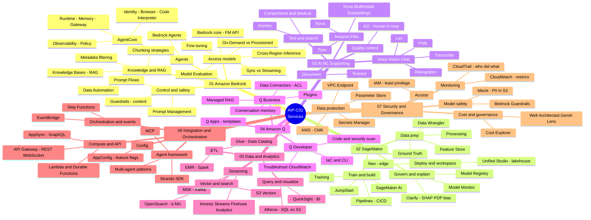

# AIP-C01 — Lesson Learned

> **AWS Certified Generative AI Developer – Professional (AIP-C01)** 試験のための学習ノート。
> **非公式**。AWS とは無関係です。すべての練習問題とケーススタディは**オリジナル作成**です。[DISCLAIMER](./DISCLAIMER.md) を参照。

**🌐 言語:** [English](./README.md) · [Tiếng Việt](./README.vi.md) · **日本語**

---

## この試験について

AIP-C01 は AWS の最新の **Professional** レベル AI 認定（2025年11月リリース）。Generative AI を**本番環境**に導入する能力（FM 統合、RAG、ベクトルストア、セキュリティ、コスト最適化、運用）を検証します。

| 項目 | 内容 |
|---|---|
| 試験コード | AIP-C01 |
| レベル | Professional |
| 合格点 | 750 / 1000 |
| 特徴 | 合否判定、シナリオ重視 |

### ドメイン配点

| ドメイン | 配点 |
|---|---|
| **D1** — Foundation Model Integration, Data Management & Compliance | **31%** |
| **D2** — Implementation & Integration | **26%**（D1 + D2 = 57%） |
| **D3** — AI Safety, Security & Governance | 20% |
| **D4** — Operational Efficiency & Optimization | 12% |
| **D5** — Testing, Validation & Troubleshooting | 11% |

---

## リポジトリ構成

```
.
├── README.md            # English（デフォルト）
├── README.vi.md         # Tiếng Việt
├── README.ja.md         # 日本語
├── DISCLAIMER.md
├── LICENSE
├── en/                  # 🇬🇧 English
├── vi/                  # 🇻🇳 Tiếng Việt
├── ja/                  # 🇯🇵 日本語
│   ├── 01-basic-knowledge/
│   ├── 02-case-studies/
│   └── 03-practice-exam/
└── assets/aws-icons/    # 図用の AWS Architecture Icons
```

## はじめに

**1. 📚 基礎知識（Basic Knowledge）** — サービスカテゴリ別の概念 ([vi](./vi/01-basic-knowledge/))

### 🗺️ 全体マインドマップ — 7 つのサービスカテゴリ

Basic Knowledge（01 → 07）で扱う全サービスの俯瞰図:



**2. 🧩 ケーススタディ（Case Studies）**


### 🧩 ケーススタディ — 14 アーキテクチャの概要

各ケースは同じテンプレートに従う: use case + 要件 → Mermaid 図 → design rationale → トレードオフ → 学び。

| # | 中心概念 | ファイル |
|---|---|---|
| 1 | エンドツーエンド GenAI アーキテクチャ（FM → RAG → CRM → グローバルネットワーク → GenAIOps） | [ja](./ja/02-case-studies/case-01-multinational-financial-chatbot.md) · [en](./en/02-case-studies/case-01-multinational-financial-chatbot.md) · [vi](./vi/02-case-studies/case-01-multinational-financial-chatbot.md) |
| 2 | マルチ FM abstraction layer + resilience + GenAIOps（ヘルスケア） | [ja](./ja/02-case-studies/case-02-healthcare-document-analysis.md) · [en](./en/02-case-studies/case-02-healthcare-document-analysis.md) · [vi](./vi/02-case-studies/case-02-healthcare-document-analysis.md) |
| 3 | マルチモーダルパイプライン（text/画像/音声/表）+ data fusion | [ja](./ja/02-case-studies/case-03-insurance-claims-multimodal.md) · [en](./en/02-case-studies/case-03-insurance-claims-multimodal.md) · [vi](./vi/02-case-studies/case-03-insurance-claims-multimodal.md) |
| 4 | 多層 vector DB — データ種別ごとに最適なストアを選択 | [ja](./ja/02-case-studies/case-04-legal-search-assistant.md) · [en](./en/02-case-studies/case-04-legal-search-assistant.md) · [vi](./vi/02-case-studies/case-04-legal-search-assistant.md) |
| 5 | モデル制御フレームワーク（Prompt Mgmt + Guardrails + JSON Schema） | [ja](./ja/02-case-studies/case-05-financial-customer-service-platform.md) · [en](./en/02-case-studies/case-05-financial-customer-service-platform.md) · [vi](./vi/02-case-studies/case-05-financial-customer-service-platform.md) |
| 6 | 階層型モデルデプロイ（Lambda / Bedrock PT / SageMaker） | [ja](./ja/02-case-studies/case-06-ecommerce-tiered-deployment.md) · [en](./en/02-case-studies/case-06-ecommerce-tiered-deployment.md) · [vi](./vi/02-case-studies/case-06-ecommerce-tiered-deployment.md) |
| 7 | レガシー連携 + データ主権 + GenAI gateway | [ja](./ja/02-case-studies/case-07-enterprise-genai-integration.md) · [en](./en/02-case-studies/case-07-enterprise-genai-integration.md) · [vi](./vi/02-case-studies/case-07-enterprise-genai-integration.md) |
| 8 | sync/async/streaming + 多層フォールバック | [ja](./ja/02-case-studies/case-08-healthcare-flexible-interaction.md) · [en](./en/02-case-studies/case-08-healthcare-flexible-interaction.md) · [vi](./vi/02-case-studies/case-08-healthcare-flexible-interaction.md) |
| 9 | マルチエージェントオーケストレーション（Strands / Agent Squad）+ Amazon Q | [ja](./ja/02-case-studies/case-09-insurance-claims-agentic.md) · [en](./en/02-case-studies/case-09-insurance-claims-agentic.md) · [vi](./vi/02-case-studies/case-09-insurance-claims-agentic.md) |
| 10 | 多層防御（defense-in-depth）+ adversarial testing | [ja](./ja/02-case-studies/case-10-financial-safety-controls.md) · [en](./en/02-case-studies/case-10-financial-safety-controls.md) · [vi](./vi/02-case-studies/case-10-financial-safety-controls.md) |
| 11 | ネットワーク分離 + アクセス制御 + PII + 匿名化 | [ja](./ja/02-case-studies/case-11-healthcare-data-security.md) · [en](./en/02-case-studies/case-11-healthcare-data-security.md) · [vi](./vi/02-case-studies/case-11-healthcare-data-security.md) |
| 12 | Responsible AI（LLM-as-a-judge + bias 監視 + Audit Manager） | [ja](./ja/02-case-studies/case-12-responsible-ai-fairness.md) · [en](./en/02-case-studies/case-12-responsible-ai-fairness.md) · [vi](./vi/02-case-studies/case-12-responsible-ai-fairness.md) |
| 13 | 階層型利用 + intelligent routing + batch/caching | [ja](./ja/02-case-studies/case-13-cost-effective-model-selection.md) · [en](./en/02-case-studies/case-13-cost-effective-model-selection.md) · [vi](./vi/02-case-studies/case-13-cost-effective-model-selection.md) |
| 14 | キャパシティプランニング + GenAI 特化 auto scaling + Inferentia | [ja](./ja/02-case-studies/case-14-resource-allocation-fm-workloads.md) · [en](./en/02-case-studies/case-14-resource-allocation-fm-workloads.md) · [vi](./vi/02-case-studies/case-14-resource-allocation-fm-workloads.md) |


**3. ✅ 練習問題（Practice Exam）**

### ✅ 20 問の概要

各オリジナル問題が試す内容と触れる AWS サービス（*(2)* = 2 つ選択）:

| # | 試す内容 | 主な AWS サービス & 概念 | リンク |
|---|---|---|---|
| 1 | RAG result reranking *(2)* | Knowledge Bases hybrid search, Bedrock reranker, OpenSearch | [Q1](./ja/03-practice-exam/questions.md#問-1--rag-最良の結果が下に沈む2-つ選択) |
| 2 | Real-time & resilient KB sync | S3 Event Notifications, SQS, Lambda, Ingest/Delete API | [Q2](./ja/03-practice-exam/questions.md#問-2--リアルタイムかつ-resilient-な-knowledge-base-同期) |
| 3 | Analyze images/video, least overhead | Bedrock multimodal FMs, Step Functions, QuickSight | [Q3](./ja/03-practice-exam/questions.md#問-3--最小の手間で画像動画を分析) |
| 4 | Order a model-evaluation workflow | metrics → dataset → A/B test → quality gates (Step Functions) → report | [Q4](./ja/03-practice-exam/questions.md#問-4--モデル置換の評価ワークフローを順序付け) |
| 5 | Enforce guardrails on every call | IAM condition key `bedrock:GuardrailIdentifier` | [Q5](./ja/03-practice-exam/questions.md#問-5--全呼び出しに-guardrail-を強制) |
| 6 | Stop generation at a phrase | stop sequences (inference parameter) | [Q6](./ja/03-practice-exam/questions.md#問-6--特定フレーズで生成を停止) |
| 7 | LLM endpoint optimization *(2)* | max sequence length, tensor parallelism, DJL, SageMaker | [Q7](./ja/03-practice-exam/questions.md#問-7--llm-エンドポイントのリソース利用最適化2-つ選択) |
| 8 | Real-time streaming to a web UI | API Gateway WebSocket, Lambda, Bedrock streaming API, Prompt Management | [Q8](./ja/03-practice-exam/questions.md#問-8--web-エディタへのリアルタイム提案ストリーミング) |
| 9 | Prompt governance + long-term logging *(2)* | Bedrock Prompt Management, model invocation logging, S3 Object Lock | [Q9](./ja/03-practice-exam/questions.md#問-9--prompt-ガバナンス--長期コンプラ-logging2-つ選択) |
| 10 | Deploy a Python agent to AgentCore *(2)* | AgentCore SDK `@app.entrypoint`, starter toolkit | [Q10](./ja/03-practice-exam/questions.md#問-10--python-agent-を-agentcore-runtime-へデプロイ2-つ選択) |
| 11 | Source lineage for generated content *(2)* | metadata tagging, AWS Glue Data Catalog | [Q11](./ja/03-practice-exam/questions.md#問-11--生成コンテンツの-source-lineage2-つ選択) |
| 12 | RAG silent failure after a deploy | embedding model version / vector-space mismatch | [Q12](./ja/03-practice-exam/questions.md#問-12--デプロイ後に-rag-が静かに故障) |
| 13 | Monitor KB ingestion errors | Knowledge Base logging, CloudWatch Logs Insights | [Q13](./ja/03-practice-exam/questions.md#問-13--knowledge-base-へのドキュメント取込を監視) |
| 14 | Amazon Q Developer productivity *(2)* | code generation/refactor, test generation in CI/CD | [Q14](./ja/03-practice-exam/questions.md#問-14--amazon-q-developer-で生産性最大化2-つ選択) |
| 15 | SageMaker inference type for image gen | Asynchronous vs Real-time / Serverless / Batch Transform | [Q15](./ja/03-practice-exam/questions.md#問-15--画像生成に適した-sagemaker-inference-種別) |
| 16 | Large-scale infrequent vector search | Amazon S3 Vectors vs OpenSearch / RDS / DynamoDB | [Q16](./ja/03-practice-exam/questions.md#問-16--大規模低頻度の-vector-search最安) |
| 17 | Which guardrail rule fired | guardrail tracing, GuardrailPolicyType vs GuardrailContentSource | [Q17](./ja/03-practice-exam/questions.md#問-17--どの-guardrail-ルールがブロックしたか特定) |
| 18 | Secure auth + IdP, no long-lived creds *(2)* | Amazon Cognito (OIDC), IAM Identity Center (SAML) | [Q18](./ja/03-practice-exam/questions.md#問-18--安全な認証idp-federationlong-lived-credentials-なし2-つ選択) |
| 19 | Peak throttling, same FM, cheapest | Cross-Region Inference vs Provisioned Throughput | [Q19](./ja/03-practice-exam/questions.md#問-19--ピーク時-throttling同一-fm最安) |
| 20 | Redact PII before search | Amazon Comprehend (PII redaction) + Amazon Kendra | [Q20](./ja/03-practice-exam/questions.md#問-20--検索に入れる前に-pii-を-redact) |

## コンテンツ状況

| セクション | vi | en | ja |
|---|---|---|---|
| Basic Knowledge (7 カテゴリ) | ✅ | ✅ | ✅ |
| Case Studies | ✅ 14 | ✅ | ✅ |
| Practice Exam | ✅ 20 | ✅ | ✅ |

> 🔲 未着手 · 🚧 作成中 · ✅ ドラフト

## ライセンス

- **コンテンツ**: [CC BY 4.0](./LICENSE) · **コード**: MIT

詳細は [DISCLAIMER.md](./DISCLAIMER.md) を参照。
