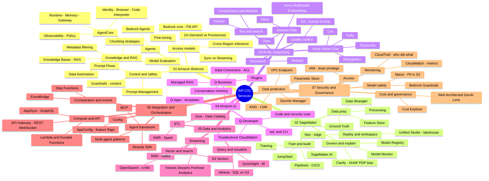

# AIP-C01 — Lesson Learned

> **AWS Certified Generative AI Developer – Professional (AIP-C01)** 試験のための学習ノート。
> **非公式**。AWS とは無関係です。すべての練習問題とケーススタディは**オリジナル作成**です。[DISCLAIMER](./DISCLAIMER.md) を参照。

**🌐 言語:** [English](./README.md) · [Tiếng Việt](./README.vi.md) · **日本語**

---

## この試験について

AIP-C01 は AWS の最新の **Professional** レベル AI 認定（2025年11月リリース）。Generative AI を**本番環境**に導入する能力（FM 統合、RAG、ベクトルストア、セキュリティ、コスト最適化、運用）を検証します。

| 項目 | 内容 |
|---|---|
| 試験コード | AIP-C01 |
| レベル | Professional |
| 合格点 | 750 / 1000 |
| 特徴 | 合否判定、シナリオ重視 |

### ドメイン配点

| ドメイン | 配点 |
|---|---|
| **D1** — Foundation Model Integration, Data Management & Compliance | **31%** |
| **D2** — Implementation & Integration | **26%**（D1 + D2 = 57%） |
| **D3** — AI Safety, Security & Governance | 20% |
| **D4** — Operational Efficiency & Optimization | 12% |
| **D5** — Testing, Validation & Troubleshooting | 11% |

---

## リポジトリ構成

```
.
├── README.md            # English（デフォルト）
├── README.vi.md         # Tiếng Việt
├── README.ja.md         # 日本語
├── DISCLAIMER.md
├── LICENSE
├── en/                  # 🇬🇧 English
├── vi/                  # 🇻🇳 Tiếng Việt
├── ja/                  # 🇯🇵 日本語
│   ├── 01-basic-knowledge/
│   ├── 02-case-studies/
│   └── 03-practice-exam/
└── assets/aws-icons/    # 図用の AWS Architecture Icons
```

## はじめに

**1. 📚 基礎知識（Basic Knowledge）** — サービスカテゴリ別の概念 ([vi](./vi/01-basic-knowledge/))

### 🗺️ 全体マインドマップ — 7 つのサービスカテゴリ

Basic Knowledge（01 → 07）で扱う全サービスの俯瞰図:



**2. 🧩 ケーススタディ（Case Studies）**

**3. ✅ 練習問題（Practice Exam）**

### ✅ Practice Exam — 20 問の概要

各オリジナル問題が試す内容と触れる AWS サービス（*(2)* = 2 つ選択）:

| # | 試す内容 | 主な AWS サービス & 概念 |
|---|---|---|
| 1 | RAG result reranking *(2)* | Knowledge Bases hybrid search, Bedrock reranker, OpenSearch |
| 2 | Real-time & resilient KB sync | S3 Event Notifications, SQS, Lambda, Ingest/Delete API |
| 3 | Analyze images/video, least overhead | Bedrock multimodal FMs, Step Functions, QuickSight |
| 4 | Order a model-evaluation workflow | metrics → dataset → A/B test → quality gates (Step Functions) → report |
| 5 | Enforce guardrails on every call | IAM condition key `bedrock:GuardrailIdentifier` |
| 6 | Stop generation at a phrase | stop sequences (inference parameter) |
| 7 | LLM endpoint optimization *(2)* | max sequence length, tensor parallelism, DJL, SageMaker |
| 8 | Real-time streaming to a web UI | API Gateway WebSocket, Lambda, Bedrock streaming API, Prompt Management |
| 9 | Prompt governance + long-term logging *(2)* | Bedrock Prompt Management, model invocation logging, S3 Object Lock |
| 10 | Deploy a Python agent to AgentCore *(2)* | AgentCore SDK `@app.entrypoint`, starter toolkit |
| 11 | Source lineage for generated content *(2)* | metadata tagging, AWS Glue Data Catalog |
| 12 | RAG silent failure after a deploy | embedding model version / vector-space mismatch |
| 13 | Monitor KB ingestion errors | Knowledge Base logging, CloudWatch Logs Insights |
| 14 | Amazon Q Developer productivity *(2)* | code generation/refactor, test generation in CI/CD |
| 15 | SageMaker inference type for image gen | Asynchronous vs Real-time / Serverless / Batch Transform |
| 16 | Large-scale infrequent vector search | Amazon S3 Vectors vs OpenSearch / RDS / DynamoDB |
| 17 | Which guardrail rule fired | guardrail tracing, GuardrailPolicyType vs GuardrailContentSource |
| 18 | Secure auth + IdP, no long-lived creds *(2)* | Amazon Cognito (OIDC), IAM Identity Center (SAML) |
| 19 | Peak throttling, same FM, cheapest | Cross-Region Inference vs Provisioned Throughput |
| 20 | Redact PII before search | Amazon Comprehend (PII redaction) + Amazon Kendra |

## コンテンツ状況

| セクション | vi | en | ja |
|---|---|---|---|
| Basic Knowledge (7 カテゴリ) | ✅ | ✅ | ✅ |
| Case Studies | ✅ 14 | 🔲 | 🔲 |
| Practice Exam | ✅ 20 | ✅ | ✅ |

> 🔲 未着手 · 🚧 作成中 · ✅ ドラフト

## ライセンス

- **コンテンツ**: [CC BY 4.0](./LICENSE) · **コード**: MIT

詳細は [DISCLAIMER.md](./DISCLAIMER.md) を参照。
