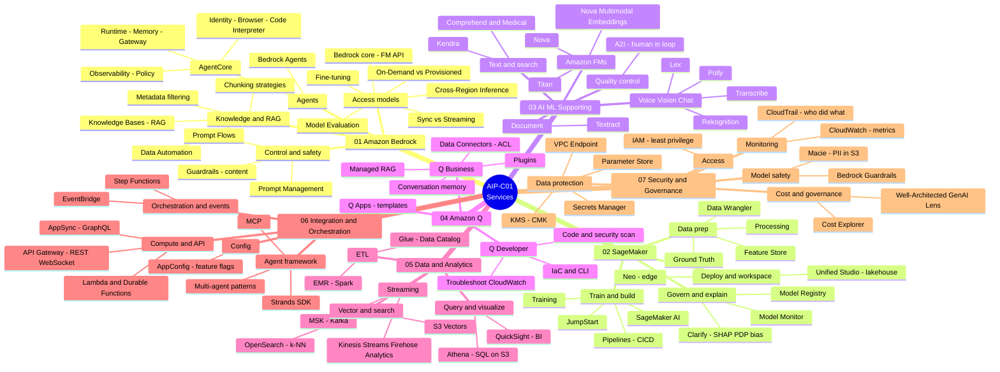

# AIP-C01 — Lesson Learned

> Study notes for the **AWS Certified Generative AI Developer – Professional (AIP-C01)** exam.
> **Unofficial**, not affiliated with AWS. All practice questions and case studies are **original works**. See [DISCLAIMER](./DISCLAIMER.md).

**🌐 Language:** **English** · [Tiếng Việt](./README.vi.md) · [日本語](./README.ja.md)

---

## What is this exam?

AIP-C01 is AWS's newest **Professional**-level AI certification (released Nov 2025). It validates the ability to take Generative AI to **production**: integrating Foundation Models (FMs), RAG, vector stores, security, cost optimization, and operations.

| Item | Value |
|---|---|
| Exam code | AIP-C01 |
| Level | Professional |
| Passing score | 750 / 1000 |
| Style | Pass/Fail, heavily scenario-based |

### Content domain weightings

| Domain | Weight |
|---|---|
| **D1** — Foundation Model Integration, Data Management & Compliance | **31%** |
| **D2** — Implementation & Integration | **26%** (D1 + D2 = 57%) |
| **D3** — AI Safety, Security & Governance | 20% |
| **D4** — Operational Efficiency & Optimization | 12% |
| **D5** — Testing, Validation & Troubleshooting | 11% |

---

## Repository structure

```
.
├── README.md            # English (default)  + language switcher
├── README.vi.md         # Vietnamese landing
├── README.ja.md         # Japanese landing
├── DISCLAIMER.md
├── LICENSE
├── en/                  # 🇬🇧 English
│   ├── 01-basic-knowledge/   (index + 7 service categories)
│   ├── 02-case-studies/
│   └── 03-practice-exam/
├── vi/                  # 🇻🇳 Vietnamese
│   ├── 01-basic-knowledge/
│   ├── 02-case-studies/
│   └── 03-practice-exam/
├── ja/                  # 🇯🇵 Japanese
└── assets/aws-icons/    # official AWS Architecture Icons for diagrams
```

## Where to start

**1. 📚 Basic Knowledge** — concepts by service category ([en](./en/01-basic-knowledge/) · [vi](./vi/01-basic-knowledge/) · [ja](./ja/01-basic-knowledge/))

### 🗺️ Overview mindmap — all 7 service categories

A bird's-eye view of every service covered in Basic Knowledge (01 → 07):



**2. 🧩 Case Studies** ([en](./en/02-case-studies/) · [vi](./vi/02-case-studies/) · [ja](./ja/02-case-studies/))

**3. ✅ Practice Exam** ([en](./en/03-practice-exam/) · [vi](./vi/03-practice-exam/) · [ja](./ja/03-practice-exam/))

### ✅ Practice Exam — the 20 questions at a glance

What each original question tests and the AWS services it touches (*(2)* = Select TWO):

| # | What it tests | Key AWS services & concepts |
|---|---|---|
| 1 | RAG result reranking *(2)* | Knowledge Bases hybrid search, Bedrock reranker, OpenSearch |
| 2 | Real-time & resilient KB sync | S3 Event Notifications, SQS, Lambda, Ingest/Delete API |
| 3 | Analyze images/video, least overhead | Bedrock multimodal FMs, Step Functions, QuickSight |
| 4 | Order a model-evaluation workflow | metrics → dataset → A/B test → quality gates (Step Functions) → report |
| 5 | Enforce guardrails on every call | IAM condition key `bedrock:GuardrailIdentifier` |
| 6 | Stop generation at a phrase | stop sequences (inference parameter) |
| 7 | LLM endpoint optimization *(2)* | max sequence length, tensor parallelism, DJL, SageMaker |
| 8 | Real-time streaming to a web UI | API Gateway WebSocket, Lambda, Bedrock streaming API, Prompt Management |
| 9 | Prompt governance + long-term logging *(2)* | Bedrock Prompt Management, model invocation logging, S3 Object Lock |
| 10 | Deploy a Python agent to AgentCore *(2)* | AgentCore SDK `@app.entrypoint`, starter toolkit |
| 11 | Source lineage for generated content *(2)* | metadata tagging, AWS Glue Data Catalog |
| 12 | RAG silent failure after a deploy | embedding model version / vector-space mismatch |
| 13 | Monitor KB ingestion errors | Knowledge Base logging, CloudWatch Logs Insights |
| 14 | Amazon Q Developer productivity *(2)* | code generation/refactor, test generation in CI/CD |
| 15 | SageMaker inference type for image gen | Asynchronous vs Real-time / Serverless / Batch Transform |
| 16 | Large-scale infrequent vector search | Amazon S3 Vectors vs OpenSearch / RDS / DynamoDB |
| 17 | Which guardrail rule fired | guardrail tracing, GuardrailPolicyType vs GuardrailContentSource |
| 18 | Secure auth + IdP, no long-lived creds *(2)* | Amazon Cognito (OIDC), IAM Identity Center (SAML) |
| 19 | Peak throttling, same FM, cheapest | Cross-Region Inference vs Provisioned Throughput |
| 20 | Redact PII before search | Amazon Comprehend (PII redaction) + Amazon Kendra |

## Content status

| Section | vi | en | ja |
|---|---|---|---|
| Basic Knowledge (7 service categories) | ✅ | ✅ | ✅ |
| Case Studies | ✅ 14 | 🔲 | 🔲 |
| Practice Exam | ✅ 20 | ✅ | ✅ |

> 🔲 not started · 🚧 in progress · ✅ drafted

## License

- **Content** (notes, case studies, questions): [CC BY 4.0](./LICENSE)
- **Code** (Mermaid, config snippets): MIT

See [DISCLAIMER.md](./DISCLAIMER.md) for copyright notes.
