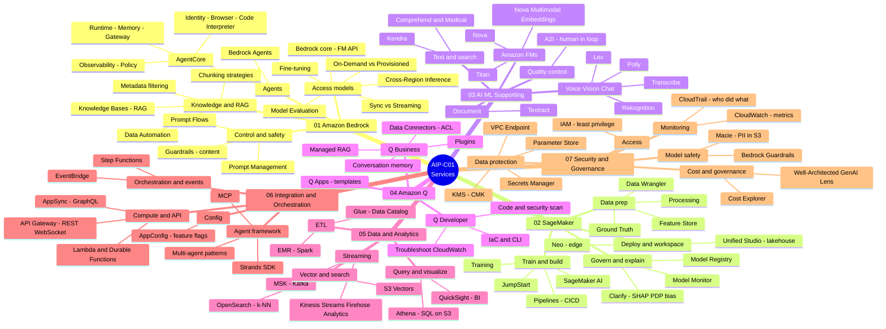

# AIP-C01 — Lesson Learned

> Ghi chép & tổng hợp kiến thức tự học cho kỳ thi **AWS Certified Generative AI Developer – Professional (AIP-C01)**.
> Tài liệu **không chính thức**, không liên kết với AWS. Toàn bộ câu hỏi và case study là **nội dung gốc (original)**. Xem [DISCLAIMER](./DISCLAIMER.md).

**🌐 Ngôn ngữ:** [English](./README.md) · **Tiếng Việt** · [日本語](./README.ja.md)

---

## Kỳ thi này là gì?

AIP-C01 là chứng chỉ **Professional** mới nhất nhánh AI của AWS (ra mắt 11/2025), kiểm tra khả năng **đưa Generative AI lên production**: tích hợp Foundation Model (mô hình nền tảng), RAG, vector store, bảo mật, tối ưu chi phí và vận hành.

| Hạng mục | Thông tin |
|---|---|
| Mã thi | AIP-C01 |
| Cấp độ | Professional |
| Điểm đạt | 750 / 1000 |
| Đặc điểm | Pass/Fail, nặng về tình huống (scenario-based) |

### Trọng số 5 domain

| Domain | Trọng số |
|---|---|
| **D1** — Foundation Model Integration, Data Management & Compliance | **31%** |
| **D2** — Implementation & Integration | **26%** (D1 + D2 = 57%) |
| **D3** — AI Safety, Security & Governance | 20% |
| **D4** — Operational Efficiency & Optimization | 12% |
| **D5** — Testing, Validation & Troubleshooting | 11% |

---

## Cấu trúc repo

```
.
├── README.md            # English (mặc định)
├── README.vi.md         # Tiếng Việt
├── README.ja.md         # 日本語
├── DISCLAIMER.md
├── LICENSE
├── en/                  # 🇬🇧 English
├── vi/                  # 🇻🇳 Tiếng Việt
│   ├── 01-basic-knowledge/   (index + 7 nhóm service)
│   ├── 02-case-studies/
│   └── 03-practice-exam/
├── ja/                  # 🇯🇵 日本語
└── assets/aws-icons/    # AWS Architecture Icons để vẽ diagram
```

## Bắt đầu từ đâu

**1. 📚 [Kiến thức nền (Basic Knowledge)](./vi/01-basic-knowledge/)** — nắm concept theo từng nhóm service.

### 🗺️ Mindmap tổng quan — 7 nhóm service

Nhìn nhanh toàn bộ service được phủ trong Basic Knowledge (01 → 07):



**2. 🧩 [Case Studies](./vi/02-case-studies/)** — áp dụng vào tình huống thực tế.


### 🧩 Case Studies — tổng quan 14 kiến trúc

Mỗi case theo cùng một khuôn: use case + requirement → sơ đồ Mermaid → design rationale → trade-off → lesson learned.

| # | Concept chính | File |
|---|---|---|
| 1 | Kiến trúc GenAI end-to-end (FM → RAG → CRM → mạng toàn cầu → GenAIOps) | [vi](./vi/02-case-studies/case-01-multinational-financial-chatbot.md) · [en](./en/02-case-studies/case-01-multinational-financial-chatbot.md) · [ja](./ja/02-case-studies/case-01-multinational-financial-chatbot.md) |
| 2 | Abstraction layer đa-FM + resilience + GenAIOps (y tế) | [vi](./vi/02-case-studies/case-02-healthcare-document-analysis.md) · [en](./en/02-case-studies/case-02-healthcare-document-analysis.md) · [ja](./ja/02-case-studies/case-02-healthcare-document-analysis.md) |
| 3 | Pipeline đa phương thức (text/ảnh/audio/bảng) + data fusion | [vi](./vi/02-case-studies/case-03-insurance-claims-multimodal.md) · [en](./en/02-case-studies/case-03-insurance-claims-multimodal.md) · [ja](./ja/02-case-studies/case-03-insurance-claims-multimodal.md) |
| 4 | Vector DB đa tầng — chọn đúng kho cho từng loại dữ liệu | [vi](./vi/02-case-studies/case-04-legal-search-assistant.md) · [en](./en/02-case-studies/case-04-legal-search-assistant.md) · [ja](./ja/02-case-studies/case-04-legal-search-assistant.md) |
| 5 | Khung điều khiển model (Prompt Mgmt + Guardrails + JSON Schema) | [vi](./vi/02-case-studies/case-05-financial-customer-service-platform.md) · [en](./en/02-case-studies/case-05-financial-customer-service-platform.md) · [ja](./ja/02-case-studies/case-05-financial-customer-service-platform.md) |
| 6 | Tiered model deployment (Lambda / Bedrock PT / SageMaker) | [vi](./vi/02-case-studies/case-06-ecommerce-tiered-deployment.md) · [en](./en/02-case-studies/case-06-ecommerce-tiered-deployment.md) · [ja](./ja/02-case-studies/case-06-ecommerce-tiered-deployment.md) |
| 7 | Kết nối legacy + chủ quyền dữ liệu + GenAI gateway | [vi](./vi/02-case-studies/case-07-enterprise-genai-integration.md) · [en](./en/02-case-studies/case-07-enterprise-genai-integration.md) · [ja](./ja/02-case-studies/case-07-enterprise-genai-integration.md) |
| 8 | Sync/async/streaming + fallback nhiều lớp | [vi](./vi/02-case-studies/case-08-healthcare-flexible-interaction.md) · [en](./en/02-case-studies/case-08-healthcare-flexible-interaction.md) · [ja](./ja/02-case-studies/case-08-healthcare-flexible-interaction.md) |
| 9 | Multi-agent orchestration (Strands / Agent Squad) + Amazon Q | [vi](./vi/02-case-studies/case-09-insurance-claims-agentic.md) · [en](./en/02-case-studies/case-09-insurance-claims-agentic.md) · [ja](./ja/02-case-studies/case-09-insurance-claims-agentic.md) |
| 10 | Defense-in-depth + adversarial testing | [vi](./vi/02-case-studies/case-10-financial-safety-controls.md) · [en](./en/02-case-studies/case-10-financial-safety-controls.md) · [ja](./ja/02-case-studies/case-10-financial-safety-controls.md) |
| 11 | Network isolation + access control + PII + anonymization | [vi](./vi/02-case-studies/case-11-healthcare-data-security.md) · [en](./en/02-case-studies/case-11-healthcare-data-security.md) · [ja](./ja/02-case-studies/case-11-healthcare-data-security.md) |
| 12 | Responsible AI (LLM-as-a-judge + giám sát bias + Audit Manager) | [vi](./vi/02-case-studies/case-12-responsible-ai-fairness.md) · [en](./en/02-case-studies/case-12-responsible-ai-fairness.md) · [ja](./ja/02-case-studies/case-12-responsible-ai-fairness.md) |
| 13 | Tiered usage + intelligent routing + batch/caching | [vi](./vi/02-case-studies/case-13-cost-effective-model-selection.md) · [en](./en/02-case-studies/case-13-cost-effective-model-selection.md) · [ja](./ja/02-case-studies/case-13-cost-effective-model-selection.md) |
| 14 | Capacity planning + auto scaling đặc thù GenAI + Inferentia | [vi](./vi/02-case-studies/case-14-resource-allocation-fm-workloads.md) · [en](./en/02-case-studies/case-14-resource-allocation-fm-workloads.md) · [ja](./ja/02-case-studies/case-14-resource-allocation-fm-workloads.md) |


**3. ✅ [Practice Exam](./vi/03-practice-exam/)** — tự kiểm tra + học cách phân tích câu scenario.

### ✅ Tổng quan 20 câu hỏi

Mỗi câu test concept gì và chạm tới service AWS nào (*(2)* = Chọn HAI):

| # | Test concept gì | Service & khái niệm AWS chính | Link |
|---|---|---|---|
| 1 | RAG result reranking *(2)* | Knowledge Bases hybrid search, Bedrock reranker, OpenSearch | [Q1](./vi/03-practice-exam/questions.md#câu-1--rag-kết-quả-tốt-bị-chìm-xuống-dưới-chọn-hai) |
| 2 | Real-time & resilient KB sync | S3 Event Notifications, SQS, Lambda, Ingest/Delete API | [Q2](./vi/03-practice-exam/questions.md#câu-2--đồng-bộ-knowledge-base-real-time-và-resilient) |
| 3 | Analyze images/video, least overhead | Bedrock multimodal FMs, Step Functions, QuickSight | [Q3](./vi/03-practice-exam/questions.md#câu-3--phân-tích-ảnhvideo-với-ít-công-sức-nhất) |
| 4 | Order a model-evaluation workflow | metrics → dataset → A/B test → quality gates (Step Functions) → report | [Q4](./vi/03-practice-exam/questions.md#câu-4--sắp-xếp-quy-trình-đánh-giá-thay-model) |
| 5 | Enforce guardrails on every call | IAM condition key `bedrock:GuardrailIdentifier` | [Q5](./vi/03-practice-exam/questions.md#câu-5--bắt-buộc-mọi-lệnh-gọi-phải-gắn-guardrail) |
| 6 | Stop generation at a phrase | stop sequences (inference parameter) | [Q6](./vi/03-practice-exam/questions.md#câu-6--dừng-sinh-văn-bản-tại-một-cụm-từ) |
| 7 | LLM endpoint optimization *(2)* | max sequence length, tensor parallelism, DJL, SageMaker | [Q7](./vi/03-practice-exam/questions.md#câu-7--tối-ưu-tài-nguyên-endpoint-llm-chọn-hai) |
| 8 | Real-time streaming to a web UI | API Gateway WebSocket, Lambda, Bedrock streaming API, Prompt Management | [Q8](./vi/03-practice-exam/questions.md#câu-8--stream-gợi-ý-real-time-lên-web-editor) |
| 9 | Prompt governance + long-term logging *(2)* | Bedrock Prompt Management, model invocation logging, S3 Object Lock | [Q9](./vi/03-practice-exam/questions.md#câu-9--quản-trị-prompt--lưu-log-tuân-thủ-dài-hạn-chọn-hai) |
| 10 | Deploy a Python agent to AgentCore *(2)* | AgentCore SDK `@app.entrypoint`, starter toolkit | [Q10](./vi/03-practice-exam/questions.md#câu-10--triển-khai-agent-python-lên-agentcore-runtime-chọn-hai) |
| 11 | Source lineage for generated content *(2)* | metadata tagging, AWS Glue Data Catalog | [Q11](./vi/03-practice-exam/questions.md#câu-11--truy-xuất-nguồn-gốc-nội-dung-sinh-ra-chọn-hai) |
| 12 | RAG silent failure after a deploy | embedding model version / vector-space mismatch | [Q12](./vi/03-practice-exam/questions.md#câu-12--rag-hỏng-âm-thầm-sau-khi-cập-nhật-code) |
| 13 | Monitor KB ingestion errors | Knowledge Base logging, CloudWatch Logs Insights | [Q13](./vi/03-practice-exam/questions.md#câu-13--giám-sát-quá-trình-nạp-tài-liệu-vào-knowledge-base) |
| 14 | Amazon Q Developer productivity *(2)* | code generation/refactor, test generation in CI/CD | [Q14](./vi/03-practice-exam/questions.md#câu-14--tối-ưu-năng-suất-với-amazon-q-developer-chọn-hai) |
| 15 | SageMaker inference type for image gen | Asynchronous vs Real-time / Serverless / Batch Transform | [Q15](./vi/03-practice-exam/questions.md#câu-15--chọn-loại-sagemaker-inference-cho-sinh-ảnh) |
| 16 | Large-scale infrequent vector search | Amazon S3 Vectors vs OpenSearch / RDS / DynamoDB | [Q16](./vi/03-practice-exam/questions.md#câu-16--vector-search-khối-lượng-lớn-tần-suất-thấp-rẻ-nhất) |
| 17 | Which guardrail rule fired | guardrail tracing, GuardrailPolicyType vs GuardrailContentSource | [Q17](./vi/03-practice-exam/questions.md#câu-17--biết-luật-guardrail-nào-đã-chặn) |
| 18 | Secure auth + IdP, no long-lived creds *(2)* | Amazon Cognito (OIDC), IAM Identity Center (SAML) | [Q18](./vi/03-practice-exam/questions.md#câu-18--xác-thực-an-toàn-liên-kết-idp-không-chứng-chỉ-dài-hạn-chọn-hai) |
| 19 | Peak throttling, same FM, cheapest | Cross-Region Inference vs Provisioned Throughput | [Q19](./vi/03-practice-exam/questions.md#câu-19--throttling-giờ-cao-điểm-cùng-fm-rẻ-nhất) |
| 20 | Redact PII before search | Amazon Comprehend (PII redaction) + Amazon Kendra | [Q20](./vi/03-practice-exam/questions.md#câu-20--tẩy-pii-trước-khi-đưa-vào-tìm-kiếm) |

## Trạng thái nội dung

| Phần | vi | en | ja |
|---|---|---|---|
| Basic Knowledge (7 nhóm service) | ✅ | ✅ | ✅ |
| Case Studies | ✅ 14 | ✅ | ✅ |
| Practice Exam | ✅ 20 | ✅ | ✅ |

> 🔲 chưa làm · 🚧 đang làm · ✅ đã có bản nháp

## Giấy phép

- **Nội dung**: [CC BY 4.0](./LICENSE) · **Code**: MIT

Xem [DISCLAIMER.md](./DISCLAIMER.md).
