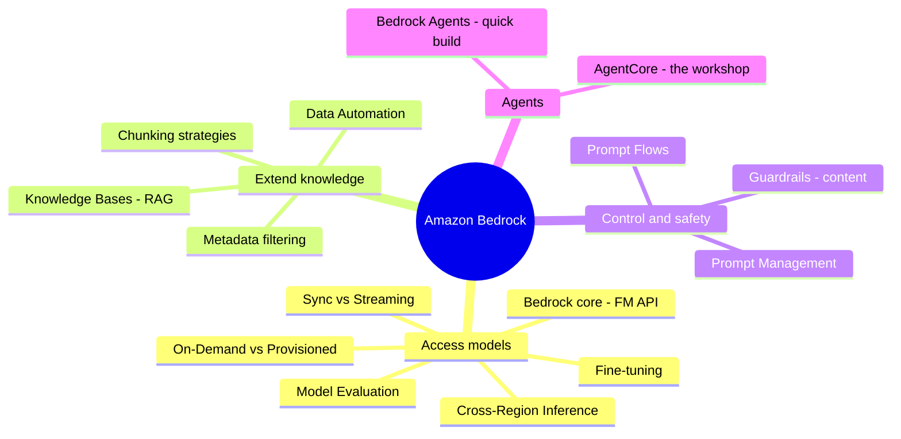

# 01. Amazon Bedrock Services

[← Back to Basic Knowledge](./README.md)

> The **core** service group for doing GenAI on AWS. Think of **Amazon Bedrock** as a *"shopping mall" of AI brains (Foundation Models)*: you don't host models yourself, you just walk in and "pick a brain" via API. Around it sits a whole ecosystem: RAG, safety, prompt management, agents.

## Mindmap of this category

## Quick reference

| Service | One-line description | Related domain |
|---|---|---|
| Amazon Bedrock (core) | Unified API to call many FMs, serverless | D1, D2 |
| Foundation Model & Fine-tuning | "Top graduate" vs sending them to "grad school" | D1 |
| Model Evaluation | Compare FM performance to choose one | D1, D5 |
| Cross-Region Inference | Route inference to another region | D1, D4 |
| Knowledge Bases (RAG) | Let AI "take an open-book exam" on company docs | D1 |
| Data Automation | Read messy documents with GenAI | D1 |
| Guardrails | Guardrail: controls **CONTENT** (PII, toxic) | D3, D1 |
| Prompt Management | "Git for prompts": versioning + approval | D1, D3 |
| Prompt Flows | Chain multi-step prompts (DAG, drag-drop) | D1, D2 |
| Bedrock Agents | Agent built quickly in the Console | D2 |
| AgentCore | Production infrastructure to run agents at scale (8 parts) | D2 |

---

## Service cards

### Amazon Bedrock (core)

> **One-line description:** A "shopping mall" of AI brains — you don't buy servers or train anything, you just call an API and use Claude, Llama, Titan…

- **What problem it solves:** access many Foundation Models through **one** API. **Serverless** — call the API, get results, pay per use.
- **When to use:** almost every GenAI project starts here; fast PoCs; switching between models.
- **When NOT to use / easily confused with:** if you need to self-host an open-source model with deep customization on your own infrastructure → **SageMaker**. Bedrock is *managed*, not a place to train from scratch.
- **Related exam domain:** D1, D2.
- **⚠️ Must remember:**
  - **Sync vs Streaming:** *Synchronous* waits for the whole answer; *Streaming* returns token-by-token — chatbots must stream so users don't wait.
  - **2 pricing modes:** **On-Demand** (pay per use) vs **Provisioned Throughput** (pay up front, stable latency). There is **no** Spot option.
  - **Security:** call via **VPC Endpoint (PrivateLink)** so data never leaves to the internet; Bedrock commits not to use your data to train third-party models.
  - **Common error:** `AccessDeniedException` when you haven't done **"Request Model Access"** in the Console + missing IAM `bedrock:InvokeModel`.
- **🧪 One-line example:** an internal chatbot calls Claude via Bedrock with `temperature=0` for stable answers.

💰 Deep dive: On-Demand vs Provisioned Throughput (definitely on the exam)

- **On-Demand (pay-as-you-go):** like a taxi — pay per distance (per token). Good for **new projects, spiky traffic, Dev/Test**. May slow down at peak hours (shared queue).
- **Provisioned Throughput:** like renting a car + driver 24/7 — pay up front (usually **1–6 month commitment**) but **latency is always stable, no queueing**. Good for **large, steady production with consistent latency needs**.
- **Sample question:** "startup, unpredictable traffic" → On-Demand. "bank processing 100,000 contracts/night, latency must be stable, fixed budget" → Provisioned.
- **🔴 Trap:** Bedrock has **NO** EC2 Spot-style pricing. Only the two above.

---

### Foundation Model (FM) & Fine-tuning

> **One-line description:** An FM is a "top graduate who knows a bit of everything." Fine-tuning is "sending that graduate to grad school at your company."

- **What problem it solves:** an FM knows general knowledge (it "read" most of the internet) but **doesn't** know your company's private data. Fine-tuning adjusts the model's "weights" to absorb your style/terminology.
- **When to use fine-tuning:** when the model needs **deep** domain terminology that prompting can't solve.
- **When NOT to use / easily confused with:** to make the AI know **always-fresh internal knowledge** → use **RAG (Knowledge Bases)**, NOT fine-tuning. Fine-tuning is **expensive, slow**, and must be redone when docs change.
- **Related exam domain:** D1.
- **⚠️ Must remember:** this is **the most classic trap** of AWS — when you see "update internal knowledge," think RAG first, fine-tune later.
- **🧪 One-line example:** a chatbot answering the 2025 leave policy → RAG (just swap the PDF), not fine-tune.

---

### Amazon Bedrock Knowledge Bases (RAG)

> **One-line description:** Let the AI "take an open-book exam" — load company docs, the AI looks them up and answers based on them (managed RAG).

- **What problem it solves:** automatically **chunk → embed → store vectors → retrieve** so the AI answers from your docs, reducing hallucination, **without fine-tuning**.
- **How it works:** docs (PDF/Word) → "chunked" → turned into number vectors (embeddings) → stored in a Vector DB. On a question, the question becomes a vector → find the **closest-meaning** chunks → inject into the prompt for the AI.
- **When to use:** fast RAG, low code; connectors plug straight into **S3 / SharePoint / Confluence**.
- **When NOT to use / easily confused with:** don't confuse with **fine-tuning** (baking knowledge into weights). RAG keeps the model's "brain" intact, it just "opens the book."
- **Related exam domain:** D1.
- **⚠️ Must remember:** **metadata filtering** both speeds things up and **enforces access control**; choose **SEMANTIC vs HYBRID** via `OverrideSearchType`.
- **🧪 One-line example:** an internal assistant answers process questions from 10,000 PDF pages in S3.

✂️ Deep dive: 3 chunking strategies + metadata filtering

| Strategy | How | Pros | Cons | Good for |
|---|---|---|---|---|
| **Fixed-size** | Cut every N tokens | Fast, cheap, simple | Cuts mid-sentence, breaks meaning | Short Q&A/FAQ, independent |
| **Semantic** | Keep whole idea/paragraph | Preserves context | Compute-heavy, uneven chunks (too short / too long beyond context window) | Contracts, legal text |
| **Hierarchical** | Store parent–child (Chapter→Section→Item) | Captures wide context | Complex, needs clear headings; harder retrieval | Large technical manuals (e.g. car repair) |

- **Hybrid chunking (common in production):** Hierarchical keeps structure → Semantic cuts by idea → Fixed-size as a final cap ("no more than 500 tokens/chunk").
- **Metadata filtering:** tag docs (`department=HR`, `year=2025`) to **pre-filter** → faster & **prevents leakage** (HR staff don't see Finance salary docs).
- **Vector Embeddings:** search by **meaning** (distance between vectors), not keyword matching like old Google.

---

### Amazon Bedrock Data Automation

> **One-line description:** A "smart analyst" for messy documents — uses GenAI to understand context, not just scrape text.

- **What problem it solves:** extract data from documents with **no fixed structure** (invoices from many vendors, medical records…) and output normalized JSON. It understands "Amount Due" = "Total" = "Balance Due".
- **When to use:** **irregular** data, many different formats, AI needs to understand context.
- **When NOT to use / easily confused with:** just digitize plain text or a **100% fixed form** → **Amazon Textract** (fast, cheap, stable). Data Automation is slower & pricier but "intelligent" (often uses Textract underneath, then an FM analyzes).
- **Related exam domain:** D1.
- **⚠️ Must remember:** question says "fixed form / scrape text" → Textract; "many messy formats / understand context" → Data Automation.
- **🧪 One-line example:** a system receiving invoices from 500 vendors in different layouts → Data Automation outputs uniform `{"total_due": 500000}`.

---

### Amazon Bedrock Guardrails

> **One-line description:** A safety guardrail for AI — controls **CONTENT**: blocks toxic words and masks PII.

- **What problem it solves:** filter hate/insults/sexual/violence (low/medium/high), **mask PII**, block denied topics, defend against prompt injection; applied uniformly across models.
- **When to use:** output may reach end users; the question asks for "least development effort" to block PII.
- **When NOT to use / easily confused with:** **🔑 Guardrails control CONTENT. Controlling ACTIONS (which tools an agent may call) is AgentCore Policy's job** (see below). This is the classic trap pair.
- **Related exam domain:** D3 (primary), D1.
- **⚠️ Must remember:** it's a *managed* service → pick it over hand-written regex when the question says "LEAST development effort." Distinguish **prevent (block)** vs **just alert (CloudWatch)**.
- **🧪 One-line example:** an insurance chatbot enables PII filter + denied topics so it never leaks policy numbers.

---

### Amazon Bedrock Prompt Management

> **One-line description:** "Git for prompts" — manage versions, variables, and an approval workflow before going to production.

- **What problem it solves:** **don't hard-code prompts** in source. Store prompts in the cloud, version them (v1, v2), call by ARN; has an approval workflow.
- **When to use:** enterprises with many apps needing governance + letting non-IT teams edit prompts without redeploying code.
- **When NOT to use / easily confused with:** don't build your own Git CI/CD or DynamoDB to manage prompts when this managed service exists (a Pro-exam trap).
- **Related exam domain:** D1, D3.
- **⚠️ Must remember:** changing a prompt = changing a version in the Console, **not** redeploying the backend.
- **🧪 One-line example:** 50 apps share a prompt library with versions + approval → Prompt Management + CloudTrail audit.

---

### Amazon Bedrock Prompt Flows

> **One-line description:** Drag-and-drop chaining of multiple AI steps into a **DAG** (directed acyclic graph), instead of writing orchestration code.

- **What problem it solves:** **linear multi-step AI flows with branching** (e.g. receive text → classify → summarize → generate reply), reusable components, pre/post-processing.
- **When to use:** clear, one-directional flows with conditional branches.
- **When NOT to use / easily confused with:** need an agent that **reasons and picks tools flexibly** → Bedrock Agents/AgentCore. Need long-running stateful orchestration over days → Step Functions.
- **Related exam domain:** D1, D2.
- **⚠️ Must remember:** DAG = one direction, has start/end, **no loops** back.
- **🧪 One-line example:** customer email → analyze sentiment → (negative) write apology / (positive) post to Slack.

---

### Amazon Bedrock Agents

> **One-line description:** A "ready-to-assemble toy" — quickly create an autonomous AI agent right in the Console, no orchestration code needed.

- **What problem it solves:** the AI reasons and decides which tool to call. You provide 4 things:
  - **Instructions:** *required* — "act as a support agent…".
  - **Action groups:** *optional* — API/Lambda to take actions (book flights, create tickets).
  - **Knowledge bases:** *optional* — data to look up.
  - **Guardrails:** *optional* — block bad content/PII.
- **When to use:** an agent **configured quickly** in the Console for a moderate task.
- **When NOT to use / easily confused with:** need a custom framework (LangGraph/CrewAI), long-running, large scale → **AgentCore**.
- **Related exam domain:** D2.
- **⚠️ Must remember:** without **Instructions** you can't save the agent; without the others it still runs but "downgraded" (no KB → hallucinates; no Action → just talks; no Guardrails → easy to jailbreak).
- **🧪 One-line example:** a customer-service booking agent: Instructions + Action group (booking API) + KB (policies) + Guardrails.

---

### Amazon Bedrock AgentCore

> **One-line description:** If Bedrock Agents is the "ready-to-assemble toy," then **AgentCore is the machine workshop** — infrastructure to run agents at **production scale**, framework-agnostic & model-agnostic.

- **What problem it solves:** run/operate complex enterprise-grade agents, built from **8 modular parts**.
- **When to use:** long-running agents, complex state, custom frameworks, production-grade security/observability.
- **When NOT to use / easily confused with:** small task, quick config → Bedrock Agents.
- **Related exam domain:** D2 (primary). *Note: AgentCore leans toward Domain 2; grouped here since it's part of the Bedrock family.*

#### The 8 AgentCore components

| Component | One-line | Remember / trap |
|---|---|---|
| **Runtime** | Dedicated agent runtime, isolated microVM | Session up to **8 hours** (Lambda only 15 min) |
| **Memory** | Short-term (session) + long-term (summary → Vector DB) | Long-term crosses session boundaries |
| **Gateway** | Turns APIs/Lambda into "tools" for the agent | Agent **auto-discovers new tools** via OpenAPI Schema/MCP, no code change |
| **Identity** | Lets the agent act **on behalf of** a user | Temporary tokens (**AWS STS**), no hard-coded passwords |
| **Code Interpreter** | Sandbox for the agent to write & run Python | For precise calculation / file processing (avoid AI miscomputing) |
| **Browser** | Virtual browser for the agent | Web automation, form filling, CAPTCHA when a partner has no API |
| **Observability** | Trace/log each step, tokens, latency | Production debugging; **⚠️ PII-leak risk in logs** |
| **Policy** | Cedar — controls **ACTIONS** (which tools may be called) | default-deny, forbid-wins; e.g. "refund < $500" |

> **🔑 Most important trap pair:** **Guardrails = control CONTENT** (filter toxic words, mask PII). **AgentCore Policy (Cedar) = control ACTIONS** (stop the agent from calling delete-DB / transacting > $10,000).

🔬 Deep dive: each component ("what if…" scenarios)

- **Runtime > 8 hours?** Over 8h it times out. Don't make the agent "stay up all night" — use **Step Functions** to split a big task into many small ones, calling Runtime repeatedly (resilient + cheaper).
- **Memory short vs long-term:** short-term = whole chat in one session, gone when the app closes. Long-term = a background AI **summarizes & extracts facts** ("user is Minh, allergic to peanuts") into a Vector DB, retrieved next session by semantic search.
- **Gateway "auto tool discovery":** declare APIs + OpenAPI Schema into the Gateway → Gateway converts them into Tools for the FM. IT plugs in a new API, the agent sees & uses it, **no agent code change**.
- **Code Interpreter needs a sandbox because:** an attacker could prompt-inject the AI into writing code that deletes data/steals passwords. The sandbox is an isolated box, no outbound network, **self-destructs** after running → malware only wrecks an empty box.
- **Browser & passwords/CAPTCHA:** the AI **doesn't** hold passwords — they come from **Secrets Manager** or OAuth 2.0, injected into a headless browser. CAPTCHA: simulated mouse/User-Agent + a vision model for simple images; bank-grade security may still block it (a tech limit).
- **Identity anti-spoofing:** temporary tokens via **STS** (15 min–1 hour); IAM checks the cryptographic signature → a hacker who knows the ID but lacks the secret key can't impersonate.
- **Observability & PII:** logs go to **CloudWatch Logs** (retention you set, costs per GB). ⚠️ A user's "card 4508…" can land in logs → enable **CloudWatch Logs Data Protection** (mask ***) or **Guardrails** to mask PII before logging.
- **Evaluations (confidence note):** AWS docs clearly confirm **Policy/Runtime/Memory/Gateway/Identity/Code Interpreter/Browser/Observability**; "**Evaluations**" appears in some recent articles but I **couldn't confirm** it as a distinct named service. The concept is real & worth knowing: use a **Golden Dataset** (pairs of [question]–[expected answer] by SMEs) + a **👍/👎 feedback loop** to evaluate/A-B test agents; refresh when policy changes (avoid going out-of-date).

---

### Model Evaluation & Cross-Region Inference (summary)

> Two common Bedrock features; deeper notes will be added later.

- **Model Evaluation:** benchmark multiple FMs on standard tasks (accuracy, latency, throughput, cost) to choose by TCO, not by gut. (D1, D5)
- **Cross-Region Inference (CRIS):** auto-route inference to another region to raise availability/throughput at the **model layer**. ⚠️ CRIS **≠** full-system DR — to survive failure of the whole app stack you also need **multi-region + Route 53 health checks + failover**. (D1, D4)

---

## "Exam weapon" comparison table

| Situation / keyword | Don't pick (trap) | Pick (correct) |
|---|---|---|
| Assistant answers from internal docs (PDF/Word) | Fine-tuning | **Knowledge Bases (RAG)** |
| Extract from thousands of differently-formatted invoices | Textract (fixed form) | **Data Automation** |
| Digitize a fixed form, fast & cheap | Data Automation | **Textract** |
| Stop AI from leaking PII / cursing | AgentCore Policy | **Guardrails** (content) |
| Stop agent from calling delete-DB / transacting > $10,000 | Guardrails | **AgentCore Policy** (Cedar, action) |
| Agent assembled quickly in the Console | AgentCore | **Bedrock Agents** |
| Custom-framework agent, long-running, large scale | Bedrock Agents | **AgentCore Runtime** |
| Agent task running > 8 hours | Force Runtime to run straight through | **Step Functions** split + call Runtime repeatedly |
| Agent remembers user preferences across months | Session memory | **AgentCore Memory** (long-term) |
| Agent writes Python to analyze CSV safely | Run on the main server | **AgentCore Code Interpreter** (sandbox) |
| Multi-step linear AI flow with branches | Step Functions (too generic) | **Prompt Flows** |
| Version prompts + approval | Hard-code / homemade Git | **Prompt Management** |
| Large, steady app, latency must be stable | On-Demand | **Provisioned Throughput** |
| Startup, spiky traffic / Dev-Test | Provisioned | **On-Demand** |

## ⚠️ Common traps (summary)

- "Update internal knowledge" → **RAG**, not fine-tune (trap #1).
- **Guardrails (content) vs Policy (action)** — remember this pair.
- **Bedrock has no Spot pricing** — only On-Demand & Provisioned.
- **AgentCore Runtime max 8h** — beyond that, pair with Step Functions.
- **Observability can leak PII** — enable Data Protection / Guardrails masking.
- Real-time chatbot → **Streaming**, not Synchronous.

## Related exam domains

This group covers **D1 (31%)** and **D2 (26%)** heavily, touches **D3** (Guardrails), **D4** (CRIS, cost), **D5** (Model Evaluation). See the [cross-map](./README.md#service--5-exam-domain-cross-map).

🔗 **Related:** [Case studies](../02-case-studies/) · [Practice exam](../03-practice-exam/) · [02. SageMaker →](./02-sagemaker-services.md)
