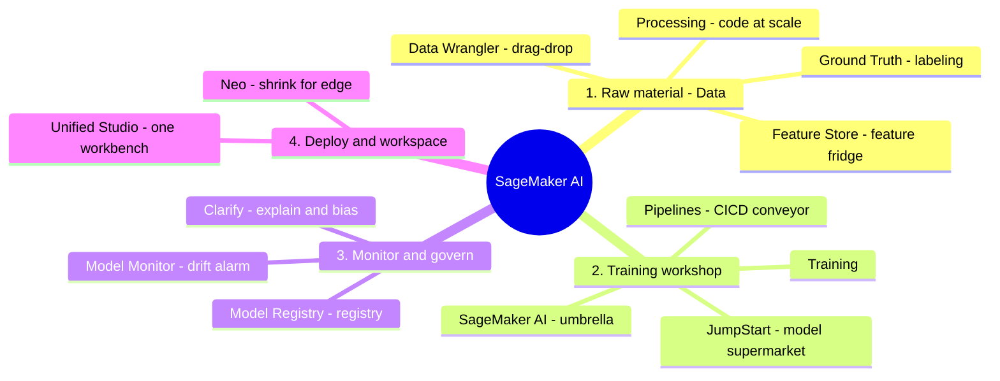

# 02. SageMaker Services

[← Back to Basic Knowledge](./README.md)

> If **Bedrock is a "restaurant"** (order = call an API and eat), then **SageMaker is an "industrial kitchen"** — for engineers who want to knead the data, train, and package models themselves.
> **Mantra:** SageMaker isn't one tool, it's a **pipeline**. Exam questions usually describe one broken/needs-optimizing "link" and ask you to name the right service for that link.

## Mindmap of this category (by ML lifecycle)

## Quick reference

| Service | One-line description | Related domain |
|---|---|---|
| SageMaker AI (core) | "Umbrella" to train/host models (new name of SageMaker) | D1, D2 |
| Ground Truth | Data-labeling army (+ auto labeling) | D1 |
| Data Wrangler | Clean data by **drag-drop** (visual, no-code) | D1 |
| Processing | "Tractor" for large-scale data via **code/Spark** | D1 |
| Feature Store | "Fridge" of reusable features | D1 |
| JumpStart | "Supermarket" of open models (Llama, FLAN-T5, Stable Diffusion) | D1, D2 |
| Pipelines | "Conveyor" automating CI/CD for ML | D2, D5 |
| Model Registry | "Registry": version + approval + lineage | D1, D5 |
| Model Monitor | "Guard" watching drift in production | D5 |
| Clarify | "Inspector": explainability + bias | D3, D5 |
| Neo | "Tuner" shrinking models for edge/IoT | D4 (peripheral) |
| Unified Studio | "All-in-one workbench" + AI writes code | D2 |

---

## Group 1 — Raw material (Data)

### Amazon SageMaker Ground Truth

> **One-line description:** A "labeling army" — hire real people to box/label data to teach the AI, with an AI assistant doing the easy ones to save cost.

- **What problem it solves:** build labeled datasets (e.g. box motorbikes/cars across 50,000 traffic images) via your staff or Mechanical Turk.
- **When to use:** need high-quality labeled data for computer vision/NLP.
- **When NOT to use / easily confused with:** this is the **labeling** step, different from cleaning (Data Wrangler/Processing).
- **Related exam domain:** D1.
- **⚠️ Must remember (the money point):** **Automated Data Labeling** = AI auto-labels "easy" samples, leaving only "hard" ones for humans → **saves labeling cost**.
- **🧪 One-line example:** draw pedestrian bounding boxes for a self-driving project.

🔬 Deep dive: how does it know "easy" vs "hard"? (Active Learning)

**Active Learning** uses a **Confidence Score**, not "feelings":
1. Humans label the first 1,000 → Ground Truth trains a small *labeling model*.
2. That model predicts labels for the next samples with a confidence number.
3. Confidence **≥ threshold** (e.g. 90%) → auto-accept (the "easy" ones). **< threshold** (e.g. 45%) → send to humans (the "hard" ones).
4. Humans label the hard ones → the model retrains → fewer humans needed over time.

### Amazon SageMaker Data Wrangler

> **One-line description:** Clean data by **drag-and-drop** (visual, almost no code).

- **What problem it solves:** connect data from S3, drop empty columns, filter junk, normalize — with the mouse.
- **When to use:** explore & build a "recipe" (pipeline) on a **small sample**.
- **When NOT to use / easily confused with:** huge data (terabytes) → drag-drop hangs → use **Processing**.
- **Related exam domain:** D1.
- **⚠️ Must remember:** Wrangler can **export** to S3, **Feature Store**, or a Python script/Pipeline. Best MLOps practice: build the recipe on sample data, then push to Processing for the full run.
- **🧪 One-line example:** drag-drop 100 sample images to drop excess GPS columns and normalize timestamps.

### Amazon SageMaker Processing

> **One-line description:** A "data tractor" — write Python/Spark code, hand it off, it spins up a cluster, plows through huge data, then shuts down.

- **What problem it solves:** pre/post-processing of **large-scale data (terabytes)**, feature engineering, or model evaluation.
- **When to use:** heavy workloads needing scripts & automation; usually a step inside a Pipeline.
- **When NOT to use / easily confused with:** light drag-drop on sample data → Data Wrangler.
- **Related exam domain:** D1.
- **⚠️ Must remember:** for heavy jobs, enable **Managed Spot** to cut up to **~90%** vs On-Demand.
- **🧪 One-line example:** unzip & resize 50TB of dashcam images to 1080p before training.

### Amazon SageMaker Feature Store

> **One-line description:** A shared "fridge" of pre-computed **features** for all teams to reuse instead of recomputing.

- **What problem it solves:** store & share features (e.g. `user_failed_logins_last_5_mins`) with a clear schema; avoid duplicated work across teams.
- **When to use:** many models/teams need shared features; need **real-time** feature retrieval at inference.
- **When NOT to use / easily confused with:** storing raw files (images/logs/video) → **S3**, not Feature Store.
- **Related exam domain:** D1.
- **⚠️ Must remember:** **Online Store** = **< 10ms** latency for real-time (e.g. fraud detection at card swipe); **Offline Store** = for training (stored in S3 underneath).
- **🧪 One-line example:** at card swipe, the AI hits the Online Store for `failed_logins_5m` in 0.1s to judge fraud.

🔬 Deep dive: Feature Store vs S3 + governance against a "data swamp"

| Criteria | Amazon S3 | Feature Store |
|---|---|---|
| Data type | Anything (images/video/raw logs) | Only computed **features** (numbers/strings) |
| Speed | tens of ms–seconds | **Online < 10ms** |
| Structure | Messy, dump anything | Strict **schema** typing |

Governance (anti data-swamp): (1) must create a **Feature Group** with a strict schema; (2) **metadata/catalog** with name, formula, owner for discovery & correct use; (3) **versioning/time-travel** by timestamp — old models still fetch the feature value as of the old time.

---

## Group 2 — Training workshop

### Amazon SageMaker AI (core)

> **One-line description:** The "umbrella" over all SageMaker services — provides servers and algorithms to train & host models. This is the **new name** of Amazon SageMaker (renamed at re:Invent **late 2024**).

- **What problem it solves:** a full-lifecycle ML platform: build → train → deploy.
- **When to use:** you need deep control over training/hosting (unlike Bedrock's just-call-API).
- **When NOT to use / easily confused with:** just want fast FM calls without managing infra → Bedrock.
- **Related exam domain:** D1, D2.
- **⚠️ Must remember:** the rename didn't break the core architecture; "Amazon SageMaker AI" + "Unified Studio" was the big late-2024 restructure, sub-services keep their roles.
- **🧪 One-line example:** train a fraud-detection model on a GPU cluster in SageMaker.

### Amazon SageMaker JumpStart

> **One-line description:** A "model supermarket" — grab ready-made open-source Foundation Models (Llama, FLAN-T5, Stable Diffusion) instead of building a "brain" from zero.

- **What problem it solves:** quickly deploy/fine-tune ready-made models inside SageMaker.
- **When to use:** you want **full control** of the model on your own endpoint for deep tuning.
- **When NOT to use / easily confused with:** don't confuse **JumpStart** (other people's model supermarket) with **Model Registry** (your **internal** model registry). Also different from Bedrock: JumpStart deploys to **your own SageMaker endpoint** (you manage the instance); Bedrock is pay-per-token, fully managed.
- **Related exam domain:** D1, D2.
- **⚠️ Must remember — model selection criteria:** *task-specific* (summarize→FLAN-T5/BART; image→Stable Diffusion; multilingual chat→Llama/Mistral); *parameter size* (7–8B fast-cheap vs 70B+ smart-expensive); *context window* (4K vs 128K/200K); **licensing** (commercial needs Apache 2.0/MIT).
- **🧪 One-line example:** take Llama from JumpStart, fine-tune for a Vietnamese chatbot, deploy to your own endpoint.

---

## Group 3 — Monitor, govern & explain (exam focus)

### Amazon SageMaker Pipelines

> **One-line description:** A "conveyor" chaining ML steps into an automated process — **CI/CD for Machine Learning (MLOps)**.

- **What problem it solves:** automate ingest → process → train → evaluate → register → deploy, instead of running each step by hand.
- **When to use:** periodic retraining / on new data / when Model Monitor alarms.
- **When NOT to use / easily confused with:** orchestrating a reasoning GenAI agent → that's Bedrock Agents/Step Functions, not Pipelines.
- **Related exam domain:** D2, D5.
- **⚠️ Must remember:** **CI** = auto re-run on code/data change; **CD** = controlled deploy via an **approval step in Model Registry** (no broken model reaches production).
- **🧪 One-line example:** Monitor alarms drift → trigger Pipeline → a few hours later model v5.0 ships automatically.

🔬 Deep dive: a fraud-detection MLOps conveyor

1. **Processing** — pull data from S3, clean.
2. **Training** — train on a GPU cluster.
3. **Evaluation** (Processing + **Clarify**) — accuracy < 95% stops the Pipeline & alerts; if it passes, continue, Clarify checks bias.
4. **Model Registry** — register v5.0, status *Pending Approval*.
5. **Approval & Deploy** — a human approves → CD auto-updates the **SageMaker Endpoint**.

### Amazon SageMaker Model Registry

> **One-line description:** A "registry / GitHub for models" — manage versions, who created, status, and it must be **approved** before use.

- **What problem it solves:** manage the internal model lifecycle (v1, v2, v3), lineage, approval (Dev → Prod).
- **When to use:** many people, many models, need to know which is in production.
- **When NOT to use / easily confused with:** grabbing other people's models → JumpStart; this manages **your** models.
- **Related exam domain:** D1, D5.
- **⚠️ Must remember:** **rollback** isn't `git revert` — set v3 to **Rejected** then point the Endpoint config back to **v2**. **Model Lineage** traces origin (which data, code version, who approved) → transparency for audits.
- **🧪 One-line example:** v3 fails in production → Reject v3, point traffic back to stable v2.

### Amazon SageMaker Model Monitor

> **One-line description:** A "gatekeeper guard" — watches the model in production, sounds the alarm (via CloudWatch) when accuracy degrades.

- **What problem it solves:** detect **drift** when real-world data diverges from training data.
- **When to use:** the model is live, needs 24/7 health monitoring.
- **When NOT to use / easily confused with:** **Monitor alarms *when* results drift (symptom)**; **Clarify finds the *root cause* (bias/reason)**. Easily confused pair.
- **Related exam domain:** D5.
- **⚠️ Must remember:** whatever the cause, the final fix is **trigger Pipeline retraining** with fresh data.
- **🧪 One-line example:** house prices spike in 2024 vs 2020 data → Monitor flags drift → retrain.

🔬 Deep dive: Data Drift vs Concept/Model Drift

- **Data Drift:** the model is fine, the "world" changed — **input** distribution shifts (avg income 10M→20M). Detect: compare current distribution vs **baseline**.
- **Concept/Model Drift:** input unchanged but the **rules** changed ("buy a mask" 2019 = medical, 2026 = fashion). Detect: need real **ground-truth labels** to compare against predictions.

### Amazon SageMaker Clarify

> **One-line description:** A "justice inspector" — explains **why** the AI decided (explainability) and detects **bias**.

- **What problem it solves:** explain each factor's contribution to a decision; measure imbalance across sensitive groups.
- **When to use:** a customer demands a reason for loan rejection; check the model for gender/age discrimination.
- **When NOT to use / easily confused with:** Clarify = **root cause**; Model Monitor = **symptom/drift**.
- **Related exam domain:** D3 (bias/responsible AI), D5.
- **⚠️ Must remember:** see **Shapley Values (SHAP)** or **Partial Dependence Plots (PDP)** → 99% it's **Clarify**. Bias is measured by statistical metrics like **DPL (Difference in Proportions of Labels)** on a **sensitive facet** (e.g. the Gender column).
- **🧪 One-line example:** a file rejected 70% due to bad debt, 30% due to low income (explained via SHAP).

🔬 Deep dive: SHAP & PDP

- **Shapley Values (SHAP):** from *game theory* — compute each feature's "contribution" ("Income" 50%, "Bad debt" 40%, "Age" 10%).
- **PDP (Partial Dependence Plot):** hold everything fixed, vary one factor (e.g. Age 20→60) to see how the outcome probability curve changes.
- **Bias (DPL):** compare approval rates of Male vs Female (other conditions equal); too large a gap → bias alert. Clarify only sees **statistical imbalance**, it doesn't "understand" gender.

---

## Group 4 — Deploy & workspace

### Amazon SageMaker Neo

> **One-line description:** A "car tuner" — compile & optimize a heavy model to run smoothly on small edge/IoT/mobile devices.

- **What problem it solves:** compile a model for target hardware, cutting RAM/latency while keeping near-original accuracy.
- **When to use:** fit a model into a security camera, IoT device, mobile.
- **When NOT to use / easily confused with:** Neo **compiles for hardware**, different from Processing (**processes data**).
- **Related exam domain:** D4 — *and fairly peripheral to this GenAI cert; low study priority.*
- **⚠️ Must remember:** Neo's confirmed techniques are **compile-optimize for target hardware + Quantization** (round Float-32 → Int-8, ~4× lighter). *Confidence note:* the source notes also say "Pruning" — I'm **not sure** that's a named Neo feature (pruning is usually a separate compression technique), so don't treat pruning as a Neo identifier on the exam.
- **🧪 One-line example:** shrink an object-detection model to run on an intersection camera.

### Amazon SageMaker Unified Studio

> **One-line description:** An "all-in-one workbench" — gathers Athena/SageMaker/Bedrock into one screen, with an AI (Amazon Q) beside you writing code.

- **What problem it solves:** a unified IDE for data engineers + ML + GenAI, built on an **open lakehouse architecture**.
- **When to use:** seamless work across many tools in one place.
- **When NOT to use / easily confused with:** it's a **workspace/UI**, not a processing engine.
- **Related exam domain:** D2.
- **⚠️ Must remember:** the keywords are **Open Lakehouse** + **AI code generation (Amazon Q)**.
- **🧪 One-line example:** type "write SQL to filter VIP customers," Q generates and runs it.

🔬 Deep dive: why a Lakehouse queries S3 fast

Lakehouse = Data Lake (S3, cheap, raw) + Data Warehouse (fast queries), via 2 technologies layered on S3:
- **Columnar storage (Parquet):** stored by **column** → summing "Revenue" only pulls that column, skipping 90% of irrelevant data.
- **Open Table Format (Apache Iceberg / Delta Lake):** a metadata "super-index" → a SQL query reads the index first, jumps straight to the few files holding May-2026 data, skipping millions of others.
→ Cheap S3 storage, warehouse-fast queries.

---

## "Exam weapon" comparison table

| Situation / keyword | Don't pick (trap) | Pick (correct) |
|---|---|---|
| Visual, drag-drop data cleaning (no-code) | Processing | **Data Wrangler** |
| Huge batch (terabytes) via script | Data Wrangler | **Processing** (+ Managed Spot) |
| Explain why AI decided / check bias | Model Monitor | **Clarify** (SHAP, PDP, DPL) |
| Alert that accuracy degraded (drift) in production | Clarify | **Model Monitor** |
| Grab a ready GenAI model (Llama, FLAN) | Model Registry | **JumpStart** |
| Version internal models (Dev→Prod) | JumpStart | **Model Registry** |
| Optimize a model to run on edge/IoT | Processing | **Neo** |
| Automate the whole train→deploy flow (CI/CD) | Manual steps | **Pipelines** |
| Store reusable features, real-time < 10ms | S3 | **Feature Store** (Online) |

## ⚠️ Common traps (summary)

- **Data Wrangler (mouse) vs Processing (code)** — scale decides.
- **Clarify (cause/bias) vs Model Monitor (symptom/drift)** — classic pair.
- **JumpStart (others' models) vs Model Registry (internal models).**
- Cost-saving on heavy jobs → **Managed Spot** (~90%).
- Any drift → final solution is **retrain via Pipelines**.
- SHAP/PDP/DPL appears → think **Clarify**.

## Related exam domains

Covers **D1** (data pipeline, FM customization/lifecycle) and **D5** (testing/validation/troubleshooting: Monitor, Pipelines, Registry) heavily, touches **D2** (deploy) and **D3** (Clarify bias). See the [cross-map](./README.md#service--5-exam-domain-cross-map).

🔗 **Related:** [Case studies](../02-case-studies/) · [Practice exam](../03-practice-exam/) · [← 01. Bedrock](./01-amazon-bedrock-services.md) · [03. AI/ML Supporting →](./03-ai-ml-supporting-services.md)
