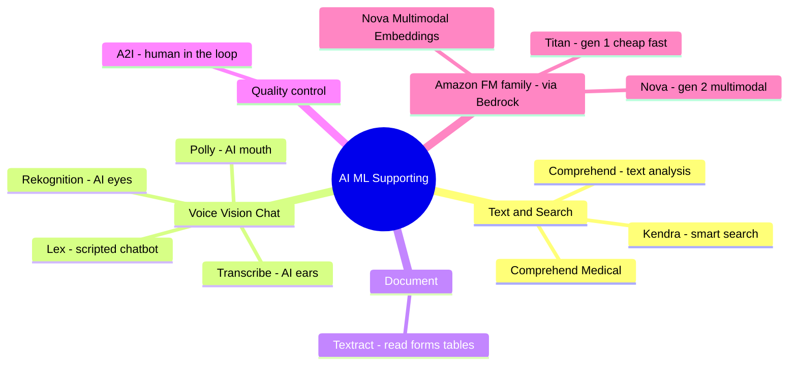

# 03. AI/ML Supporting Services

[← Back to Basic Knowledge](./README.md)

> The "excellent supporting cast" — AWS's **traditional** AI services (long-standing). AIP-C01 doesn't only ask about pure GenAI; it tests whether you can **combine traditional AI + FMs** for a cost- and performance-optimal architecture.
>
> **The "hammer & scalpel" rule:** an FM (Claude, Nova) is an expensive all-purpose "scalpel." If you just need to drive a nail (sentiment analysis, counting people in an image) → use a "hammer" (Comprehend, Rekognition) — fast, cheap, structured output. Traditional AI is usually the **preprocessing** layer; the FM sits at the core for deep reasoning.

## Mindmap of this category

## Quick reference

| Service | One-line description | Related domain |
|---|---|---|
| Comprehend | Text analysis: sentiment, entities, PII | D1, D2 |
| Comprehend Medical | Comprehend specialized for healthcare | D1, D3 |
| Kendra | Semantic search engine (returns docs, doesn't generate) | D1, D2 |
| Lex | Scripted chatbot/voicebot (intent + slot) | D2 |
| Rekognition | "AI eyes": image/video analysis, content moderation | D1, D3 |
| Transcribe | "AI ears": speech-to-text + speaker diarization | D1 |
| Polly | "AI mouth": text-to-speech | D2 |
| Textract | Read forms/tables/OCR (fixed forms) | D1 |
| A2I (Augmented AI) | Human-in-the-loop on low confidence | D3, D5 |
| Amazon Titan | Amazon's "gen 1" FM (cheap, fast) | D1 |
| Amazon Nova | Amazon's "gen 2" multimodal FM + embeddings | D1 |

---

## Text & Search

### Amazon Comprehend

> **One-line description:** A "text-analysis expert" — read a passage and extract structured insights (JSON).

- **What problem it solves:** Sentiment (pos/neg/neutral), Entity Recognition (names/dates/places), Language Detection, Topic Modeling, **PII detection/redaction**.
- **When to use (instead of an FM):** when you need **high volume, millisecond speed, low cost, 100% clean JSON**. FMs are pricier & slower for simple classification, and may be "chatty" and break JSON.
- **When NOT to use / easily confused with:** need to *write prose*, understand sarcasm, classify unknown documents → an FM (Bedrock). Comprehend only **extracts**, it doesn't "compose."
- **Related exam domain:** D1, D2.
- **⚠️ Must remember:** output already specified (sentiment/entities) → prefer Comprehend. In a flow, Comprehend's **PII Redaction** is cheaper & more reliable than letting an FM mask it.
- **🧪 One-line example:** mask `***` over credit-card numbers in a transcript before sending to Bedrock.

🏥 Amazon Comprehend Medical

A Comprehend trained for healthcare: reads messy records, extracts **conditions, medications, dosages, habits** accurately. Use an FM for records **only when** you need to *summarize* or *write patient instructions* (composition); to *extract* medical data → Comprehend Medical.

### Amazon Kendra

> **One-line description:** A "mini Google for your company" — search by **meaning**, returns **original passages + confidence score**, doesn't invent answers.

- **What problem it solves:** enterprise search that understands natural questions.
- **When to use:** the question only asks to **"find and return relevant documents."**
- **When NOT to use / easily confused with:** **🔑 Kendra returns documents; Knowledge Bases (RAG) reads documents and *generates* a complete answer.** "Read documents and answer / synthesize multiple sources" → Knowledge Bases. (Kendra can be the retriever under RAG.)
- **Related exam domain:** D1, D2.
- **⚠️ Must remember:** Kendra does **not** synthesize/compare multiple docs into one answer — that's RAG's job.
- **🧪 One-line example:** ask "maternity policy" → Kendra returns 2 links + excerpts; to *compare 2023 vs 2024 into a table* → Knowledge Bases.

---

## Voice / Vision / Chat

### Amazon Lex

> **One-line description:** A "scripted chatbot builder" — based on **Intents + Slots**, disciplined, no hallucination.

- **What problem it solves:** chatbot/voicebot for clear processes (booking, ordering) via slot-filling.
- **When to use:** **structured** tasks that must collect all required info.
- **When NOT to use / easily confused with:** open/flexible questions → hand off to an FM.
- **Related exam domain:** D2.
- **⚠️ Must remember:** Lex **doesn't guess** — missing a slot, it re-asks until correct. Combine with GenAI via **Fallback Intent**.
- **🧪 One-line example:** Lex keeps booking discipline; random questions go to Bedrock.

🔀 Deep dive: Hand-off Lex → Bedrock (Fallback Intent)

When the user says something **matching no script** (mid-booking suddenly "what should I wear in Tokyo today?"), Lex fires the **Fallback Intent** → calls **Lambda** → Lambda sends the question to **Bedrock** → the FM answers → Lambda returns it to Lex to display. Lex is the "guard" keeping business discipline; Bedrock is the "scholar" handling open questions.

### Amazon Rekognition

> **One-line description:** "AI eyes" — analyze images/video: detect objects, faces, text-in-image, and **content moderation**.

- **What problem it solves:** object/face detection, text-in-image, **Content Moderation** (`DetectModerationLabels`), **Custom Labels** (teach it your logos/parts).
- **When to use:** **preprocess** images before an FM (cheap & fast moderation); specialized recognition.
- **When NOT to use / easily confused with:** an **image-search (RAG)** task → use **Nova Multimodal Embeddings**, not Rekognition (a common trap).
- **Related exam domain:** D1, D3.
- **⚠️ Must remember:** cheaply screen images first (Rekognition) to block junk/inappropriate ones → avoid wasted FM cost & FM crashes on policy violations.
- **🧪 One-line example:** block 18+ images with `DetectModerationLabels` before an FM analyzes them.

### Amazon Transcribe

> **One-line description:** "AI ears" — convert speech → text (speech-to-text).

- **What problem it solves:** transcribe audio; **Speaker Diarization** (distinguish speakers); **Custom Vocabulary** (your jargon).
- **When to use:** process audio/calls before an FM summarizes/analyzes.
- **When NOT to use / easily confused with:** Transcribe = listen; Polly = speak (opposite directions).
- **Related exam domain:** D1.
- **⚠️ Must remember:** its weakness is **crosstalk** (overlapping speech) → use separate/multi-directional mics. Transcribe also has built-in PII redaction.
- **🧪 One-line example:** meeting recording → Transcribe (diarization) → Bedrock summarizes per speaker.

🔬 Deep dive: how Speaker Diarization works

3 steps: (1) **acoustic feature extraction** (pitch, tone…) → encode into a **voiceprint** (like a voice fingerprint); (2) **clustering** nearby voiceprints into "Speaker 0/1…"; (3) label by cluster (no need for real names). It filters background noise well, but **crosstalk** is the weak point.

### Amazon Polly

> **One-line description:** "AI mouth" — text-to-speech, reads text aloud in a natural voice.

- **When to use:** read answers back to the user (voice UX), the final step of a conversational flow.
- **Easily confused:** Polly = text→speech; Transcribe = speech→text. (D2)
- **🧪 One-line example:** Bedrock composes an answer → Polly reads it to the customer by phone.

---

## Document

### Amazon Textract

> **One-line description:** A "forms/tables reader" — OCR + Key-Value + preserves table structure from PDF/images.

- **When to use:** **fixed forms**, standard invoices, fast-cheap-stable (deterministic) digitization.
- **When NOT to use / easily confused with:** **messy, many-format documents needing context understanding** → **Bedrock Data Automation** (see [category 01](./01-amazon-bedrock-services.md)). Textract scrapes *what's on the page*; Data Automation *reasons about meaning*.
- **Related exam domain:** D1.
- **🧪 One-line example:** extract a numeric table from a bank's standard registration form.

---

## Quality Control

### Amazon Augmented AI (A2I)

> **One-line description:** A "human loop" — when the AI's confidence is low, it holds the result and routes it to a human reviewer.

- **What problem it solves:** insert humans when **Confidence Score < threshold** (e.g. < 80%).
- **When to use:** see "**human review / quality control / low-confidence results**" → pick A2I.
- **When NOT to use / easily confused with:** don't confuse with Model Monitor (drift watch). A2I is a **per-result human reviewer**.
- **Related exam domain:** D3, D5.
- **⚠️ Must remember:** A2I integrates with Textract/Rekognition/FM/custom; can be a **manual approval gate inside a CI/CD Pipeline**.
- **🧪 One-line example:** Bedrock reads a loan letter, confidence < 80% → A2I sends it to a credit officer.

🔬 Deep dive: A2I inside CI/CD (high-risk industries)

X-ray reading flow: **CI** auto-trains + checks accuracy → before deploy, the Pipeline calls **A2I** picking the 100 hardest scans for a doctor panel → Pipeline is *Paused* → doctors approve → **CD** auto-deploys, reject → cancels the update. A2I = a safe "handbrake" inside the automated system.

---

## Amazon's Foundation Model family (accessed via Bedrock)

> *Grouping note:* Titan/Nova are Amazon's FMs used **via Bedrock (category 01)**; placed here per the original grouping. AWS loves to ask about its "own children."

### Amazon Titan (gen 1 — cheap, fast)

> **One-line description:** An "intern" — handles basic text tasks with clear rules, prioritizing low cost.

- **Includes:** Titan Text, Titan Image Generator, Titan Embeddings (and Titan Multimodal Embeddings).
- **When to use:** simple high-volume tasks (summarize emails, classify by department) — fast, very cheap.
- **Related exam domain:** D1.
- **🧪 One-line example:** Titan Text summarizes 10,000 emails/day into 2 bullets.

### Amazon Nova (gen 2 — multimodal)

> **One-line description:** A "senior expert" — multimodal (text/image/video), long context, great price.

- **Models & specs (verified):**
  - **Nova Micro** — text-only, **128K** context.
  - **Nova Lite / Nova Pro** — multimodal, **300K** context.
  - **Nova Premier** — most capable, **1M-token** context ("teacher" model for distillation).
  - **Nova Canvas** — image gen; **Nova Reel** — video gen (initially ~6s; newer Reel 1.1 up to ~2 minutes).
- **When to use:** RAG/agentic, image-video understanding, large context.
- **Related exam domain:** D1.
- **⚠️ Must remember — correction:** "1M tokens" is **Premier only** (not the whole family). *(A newer Nova 2 generation appeared in late 2025; for AIP-C01, focusing on the Nova 1 family is enough.)*
- **🧪 One-line example:** Nova Pro analyzes a financial report with charts.

### Amazon Nova Multimodal Embeddings ⭐ (RAG weapon)

> **One-line description:** Turns **text, images, video, audio into the SAME vector space** → cross-modal retrieval.

- **What problem it solves:** use one text query to find a matching video; use an image to find a product. (AWS released **Nov 2025**, "industry's first unified embedding.")
- **When to use:** multimodal RAG — "search by image, return text/video."
- **When NOT to use / easily confused with:** **🔑 image *search/RAG* → Nova Multimodal Embeddings, NOT Rekognition** (Rekognition *recognizes/moderates*, it doesn't create vectors for retrieval).
- **Related exam domain:** D1.
- **🧪 One-line example:** a customer photographs a sofa → embed → find nearest vector in the DB → return product + "98% match" video.

---

## Data-flow thinking (cheap preprocessing first, FM later)

> AWS loves making you **assemble services**. Principle: traditional AI is the preprocessing layer (fast, cheap, structured) → the FM is the reasoning core.

🔗 4 classic flows

1. **Post-call analytics (no PII leak):** `Audio (S3) → Transcribe (diarization) → Comprehend (PII redaction) → Bedrock (summarize)`. *Why Comprehend redacts, not Bedrock?* cheap, fast, 100% accurate; an FM may "hallucinate" and leak PII.
2. **Loan-document processing (IDP):** `PDF (S3) → Textract (standard form) → Data Automation (messy handwritten letter) → A2I (confidence < 80% → human review)`.
3. **Multimodal RAG (maintenance engineer):** `Image + question → Nova Multimodal Embeddings → Vector DB (OpenSearch) → Bedrock (Nova Pro) writes the guide`. *Trap:* don't use Rekognition for the search step.
4. **Safe content generation for kids (defense-in-depth):** `User image → Rekognition (moderation) → Prompt → Bedrock Guardrails → Bedrock generates the story` (Guardrails also checks the output).

---

## "Exam weapon" comparison table

| Situation / keyword | Don't pick (trap) | Pick (correct) |
|---|---|---|
| Classify sentiment/entities, high volume, cheap | FM (Bedrock) | **Comprehend** |
| Extract data from medical records | Plain Comprehend | **Comprehend Medical** |
| Just find & return relevant documents | Knowledge Bases | **Kendra** |
| Read documents and answer / synthesize sources | Kendra | **Knowledge Bases (RAG)** |
| Rigid-process chatbot (booking), no hallucination | Pure FM | **Lex** (+ Fallback → Bedrock) |
| Moderate images / detect objects | FM Vision (pricey) | **Rekognition** (preprocess) |
| Image search (RAG) returning text/video | Rekognition | **Nova Multimodal Embeddings** |
| Speech-to-text + distinguish speakers | — | **Transcribe** (diarization) |
| Read fixed forms, OCR tables | Data Automation | **Textract** |
| Messy documents needing context | Textract | **Bedrock Data Automation** |
| "human review / low-confidence / quality control" | Model Monitor | **A2I** |

## ⚠️ Common traps

- **Hammer & scalpel:** simple task → cheap/fast traditional AI; deep reasoning → FM.
- **Kendra (returns docs) vs Knowledge Bases (generates answers).**
- **Rekognition (recognize/moderate) vs Nova Multimodal Embeddings (image search/RAG).**
- **A2I** = keyword "human review / low-confidence."
- Traditional AI = the cheap **preprocessing** layer; FM = the core.

## Related exam domains

Covers **D1** (data processing Task 1.3) & **D2** (integration) heavily, touches **D3** (Rekognition moderation, A2I). See the [cross-map](./README.md#service--5-exam-domain-cross-map).

🔗 **Related:** [Case studies](../02-case-studies/) · [Practice exam](../03-practice-exam/) · [← 02. SageMaker](./02-sagemaker-services.md) · [04. Amazon Q →](./04-amazon-q-services.md)
