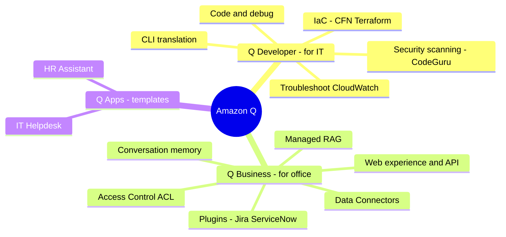

# 04. Amazon Q Services

[← Back to Basic Knowledge](./README.md)

> If Bedrock/SageMaker is where you **build** AI, then **Amazon Q is AWS's pre-packaged AI products** for immediate use — the Productivity family. Imagine your company just hired 3 AI employees: **Q Developer** (coder), **Q Business** (enterprise librarian), **Q Apps** (instant noodles).
>
> *Scope note:* Amazon Q appears in AIP-C01 at a **moderate** level (mostly D2). The main goal is to **distinguish** it from Bedrock Knowledge Bases.

## Mindmap of this category

## Quick reference

| Service | One-line description | Related domain |
|---|---|---|
| Amazon Q Developer | Coding + AWS infra assistant (in IDE & Console) | D2 |
| Amazon Q Business | Packaged enterprise RAG + access control | D2, D3 |
| Amazon Q Apps | Pre-built app templates on Q Business (HR, IT) | D2 |

---

## Service cards

### Amazon Q Developer

> **One-line description:** A "senior coder + AWS expert" living inside the IDE (VS Code, JetBrains) **and** the AWS Console.

- **What problem it solves:** speed up coding & AWS infrastructure management.
- **Main capabilities:**
  - **Code & debug:** understands the project, writes in your style, explains code.
  - **Security Scanning (often on the exam):** runs in the background catching security bugs (hardcoded credentials, SQL injection) **before commit**.
  - **IaC:** generates CloudFormation/Terraform per Well-Architected.
  - **CLI translation:** "show me running servers" → `aws ec2 describe-instances`.
  - **Troubleshooting:** right in the Console, reads CloudWatch Logs → finds root cause (e.g. missing IAM permission) → suggests a fix.
- **When to use:** anything involving **code, infrastructure, AWS commands, IDE, infra debugging**.
- **When NOT to use / easily confused with:** **Q Developer ≠ Q Business.** Q Developer is for developers; Q Business lets staff query documents. Security Scanning is **different from** Bedrock Guardrails (Guardrails filters prompt content/PII, doesn't scan code) and **different from** CodeGuru Profiler (measures runtime performance).
- **Related exam domain:** D2.
- **⚠️ Must remember:** Security Scanning inherits **CodeGuru Security** → CVE/OWASP updates **in real time on the cloud** (not a static AI). Q Developer's predecessor was **CodeWhisperer**.
- **🧪 One-line example:** Q Developer catches a Lambda hard-coding a DB password as you type.

🔬 Deep dive: how it handles large projects (context limit)

Q Developer doesn't ship a million lines to the cloud. It uses **Local Semantic Indexing** + RAG in the IDE: builds a hidden "index," sends only the most relevant code (open file, highlighted functions, directly imported files). Complex projects can "lose context" → use the **@workspace** tag (Pro) to force a full-index sweep, or connect to GitHub/GitLab/CodeCommit to index whole repos.

### Amazon Q Business

> **One-line description:** An "enterprise librarian" — a **100%-packaged RAG** system: plug into company data sources, get a chat UI out of the box.

- **What problem it solves:** staff (Sales/HR/Marketing) ask about internal docs. Plug in **Data Connectors** (S3, SharePoint, Google Drive, Salesforce) → it auto-ingests, chunks, vectorizes, gives a chat UI.
- **When to use:** enterprise search/RAG with **least effort**, needs **strict access control**, multi-turn.
- **When NOT to use / easily confused with:** want to **code it yourself, build your own UI, deeply control the RAG flow**, or build a RAG app for external customers → **Bedrock Knowledge Bases** (Q Business is SaaS, no deep intervention). Not a code-writing tool (that's Q Developer).
- **Related exam domain:** D2, D3.
- **⚠️ Must remember:** its "greatest" feature = **inherits access control (ACL)** from source systems → prevents cross-data leakage. **Conversation memory** keeps multi-turn context with no code. **Web experience** out-of-the-box (rebrand logo/colors and go) or use the **Q Business API** to embed a custom UI.
- **🧪 One-line example:** a contractor asks "CEO's salary?" → Q checks the ACL, sees DENY on `finance/` → replies "I don't have that information."

🔐 Deep dive: Access Control (ACL) & Plugins

- **ACL:** Q Business respects source permissions. E.g. a JSON ACL: group `finance-team` = ALLOW, `contractors` = DENY on prefix `finance/`. A DENY'd person asking about that doc → Q acts as if it **doesn't exist**.
- **Plugins (hands — write actions):** built-in connectors to Jira/ServiceNow/Salesforce/Zendesk. A staffer chats "broken mouse" → Q asks "create a Jira ticket?" → one click creates it. *Vs Bedrock Agents:* Agents are flexible but you code Lambda/OpenAPI; Plugins are **pre-built enterprise connectors** configured by clicking.
- **Data Connectors** only **read (read-only)** to ingest docs; to **take actions (write)** use **Plugins**.

### Amazon Q Apps (Q Business Apps)

> **One-line description:** "Instant noodles" — pre-built app templates (HR Assistant, IT Helpdesk) **on top of** Q Business.

- **What problem it solves:** deploy very fast (days), comes with a domain System Prompt + UI, no writing prompts/UI.
- **When to use:** need an HR/IT bot **fastest**, little customization.
- **When NOT to use / easily confused with:** **understand correctly:** a Q App does **not** contain another company's HR data — it's just a "mold" (template prompt + UI). **The soul is still your data** (you still point a connector to S3/SharePoint with your internal handbook). Being RAG, it answers **per your company's rules**, not generic knowledge.
- **Related exam domain:** D2.
- **⚠️ Must remember:** fast but **less flexible** than building Q Business yourself.
- **🧪 One-line example:** HR App + point to S3 with the "employee handbook" → in days you have a bot answering leave policy.

---

## "Exam weapon" comparison table

| Situation / keyword | Don't pick (trap) | Pick (correct) |
|---|---|---|
| Find security bugs in code, write CFN/Terraform, translate CLI | Q Business | **Q Developer** |
| Debug infra from CloudWatch Logs in the Console | Comprehend / IDE explain | **Q Developer in Console** |
| Chat over internal docs (SharePoint/S3) + strict permissions, least effort | Bedrock KB (code ACL yourself) | **Q Business** |
| RAG but need to code it, build UI, deep control / external customers | Q Business (SaaS) | **Bedrock Knowledge Bases** |
| HR/IT bot deployed fast, no writing prompt/UI | Q Business native / Bedrock | **Q Apps** |
| Chatbot auto-creates Jira/ServiceNow tickets | Data Connectors | **Q Business Plugins** |
| Read-only ingest from S3/SharePoint | Plugins | **Data Connectors** |
| Scan code for security bugs | Bedrock Guardrails / CodeGuru Profiler | **Q Developer (Security Scanning)** |

## ⚠️ Common traps

- **Q Developer (code/infra) vs Q Business (internal docs) vs Bedrock KB (build your own RAG).**
- **Q Apps** is just a template — the data is still your company's (still RAG).
- **Plugins = actions (write)**, **Data Connectors = read.**
- Q Developer's Security Scanning **≠** Guardrails (content) **≠** CodeGuru Profiler (performance).
- Need low latency/deep control, custom UI, external customers → lean **Bedrock**, not Q.

## Related exam domains

Covers **D2** (implementation/integration) heavily, touches **D3** (Q Business ACL/governance) and **D1**. Amazon Q is overall a **moderate** AIP-C01 topic. See the [cross-map](./README.md#service--5-exam-domain-cross-map).

🔗 **Related:** [Case studies](../02-case-studies/) · [Practice exam](../03-practice-exam/) · [← 03. AI/ML Supporting](./03-ai-ml-supporting-services.md) · [05. Data & Analytics →](./05-data-analytics-services.md)
