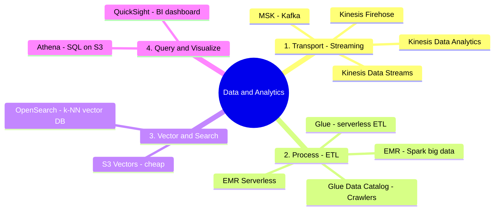

# 05. Data & Analytics Services

[← Back to Basic Knowledge](./README.md)

> A **high-weight** layer (contributes heavily to D1 = 31%). No matter how good the AI chef is, spoiled/messy "ingredients" (data) ruin the dish. This group **prepares, transports, stores-searches, and reports** data.
>
> Remember it as the **4 stages of a data factory:** Transport → Process (ETL) → Store & search (Vector) → Query & visualize.

## Mindmap of this category



## Quick reference

| Service | One-line description | Related domain |
|---|---|---|
| Kinesis Data Streams | Real-time intake pipe (you code the processing) | D1 |
| Kinesis Firehose | Funnel that auto-compresses + partitions + dumps to S3 (no-code) | D1, D4 |
| Kinesis Data Analytics | Filter/catch errors in the pipe via SQL | D1, D5 |
| Amazon MSK | Kinesis in Kafka form (open source) | D1 |
| AWS Glue | Serverless ETL + Data Catalog (the heart of data) | D1 |
| Amazon EMR | Spark/Hadoop cluster for heavy big data | D1 |
| OpenSearch Service | Vector DB (k-NN) — the standard RAG backend | D1 |
| Amazon Athena | Serverless SQL querying directly on S3 | D1, D4 |
| QuickSight | BI dashboards for executives | D4 |

---

## Stage 1 — Transport (Streaming)

### Amazon Kinesis

> **One-line description:** An "internal AWS pipeline" catching continuously-flowing data in real time.

- **3 components:**
  - **Data Streams:** ingest real-time; **you write code (Lambda)** to process each record.
  - **Firehose (often on the exam):** an "auto funnel" — inflow auto-**compresses + partitions by date + dumps to S3**, no code.
  - **Data Analytics:** filter/catch errors **inside the pipe** via SQL (e.g. AI answered wrong 10×/minute).
- **When to use:** ingest real-time logs/clicks/events.
- **When NOT to use / easily confused with:** "gather data, auto-compress, partition, dump to S3" → **Firehose** (don't pick Data Streams, it forces you to code).
- **Related exam domain:** D1 (D4 thanks to Firehose compression/partition savings).
- **🧪 One-line example:** Epic Games ingests millions of events/sec from gamers via Data Streams.

### Amazon MSK (Managed Apache Kafka)

> **One-line description:** Like Kinesis but is **open-source Apache Kafka** managed by AWS.

- **When to use:** the company **already runs Kafka** (lift to cloud without rewriting), or extreme load.
- **When NOT to use / easily confused with:** the question **doesn't mention "Kafka"** → default to **Kinesis**.
- **Related exam domain:** D1.
- **🧪 One-line example:** Uber/Netflix lift their old Kafka architecture to AWS via MSK.

---

## Stage 2 — Process (ETL)

### AWS Glue

> **One-line description:** An "auto blender" — **serverless** ETL that shuts down when done; great for prepping RAG data.

- **What problem it solves:** Extract–Transform–Load data in S3 with a few lines of Python/Scala.
- **Key components:**
  - **Glue Data Catalog** = the "heart" of AWS data: **Crawlers** auto-crawl S3 to read schema (columns, types) → write into a shared catalog so other services (Athena…) know what's in S3.
  - **Glue Studio:** drag-drop UI for the code-averse.
- **When to use:** simple, serverless, automated ETL.
- **When NOT to use / easily confused with:** **tens of TB** or very complex ML transforms → **EMR** (Glue struggles).
- **Related exam domain:** D1.
- **🧪 One-line example:** a Glue Crawler scans S3 to build a Catalog so Athena can query it.

### Amazon EMR

> **One-line description:** A "big-data industrial park" — a cluster running Apache Spark/Hadoop, immensely powerful.

- **When to use:** **tens of TB**, complex ML transforms Glue can't handle; distributed across thousands of nodes.
- **When NOT to use / easily confused with:** fast queries or light ETL → Athena/Glue. EMR means managing a cluster (except **EMR Serverless**).
- **Related exam domain:** D1.
- **⚠️ Must remember — correction:** **Amazon EMR Serverless EXISTS** (throw in PySpark code, AWS auto-starts/stops, pay per second). Pick EMR Serverless over Glue when you need **specialized Spark/ML libraries Glue doesn't support**.
- **🧪 One-line example:** process 50TB of self-driving data/night: blur faces + sync GPS via Spark on EMR.

---

## Stage 3 — Vector & Search

### Amazon OpenSearch Service

> **One-line description:** A full-text search engine that is also a **Vector Database (k-NN)** — the most standard "bookshelf" for RAG.

- **What problem it solves:** store embeddings + find **nearest neighbors (k-NN)**; also real-time log analytics.
- **When to use:** Vector DB backend for Bedrock Knowledge Bases; millisecond semantic search.
- **When NOT to use / easily confused with:** **OpenSearch = vector/semantic search**; **Athena = static SQL on S3**. Need cheap vectors, infrequent queries → **S3 Vectors** ([category 06](./06-integration-orchestration-services.md)).
- **Related exam domain:** D1.
- **🧪 One-line example:** store document vectors, retrieve top-5 nearest-meaning chunks via k-NN for RAG.

<details><summary>🔑 Deep dive: k-NN ≠ Top-k / Top-p / Temperature (very commonly confused)</summary>

- **k-NN** (in OpenSearch): **SEARCH** — "get me the 5 documents closest in meaning to my question."
- The next 3 "knobs" control **TEXT GENERATION** in Bedrock (nothing to do with search):
  - **Temperature:** "creativity." ~0 = always pick the highest-probability token (precise, mechanical → for **RAG/code/legal**). High (e.g. 0.9) = flatten probabilities, pick rarer words (creative/poetry/marketing).
  - **Top-k:** keep only the **k** highest-probability tokens, then sample (e.g. k=3).
  - **Top-p (nucleus):** sum probabilities until reaching **p%**, then cut (e.g. p=0.85).
- **Exam tip:** want **accurate RAG, no fabrication** → set **Temperature to 0**; want creativity → raise Temperature + Top-p.
</details>

---

## Stage 4 — Query & Visualize

### Amazon Athena

> **One-line description:** An "S3 explorer" — **serverless SQL** running directly on files in S3, no need to copy into a database.

- **When to use:** SQL over JSON/CSV/Parquet sitting in S3 (e.g. filtering error logs).
- **When NOT to use / easily confused with:** complex/heavy ML → EMR; vector/semantic → OpenSearch.
- **Related exam domain:** D1, D4.
- **⚠️ Must remember (cost saving):** Athena bills by **data scanned**. You must **partition by date** → querying May 15 scans only that folder → cheap & fast. (Columnar Parquet also slashes scan cost.)
- **🧪 One-line example:** `SELECT * FROM logs WHERE error=true AND dt='2026-05-15'` runs straight on S3.

### Amazon QuickSight (Quick Suite)

> **One-line description:** A "chart artist" — a BI tool drawing pretty business dashboards for executives.

- **When to use:** take Athena results → draw bar/pie charts for **business stakeholders**.
- **When NOT to use / easily confused with:** **QuickSight = business charts for execs; CloudWatch = technical charts (latency/errors) for IT.**
- **Related exam domain:** D4.
- **🧪 One-line example:** a "how much did the AI spend this month" dashboard for the director.

---

## Standard GenAI data flow (often on the exam)

```
System logs → Kinesis Firehose (compress + partition) → S3
   → Glue Crawler builds the Data Catalog
   → Athena runs SQL to filter errors (based on the Catalog)
   → QuickSight connects to Athena to draw a report for the boss
```

## "Achilles' heel" comparison table

| Requirement (keyword) | Pick | Why not the other |
|---|---|---|
| SQL over JSON/CSV files sitting in S3 | **Athena** | EMR is for complex processing, not fast queries |
| Simple, serverless, automated ETL | **Glue** | EMR must manage a cluster, heavier |
| Complex ML transform on 50TB via Spark | **EMR** | Glue struggles with data too large/complex |
| Gather data, auto-compress, partition, dump to S3 | **Kinesis Firehose** | Data Streams forces you to code |
| Store vectors + semantic search for RAG | **OpenSearch** | Athena is static SQL, not a Vector DB |
| Tons of vectors, infrequent queries, cost-optimized | **S3 Vectors** | OpenSearch is fast but expensive |
| Business dashboards for management | **QuickSight** | CloudWatch is technical metrics for IT |
| Already have Kafka / extreme load | **MSK** | Kinesis if the question doesn't mention Kafka |

## ⚠️ Common traps

- **Firehose (no-code, compress/partition) vs Data Streams (you code).**
- **Glue (light serverless ETL) vs EMR (heavy Spark big data)** — there's also **EMR Serverless**.
- **OpenSearch (vector/semantic) vs Athena (static SQL).**
- **QuickSight (execs) vs CloudWatch (IT).**
- **Athena:** always remember **partition + Parquet** for cheapness.
- **k-NN ≠ Top-k/Top-p/Temperature.**

## Related exam domains

Covers **D1 very heavily** (data pipeline, vector store, RAG backend — Tasks 1.3/1.4) and touches **D4** (cost: Firehose, Athena partitioning). See the [cross-map](./README.md#service--5-exam-domain-cross-map).

🔗 **Related:** [Case studies](../02-case-studies/) · [Practice exam](../03-practice-exam/) · [← 04. Amazon Q](./04-amazon-q-services.md) · [06. Integration & Orchestration →](./06-integration-orchestration-services.md)
