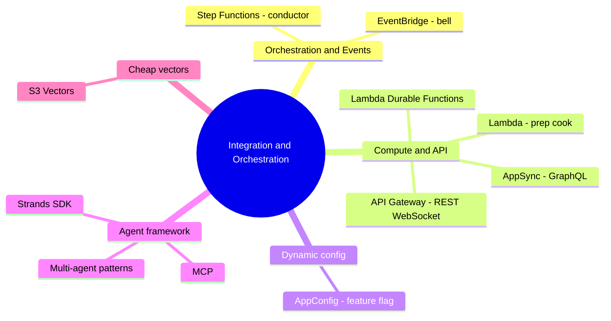

# 06. Integration & Orchestration Services

[← Back to Basic Knowledge](./README.md)

> The "front-of-house staff" of **D2 (26%)**. If FMs (Claude, Titan) are the "master chefs," the restaurant still needs: a **host taking orders** (API Gateway/AppSync), a **manager orchestrating** (Step Functions), a **prep cook** (Lambda), a **dish-ready bell** (EventBridge), and a **switchboard** to change the menu without closing (AppConfig).

## Mindmap of this category

## Quick reference

| Service | One-line description | Related domain |
|---|---|---|
| Step Functions | Orchestrate multi-step with branching/retry (state machine) | D2 |
| EventBridge | Event bus to decouple systems | D2 |
| Lambda | Serverless "glue" compute (≤15 min) | D2 |
| Lambda Durable Functions | Lambda running up to 1 year, checkpoint/replay | D2, D4 |
| API Gateway | REST/WebSocket host: auth, rate-limit, streaming | D2 |
| AppSync | GraphQL host: flexible single-call multi-fetch | D2 |
| AppConfig | Change model/config **without redeploying** | D2, D4 |
| Strands Agents SDK | Framework to code autonomous agents (model-driven) | D2 |
| Amazon S3 Vectors | Ultra-cheap vector storage for RAG | D1 |

---

## Group 1 — Orchestration & Events

### AWS Step Functions

> **One-line description:** The "restaurant manager" — orchestrates steps along a flowchart (state machine) with strong error handling & retries.

- **What problem it solves:** chain many AWS services into a process with **branching, waiting, retry, human approval**.
- **When to use:** see "**visual workflow / orchestrate multiple AWS services / error handling / retry**."
- **When NOT to use / easily confused with:** simple straight-line flow → just Lambda. A process where **AI reasons and picks steps** (not predefined) → **Strands/AgentCore**, NOT Step Functions.
- **Related exam domain:** D2.
- **⚠️ Must remember:** **Standard workflow** holds state up to **1 year**; defined in JSON (Amazon States Language).
- **🧪 One-line example:** loan approval: analyze → wait 3 days for the director → call the bank API.

🔬 Deep dive: Step Functions vs Bedrock Prompt Flows

| | Prompt Flows | Step Functions |
|---|---|---|
| Scope | Inside Bedrock (chain prompts/models/RAG) | 200+ AWS services (Lambda, SQS, DynamoDB…) |
| Duration | seconds/minutes | up to **1 year** |
| Interface | drag-drop for AI/Prompt Engineers | JSON (ASL) for backend/DevOps |
| Error/branching | basic | very strong (retry, catch, loops) |

"Head chef" (Prompt Flows, in the kitchen) vs "Restaurant manager" (Step Functions, the whole multi-day business process).

### Amazon EventBridge

> **One-line description:** A "bell system" — **decouple** systems via events.

- **What problem it solves:** component A emits an event, EventBridge routes it to many targets without A knowing who listens.
- **When to use:** see "**decouple / route events to multiple targets / event-driven**."
- **When NOT to use / easily confused with:** need a sequential stateful process → Step Functions, not EventBridge.
- **Related exam domain:** D2.
- **🧪 One-line example:** the AI finishes cooking, "rings the bell" → EventBridge notifies every interested service.

---

## Group 2 — Compute & API

### AWS Lambda

> **One-line description:** A "versatile prep cook" — serverless compute, runs on demand, shuts off when done; the "glue code."

- **When to use:** pre/post-processing (spell-check input, trim JSON output), short tasks.
- **⚠️ Must remember:** Lambda is usually **capped at 15 minutes**.
- **Related exam domain:** D2.
- **🧪 One-line example:** Lambda normalizes the FM's answer JSON before returning to the client.

### AWS Lambda Durable Functions

> **One-line description:** A "long-lived, stateful" Lambda — write sequential code but run up to **1 year**, auto-checkpoint, sleep without charges.

- **What problem it solves:** multi-step/long-wait workflows (human approval, long-running AI) **in one Lambda**, no Step Functions needed.
- **When to use:** multi-step AI workflows needing fault tolerance while keeping the familiar Lambda model.
- **Related exam domain:** D2, D4 (sleeping = no compute charge).
- **⚠️ Must remember (verified):** **launched at re:Invent Dec 2025**; checkpoint/replay, suspend up to ~366 days, pay only while running.
- **🧪 One-line example:** a ticket pipeline: triage → wait for human reply → close, all in one function.

### Amazon API Gateway

> **One-line description:** A "REST/WebSocket host" — the door receiving requests, standing in front of Lambda.

- **When to use:** see "**REST / rate limiting / authentication / streaming responses**."
- **⚠️ Must remember:** handles **Auth** (check the badge), **Rate Limiting** (anti-spam), **WebSocket** (stream AI text line-by-line).
- **Related exam domain:** D2.
- **🧪 One-line example:** WebSocket streams a Bedrock answer to the UI in real time.

### AWS AppSync

> **One-line description:** A "GraphQL host" — one call fetches many different pieces of data.

- **When to use:** see "**GraphQL / flexible queries**" (e.g. fetch AI answer + avatar + chat history in one request).
- **Easily confused:** REST/WebSocket → API Gateway; GraphQL → AppSync.
- **Related exam domain:** D2.

---

## Group 3 — Dynamic config

### AWS AppConfig

> **One-line description:** A "magic switch" — change model/config via a **Feature Flag** **without redeploying code**.

- **What problem it solves:** flip Claude ↔ Llama instantly; **Canary** opens 10% first, on error auto-flips back.
- **When to use:** see "**change model without redeploying / A-B testing / gradual rollout**."
- **When NOT to use / easily confused with:** storing **passwords/API keys needing rotation** → Secrets Manager; static env vars → Parameter Store (see [category 07](./07-security-governance-services.md)).
- **Related exam domain:** D2, D4.
- **🧪 One-line example:** shift 10% of traffic to Sonnet; CloudWatch reports errors → AppConfig auto-reverts to Haiku.

---

## Group 4 — Agent framework (focus rising sharply in 2026)

### Strands Agents SDK

> **One-line description:** A code library (Python/TypeScript) to write **autonomous agents** in a **model-driven** way — give the AI a goal + tools, it figures out the steps.

- **What problem it solves:** build agents that **decide for themselves** (unlike Step Functions' hard-wired flow).
- **When to use:** see "**dynamic decision making / plan and execute / multi-agent / model-driven orchestration**."
- **When NOT to use / easily confused with:** fixed, predefined-branch flow → Step Functions. Plain RAG (read docs, answer) → Knowledge Bases.
- **Relationship to AgentCore:** **Strands = framework (write the agent code); AgentCore = infrastructure (run that agent on AWS)** — they go together. (The official exam guide also names **AWS Agent Squad**.)
- **Related exam domain:** D2 (Task 2.1 — agentic AI).
- **🧪 One-line example:** an investment agent auto-calls a news-reading agent + a numbers-analysis agent, then synthesizes.

🔬 Deep dive: 4 multi-agent patterns + how to "rein in" the AI

- **Agents-as-Tools (boss–soldier, hierarchical):** one orchestrator treats specialist agents as "tools" to dispatch, then synthesizes. Easy to control.
- **Swarms (peer-to-peer):** no boss; agents "hand off" to each other by context until done.
- **Graphs (deterministic assembly line):** "nail down" step order (step 1 done before step 2), but **inside each step the agent reasons freely**.
- **Handoffs (transfer to a human):** the agent hits a hard/dangerous case → hands the whole chat to a **real human** (e.g. healthcare: "chest pain" → alert a doctor).

**Reining in the AI (3 layers):** (1) strict **Tool Schema** JSON (missing a param → the SDK blocks it); (2) disciplined **System Prompt** ("you MUST check balance BEFORE transferring"); (3) **AgentCore Policy (Cedar)** at the Gateway blocks over-privileged actions (e.g. > $5M needs human approval).

🔌 MCP (Model Context Protocol) — "the USB-C of AI"

A standard for agents to plug into external tools/systems (Google Drive, SQL, Slack/Jira) without writing per-tool glue code. The community/AWS ship pre-built **MCP Servers**; in Strands you just declare an MCP Client pointing to one. AgentCore Gateway uses MCP as a "universal socket" with IAM permission management.

---

## Group 5 — Ultra-cheap vector storage

### Amazon S3 Vectors

> **One-line description:** A new kind of S3 bucket dedicated to vectors — **~90% cheaper** than OpenSearch, slightly slower (under ~1 second).

- **When to use:** see "**cost-optimized vector storage / billions of vectors / infrequent queries**." Integrates directly with Bedrock Knowledge Bases.
- **When NOT to use / easily confused with:** need **millisecond, high-frequency** retrieval → OpenSearch ([category 05](./05-data-analytics-services.md)).
- **Related exam domain:** D1.
- **🧪 One-line example:** 1 billion old, rarely-queried documents → S3 Vectors instead of OpenSearch to save cost.

---

## Eliminate-wrong-answers tips (keyword → service)

| Keyword in the question | Pick |
|---|---|
| Visual workflow / orchestrate multiple AWS services / error handling, retry | **Step Functions** |
| Streaming responses / REST / rate limiting / auth | **API Gateway** |
| GraphQL / flexible queries | **AppSync** |
| Decouple / route events to multiple targets / event-driven | **EventBridge** |
| Change model without redeploying / A-B testing / gradual rollout | **AppConfig** |
| Multi-agent / swarms / model-driven / plan and execute | **Strands SDK** (+ AgentCore) |
| Cost-optimized vector storage / billions of vectors / infrequent | **S3 Vectors** |
| Long-running fault-tolerant multi-step AI workflow, still Lambda | **Lambda Durable Functions** |

## ⚠️ Common traps

- **Step Functions (hard-wired flow) vs Strands/AgentCore (AI self-decides).**
- **API Gateway (REST/WebSocket) vs AppSync (GraphQL).**
- **AppConfig (dynamic config) vs Secrets Manager (secrets) vs Parameter Store (static)** — see 07.
- **Strands = framework, AgentCore = infrastructure** (go together).
- **S3 Vectors (cheap, slower) vs OpenSearch (pricey, fast).**

## Related exam domains

Covers **D2 very heavily** (implementation/integration, agentic), touches **D1** (S3 Vectors) and **D4** (AppConfig, Durable Functions savings). See the [cross-map](./README.md#service--5-exam-domain-cross-map).

🔗 **Related:** [Case studies](../02-case-studies/) · [Practice exam](../03-practice-exam/) · [← 05. Data & Analytics](./05-data-analytics-services.md) · [07. Security & Governance →](./07-security-governance-services.md)
