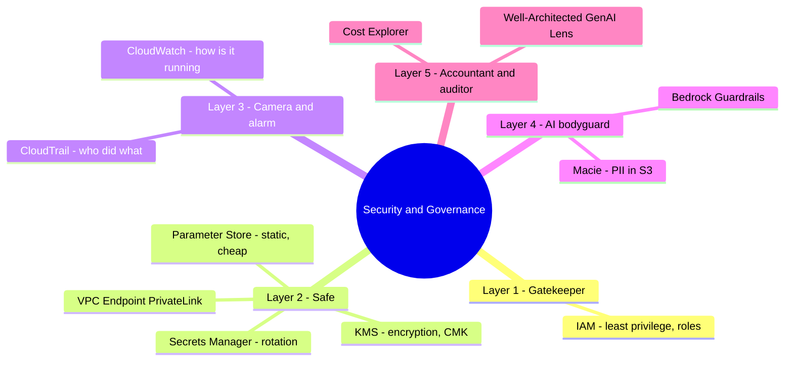

# 07. Security & Governance Services

[← Back to Basic Knowledge](./README.md)

> The "defense" layer, **D3 (20%)** — it decides whether your GenAI system is **allowed into production**. Picture the system as an **AI Bank** with multiple protection layers.

## Mindmap of this category

## Quick reference

| Service | One-line description | Related domain |
|---|---|---|
| IAM | Who can do what to which resource (least privilege) | D3 |
| KMS | Manage keys for data-at-rest encryption | D3 |
| Secrets Manager | Safe for secrets + auto-rotation | D3 |
| Parameter Store | Drawer for static config, cheap | D3 |
| VPC Endpoint (PrivateLink) | Call Bedrock without the internet | D3 |
| CloudTrail | "Audit camera": who called which API | D3, D5 |
| CloudWatch | "Gauge": latency, errors, logs | D5, D4 |
| Bedrock Guardrails | AI bodyguard: filter content, mask PII, block topics | D3 |
| Macie | Detect PII/sensitive data in S3 | D3 |
| Cost Explorer | Inspect token cost, anomaly detection | D4 |
| Well-Architected (GenAI Lens) | "Textbook" to assess the architecture | D3, D4 |

---

## Layer 1 — Gatekeeper

### AWS IAM

> **One-line description:** Decides **Who (Principal)** can do **What (Action)** to **Which resource**.

- **What problem it solves:** control access to resources.
- **When to use:** see "**control access / who can call the model**."
- **⚠️ Must remember:** **Least Privilege** — don't grant `bedrock:*`, only allow the exact model needed. **IAM Roles**: Lambda/EC2 have no user/password, they use a Role to borrow temporary credentials.
- **Related exam domain:** D3.
- **🧪 One-line example:** a Role lets Lambda call `bedrock:InvokeModel` only on Claude 3, no other model.

---

## Layer 2 — Safe & key box

### AWS KMS

> **One-line description:** Manages **encryption keys** for data at rest (encryption at rest) on S3/DynamoDB.

- **When to use:** see "**encrypt data / manage keys**."
- **⚠️ Must remember:** the question mentions **Compliance/Audit** → pick **Customer-Managed Keys (CMK)** over the AWS default, because CMK gives **full control & key-usage logs**.
- **Related exam domain:** D3.
- **🧪 One-line example:** encrypt RAG documents in S3 with a CMK for auditability.

### AWS Secrets Manager vs Parameter Store (classic trap)

> **Secrets Manager — one-line:** a "smart safe" for sensitive secrets, with **auto-rotation**.
> **Parameter Store — one-line:** a "drawer" for static/non-sensitive config, **cheap/free**.

- **Secrets Manager:** DB passwords, API keys (OpenAI/Anthropic) — the prized feature is **Automatic Rotation** (rotate the DB password every 30 days without breaking the app). Costs per secret.
- **Parameter Store (Systems Manager):** model IDs, URLs, Dev/Prod env names — cheap, hierarchical like `/dev/db/url`.
- **🔑 Vs AppConfig** ([category 06](./06-integration-orchestration-services.md)): AppConfig = **dynamic config/feature flags** changed without redeploy.
- **Related exam domain:** D3.
- **🧪 One-line example:** DB password needs rotation → Secrets Manager; a fixed helper-API URL → Parameter Store.

🔬 Deep dive: Secrets Manager vs Parameter Store vs AppConfig

| | Secrets Manager | Parameter Store | AppConfig |
|---|---|---|---|
| Purpose | High-security secrets | Static config/env vars | Dynamic config, feature flags |
| Prized feature | Auto-rotation | Free (standard), hierarchical | Change without deploy + canary |
| Cost | Expensive ($/secret) | Cheap/free | Per storage & API |

Hitting **passwords/API keys needing rotation** → Secrets Manager · **static env vars** → Parameter Store · **toggle features, A/B, gradual rollout** → AppConfig.

### VPC Endpoint (PrivateLink)

> **One-line description:** Lets the app call Bedrock/S3 **over AWS's private network, not the public internet**.

- **When to use:** data must not leave the internal network (compliance, sensitive data).
- **Related exam domain:** D3.
- **🧪 One-line example:** Lambda calls Bedrock via a VPC Endpoint so prompts/PII never traverse the internet.

---

## Layer 3 — Camera & alarm (most-confused pair)

### AWS CloudTrail vs Amazon CloudWatch

> **CloudTrail — one-line:** an "audit camera" — records **which API the AI/person called, when**.
> **CloudWatch — one-line:** a "gauge" — **how the system is running** (latency, errors, logs).

| Criteria | CloudTrail | CloudWatch |
|---|---|---|
| Core question | **Who did what, when?** | **How is the system running?** |
| Data | API calls (call history) | Metrics (latency, error) & logs |
| GenAI | Audit: prove only Role A could call the FM | Alarm when AI answers > 5s or error rate spikes |

- **Related exam domain:** D3 (CloudTrail audit), D5/D4 (CloudWatch monitor).
- **⚠️ Must remember:** "find evidence of **who** called an API" → **CloudTrail**; "monitor **latency/errors**, draw technical charts" → **CloudWatch**. (CloudWatch Logs has **Data Protection** to mask PII in logs.)
- **🧪 One-line example:** an auditor asks "who downloaded the S3 file at 2 AM?" → CloudTrail.

---

## Layer 4 — AI-specific bodyguard

### Amazon Bedrock Guardrails

> **One-line description:** A "supervisor" standing in the middle, **double defense** — checks both **input (prompt)** and **output (response)**.

- **What problem it solves:** block toxic content, **mask PII**, keep the AI on-topic, defend prompt injection. (This card repeats from [category 01](./01-amazon-bedrock-services.md) but digs into the governance config.)
- **When to use:** see "**block AI from cursing / mask PII / forbid topics**."
- **When NOT to use / easily confused with:** Guardrails = **CONTENT**; controlling an agent's **ACTIONS** = **AgentCore Policy**.
- **Related exam domain:** D3 (primary).
- **🧪 One-line example:** a shoe-selling chatbot asked about buying stocks → Topic Filter blocks it.

🔬 Deep dive: configuring Guardrails (very common on the exam)

- **PII:** 2 behaviors — **BLOCK** (hard stop, error) or **MASK/REDACT** (replace with `[PHONE_NUMBER]`, smoother, **recommended**).
- **Content Filters:** 6 categories — Hate, Insults, Sexual, Violence, Misconduct/self-harm, **Prompt Injection** — each with a **Low/Medium/High** slider.
- **Topic Filters:** define forbidden topics in **natural language** (e.g. "Medical_Advice: any question about conditions, diagnosis, drugs"), no keyword lists.
- **Word Filters:** a blocklist of words (competitor names, slang).
- **Blocked Messaging:** a polite custom response instead of a red error.
- **Exam tip:** "hide credit-card numbers" → **PII Masking**; "stop the shoe chatbot from advising stock purchases" → **Topic Filters**.

### Amazon Macie

> **One-line description:** Uses ML to **detect PII/sensitive data sitting in S3** (e.g. training data accidentally containing IDs, credit cards).

- **When to use:** scan the data lake/training data for PII leakage before feeding RAG/fine-tune.
- **Easily confused:** Macie **scans data at rest in S3**; Guardrails **filters content during chat**; Comprehend PII **extracts/redacts in a processing pipeline**.
- **Related exam domain:** D3.
- **🧪 One-line example:** Macie scans a training bucket and flags files containing card numbers.

---

## Layer 5 — Accountant & auditor

### AWS Cost Explorer

> **One-line description:** Inspect costs (tokens can skyrocket), detect anomalies (Anomaly Detection), split bills by **Tags**.

- **When to use:** control/split GenAI cost by department.
- **Related exam domain:** D4.
- **🧪 One-line example:** alert when Bedrock cost spikes at month-end.

### AWS Well-Architected Tool (Generative AI Lens)

> **One-line description:** AWS's "textbook" to **assess a GenAI architecture** for security/cost/reliability best practices.

- **When to use:** the question asks "**how to evaluate/review a GenAI architecture per best practice**" → this is the answer.
- **Related exam domain:** D3, D4.
- **🧪 One-line example:** review a RAG system against the GenAI Lens before going to production.

---

## Quick keyword → service mapping

| The question asks | Pick |
|---|---|
| Control access | **IAM** (least privilege) |
| Encrypt data, manage keys, compliance/audit | **KMS (CMK)** |
| Store API keys/passwords + auto-rotate | **Secrets Manager** |
| Env vars/static config, cheap | **Parameter Store** |
| Change config without deploy / A-B / rollout | **AppConfig** (category 06) |
| Find evidence of who called an API | **CloudTrail** |
| Monitor latency/errors, technical charts | **CloudWatch** |
| Block AI from cursing / mask PII / forbid topics | **Bedrock Guardrails** |
| Control an agent's actions (which tools it may call) | **AgentCore Policy** (category 01) |
| Detect PII in S3 | **Macie** |
| Data must not leave to the internet | **VPC Endpoint (PrivateLink)** |
| Assess a GenAI architecture properly | **Well-Architected GenAI Lens** |

## ⚠️ Common traps

- **CloudTrail (who did what — audit) vs CloudWatch (how it runs — metrics).**
- **Secrets Manager (rotation) vs Parameter Store (static) vs AppConfig (dynamic).**
- **Guardrails (content) vs AgentCore Policy (actions) vs Macie (PII in S3).**
- KMS + **CMK** when compliance/audit is mentioned.
- Always prefer **Least Privilege**, never `bedrock:*`.

## Related exam domains

Covers **D3 very heavily** (security/governance/responsible AI), touches **D4** (Cost Explorer, Well-Architected) and **D5** (CloudWatch, CloudTrail). See the [cross-map](./README.md#service--5-exam-domain-cross-map).

🔗 **Related:** [Case studies](../02-case-studies/) · [Practice exam](../03-practice-exam/) · [← 06. Integration & Orchestration](./06-integration-orchestration-services.md) · [Back to index ↑](./README.md)
