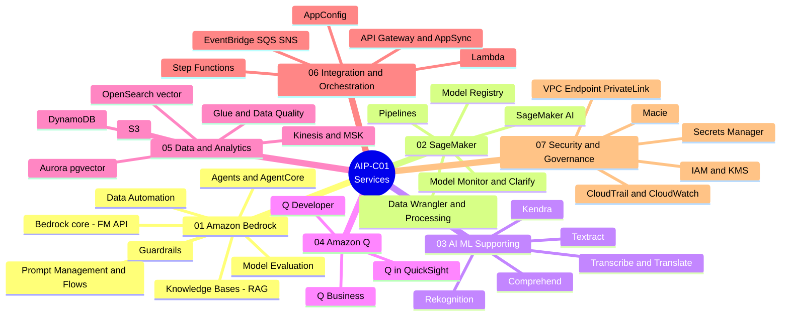

# 📚 Basic Knowledge — by Service Category

[← Home](../../README.md)

This section organizes knowledge **by AWS service category** (instead of by the 5 exam domains) for easy lookup: study Bedrock in one place, study security in one place.

> ⚠️ The exam is still scored by **5 domains**. To keep exam alignment, every service is tagged with its *related domain*, and there is a [service ↔ domain cross-map](#service--5-exam-domain-cross-map) below.

## 📌 2026 focus update (Agentic AI)

The GenAI focus in 2026 shifts from **RAG** (retrieve & answer) toward **Agentic AI** (reason & act). This is **confirmed** by the official AIP-C01 exam guide: there is a dedicated **Task 2.1 "Implement agentic AI solutions and tool integrations"**, explicitly naming **Strands Agents**, **AWS Agent Squad**, ReAct, and **Amazon Bedrock AgentCore**.

- **Study deeper:** AgentCore (Runtime/Memory/Gateway/Policy — [category 01](./01-amazon-bedrock-services.md)) and Strands SDK + multi-agent patterns + MCP ([category 06](./06-integration-orchestration-services.md)).
- **Answer-picking tip:** if the question is just "read documents and answer the customer" → **Knowledge Bases (RAG)**; if it has "decide which tool to use / plan-and-execute / undefined multi-step / multi-agent" → **Strands SDK + AgentCore**, *don't* pick Step Functions for "self-reasoning" tasks.
- **Relationship:** **Strands = framework (write code)**, **AgentCore = infrastructure (run it)** — they go together.

> *Confidence note:* RAG/MLOps/Security/Data are still the backbone (~90% of the knowledge is unchanged). The **agentic part is an official focus**. However, the specific claims "Standard version released 2026-03-18" and "Agentic AI microcredential" are **not fully verified** — the beta runs until ~2026-03-31 and AWS has not clearly announced the full-release date. Do not treat those two details as certain.

## Mindmap — 7 service categories

## The 7 service categories

| # | Category | What's inside (examples) | File |
|---|---|---|---|
| 01 | **Amazon Bedrock Services** | Bedrock core, Knowledge Bases, Guardrails, Prompt Management/Flows, Agents/AgentCore, Model Evaluation, Data Automation | [→](./01-amazon-bedrock-services.md) |
| 02 | **SageMaker Services** | SageMaker AI, Model Registry, Pipelines, Data Wrangler, Processing, Model Monitor, Clarify, JumpStart | [→](./02-sagemaker-services.md) |
| 03 | **AI/ML Supporting Services** | Comprehend, Textract, Transcribe, Translate, Rekognition, Polly, Kendra | [→](./03-ai-ml-supporting-services.md) |
| 04 | **Amazon Q Services** | Q Business, Q Developer, Q in QuickSight | [→](./04-amazon-q-services.md) |
| 05 | **Data & Analytics Services** | S3, OpenSearch (vector), Aurora pgvector, DynamoDB, Glue (Data Quality), Kinesis, MSK, Athena | [→](./05-data-analytics-services.md) |
| 06 | **Integration & Orchestration Services** | Lambda, Step Functions, API Gateway, AppSync, EventBridge, SQS, SNS, AppConfig | [→](./06-integration-orchestration-services.md) |
| 07 | **Security & Governance Services** | IAM, KMS, VPC Endpoint/PrivateLink, CloudTrail, CloudWatch, Macie, Secrets Manager | [→](./07-security-governance-services.md) |

## Service ↔ 5 exam domain cross-map

Shows which domain each category mostly "serves" — so when studying by service you still know which scoring area you're covering.

| Category \ Domain | D1 (31%) | D2 (26%) | D3 (20%) | D4 (12%) | D5 (11%) |
|---|:---:|:---:|:---:|:---:|:---:|
| 01 Bedrock | ●●● | ●●● | ●● | ●● | ●● |
| 02 SageMaker | ●● | ●● | ● | ● | ●● |
| 03 AI/ML Supporting | ●● | ●● | ● | | |
| 04 Amazon Q | ● | ●● | ● | | |
| 05 Data & Analytics | ●●● | ● | ● | ● | |
| 06 Integration & Orchestration | ●● | ●●● | | ●● | ● |
| 07 Security & Governance | ● | | ●●● | ● | ● |

> ● minor · ●● medium · ●●● primary. (Levels are study-orientation estimates, not official AWS figures.)
> The 5 domains: **D1** FM Integration & Data · **D2** Implementation & Integration · **D3** AI Safety/Security/Governance · **D4** Operational Efficiency · **D5** Testing/Validation/Troubleshooting.

## How to read each "service card"

Each service is presented concisely, in plain language, in this shape:

- **One-line description** — explained with an easy metaphor.
- **What problem it solves** — what it's actually used for.
- **When to use** — signals in the question/project that pick it.
- **When NOT to use / easily confused with** — the boundary with other services.
- **Related exam domain** — D1…D5 tags.
- **⚠️ Must remember** — common traps.
- **🧪 One-line example** — a quick illustration.
