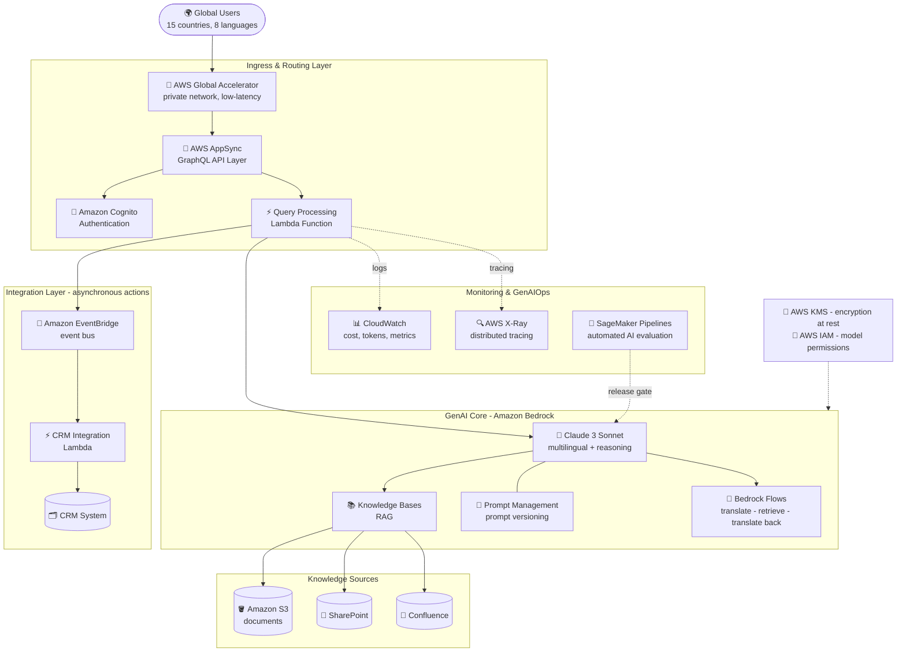

# Case Study 01 — Customer-Support Chatbot for a Multinational Bank

[← Back to Case Studies](./README.md)

| | |
|---|---|
| **Core concept** | End-to-end GenAI architecture: FM selection → safe RAG → CRM integration → global network → GenAIOps |
| **Related domains** | D1 (FM & Data), D2 (Integration), D3 (Security/Governance), D4 (Operational Efficiency) |
| **Key services** | Bedrock (Claude 3 Sonnet, Knowledge Bases, Prompt Management, Flows), AppSync, EventBridge, Global Accelerator, Cognito, KMS, IAM, CloudWatch, X-Ray, SageMaker Pipelines |

---

## 1. Use case summary

> A **multinational financial-services company** wants to upgrade its customer support (CS) across **15 countries and 8 languages**. It needs a GenAI solution that understands customer questions, answers **accurately from its internal knowledge base**, and **integrates smoothly with the existing CRM**. The solution must **comply with financial regulations**, **preserve data privacy**, deliver a **consistent experience across regions**, and **cut response time by 70%**.

Picture being asked to build an **"AI-powered support center for an international bank."** Not a toy chatbot, but a virtual agent that speaks 8 languages, understands banking, never makes up interest rates, knows when to "hand off to a human," and runs equally fast whether the customer is in Tokyo or São Paulo.

### Requirements to solve

Break the use case into concrete requirements — this is the "exam question" the architecture below must answer one by one:

| # | Requirement | Why it's hard |
|---|---|---|
| R1 | **Multilingual + financial reasoning** | 8 languages, complex financial questions → needs a "brain" strong in both language and reasoning |
| R2 | **Accurate answers from internal sources, no fabrication** | A wrong interest-rate figure is a legal risk → RAG required, hallucination forbidden |
| R3 | **Safe CRM integration** | Customer says "open a credit card" → the system must act, but the AI **must not** touch core banking directly |
| R4 | **Fast, globally consistent responses** | 70% time reduction; customers in 15 countries get the same experience |
| R5 | **Security & financial compliance** | User authentication, encryption of sensitive data, strict permissions |
| R6 | **Reliable operations (GenAIOps)** | Measure cost/tokens, find bottlenecks, validate AI quality before release |

---

## 2. Architecture diagram

---

## 3. Why this architecture meets the requirements (Design Rationale)

### R1 → The "brain": Claude 3 Sonnet (not the cheapest model)

You can't hire a CS agent who only speaks English and thinks slowly to serve customers in 8 countries asking complex financial questions.

When choosing among multiple FMs (Titan, Llama, Cohere, Claude), pick **Claude 3 Sonnet** because it offers the best balance of **multilingual** ability and **complex reasoning** at a reasonable cost tier. Other models may be cheaper but tend to fail on language capability or miss financial context. *(Note: the original diagram says "Claude 3 Sonnet"; the selection principle still holds for newer Claude versions — favor models strong in reasoning + multilingual.)*

### R2 → The "memory notebook": Bedrock Knowledge Bases (RAG), not fine-tuning

Instead of forcing the agent to memorize the entire banking rulebook (and misremember it), you hand them a **reference notebook** wired straight into the filing cabinet. Customer asks → open notebook → look up → answer.

**Knowledge Bases** automatically chunk → embed → store vectors → retrieve, so the AI answers from real documents and **avoids hallucinating** financial figures. Crucially, it ships with **connectors** straight into **S3, SharePoint, Confluence** → no need to hand-write data-ingestion code.

- **Why not fine-tuning?** Regulations/rates change constantly; re-fine-tuning on every change is extremely expensive and slow. RAG only needs the source documents updated — this is the classic trap: "update internal knowledge" → always think RAG first.

### R3 → Disciplined "hands": EventBridge, never let the AI call the DB directly

When a customer says "open a credit card for me," the AI **must not reach into the vault** (core banking) itself. The AI may only write a **"request slip"** and drop it in a mailbox; the business unit (CRM) picks it up and processes it.

That "mailbox" is **Amazon EventBridge**: the AI/Lambda emits an **Event** → EventBridge routes it to the **CRM Integration Lambda** → CRM opens a ticket **asynchronously (async)**.

- **Why EventBridge instead of letting the AI call the API/DB directly?** Decoupling → safety (AI has no write access to core banking), fault tolerance (if CRM is busy, the event waits), and easy scaling. Granting the AI direct write access to a financial DB is an unacceptable security risk.
- **Why AppSync (GraphQL) rather than plain REST?** Customers use a **mobile app**; GraphQL lets the app query exactly the data it needs → saves 3G/4G bandwidth, reduces over-fetching.

### R4 → The "VIP expressway": Global Accelerator, NOT CloudFront

CloudFront is like a **cold-storage warehouse near your home** (pre-caches static images/videos). But AI chat is **dynamic data, freshly generated each time** — not cacheable. You need a **dedicated expressway** across the ocean.

> ⚠️ **Common mistake:** many engineers reflexively pick **CloudFront** to "speed things up globally." Wrong for this case. CloudFront is optimized for **cacheable static content**. For a GenAI API (dynamic, non-cacheable) that needs **global low latency**, the answer is **AWS Global Accelerator** — it routes traffic over **AWS's private backbone** instead of the public Internet, giving low and stable latency. This is the key to hitting the **70% response-time reduction** and **consistent experience** across 15 countries.

### R5 → The "security team": Cognito + KMS + IAM (the power trio)

**Cognito** = the guard checking IDs at the door; **KMS** = the encryption safe; **IAM** = internal permission badges.

- **Amazon Cognito** — authentication: only genuine bank customers get in.
- **AWS KMS** — encrypts sensitive financial data at rest (encryption at rest).
- **AWS IAM** — role-based permissions: e.g., only Role A may call Claude 3 Sonnet (expensive, powerful), Role B only a cheaper model. This directly addresses **financial compliance + data privacy**.

### R6 → The "detective & inspector": X-Ray + CloudWatch + SageMaker Pipelines

**CloudWatch** = the accountant logging how much money/tokens the AI burned today. **X-Ray** = the detective with a stopwatch on each step. **SageMaker Pipelines** = the QA inspector standing at the gate before anything goes live.

- **CloudWatch** — dashboard for cost, tokens, operational metrics.
- **AWS X-Ray:** when a customer complains "the chat app is slow," how do you know whether it's the **Vector DB query** or the **LLM response**? → **X-Ray (distributed tracing)** times each step and pinpoints the bottleneck. CloudWatch tells you "it's slow," X-Ray tells you "slow WHERE."
- **SageMaker Pipelines:** for normal software you test with CodePipeline/GitLab CI. But with AI, **the code isn't wrong yet the AI's CONTENT can be wrong** (made-up rates, off-standard, biased). AWS uses **SageMaker Pipelines** to build an **automated evaluation** flow — checking accuracy, bias, compliance — before releasing a new model version.

---

## 4. Alternatives & trade-offs

| Decision | Right choice | Common wrong choice | Why |
|---|---|---|---|
| Update internal knowledge | **Knowledge Bases (RAG)** | Fine-tuning | Docs change constantly; RAG just swaps files, fine-tune is costly & slow |
| Speed up a dynamic global API | **Global Accelerator** | CloudFront | CloudFront only caches static content; AI chat is dynamic |
| AI performs an action (open card) | **EventBridge** (async) | Let AI call DB/API directly | Decoupling = safety + fault tolerance; AI must not touch core banking |
| API for mobile | **AppSync (GraphQL)** | Many REST endpoints | GraphQL fetches exactly the needed data, saves bandwidth |
| Find latency bottleneck | **X-Ray** | CloudWatch only | CloudWatch says "slow," X-Ray says "slow at which step" |
| Validate AI quality | **SageMaker Pipelines** | CodePipeline/GitLab CI | CI tests code; AI needs accuracy/bias/compliance testing |

---

## 5. 💡 Lesson learned

> **When you face a problem with** **"global enterprise + safe RAG + fast chat responses + compliance,"** immediately think of the quartet:
> **Claude 3 (the brain) + Bedrock Knowledge Bases (the RAG notebook) + Global Accelerator (the network) + SageMaker Pipelines (the QA inspector).**

- **RAG ≠ fine-tuning:** "update internal knowledge" → always think RAG first.
- **Global Accelerator ≠ CloudFront:** dynamic low-latency global API → Global Accelerator; cacheable static content → CloudFront.
- **The AI never acts directly on core systems:** always go through **EventBridge** (event-driven, async) for decoupling and safety.
- **X-Ray ≠ CloudWatch:** CloudWatch = "it's slow"; X-Ray = "slow where."
- **GenAIOps ≠ regular DevOps:** validating AI (accuracy/bias/compliance) → **SageMaker Pipelines**, not plain code CI/CD.

🔗 **Related:** [01. Bedrock](../01-basic-knowledge/01-amazon-bedrock-services.md) · [06. Integration & Orchestration](../01-basic-knowledge/06-integration-orchestration-services.md) · [07. Security & Governance](../01-basic-knowledge/07-security-governance-services.md) · [Practice exam](../03-practice-exam/)
