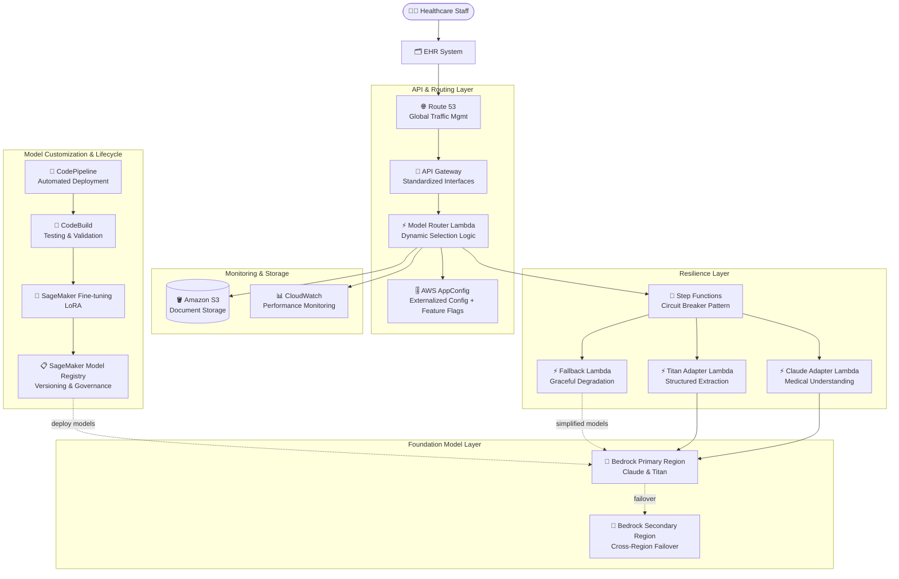

# Case Study 02 — Medical-Record Analysis System for a Healthcare Provider

[← Back to Case Studies](./README.md)

| | |
|---|---|
| **Core concept** | Multi-FM abstraction layer + resilience + GenAIOps for a mission-critical healthcare system |
| **Related domains** | D1 (FM Selection & Data), D2 (Integration), D4 (Operational Efficiency), D5 (Testing/Resilience) |
| **Key services** | Bedrock (Model Evaluation, Cross-Region Inference), Lambda, API Gateway, AppConfig, Step Functions, Route 53, SageMaker (Fine-tuning + LoRA, Model Registry, Model Monitor), CodePipeline/CodeBuild, S3, CloudWatch |

---

## 1. Use case summary

> A **large healthcare provider** in North America needs an AI system to **analyze medical records, extract key clinical information, and produce structured reports** for its electronic health record (EHR) system. It must handle diverse document types (clinical notes, lab results, radiology findings, patient histories), **strictly comply with HIPAA**, achieve **99.9% availability**, **high accuracy on medical terminology**, and **adapt as medicine/terminology evolves**.

Picture building an "AI medical-record processing room" for a large hospital. The make-or-break issue here isn't picking one smart AI model — it's that if that model **fails mid-task** or an AWS region **goes down**, the system must not stop, because clinical workflows affecting patients depend on it. This case tests designing a system that **doesn't depend on a single FM** and **self-recovers from incidents**.

### Requirements to solve

| # | Requirement | Why it's hard |
|---|---|---|
| R1 | **Pick a medically suitable FM, with evidence** | Must objectively compare multiple FMs on medical knowledge + structured extraction, not by gut feel |
| R2 | **No hard lock-in to one FM** | Medicine changes; must swap/try new models without rewriting all the code |
| R3 | **99.9% availability, fault tolerance** | Medical records are critical; one FM failing or one region going down must not stop the system |
| R4 | **HIPAA compliance + PHI protection** | Must detect and redact protected health information (PHI) |
| R5 | **Customize for specific medical terminology** | Generic FMs aren't deep enough; need fine-tuning but must save compute cost |
| R6 | **Model lifecycle governance + clinical validation** | Must version, trace lineage, and require physician sign-off before a model reaches production |

---

## 2. Architecture diagram

---

## 3. Why this architecture meets the requirements (Design Rationale)

### R1 → Pick the FM with data: Bedrock Model Evaluation

You shouldn't choose the "brain" for a healthcare system by feel. **Amazon Bedrock Model Evaluation** lets you systematically benchmark multiple FMs against the right medical criteria: terminology-extraction accuracy, ability to detect & redact PHI, and complex medical reasoning. Results are weighed against operational constraints (latency, peak throughput, cost) — turning model choice into a TCO-based decision, not a preference.

### R2 → No FM lock-in: Abstraction Layer (Lambda + API Gateway + AppConfig)

Treat each FM as a replaceable "supplier." You don't weld business logic to one supplier.

- **API Gateway** provides a standard request/response interface — the app calls "analyze document" without knowing which FM is behind it.
- **Adapter Lambda** normalizes input/output across different FMs (Claude adapter, Titan adapter), so the app behaves consistently regardless of which model processes it.
- **AWS AppConfig** externalizes model-selection criteria out of the code. To switch models or enable **A/B testing** for a specific department → change a **feature flag**, **no code redeploy needed**.

> ⚠️ **Common mistake:** don't hard-code model selection in source. When the question says "switch models at runtime / A-B testing without redeploy" → that's **AppConfig**, not editing code.

### R3 → Fault tolerance: Step Functions (Circuit Breaker) + Cross-Region Inference + Route 53

This is the most important part of a mission-critical healthcare system.

- **Step Functions** acts as the **circuit breaker**: it monitors FM performance, and when a model degrades/fails it **auto-routes to an alternative model**, with retries using **exponential backoff**.
- **Bedrock Cross-Region Inference + Route 53 health checks**: when a region falters, traffic auto-shifts to a **healthy region**. This is exactly the mechanism that keeps the outage to ~3 minutes when an AWS region has an incident (instead of many hours).
- **Fallback Lambda (graceful degradation)**: when the premium FM is unavailable, core functionality is preserved with a simpler model or a rule-based system.

> ⚠️ **Common mistake:** "circuit breaker / auto-switch to another model on failure" → **Step Functions**, not scattered hand-written try/catch. "Multi-region high availability at the model tier" → **Cross-Region Inference + Route 53**, not a single region.

### R4 → HIPAA compliance + PHI protection

Detecting and **redacting PHI (protected health information)** is built into the FM-evaluation criteria (R1) and handled in the flow. Combined with CloudWatch monitoring + controlled S3 storage to ensure a compliance trail.

### R5 → Cost-efficient customization: SageMaker Fine-tuning with LoRA

Generic FMs aren't deep enough for specific medical terminology. You fine-tune with **SageMaker AI**, but use **LoRA (Low-Rank Adaptation)** — a **parameter-efficient** technique: it reaches near-full-fine-tune performance while **sharply cutting compute cost** (training only a small fraction of parameters instead of the whole model).

### R6 → Lifecycle governance: Model Registry + Model Monitor + CodePipeline

- **SageMaker Model Registry**: versions customized models, traces lineage (dataset → deployed model), and provides an **approval workflow with a clinical-validation step** (physician sign-off) before production.
- **CodePipeline + CodeBuild**: automated pipeline tests (medical accuracy, HIPAA compliance, EHR integration) → deploy. Uses **blue-green deployment** via Lambda aliases for smooth version transitions.
- **SageMaker Model Monitor**: tracks **drift** in medical terminology, document formats, extraction accuracy.

---

## 4. Alternatives & trade-offs

| Decision | Right choice | Common wrong choice | Why |
|---|---|---|---|
| Pick FM | **Bedrock Model Evaluation** | By gut/price | Need objective benchmark on medical criteria |
| Switch model at runtime | **AppConfig (feature flags)** | Hard-code + redeploy | AppConfig changes config without deploy |
| Auto-switch model on failure | **Step Functions (circuit breaker)** | Scattered try/catch | SF orchestrates retry/failover systematically |
| Multi-region HA at model tier | **Cross-Region Inference + Route 53** | Single region | One region down = whole system lost |
| Cost-efficient fine-tune | **LoRA on SageMaker** | Full fine-tuning | LoRA reaches comparable performance much cheaper |
| Model governance | **Model Registry + approval** | Deploy directly | Healthcare needs physician validation before production |

---

## 5. 💡 Lesson learned

> **When you face a problem with** **"mission-critical system (healthcare/finance) + multiple FMs + high fault tolerance + domain customization,"** immediately think of the combo:
> **Bedrock Model Evaluation (pick FM) + Abstraction Layer via AppConfig (flexible model swap) + Step Functions circuit breaker + Cross-Region Inference (fault tolerance) + LoRA + Model Registry (lifecycle).**

- **Abstraction layer = no FM lock-in:** API Gateway standardizes + Adapter Lambda + AppConfig externalizes → swap models without code changes.
- **Resilience = Circuit breaker + Cross-Region + Graceful degradation:** these three layers are why the system is down only minutes when a region fails.
- **LoRA:** fine-tune at near-full performance but far cheaper — choose it for "cost-efficient customization."
- **Model Registry + clinical approval:** critical industries always need human-in-the-loop model sign-off before production.
- **AppConfig ≠ Secrets Manager ≠ Parameter Store:** AppConfig is dynamic config/feature flags for A-B testing & rollout.

🔗 **Related:** [01. Bedrock](../01-basic-knowledge/01-amazon-bedrock-services.md) · [02. SageMaker](../01-basic-knowledge/02-sagemaker-services.md) · [06. Integration & Orchestration](../01-basic-knowledge/06-integration-orchestration-services.md) · [Practice exam](../03-practice-exam/)
