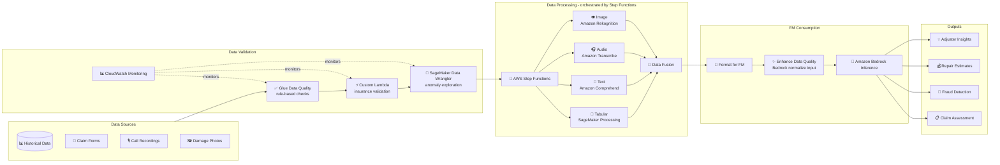

# Case Study 03 — Multi-Modal Pipeline for Insurance Claims Assessment

[← Back to Case Studies](./README.md)

| | |
|---|---|
| **Core concept** | Orchestrated multi-modal pipeline (text + image + audio + tabular), data fusion, then into the FM |
| **Related domains** | D1 (Data & FM), D2 (Integration & Orchestration), D5 (Validation) |
| **Key services** | Step Functions, Glue Data Quality, SageMaker (Data Wrangler, Processing), Lambda, Comprehend, Transcribe, Rekognition, Bedrock, CloudWatch |

---

## 1. Use case summary

> A **large insurance company** needs to modernize its claims processing with AI that can analyze **diverse data sources**: claim forms, **damage photos**, **customer call recordings**, and **historical claim data**. Goals: assess claim validity, estimate repair costs, **detect fraud**, and give adjusters a comprehensive view.

Picture building an "automated claims-assessment room." The challenge isn't processing one data type, but **four very different data types** arriving at once — text, images, voice, tables — which must then be **fused into one coherent picture** for the AI to read. This case tests designing a parallel processing line where each data type gets a dedicated tool, with orchestration and input-quality checks.

### Requirements to solve

| # | Requirement | Why it's hard |
|---|---|---|
| R1 | **Validate input data quality** | Legacy data is off-standard (malformed policy numbers…); garbage in → garbage out |
| R2 | **Process 4 different data types in parallel** | Text, image, audio, tabular — each needs its own tool, run in parallel for speed |
| R3 | **Fuse multi-modal data** | Must combine information from 4 sources into one coherent "claim file" for the FM |
| R4 | **Orchestrate a complex flow, preserve data relationships** | Many parallel steps but must keep logical links between related parts |
| R5 | **Normalize inputs before the FM** | Off-standard damage descriptions, insurance abbreviations → reduce FM accuracy |
| R6 | **Monitor quality over time** | Alert when quality metrics fall below thresholds |

---

## 2. Architecture diagram

---

## 3. Why this architecture meets the requirements (Design Rationale)

### R1 → Validate input quality: Glue Data Quality + Lambda + Data Wrangler

"Garbage in, garbage out" — for insurance claims, dirty data leads to wrong assessments and lost money. Three complementary check layers:

- **AWS Glue Data Quality**: rule-based checks for structured data — valid policy numbers, damage dates within the coverage period, claim amounts within policy limits.
- **SageMaker Data Wrangler**: visually explore data distributions, spot anomalies (e.g., policy numbers formatted inconsistently across legacy systems).
- **Custom Lambda**: insurance-specific logic — VIN matches make/model, valid medical procedure codes, damage descriptions match the photos.

### R2 + R4 → Parallel processing & orchestration: Step Functions, a dedicated tool per type

This is the heart of the architecture. **Step Functions** orchestrates **parallel** flows, assigning each data type to the tool best at it:

- **Text (claim descriptions)** → **Amazon Comprehend**: detect language, sentiment, entities.
- **Image (damage photos)** → **Amazon Rekognition**: detect objects, damage patterns, image quality; SageMaker Processing for severity analysis.
- **Audio (recordings)** → **Amazon Transcribe**: speech to text; Transcribe Call Analytics for sentiment + fraud indicators.
- **Tabular** → **SageMaker Processing**.

> ⚠️ **Common mistake:** for a multi-step parallel pipeline that must keep logical relationships → **Step Functions** (orchestration), not cramming everything into one giant Lambda. Don't use one tool for every data type — a dedicated service per modality (Comprehend for text, Rekognition for images, Transcribe for audio).

### R3 → Data fusion: Data Fusion

After the 4 branches finish, **Data Fusion** (orchestrated by Step Functions) aligns information across modalities, creating a coherent, comprehensive "claim file" for the FM to consume.

### R5 → Normalize inputs: use Bedrock itself to "clean" before inference

Off-standard inputs (inconsistent damage descriptions, insurance abbreviations, grammatical errors) lower FM accuracy. The clever solution: **use Amazon Bedrock itself with a dedicated prompt** to normalize inputs — expand abbreviations, fix errors — **before** sending them to the main assessment model. Comprehend handles entity extraction; enrich with context from a knowledge base (vehicle specs, repair-cost benchmarks).

### R6 → Monitoring: CloudWatch

CloudWatch metrics + alarms track validation results over time, auto-alerting when quality drops below thresholds.

---

## 4. Alternatives & trade-offs

| Decision | Right choice | Common wrong choice | Why |
|---|---|---|---|
| Orchestrate multi-step pipeline | **Step Functions** | One giant Lambda | SF keeps logical relations, parallelizes, easy retry |
| Analyze text | **Comprehend** | Hand-write NLP | Managed, built-in entity/sentiment |
| Analyze images | **Rekognition** | Train your own vision model | Managed, detects objects/damage out of the box |
| Audio→text | **Transcribe** | Roll your own | Has Call Analytics + sentiment + fraud indicators |
| Validate structured data quality | **Glue Data Quality** | Scattered hand-written rules | Centralized rule-based checks with monitoring |
| Normalize input for FM | **Bedrock with a normalization prompt** | Skip it | Clean input → markedly higher FM accuracy |

---

## 5. 💡 Lesson learned

> **When you face a problem with** **"multiple data types (text/image/audio/table) to process then feed into an FM,"** immediately think of the combo:
> **Step Functions (parallel orchestration) + Comprehend/Rekognition/Transcribe (one tool per modality) + Data Fusion + Bedrock (input normalization & inference).**

- **A dedicated service per modality:** text → Comprehend, image → Rekognition, audio → Transcribe. Don't force one tool to do everything.
- **Complex orchestration = Step Functions:** keep logical relations + parallel processing, not crammed into one Lambda.
- **"Garbage in, garbage out":** invest in a data-quality layer (Glue Data Quality + Data Wrangler + Lambda) before the pipeline.
- **Use the FM itself to clean input:** an effective trick — Bedrock normalizes/expands input before the main model.

🔗 **Related:** [03. Data & RAG](../01-basic-knowledge/03-data-rag-knowledge-services.md) · [05. Specialized AI](../01-basic-knowledge/05-specialized-ai-services.md) · [06. Integration & Orchestration](../01-basic-knowledge/06-integration-orchestration-services.md) · [Practice exam](../03-practice-exam/)
