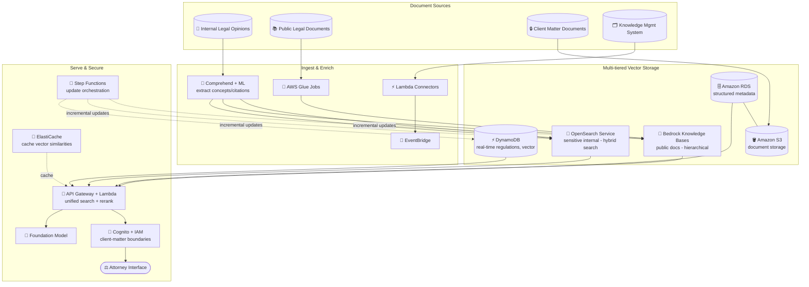

# Case Study 04 — Legal Research Assistant for a Global Law Firm

[← Back to Case Studies](./README.md)

| | |
|---|---|
| **Core concept** | Multi-tiered vector database architecture — choosing the right store for each type of legal data |
| **Related domains** | D1 (Data & RAG), D2 (Integration), D3 (Security) |
| **Key services** | Bedrock Knowledge Bases, OpenSearch Service (neural plugin), RDS, S3, DynamoDB, Comprehend, Glue, EventBridge, Step Functions, ElastiCache, API Gateway, Lambda, Cognito, IAM |

---

## 1. Use case summary

> A **global law firm** with offices in **30 countries** needs an AI legal-research assistant to help attorneys quickly find case law, statutes, regulations, and internal legal opinions across **millions of documents in many languages**. The old system only did keyword matching → attorneys spent an average of **15 hours/week** researching with inconsistent results.

Picture building an "AI librarian" for a law firm. The core challenge: legal data is **heterogeneous** — public documents, top-secret internal opinions, structured metadata, and regulations that change in real time. Each type has different requirements for security, speed, and query style. This case tests the ability to **choose the right store for each data type** rather than dumping everything into one place.

### Requirements to solve

| # | Requirement | Why it's hard |
|---|---|---|
| R1 | **Semantic search instead of keyword** | Keyword matching gives poor results; need semantic search that understands legal context |
| R2 | **Many data types, each with its own needs** | Public docs vs top-secret internal vs metadata vs real-time regulations — can't use one store |
| R3 | **Client-matter boundary security** | Attorneys see only results they're authorized for (privilege boundaries) |
| R4 | **Performance over 15 million documents** | Sub-second queries over a huge volume |
| R5 | **Real-time legal updates** | New precedents/laws must appear within hours of publication |
| R6 | **Integrate existing document-management systems** | Connect multiple DMS, knowledge-management systems |

---

## 2. Architecture diagram

---

## 3. Why this architecture meets the requirements (Design Rationale)

### R1 + R2 → Multi-tiered storage: the right tool for each data type

This is the case's main idea. No single store is optimal for all legal data, so go **multi-tiered**:

- **Bedrock Knowledge Bases** for **public legal documents**: hierarchical organization by jurisdiction and domain, preserving the logical structure of texts during chunking. This is managed RAG, low operations.
- **OpenSearch Service (neural plugin)** for **sensitive internal opinions & client documents**: enables topic-based segmentation, keeps **strict security boundaries**, and supports **hybrid search** (semantic + keyword) — crucial for legal terminology needing word-level precision.
- **RDS** for **structured metadata** + **S3** for document storage: enables complex metadata filtering alongside semantic search.
- **DynamoDB (vector storage)** for **real-time changing regulations**: low-latency retrieval of the latest updates.

> ⚠️ **Common mistake:** don't dump everything into one vector store. Public docs (managed, hierarchical) → Knowledge Bases; sensitive internal needing hybrid search + tight security → OpenSearch; real-time low-latency → DynamoDB.

### R3 → Client-matter security: Cognito + IAM

A law firm has strict privilege constraints — attorney A must not see documents of a client they don't handle. **Cognito + IAM** build an auth framework respecting **client-matter boundaries**, ensuring search returns only what the attorney is authorized for. Separating sensitive data into OpenSearch (R2) also serves this goal.

### R4 → Sub-second over 15 million documents: sharding + ElastiCache

- **OpenSearch cluster** configured with **practice-area sharding** + **time-based sub-sharding** → recent documents in relevant areas are retrieved faster.
- **Multi-index** with custom similarity algorithms per legal domain.
- **ElastiCache** pre-computes similarities for common query patterns → sharply reduces latency for frequent research scenarios.

### R5 → Real-time updates: EventBridge + Lambda + Step Functions

- **EventBridge rules + Lambda** process new cases as they're published (incremental update).
- A real-time change-detection system monitors official sources, triggering immediate updates to affected documents.
- **Step Functions** orchestrates complex update flows (from content extraction → vector storage). A scheduled refresh pipeline periodically reprocesses the whole corpus with the latest embedding model; CloudWatch tracks retrieval precision.

### R6 → Integrate existing DMS: Lambda Connectors + Glue + API Gateway

- **Lambda-based connectors** for multiple document-management systems, capturing events via **EventBridge**.
- **AWS Glue jobs** transform curated legal insights into vector-compatible formats.
- **API Gateway + Lambda** create a unified search interface, aggregating results from multiple vector stores + traditional legal DBs, routing queries to the right source and **reranking** by relevance + precedential value.

---

## 4. Alternatives & trade-offs

| Data type / need | Right choice | Why not the others |
|---|---|---|
| Public docs, managed RAG | **Bedrock Knowledge Bases** | Hierarchical + low ops; no self-managed cluster |
| Sensitive internal, hybrid search | **OpenSearch (neural plugin)** | Tight security + semantic/keyword; KB lacks segmentation control |
| Structured metadata | **RDS** | Complex filtering; pure vector stores handle structured queries poorly |
| Real-time regulations | **DynamoDB (vector)** | Low-latency, continuous updates |
| Cache hot queries | **ElastiCache** | Cuts latency for repeated query patterns |
| Permission-based security | **Cognito + IAM** | Respects client-matter/privilege boundaries |
| Real-time updates | **EventBridge + Lambda + Step Functions** | Event-driven, not slow cron |

---

## 5. 💡 Lesson learned

> **When you face a problem with** **"large data volume + multiple data types differing in security/speed/query style,"** immediately think of a **multi-tiered vector storage** architecture — the right store per type, don't dump everything in one place.

- **Knowledge Bases vs OpenSearch:** managed RAG for public data vs tight control + hybrid search for sensitive data.
- **DynamoDB for real-time vectors:** when you need low-latency and continuous updates.
- **RDS + S3** for structured metadata + document storage alongside semantic search.
- **ElastiCache** cuts latency for repeated queries over a huge corpus.
- **Real-time updates = EventBridge + Lambda + Step Functions**, not cron jobs.
- **Legal security = Cognito + IAM** respecting client-matter boundaries.

🔗 **Related:** [01. Bedrock](../01-basic-knowledge/01-amazon-bedrock-services.md) · [03. Data & RAG](../01-basic-knowledge/03-data-rag-knowledge-services.md) · [07. Security & Governance](../01-basic-knowledge/07-security-governance-services.md) · [Practice exam](../03-practice-exam/)
