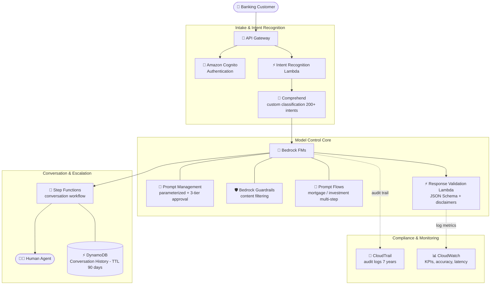

# Case Study 05 — AI Customer-Service Platform for a Global Financial Institution

[← Back to Case Studies](./README.md)

| | |
|---|---|
| **Core concept** | A model-control framework (prompt governance + guardrails + JSON Schema) ensuring compliance & consistency at scale |
| **Related domains** | D2 (Integration), D3 (Security/Governance/Compliance), D4 (Operational Efficiency) |
| **Key services** | Bedrock (Prompt Management, Guardrails, Prompt Flows, FMs), Step Functions, Comprehend (custom classification), DynamoDB (TTL), CloudTrail, CloudWatch, Lambda |

---

## 1. Use case summary

> A **global financial institution** serving **50 million customers across 30 countries** deploys an AI customer-service platform: handling routine banking queries, personalized financial guidance, and **escalating complex issues to human agents with full context**. Business requirements: consistent handling across regions/languages; **strict compliance with financial regulations & privacy laws**; **audit trails of all AI interactions**; personalized guidance based on customer history; smooth escalation to humans.

Picture building an "AI call center" for an international bank. The challenge isn't making the AI answer — it's **controlling what the AI is allowed to say**. One non-compliant piece of financial advice is a serious legal risk. This case tests building a **governance framework** around the model: standardize prompts, block forbidden content, enforce output format, and log everything for auditors.

### Requirements to solve

| # | Requirement | Why it's hard |
|---|---|---|
| R1 | **Consistency across regions & languages** | 30 countries, many languages — answers must be uniform in content & format |
| R2 | **Block unauthorized financial advice** | The AI must not speculate on markets or advise beyond its authority |
| R3 | **7-year audit trail for regulators** | Financial rules require storing all interactions for years |
| R4 | **Accurate routing by customer intent** | Must correctly identify intent among 200+ types to route right |
| R5 | **Manage conversation context, expire per regulation** | Store history to avoid re-asking, but auto-delete per law |
| R6 | **Escalate to humans with context** | Complex issues go to an agent without losing information |

---

## 2. Architecture diagram

---

## 3. Why this architecture meets the requirements (Design Rationale)

### R1 → Consistency: Prompt Management + JSON Schema templates

- **Bedrock Prompt Management** standardizes prompts for each banking scenario, with clear role definitions ("the AI is a banking assistant with limitations"). Uses **parameterized prompts** with variables for customer/account/regulation info → one prompt framework applied across all regions.
- **JSON Schema templates** standardize output structure (account details, transaction history, fee schedules) → consistent presentation regardless of language. This framework cut compliance violations by 97%.

### R2 → Block forbidden content: Bedrock Guardrails

This is the key line of defense for finance. **Bedrock Guardrails** with strict content-filtering policies **prevent the AI from giving unauthorized financial advice or speculating on market movements**, setting high severity thresholds for regulated activities. The Response Validation Lambda checks outputs for required disclaimers, accurate fees, and correct escalation triggers.

> ⚠️ **Common mistake:** "prevent the AI from saying forbidden content / unauthorized advice" → **Bedrock Guardrails**, not merely instructions in the prompt (prompts can be circumvented).

### R3 → 7-year audit: CloudTrail + CloudWatch Logs

**CloudTrail** logs every API call to Bedrock, **retained for 7 years** to meet financial regulations. **CloudWatch Logs** captures every customer interaction for compliance monitoring.

> ⚠️ Distinction: CloudTrail stores the **API trail (who called what, when)** — fitting for a compliance audit trail. If you need to store the **full prompt/response content**, use Bedrock Model Invocation Logging (see other cases). Here the requirement is an interaction audit trail → CloudTrail + CloudWatch Logs.

### R4 → Intent routing: Comprehend custom classification

**Amazon Comprehend** with a **custom classification model** trained on banking terminology recognizes **200+ distinct intents** for precise routing. This is why Comprehend is used (managed NLP, train your own classifier) instead of letting the FM guess intent without control.

### R5 → Conversation context + lawful expiry: DynamoDB with TTL

**DynamoDB** stores conversation history with a schema optimized for fast retrieval, using **TTL (Time To Live) to auto-delete data after 90 days** per regulation. This reduced customers repeating information by 78%.

> ⚠️ **Common mistake:** "auto-delete data after N days per regulation" → **DynamoDB TTL**, not a hand-written cleanup job.

### R6 → Escalate with context + complex scenarios: Step Functions + Prompt Flows

- **Step Functions** orchestrates the conversation flow, including a clarification loop for ambiguous requests, and escalation to a **Human Agent** with full context.
- **Bedrock Prompt Flows** handles complex multi-step scenarios (mortgage approval, investment planning) with conditional branching by financial profile. Pre-processing normalizes terminology; post-processing adds legal disclaimers + regional formatting.

---

## 4. Alternatives & trade-offs

| Decision | Right choice | Common wrong choice | Why |
|---|---|---|---|
| Block unauthorized content | **Bedrock Guardrails** | Prompt instructions only | Guardrails enforce at the system tier; prompts can be circumvented |
| Standardize & version prompts | **Prompt Management** | Hard-code prompts in the app | Manage versions + approval workflow without deploy |
| Consistent output format | **JSON Schema templates** | Let FM format freely | Schema enforces consistent structure across languages |
| Intent recognition | **Comprehend custom classification** | Let FM guess | A trained classifier is accurate & controllable |
| Store & expire context | **DynamoDB TTL** | Hand-written cleanup job | TTL auto-deletes per regulation, no code |
| Long-term compliance audit | **CloudTrail (7 years)** | Temporary logs | Financial rules require multi-year retention |
| Multi-step scenarios | **Prompt Flows** | One giant prompt | Flows do conditional branching, reusable components |

---

## 5. 💡 Lesson learned

> **When you face a problem with** **"AI serving a heavily regulated industry (finance/healthcare) + output control + compliance + audit,"** immediately think of the control framework:
> **Prompt Management (standardize) + Guardrails (block content) + JSON Schema (enforce format) + CloudTrail (audit) + DynamoDB TTL (data lifecycle).**

- **Guardrails ≠ prompt instructions:** to enforce content blocking → Guardrails at the system tier.
- **Prompt Management for governance:** parameterized prompts + 3-tier approval + versioning, no hard-coding.
- **JSON Schema = output consistency** across languages/regions.
- **Comprehend custom classification** for accurate intent routing (200+ intents).
- **DynamoDB TTL** = auto-expire data per regulation.
- **CloudTrail** = long-term compliance audit trail (7 years).

🔗 **Related:** [01. Bedrock](../01-basic-knowledge/01-amazon-bedrock-services.md) · [05. Specialized AI](../01-basic-knowledge/05-specialized-ai-services.md) · [07. Security & Governance](../01-basic-knowledge/07-security-governance-services.md) · [Practice exam](../03-practice-exam/)
