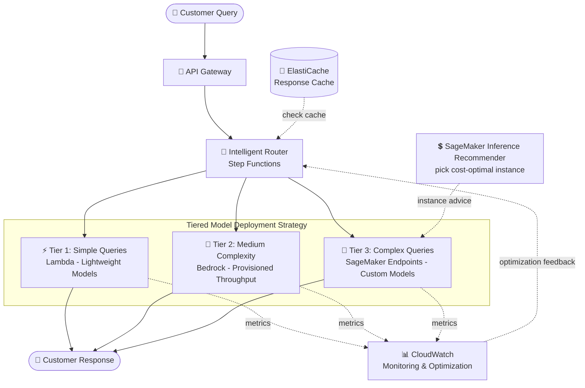

# Case Study 06 — Scalable AI Customer Support for a Global E-commerce Platform

[← Back to Case Studies](./README.md)

| | |
|---|---|
| **Core concept** | Tiered model deployment — choose infrastructure by query complexity to balance performance & cost |
| **Related domains** | D2 (Integration), D4 (Operational Efficiency & Cost), D5 (Optimization) |
| **Key services** | Lambda, Bedrock (Provisioned Throughput), SageMaker (Real-time endpoints, custom containers, Inference Recommender), API Gateway, Step Functions, CloudWatch, ElastiCache |

---

## 1. Use case summary

> A fast-growing **global e-commerce platform** needs an AI support system handling everything from basic FAQs to **complex product troubleshooting**, **keeping high performance during peak season** and **optimizing cost during normal times**. Requirements: support **20+ languages**; handle **10,000+ concurrent sessions** at peak; **sub-1-second latency** for routine queries; accurate detailed troubleshooting; cost optimization off-peak; regional data-sovereignty compliance.

Picture building an AI call center for an e-commerce platform. The challenge is **enormous variability**: 10,000 concurrent sessions on Black Friday, a trickle on normal days. And queries differ wildly — "where's my order?" (simple) vs "how do I fix this product's firmware?" (complex). Using one kind of infrastructure for all is either ruinously expensive or slow at peak. This case tests the ability to **tier**: give easy work to cheap machines, hard work to powerful ones.

### Requirements to solve

| # | Requirement | Why it's hard |
|---|---|---|
| R1 | **Simple queries, cheap, auto-scaling** | FAQs are the majority; shouldn't use expensive GPUs for light work |
| R2 | **Sustained & medium-complexity load** | Needs stable, predictable throughput at peak |
| R3 | **Complex troubleshooting, custom models** | Needs custom models + large context windows |
| R4 | **Smart routing by complexity** | Must send the right query to the right model tier |
| R5 | **Cost optimization off-peak** | Pick the most efficient instance for each tier |
| R6 | **Latency < 1s + 10,000 concurrent sessions** | Both fast and able to handle peak load |

---

## 2. Architecture diagram

---

## 3. Why this architecture meets the requirements (Design Rationale)

### R1 + R2 + R3 → Three deployment tiers, each with its own infrastructure

This is the core idea: **choose infrastructure by complexity**, not "one size fits all."

- **Tier 1 — simple FAQs → Lambda (serverless):** lightweight models on Lambda, **on-demand, auto-scaling**, pay per invocation. Use **provisioned concurrency** to avoid cold starts during anticipated peaks. Fits light, high-volume work with no GPU.
- **Tier 2 — medium complexity, sustained load → Bedrock Provisioned Throughput:** dedicated throughput based on historical traffic analysis (e.g., 10 model units normally, **auto-scaling to 25** during promotions, CloudWatch alarm firing when utilization > 70% for over 5 minutes). Fits high, **stable, predictable** load.
- **Tier 3 — complex troubleshooting, custom models → SageMaker Real-time endpoints + custom containers:** auto-scaling by invocation metrics; custom containers efficiently manage memory for large context windows (lazy loading, quantization, dynamic batching, KV-cache).

> ⚠️ **Common mistake:** don't use Provisioned Throughput for light work (wasteful) or Lambda for heavy custom models (can't handle them). **Spiky, light** load → Lambda serverless; **stable, predictable** load → Provisioned Throughput; **heavy custom models** → SageMaker endpoints.

### R4 → Smart routing: API Gateway + Step Functions

**API Gateway + Step Functions** route traffic among the three tiers with intelligent logic based on **language, complexity, and current load**. Plus **model cascading**: start with a lightweight model to classify queries & answer routine ones, only escalating to higher tiers when needed.

### R5 → Cost optimization: ElastiCache + Inference Recommender + A/B testing

- **ElastiCache** multi-level cache: response caching for common queries + embedding caching for semantic search → cuts redundant computation by up to 40% at peak.
- **SageMaker Inference Recommender** finds the cheapest-efficient instance type for each model tier.
- **A/B testing** of deployment configurations with automated performance/cost metric collection.

> ⚠️ **Common mistake:** "find the cost-optimal instance type for a model" → **SageMaker Inference Recommender**, don't guess manually.

### R6 → Latency < 1s + 10,000 sessions: combine everything

Low latency comes from Tier 1 (lightweight Lambda) + ElastiCache for routine queries; peak load is handled by auto-scaling across all three tiers + cascading + caching to shed load. CloudWatch dashboards provide unified monitoring of latency/throughput/error/cost per query type.

---

## 4. Alternatives & trade-offs

| Query type / need | Right choice | Why not the others |
|---|---|---|
| Light FAQs, high volume, spiky | **Lambda (serverless)** | Auto-scales, pay per call; Provisioned Throughput would waste money |
| Stable, predictable load | **Bedrock Provisioned Throughput** | Committed throughput; on-demand throttles at peak |
| Heavy custom model, large context | **SageMaker endpoints + custom containers** | Control memory/GPU; Lambda can't handle heavy models |
| Routing by complexity | **API Gateway + Step Functions** | Smart routing + cascading |
| Pick cost-optimal instance | **SageMaker Inference Recommender** | Data-driven decision, not guessing |
| Reduce redundant compute | **ElastiCache (multi-level cache)** | Caches response + embedding, cuts 40% |

---

## 5. 💡 Lesson learned

> **When you face a problem with** **"highly variable load + queries of varying complexity + need both fast and cheap,"** immediately think of **tiered model deployment**: give easy work to cheap infra, hard work to powerful infra.

- **The classic three tiers:** Lambda (light, spiky) → Bedrock Provisioned Throughput (stable, predictable) → SageMaker endpoints (heavy custom).
- **Provisioned Throughput** for **stable/predictable** load; on-demand/serverless for **spiky** load.
- **Model cascading + caching (ElastiCache)** sharply reduces cost at peak.
- **Inference Recommender** = pick cost-optimal instances with data.
- **Routing by complexity** = API Gateway + Step Functions.

🔗 **Related:** [01. Bedrock](../01-basic-knowledge/01-amazon-bedrock-services.md) · [02. SageMaker](../01-basic-knowledge/02-sagemaker-services.md) · [04. Compute & Deployment](../01-basic-knowledge/04-compute-deployment-services.md) · [Practice exam](../03-practice-exam/)
