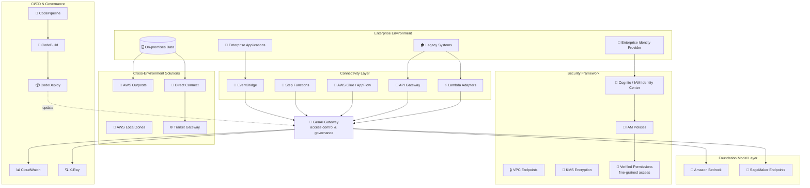

# Case Study 07 — Enterprise-wide GenAI Integration for a Financial Institution

[← Back to Case Studies](./README.md)

| | |
|---|---|
| **Core concept** | Integrating FMs into enterprise-wide legacy systems + security/data sovereignty + a centralized GenAI gateway |
| **Related domains** | D2 (Integration), D3 (Security/Governance), D4 (Operational Efficiency) |
| **Key services** | API Gateway, Lambda (adapters), EventBridge, Step Functions, Glue/AppFlow, IAM Identity Center/Cognito, Verified Permissions, KMS/ACM, VPC endpoints, Outposts/Local Zones/Wavelength, Direct Connect/Transit Gateway, CodePipeline/CodeBuild, CloudWatch/X-Ray/CloudTrail |

---

## 1. Use case summary

> A **multinational financial institution** operating in **30+ countries** runs an **enterprise-wide** GenAI integration strategy: enhance customer experience, improve operational efficiency, drive innovation — while still **complying with financial regulations & data sovereignty**. Challenges: **legacy** systems hold critical data but **lack modern APIs**; regulations differ by jurisdiction; high security standards; need consistent AI capabilities across web/mobile/branch; need **human oversight** of AI content in regulated communications; continuous delivery without disrupting operations.

Picture not building a brand-new AI app, but having to **bolt AI onto a banking machine that's run for decades** — full of legacy systems with no APIs, with data that can't leave certain countries' borders. The challenge is **connectivity** (legacy ↔ FM), **multi-layer security**, and **data sovereignty**. This case tests designing an integration + enterprise-security layer, not a chatbot.

### Requirements to solve

| # | Requirement | Why it's hard |
|---|---|---|
| R1 | **Connect FMs to API-less legacy systems** | Must convert protocols/formats between old systems and FMs |
| R2 | **Loosely coupled, event-driven architecture** | Don't weld FMs tightly to business systems |
| R3 | **Financial-grade security, fine-grained permissions** | Identity federation + least-privilege + fine-grained access |
| R4 | **Data sovereignty by jurisdiction** | Sensitive data must not leave certain countries' borders |
| R5 | **Centralized governance & access (GenAI gateway)** | Enterprise-wide access control + governance |
| R6 | **CI/CD for FM apps, no disruption** | Continuous delivery with quality gates |

---

## 2. Architecture diagram

---

## 3. Why this architecture meets the requirements (Design Rationale)

### R1 + R2 → Connectivity layer: API Gateway + Lambda adapters + EventBridge + Step Functions

Legacy systems lack modern APIs, so you build a "translation layer":

- **API Gateway** creates endpoints with request/response mapping to transform data between old systems and FMs.
- **Lambda adapters** handle protocol/format conversion.
- **EventBridge** creates an **event-driven, loosely coupled** architecture — FMs aren't welded to business systems.
- **Step Functions** orchestrates complex interactions between FMs and multiple systems.
- **Glue / AppFlow** synchronize data so FMs always have fresh data.

> ⚠️ **Common mistake:** to keep FMs and business systems **loosely coupled** → **EventBridge** (event-driven), not direct synchronous calls that create tight coupling.

### R3 → Multi-layer security

- **IAM Identity Center / Cognito** for **identity federation** with the enterprise IdP.
- **IAM least-privilege policies** + **Amazon Verified Permissions** for **fine-grained access** by user/resource attributes.
- **KMS + ACM** encrypt at-rest & in-transit; **VPC endpoints, security groups, network ACLs** for network security.

> ⚠️ **Common mistake:** "fine-grained attribute-based access (ABAC)" → **Verified Permissions**, beyond plain IAM policies.

### R4 → Data sovereignty: Outposts + Local Zones + Wavelength + Direct Connect/Transit Gateway

This is the case's signature point. Sensitive data must not leave certain countries:

- **AWS Outposts** runs FM inference **on-premises** on sensitive data (keeps data within borders).
- **AWS Local Zones / Wavelength** reduce latency in specific geographies.
- **Direct Connect + Transit Gateway** securely connect cloud ↔ on-prem.
- Replication mechanisms respect compliance boundaries (filter/anonymize).

> ⚠️ **Common mistake:** "data must stay on-prem/in-country but still needs inference" → **Outposts** (bring AWS to on-prem), not shipping data to a public region.

### R5 → Centralized governance: GenAI Gateway

A **centralized GenAI gateway** architecture for **enterprise-wide access control & governance** — all FM access goes through one gate, applying consistent policy, easy to control.

### R6 → CI/CD: CodePipeline + CodeBuild + observability

**CodePipeline + CodeBuild** with security scanning + quality gates for FM components; an automated test framework validates model behavior/performance. **CloudWatch + X-Ray + CloudTrail** for observability; centralized policy enforcement with automated remediation on violations.

---

## 4. Alternatives & trade-offs

| Decision | Right choice | Common wrong choice | Why |
|---|---|---|---|
| Connect legacy ↔ FM | **API Gateway + Lambda adapters** | Rewrite legacy | Adapters convert protocols, not rebuild old systems |
| Decouple FM & business | **EventBridge (event-driven)** | Direct synchronous calls | Loosely coupled = durable & scalable |
| Fine-grained ABAC | **Verified Permissions** | IAM policy only | Attribute-based fine-grained beyond plain IAM |
| Data must stay on-prem | **Outposts / Local Zones** | Ship to public region | Respect data sovereignty |
| Identity federation | **IAM Identity Center / Cognito** | Create separate AWS users | Federate IdP, use temporary credentials |
| FM access governance | **Centralized GenAI Gateway** | Each app calls FM itself | Consistent governance & access control |

---

## 5. 💡 Lesson learned

> **When you face a problem with** **"integrating GenAI into a large legacy enterprise + multinational + data sovereignty,"** immediately think of the combo:
> **API Gateway + Lambda adapters (connectivity) + EventBridge/Step Functions (loose orchestration) + Outposts/Local Zones (data sovereignty) + Verified Permissions (fine-grained permissions) + GenAI Gateway (centralized governance).**

- **Legacy without APIs → Lambda adapters + API Gateway**, don't rebuild old systems.
- **Loosely coupled = EventBridge**, not tight synchronous calls.
- **Data sovereignty = Outposts/Local Zones/Wavelength** — bring inference to where data must stay.
- **Fine-grained ABAC = Verified Permissions**, beyond plain IAM policies.
- **Centralized GenAI Gateway** = one gate for access control & governance.

🔗 **Related:** [04. Compute & Deployment](../01-basic-knowledge/04-compute-deployment-services.md) · [06. Integration & Orchestration](../01-basic-knowledge/06-integration-orchestration-services.md) · [07. Security & Governance](../01-basic-knowledge/07-security-governance-services.md) · [Practice exam](../03-practice-exam/)
