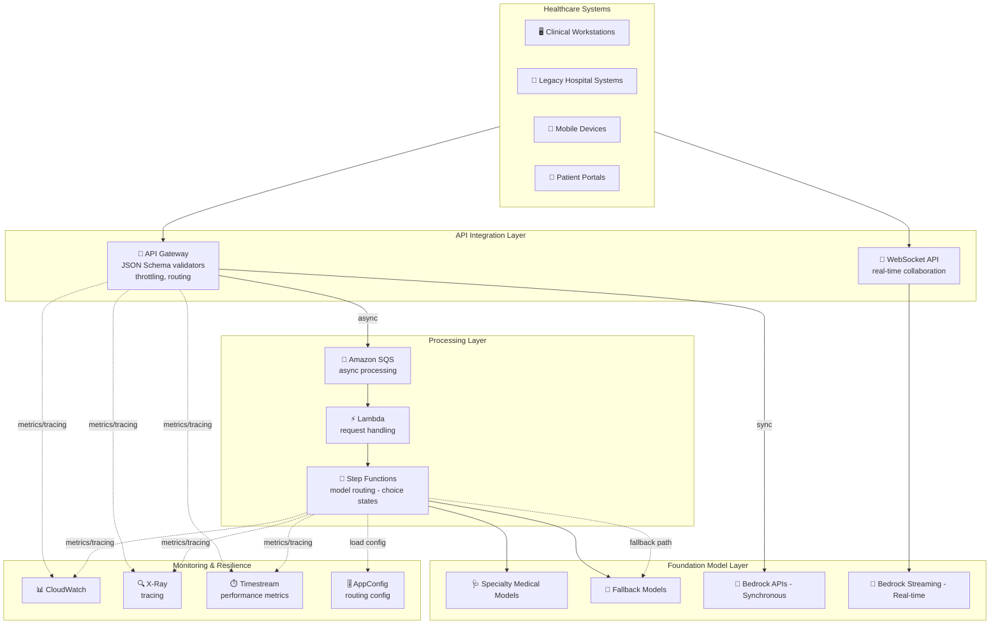

# Case Study 08 — Enterprise-grade AI Assistant Platform for Healthcare

[← Back to Case Studies](./README.md)

| | |
|---|---|
| **Core concept** | Flexible model-interaction system — sync vs async, streaming, and multi-layer fallback for mission-critical clinical workflows |
| **Related domains** | D2 (Integration), D4 (Operational Efficiency), D5 (Resilience) |
| **Key services** | Bedrock (APIs, streaming), SQS, API Gateway (JSON Schema validators, throttling), Step Functions, AppConfig, X-Ray, Timestream, AWS SDK retry |

---

## 1. Use case summary

> Your company builds an AI assistant platform for **healthcare professionals**, supporting **clinical decision-making, medical documentation, and patient engagement** across hospital environments. Requirements: support **multiple interaction patterns** from various hospital systems/devices; **real-time AI support** in time-sensitive clinical workflows; **reliable operation during network disruptions or service degradation**; **model selection by specialty & clinical context**; healthcare-regulation compliance while scaling.

Picture building an AI assistant for doctors in a hospital. The challenge is the **diversity of interaction situations**: emergency questions needing an instant answer (sync), post-encounter documentation that can wait (async), and times when the network is flaky but the system **must not die** mid clinical workflow. This case tests choosing the **right interaction type** (sync/async/streaming) and building **multiple fallback layers**.

### Requirements to solve

| # | Requirement | Why it's hard |
|---|---|---|
| R1 | **Synchronous, fast clinical queries** | Emergency questions need instant answers with short timeouts + retry |
| R2 | **Asynchronous post-encounter documentation** | Doctor submits then continues care, processed in the background |
| R3 | **Real-time display (streaming)** | Doctor starts reading results while the AI is still generating |
| R4 | **Reliability during network disruption** | Streams must resume; prioritize emergency requests |
| R5 | **Model selection by specialty & context** | Multi-specialty cases need selecting/running multiple models in parallel |
| R6 | **Validate medical context + throttle by department** | Check required fields, standard codes; per-department limits |

---

## 2. Architecture diagram

---

## 3. Why this architecture meets the requirements (Design Rationale)

### R1 → Emergency queries: synchronous Bedrock API + smart retry

Clinical questions needing instant answers → **synchronous Bedrock API** with a 4–5 second timeout, custom retry logic with **exponential backoff + jitter** to withstand hospital peaks.

### R2 → Post-encounter documentation: asynchronous SQS

Post-encounter documentation isn't instant → **Amazon SQS** with a 10-minute visibility timeout + a **dead letter queue**. The doctor submits and continues patient care while processing runs in the background.

> ⚠️ **Common mistake:** work that **can wait** (background documentation) → **SQS async**; work needed **now** (emergency) → **synchronous API**. Don't cram everything into one type.

### R3 → Real-time display: Bedrock Streaming + Server-Sent Events

- **Bedrock streaming API** with buffer management that prioritizes showing clinical information first → doctors start reading decision support while analysis is still generating.
- **Server-Sent Events (SSE)** with event IDs for patient-education apps — **streams resume after a network interruption**.

### R4 → Reliability & multi-layer fallback

- AWS SDK with tuned retry policies + **priority queuing for emergency requests**.
- **Multi-tier API Gateway throttling** by hospital size, with burst capacity for shift changes/morning rounds.
- **Multi-layer fallback (degradation path):** specialized medical model → general-purpose model + medical prompt → RAG using the hospital knowledge base → finally rule-based for critical functions.

> ⚠️ **Common mistake:** critical systems need a clear **fallback chain** (specialized → general → RAG → rule-based), not just one model.

### R5 → Model selection by specialty: Step Functions choice states + Timestream

- **Step Functions with choice states** evaluates patient data + medical codes to select the right model, **running in parallel** for multi-specialty consultations.
- **Metrics-based routing** tracks diagnostic accuracy, response quality & time in **Amazon Timestream** (time-series DB) to continuously optimize model selection.

> ⚠️ **Common mistake:** store **time-series metrics** to optimize routing → **Timestream**, not regular DynamoDB.

### R6 → Validate & throttle: API Gateway JSON Schema validators + AppConfig

- **API Gateway JSON Schema validators** check required medical-context fields, validate terminology against standard codes; usage plans with per-department throttling.
- **AppConfig** manages static routing configuration + mapping templates applying prompt/format by clinical context, with A/B testing.

---

## 4. Alternatives & trade-offs

| Need | Right choice | Common wrong choice | Why |
|---|---|---|---|
| Emergency questions | **Synchronous Bedrock API + retry** | Async SQS | Emergencies need now, not queue waiting |
| Post-encounter docs | **SQS async + DLQ** | Synchronous call | Let doctor continue, process in background |
| Progressive result display | **Bedrock streaming + SSE** | Wait for full response | Doctor reads early; SSE resumes on network loss |
| Multi-specialty model selection | **Step Functions choice states** | If-else in Lambda | SF branches + runs in parallel |
| Optimize routing by metric | **Timestream** | DynamoDB | Time-series optimal for time-based metrics |
| Reliability | **Multi-layer fallback** | Single model | Critical systems need a degradation path |

---

## 5. 💡 Lesson learned

> **When you face a problem with** **"mission-critical AI assistant + multiple interaction types + reliability during incidents,"** immediately think: **choose the right interaction type (sync/async/streaming) + a multi-layer fallback chain + smart model routing.**

- **Sync vs Async:** needed-now work → synchronous API; can-wait work → SQS (with DLQ).
- **Streaming + SSE** = progressive display + resume after network loss.
- **Multi-layer fallback:** specialized → general+prompt → RAG → rule-based.
- **Step Functions choice states** = select/run models in parallel by context.
- **Timestream** = store time-series metrics to optimize routing.
- **API Gateway JSON Schema validators** = block inputs missing required medical fields.

🔗 **Related:** [01. Bedrock](../01-basic-knowledge/01-amazon-bedrock-services.md) · [06. Integration & Orchestration](../01-basic-knowledge/06-integration-orchestration-services.md) · [04. Compute & Deployment](../01-basic-knowledge/04-compute-deployment-services.md) · [Practice exam](../03-practice-exam/)
