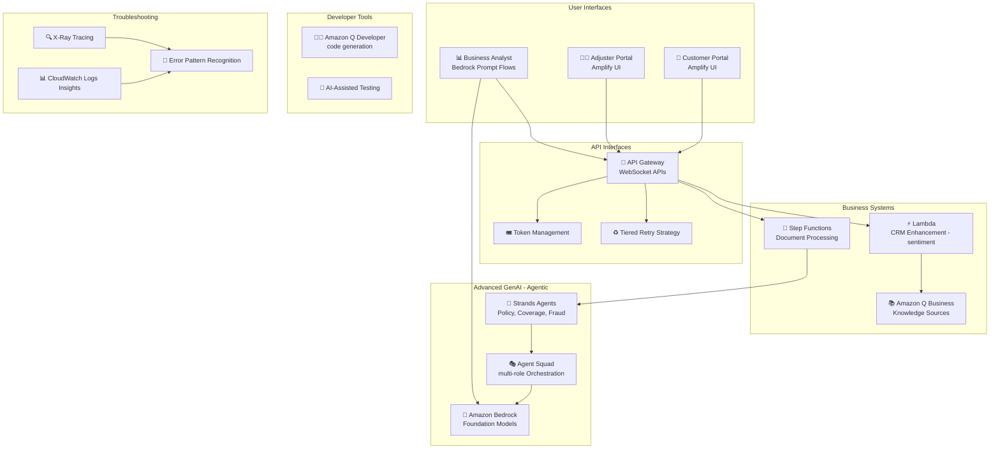

# Case Study 09 — Transforming Insurance Claims Processing with Agentic GenAI

[← Back to Case Studies](./README.md)

| | |
|---|---|
| **Core concept** | Multi-agent orchestration + developer-productivity tools (Amazon Q) for the claims process |
| **Related domains** | D2 (Integration), D4 (Operational Efficiency), D5 (Monitoring) |
| **Key services** | API Gateway (WebSocket), Bedrock (Prompt Flows), Lambda, Step Functions, Amazon Q Business, Amazon Q Developer, Strands Agents, Agent Squad, Amplify, CloudWatch Logs Insights, X-Ray |

---

## 1. Use case summary

> A **multinational insurance company** handling **50,000+ claims/month** (auto, home, health, commercial) faces problems: long processing times, **inconsistent adjudication decisions**, poor customer satisfaction, and manual document-processing bottlenecks. They undertake a comprehensive GenAI transformation to modernize claims workflows, improve customer experience, and boost operational efficiency.

Picture not building a single AI responder, but a **"team of virtual experts"** jointly handling a complex claim file: one agent looks up policy, one assesses damage, one investigates fraud, one advocates for the customer. The challenge is **orchestrating these agents to cooperate smoothly**, hand off coherently, and recover when one hits its limits. This is a problem about **agentic AI** and development productivity.

### Requirements to solve

| # | Requirement | Why it's hard |
|---|---|---|
| R1 | **Stable, real-time claim review sessions** | Long sessions need durable connections + context management within token limits |
| R2 | **Multiple specialized agents cooperating** | Policy lookup, coverage, fraud — must hand off consistently, with recovery |
| R3 | **Complex commercial claims, many roles** | Need to orchestrate many agents: policy expert, damage assessor, fraud investigator, customer advocate |
| R4 | **Parallel document processing with validation** | Many documents processed in parallel with validation checkpoints |
| R5 | **Boost development productivity** | Generate compliant insurance-domain code, refactor, test for GenAI scenarios |
| R6 | **Let non-developers design workflows** | Business analysts build workflows without developers |

---

## 2. Architecture diagram

---

## 3. Why this architecture meets the requirements (Design Rationale)

### R1 → Stable review sessions: WebSocket + token windowing + tiered retry

**API Gateway WebSocket** with a 20-minute timeout for stable claim-review sessions; **token windowing** manages context within limits (e.g., 8,000 tokens); a **tiered retry strategy** with a **circuit breaker after 4 failures** to withstand peaks.

### R2 + R3 → Multi-agent: Strands Agents + Agent Squad

This is the agentic case's signature point:

- **AWS Strands Agents**: specialized agents for **policy lookup, coverage verification, fraud detection** with orchestration workflows, ensuring consistent claim understanding across handoffs and a **recovery mechanism** when an agent hits its limits.
- **AWS Agent Squad** for complex commercial claims: orchestrates multiple roles — **policy expert, damage assessor, fraud investigator, customer advocate**. **Step Functions** inserts validation steps between handoffs to ensure consistency + recovery when needed.

> ⚠️ **Common mistake:** a problem needing "many experts cooperating on one complex task" → **multi-agent orchestration (Strands Agents / Agent Squad)** + Step Functions inserting validation between handoffs, not a single prompt.

### R4 → Parallel document processing: Step Functions + Lambda

**Step Functions** orchestrates **parallel document-processing workflows with validation checkpoints**; **Lambda** enhances the CRM with sentiment analysis at claim submission. **Amazon Q Business** serves as a knowledge source with daily refresh + metadata tags by claim type/coverage.

### R5 → Dev productivity: Amazon Q Developer

**Amazon Q Developer** configured with insurance-domain context to **generate compliant code**, refactoring pipelines prioritized by performance impact, and test frameworks with coverage specialized for GenAI scenarios.

> ⚠️ **Common mistake:** "boost developer productivity, generate/refactor code" → **Amazon Q Developer** (coding companion); "knowledge source for the business" → **Amazon Q Business**. Don't confuse the two Q products.

### R6 → Non-developers building workflows: Bedrock Prompt Flows + Amplify

**Bedrock Prompt Flows** lets business analysts design custom workflows **without developers**; **Amplify UI** builds portal interfaces quickly with progressive enhancement; OpenAPI specs for partner integration.

### Monitoring: CloudWatch Logs Insights + X-Ray

**CloudWatch Logs Insights** queries logs to find patterns in claim processing; **X-Ray** traces with insurance-specific annotations; error-recognition rules + remediation suggestions for common failure modes.

---

## 4. Alternatives & trade-offs

| Need | Right choice | Common wrong choice | Why |
|---|---|---|---|
| Many experts cooperating | **Strands Agents / Agent Squad** | One giant prompt | Multi-agent handles specialized roles + handoffs |
| Consistent agent handoffs | **Step Functions (validation steps)** | Let agents call each other | SF inserts checkpoints + recovery |
| Long, real-time review session | **WebSocket + token windowing** | REST | Durable connection + context management |
| Generate/refactor code | **Amazon Q Developer** | Q Business | Q Developer is the coding companion |
| Business knowledge source | **Amazon Q Business** | Q Developer | Q Business for enterprise knowledge |
| Workflows for non-devs | **Bedrock Prompt Flows** | Force devs to code | Prompt Flows is drag-and-drop, no code |

---

## 5. 💡 Lesson learned

> **When you face a problem with** **"a complex task needing many experts cooperating + many handoff steps,"** immediately think of **multi-agent orchestration**: Strands Agents / Agent Squad + Step Functions inserting validation between handoffs.

- **Multi-agent ≠ one prompt:** split into specialized roles (policy/damage/fraud/advocate), orchestrate + recover.
- **Step Functions** ensures consistent handoffs between agents.
- **Amazon Q Developer ≠ Q Business:** Developer for generating/refactoring code; Business for the business knowledge source.
- **Bedrock Prompt Flows** lets non-developers build workflows.
- **WebSocket + token windowing + circuit breaker** for stable long sessions.

🔗 **Related:** [01. Bedrock](../01-basic-knowledge/01-amazon-bedrock-services.md) · [06. Integration & Orchestration](../01-basic-knowledge/06-integration-orchestration-services.md) · [05. Specialized AI](../01-basic-knowledge/05-specialized-ai-services.md) · [Practice exam](../03-practice-exam/)
