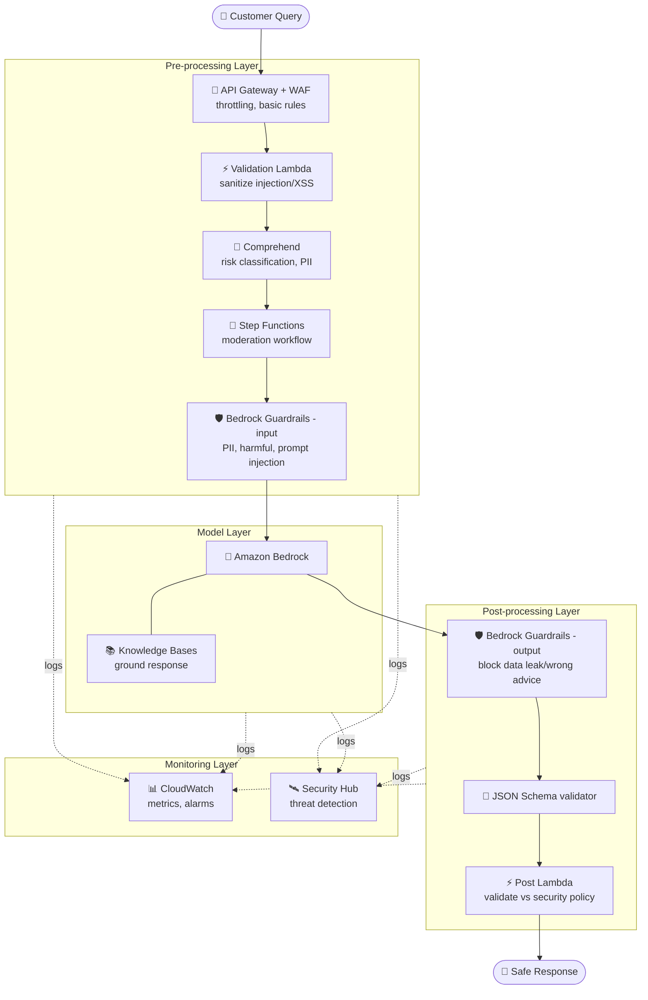
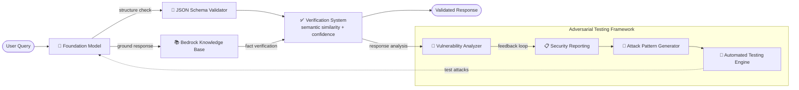

# Case Study 10 — Input/Output Safety Controls for a Financial AI Assistant

[← Back to Case Studies](./README.md)

| | |
|---|---|
| **Core concept** | Defense-in-depth for input/output safety + hallucination prevention + an adversarial testing framework |
| **Related domains** | D3 (Security/Safety/Guardrails), D5 (Testing) |
| **Key services** | Bedrock Guardrails, Knowledge Bases, Comprehend, Lambda, Step Functions, API Gateway + WAF, CloudWatch, Security Hub, AWS Organizations |

---

## 1. Use case summary

> A **large financial institution** wants to build an AI assistant answering customer questions about accounts, financial products, and general banking. The assistant must be **secure, accurate, and resistant to misuse** while handling sensitive financial information.

Picture building a banking assistant that bad actors constantly try to **trick into leaking account info** or **fool into giving wrong advice**. The challenge isn't making the AI answer, but **wrapping it in multiple defensive layers**: filter malicious input, prevent the AI from fabricating, check output before returning it, and **proactively attack yourself** to find vulnerabilities. This case tests **defense-in-depth** thinking and **adversarial testing**.

### Requirements to solve

| # | Requirement | Why it's hard |
|---|---|---|
| R1 | **Input safety filtering** | Block PII, harmful content, and prompt injection |
| R2 | **Prevent output hallucination** | Must not fabricate misleading financial advice |
| R3 | **Enforce output structure + prevent data leakage** | Output must match schema, no leaking account info |
| R4 | **Defense-in-depth** | If one layer is breached, others remain |
| R5 | **Detect & test adversarial attacks** | Proactively detect jailbreak/injection, self-attack to find vulnerabilities |
| R6 | **Monitoring & compliance** | Audit logs + anomaly detection + compliance reports |

---

## 2. Architecture diagram

### 2.1 Defense-in-depth (multiple security layers)

### 2.2 Hallucination prevention + Adversarial testing

---

## 3. Why this architecture meets the requirements (Design Rationale)

### R1 → Input safety: multiple filter layers

- **Validation Lambda** sanitizes input (against SQL injection, XSS), validates format.
- **Amazon Comprehend** analyzes sentiment/key phrases to detect threats, identifies PII, classifies risk.
- **Step Functions** orchestrates the whole moderation process, branches by risk level, keeps an audit log.
- **Bedrock Guardrails (input)** blocks PII, harmful content, and **prompt injection**.

### R2 → Prevent hallucination: Knowledge Bases + Verification System

**Bedrock Knowledge Bases** stores accurate financial-product information to **ground** answers. The **Verification System** runs **semantic similarity** checks between the response and the knowledge base, computes a **confidence score**, and flags potential hallucinations for human review.

> ⚠️ **Common mistake:** preventing fabrication in a tightly regulated industry → **RAG (Knowledge Bases) + Guardrails contextual grounding + verification**, not relying on the model alone.

### R3 → Enforce output structure: JSON Schema + Guardrails output

**JSON Schema** validates response structure (account info, product recommendation, transaction). **Bedrock Guardrails (output)** filters misleading financial advice, blocks leaking sensitive account info.

### R4 → Defense-in-depth: 4 layers

This is the core idea. Four independent layers; if one is breached, others remain:

- **Pre-processing:** API Gateway + WAF (throttling, basic rules) + Comprehend (risk classification) + Lambda (sanitize).
- **Model:** Bedrock Guardrails (content safety) + Knowledge Base (ground responses).
- **Post-processing:** Lambda validates responses against security policy + API Gateway filters to prevent data leakage.
- **Monitoring:** CloudWatch (metrics + alarms for suspicious patterns) + **Security Hub** (centralized threat detection).

### R5 → Adversarial testing: self-attack to find vulnerabilities

This case's standout part. The system **proactively self-tests its security**:

- **Attack Pattern Generator** creates finance-specific adversarial prompts (injection, jailbreak, social engineering targeting data extraction).
- **Automated Testing Engine** runs attack patterns against the system, measures responses, logs successes/failures.
- **Vulnerability Analyzer** evaluates responses to find weaknesses, measures control effectiveness.
- **Security Reporting** generates compliance reports + a **feedback loop** for continuous improvement.

> ⚠️ **Common mistake:** AI safety isn't a one-time guardrail setup — you need **continuous automated adversarial testing** to find new vulnerabilities.

### R6 → Monitoring & compliance: CloudWatch + Security Hub + Organizations

CloudWatch tracks metrics & alerts on suspicious patterns; **Security Hub** provides comprehensive threat detection; **AWS Organizations** applies governance policy across accounts.

---

## 4. Alternatives & trade-offs

| Need | Right choice | Common wrong choice | Why |
|---|---|---|---|
| Block input PII/injection | **Guardrails + Comprehend + Lambda** | Prompt instructions only | Multiple filter layers, not relying on model self-discipline |
| Prevent hallucination | **Knowledge Bases + Verification** | Trust the model | RAG grounds facts + verifies confidence |
| Output structure | **JSON Schema** | Let the model run free | Schema enforces consistent format |
| Overall security | **Defense-in-depth, 4 layers** | A single guardrail | One layer breached, others remain |
| Find vulnerabilities | **Adversarial testing framework** | Manual one-time test | Continuous automation finds new vulnerabilities |
| Threat detection | **Security Hub + CloudWatch** | Plain logs only | Centralized threat detection |

---

## 5. 💡 Lesson learned

> **When you face a problem with** **"safe AI for a sensitive industry, resisting misuse/attacks,"** immediately think of **defense-in-depth** (pre → model → post → monitoring) + **automated adversarial testing**.

- **Input/output safety = Guardrails at both ends** (input filters PII/injection, output blocks data leaks/wrong advice).
- **Prevent hallucination = Knowledge Bases (ground) + verification (confidence + human review)**.
- **Defense-in-depth, 4 layers:** one layer breached, others remain.
- **Adversarial testing** is the easily forgotten part: self-generate attacks → test → analyze vulnerabilities → feedback loop.
- **Security Hub** for centralized threat detection, not just CloudWatch.

🔗 **Related:** [01. Bedrock](../01-basic-knowledge/01-amazon-bedrock-services.md) · [07. Security & Governance](../01-basic-knowledge/07-security-governance-services.md) · [05. Specialized AI](../01-basic-knowledge/05-specialized-ai-services.md) · [Practice exam](../03-practice-exam/)
