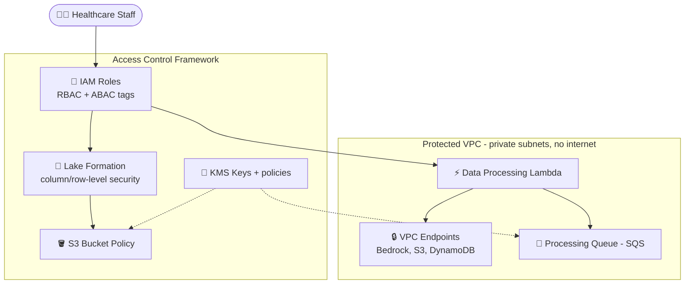
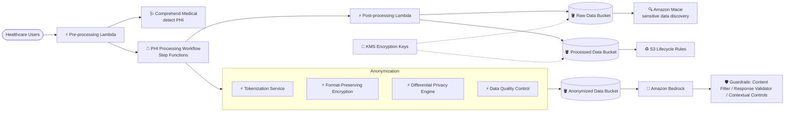

# Case Study 11 — Data Security & Privacy Controls for Healthcare AI

[← Back to Case Studies](./README.md)

| | |
|---|---|
| **Core concept** | Multi-layer data security (network isolation + access control + PII protection + anonymization) for FMs processing HIPAA data |
| **Related domains** | D3 (Security/Privacy/Governance), D1 (Data) |
| **Key services** | VPC endpoints, IAM (RBAC/ABAC), Lake Formation, KMS, Comprehend Medical, Macie, GuardDuty, CloudTrail, Security Hub, S3 Lifecycle, Bedrock Guardrails, Step Functions, Lambda |

---

## 1. Use case summary

> A **healthcare organization** wants to use FMs to analyze patient records, medical research, and treatment outcomes to improve clinical decision-making. The solution must **strictly comply with HIPAA** and deliver valuable insights to medical professionals.

Picture building an AI healthcare-analytics platform where every row of data is **protected health information (PHI)** strictly protected by law. The challenge isn't the analysis but **not leaking a single byte** — data must live in a "sealed room," only the right people may enter, all PHI must be masked/anonymized, and every access leaves a trail. This case tests **multi-layer data security** thinking around the FM.

### Requirements to solve

| # | Requirement | Why it's hard |
|---|---|---|
| R1 | **Network isolation** | AI-processing resources must have no direct internet |
| R2 | **Fine-grained access control (RBAC/ABAC, column-level)** | Right role/department sees the right data |
| R3 | **Detect & protect PII/PHI** | Automatically identify PHI in unstructured text |
| R4 | **Encryption & data lifecycle** | Encryption at rest, key rotation, retain/delete per regulation |
| R5 | **Anonymization** | Tokenization, format-preserving encryption, differential privacy |
| R6 | **Monitoring, audit & breach detection** | Comprehensive audit + data-leak detection |

---

## 2. Architecture diagram

### 2.1 Isolated environment + access control

### 2.2 PII protection + Anonymization

---

## 3. Why this architecture meets the requirements (Design Rationale)

### R1 → Network isolation: VPC + VPC Endpoints + Security Groups/NACLs

- **A dedicated VPC** for the healthcare-analytics platform, **private subnets** for all AI-processing components, **no direct internet**.
- **VPC Endpoints** (interface for Bedrock/S3, gateway for S3/DynamoDB) → all traffic stays within the AWS network, not the public Internet.
- **Security groups + Network ACLs** limit traffic between components + egress rules block data exfiltration.

> ⚠️ **Common mistake:** sensitive data calling Bedrock/S3 without going over the Internet → **VPC Endpoints** (PrivateLink), not calling via a public endpoint.

### R2 → Fine-grained access control: IAM + Lake Formation + resource policies

- **IAM**: RBAC for all components, **least privilege**, and **ABAC** (attribute-based) for dynamic permissions.
- **AWS Lake Formation**: fine-grained access control for the data lake — **column-level security** for sensitive patient data, **row-level security** by role/department.
- **Resource-based policies**: S3 bucket policies limit by role, KMS key policies enforce encryption, SQS policies limit producers/consumers.

> ⚠️ **Common mistake:** "control at the column/row level in a data lake" → **Lake Formation**, not plain IAM policies.

### R3 → Detect & protect PHI: Comprehend Medical + Macie

- **Amazon Comprehend Medical**: automatically detects PHI, identifies medical entities in unstructured text, classifies sensitive information.
- **Amazon Macie**: automatically discovers sensitive data on S3, scans periodically, custom data identifiers for healthcare info.
- **Pipeline Lambda**: sanitizes input, detects & masks PII in real time, logs events for compliance.

> ⚠️ **Common mistake:** PHI in medical text → **Comprehend Medical** (healthcare-specialized), not regular Comprehend; discovering sensitive data on S3 → **Macie**.

### R4 → Encryption & lifecycle: KMS + S3 Lifecycle

- **KMS**: auto-encrypts all data, **key rotation**, key management with tight access control.
- **S3 Lifecycle**: auto-transitions data to cold storage after a defined period, deletion policies per retention, versioning for audit.

### R5 → Anonymization: tokenization + FPE + differential privacy

- **Data masking**: tokenize patient identifiers, **format-preserving encryption** for structured data, pseudonymization with secure mapping tables.
- **Differential privacy**: add statistical noise to protect individual records, manage the privacy budget, balance protection vs utility.
- **De-identification pipeline** (Step Functions): automated anonymization workflow, multiple techniques by sensitivity, quality control after anonymization.

### R6 → Monitoring & audit: CloudTrail + GuardDuty + Macie + Security Hub

- **CloudWatch**: real-time monitoring of API calls to Bedrock, custom metrics for access patterns, anomaly detection.
- **CloudTrail**: comprehensive audit logs, integrated with **Security Hub**, retention per HIPAA.
- **GuardDuty + Macie**: detect data-breach threats, automated remediation workflows.
- **Bedrock Guardrails**: contextual controls by role/access level, block PHI leakage on both input/output, log interventions for compliance reporting.

---

## 4. Alternatives & trade-offs

| Need | Right choice | Common wrong choice | Why |
|---|---|---|---|
| Call Bedrock/S3 without Internet | **VPC Endpoints (PrivateLink)** | Public endpoint | Keeps traffic within the AWS network |
| Column/row data-lake control | **Lake Formation** | Plain IAM | Column/row-level security |
| Detect PHI in text | **Comprehend Medical** | Regular Comprehend | Specialized for medical entities |
| Discover sensitive S3 data | **Macie** | Manual scanning | Automatic + custom identifiers |
| Detect leaks/threats | **GuardDuty + Security Hub** | CloudWatch only | Dedicated threat detection |
| Anonymize data | **Tokenization + FPE + differential privacy** | Drop columns crudely | Preserves utility + protection |

---

## 5. 💡 Lesson learned

> **When you face a problem with** **"FM processing extremely sensitive data (healthcare/HIPAA) + strict security & privacy,"** immediately think of **multi-layer security**: network isolation (VPC Endpoints) + fine-grained access control (Lake Formation/ABAC) + PHI protection (Comprehend Medical/Macie) + anonymization + audit (CloudTrail/GuardDuty).

- **VPC Endpoints** = call AWS services without the Internet (core for sensitive data).
- **Lake Formation** = column/row-level control, beyond plain IAM.
- **Comprehend Medical** (PHI) + **Macie** (sensitive-data discovery on S3) — don't confuse with regular Comprehend.
- **Anonymization** = tokenization + format-preserving encryption + differential privacy.
- **GuardDuty + Security Hub** for threat detection, not just logs.

🔗 **Related:** [03. Data & RAG](../01-basic-knowledge/03-data-rag-knowledge-services.md) · [07. Security & Governance](../01-basic-knowledge/07-security-governance-services.md) · [05. Specialized AI](../01-basic-knowledge/05-specialized-ai-services.md) · [Practice exam](../03-practice-exam/)
