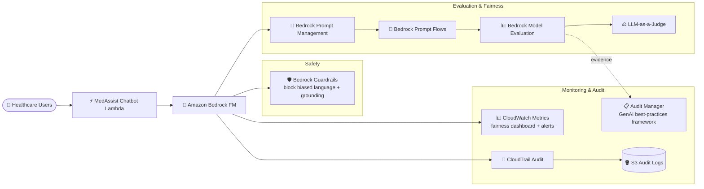

# Case Study 12 — Fairness Evaluation for a Healthcare Chatbot (Responsible AI)

[← Back to Case Studies](./README.md)

| | |
|---|---|
| **Core concept** | A fairness & Responsible AI evaluation framework: LLM-as-a-judge + human eval + continuous bias monitoring |
| **Related domains** | D5 (Responsible AI, Testing & Evaluation), D3 (Governance) |
| **Key services** | Bedrock (Model Evaluation, LLM-as-a-judge, Prompt Management, Prompt Flows, Guardrails), CloudWatch, CloudTrail, S3, Audit Manager |

---

## 1. Use case summary

> A company develops a **healthcare chatbot** using Bedrock FMs to provide medical information to patients. The task: implement **Responsible AI principles**, focusing on **fairness evaluation** so the chatbot answers **without bias** across diverse patient demographics. The dev team must evaluate & mitigate bias related to: age groups (elderly/younger), gender & gender identity, ethnic/cultural background, socioeconomic factors, and medical-literacy levels.

Picture building a healthcare chatbot that must ensure it **doesn't answer worse for the elderly, the poor, or minority groups**. The challenge: bias is hard to see by eye — you must **measure systematically** across many demographic groups, then **monitor continuously** because bias can drift over time. This case tests the **Responsible AI & fairness evaluation** framework.

### Requirements to solve

| # | Requirement | Why it's hard |
|---|---|---|
| R1 | **Automated evaluation across groups** | Need to measure correctness/completeness/harmfulness at scale, not all by hand |
| R2 | **Human evaluation** | Some fairness judgments need a final human evaluator |
| R3 | **A/B test bias-reducing prompt strategies** | Try multiple prompt variants per demographic group |
| R4 | **Continuous fairness monitoring** | Bias can drift; need real-time tracking + alerts |
| R5 | **Audit & compliance evidence** | Document fairness evaluations for compliance |
| R6 | **Guardrails against biased output** | Block biased language + ensure factual accuracy |

---

## 2. Architecture diagram

---

## 3. Why this architecture meets the requirements (Design Rationale)

### R1 → Automated evaluation: Bedrock Model Evaluation + LLM-as-a-judge

**Bedrock Model Evaluation** with **LLM-as-a-judge** measures correctness, completeness, harmfulness metrics. The process: create a diverse test dataset by demographic group → configure an evaluation job using a judge model → define fairness metrics across groups → analyze scores & explanations in the console.

> ⚠️ **Common mistake:** evaluating quality/bias at scale → **Bedrock Model Evaluation (LLM-as-a-judge)**, not hand-scoring each answer.

### R2 → Human evaluation

Supplement automated evaluation with **human evaluators** for final judgment — using your own workforce or **AWS managed custom evaluation**. Human-in-the-loop matters for subtle fairness judgments machines struggle to catch.

### R3 → A/B test bias-reducing prompts: Prompt Management + Prompt Flows

- **Bedrock Prompt Management** creates multiple **prompt variants** designed to reduce bias per group.
- **Bedrock Prompt Flows** builds a workflow that routes questions by content/context, tests different prompt strategies across demographic segments, and evaluates with fairness metrics. The visual builder links FM + prompts + AWS services. Analyze to find the fairest, most effective prompt strategy.

### R4 → Continuous fairness monitoring: CloudWatch

**CloudWatch** collects model-usage metrics near real time, custom dashboards track fairness metrics across groups, alerts on potential bias detection, and monitors invocation & token count by user segment.

> ⚠️ **Common mistake:** fairness isn't a one-time evaluation — you need **continuous monitoring** because bias can drift.

### R5 → Audit & compliance: CloudTrail + Audit Manager

- **CloudTrail** collects API data, delivers logs to S3, periodic audits of model-usage patterns to detect fairness issues.
- **AWS Audit Manager** with a **GenAI best-practices framework** documents fairness evaluations and maintains compliance evidence.

> ⚠️ **Common mistake:** "document Responsible AI evaluations + compliance evidence" → **Audit Manager** (with a built-in GenAI framework), not building documentation by hand.

### R6 → Guardrails against biased output

**Bedrock Guardrails** configures content filters to detect & block biased language, **contextual grounding checks** to ensure factually accurate responses, combining the LLM provider's built-in guardrails + external guardrails for added protection.

---

## 4. Alternatives & trade-offs

| Need | Right choice | Common wrong choice | Why |
|---|---|---|---|
| Bias evaluation at scale | **Model Evaluation + LLM-as-a-judge** | Hand-scoring | Automated, measures multiple metrics |
| Final fairness judgment | **Human evaluation** | Automated only | Some bias needs a human to catch |
| Try bias-reducing prompts | **Prompt Management + Prompt Flows** | Hard-code prompts | A/B test variants per group |
| Track bias over time | **CloudWatch fairness dashboard** | One-time evaluation | Bias drifts, needs continuous |
| Compliance evidence | **Audit Manager (GenAI framework)** | Manual documentation | Built-in framework for Responsible AI |
| Block biased output | **Guardrails + grounding** | Trust the model | Enforce at the system tier |

---

## 5. 💡 Lesson learned

> **When you face a problem with** **"Responsible AI / fairness / bias / no bias across groups,"** immediately think of the framework: **Model Evaluation (LLM-as-a-judge) + human eval + A/B test prompts (Prompt Flows) + continuous monitoring (CloudWatch) + audit (Audit Manager) + Guardrails.**

- **LLM-as-a-judge** = automated quality/bias evaluation at scale.
- **Fairness is a continuous process**, not a one-time evaluation → CloudWatch dashboard + alerts.
- **Audit Manager has a GenAI best-practices framework** = Responsible AI compliance evidence.
- **Human-in-the-loop** is still needed for subtle fairness judgments.
- **Guardrails + contextual grounding** block biased output & ensure accuracy.

🔗 **Related:** [01. Bedrock](../01-basic-knowledge/01-amazon-bedrock-services.md) · [07. Security & Governance](../01-basic-knowledge/07-security-governance-services.md) · [Practice exam](../03-practice-exam/)
