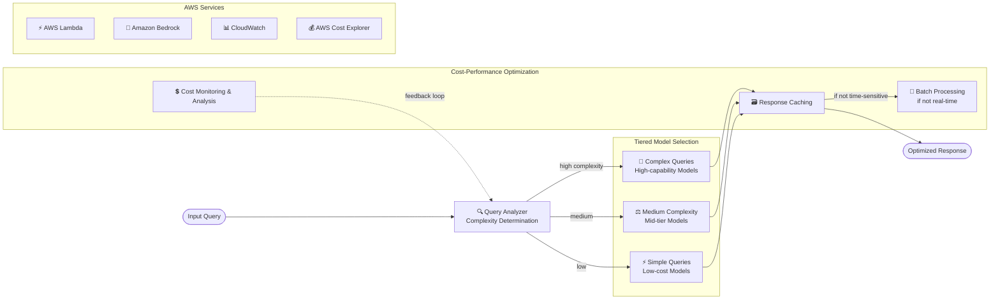

# Case Study 13 — Cost-Effective Model Selection Framework for GenAI

[← Back to Case Studies](./README.md)

| | |
|---|---|
| **Core concept** | A model-selection framework based on the cost–capability trade-off: tiered usage + intelligent routing + cost-saving inference patterns |
| **Related domains** | D4 (Operational Efficiency & Cost Optimization), D1 (FM Selection) |
| **Key services** | Bedrock (Model Evaluation, Intelligent Prompt Routing, batch, prompt/response caching), Lambda, CloudWatch, AWS Cost Explorer, cost allocation tags |

---

## 1. Use case summary

> As organizations increasingly bring GenAI into operational workflows, **managing & optimizing inference cost** becomes as important as traditional cloud cost. This case explores ways to **balance cost against performance requirements** when deploying GenAI on AWS.

Picture running a GenAI system whose inference bill spikes every month. The challenge: the most powerful model is expensive, but not every question needs it. Using a "premium" model to answer "where's my order?" is **burning money**. This case tests building a **cost–capability model-selection decision framework**: give easy work to cheap models, reserve the expensive model only for genuinely hard work.

### Requirements to solve

| # | Requirement | Why it's hard |
|---|---|---|
| R1 | **Right-size model by complexity** | Don't use an expensive model for basic tasks |
| R2 | **Systematically balance cost vs quality** | Define quality metrics + comparative testing + smart routing |
| R3 | **Measure price-to-performance** | Compute cost per unit of performance for data-driven decisions |
| R4 | **Cost-saving inference patterns** | Batch for non-real-time; caching for repeated queries |
| R5 | **Limits & stopping conditions** | Avoid runaway resource consumption |
| R6 | **Continuous optimization** | Track cost, adjust criteria with new data |

---

## 2. Architecture diagram

---

## 3. Why this architecture meets the requirements (Design Rationale)

### R1 → Right-sizing: tiered model usage by complexity

The core idea. The **Query Analyzer** determines complexity, then routes:

- **Simple queries** → small, cheap model (enough for straightforward requests).
- **Medium complexity** → mid-tier model (balances cost–capability).
- **Complex queries** → the most powerful but expensive model, **reserved for this scenario only**.

> ⚠️ **Common mistake:** don't use a powerful-expensive model for basic tasks. Tiering by complexity is the most direct way to cut cost.

### R2 → Balance cost vs quality: systematic evaluation

- **Define quality metrics**: clearly define "acceptable quality" per use case.
- **Comparative testing** (Bedrock Model Evaluation): test multiple models on quality metrics while tracking cost.
- **Intelligent routing** (Bedrock Intelligent Prompt Routing): route to the **cheapest model that meets the quality threshold**.

> ⚠️ **Common mistake:** "automatically route to the cheapest model that meets quality" → **Bedrock Intelligent Prompt Routing**, don't hand-write complex logic.

### R3 → Measure price-to-performance: cost allocation tags

Use **inference-level cost allocation tags** to track & analyze cost at a granular level. Define performance metrics → compute cost per unit of performance → create a decision matrix for **data-driven** model selection.

### R4 → Cost-saving inference patterns: batch + caching

- **Batch processing**: for **non-real-time** workloads, batch processing sharply cuts cost (e.g., generating product descriptions in a nightly job instead of on-demand when users view them).
- **Caching**: **response caching** for common queries + **prompt caching** → reduce inference calls.

> ⚠️ **Common mistake:** non-urgent work → **batch** (much cheaper); repeated queries → **caching**. Don't call real-time inference for everything.

### R5 → Limits & stopping conditions

Set **stopping conditions** and monitor execution patterns to avoid scenarios where workflows consume excessive resources or run beyond their useful purpose (runaway consumption).

### R6 → Continuous optimization: CloudWatch + Cost Explorer

- **AWS Cost Explorer** tracks inference cost & usage patterns.
- **CloudWatch** continuously evaluates model performance against metrics.
- Refine model-selection criteria with new data; track newly released models/prices that may affect the selection framework.

---

## 4. Alternatives & trade-offs

| Need | Right choice | Common wrong choice | Why |
|---|---|---|---|
| Basic tasks | **Small, cheap model** | The most powerful model | Burning money on simple work |
| Route by quality/cost | **Intelligent Prompt Routing** | Hand-write logic | Managed, routes to cheapest model meeting threshold |
| Pick a cheap-enough-good model | **Model Evaluation + cost tracking** | Pick by gut | Compares quality + cost |
| Non-real-time work | **Batch processing** | On-demand inference | Batch is much cheaper |
| Repeated queries | **Response/Prompt caching** | New call each time | Caching reduces inference calls |
| Track cost granularly | **Cost allocation tags + Cost Explorer** | Estimate | Data-driven decisions |

---

## 5. 💡 Lesson learned

> **When you face a problem with** **"optimize GenAI inference cost while keeping quality,"** immediately think: **tiered model usage + intelligent routing + batch/caching + measure price-to-performance.**

- **Tiered usage**: easy work → cheap model; reserve the expensive model only for genuinely hard work.
- **Intelligent Prompt Routing** = automatically route to the cheapest model meeting the quality threshold.
- **Batch** for non-real-time work; **caching** (response + prompt) for repeated queries.
- **Cost allocation tags + Cost Explorer** = granular cost measurement, data-driven decisions.
- **Stopping conditions** = guard against runaway consumption.
- Cost optimization is a **continuous process**, tracking new models/prices.

🔗 **Related:** [01. Bedrock](../01-basic-knowledge/01-amazon-bedrock-services.md) · [04. Compute & Deployment](../01-basic-knowledge/04-compute-deployment-services.md) · [Practice exam](../03-practice-exam/)
