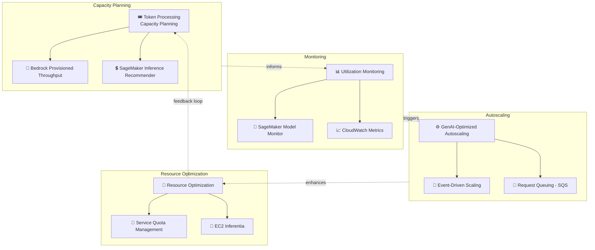

# Case Study 14 — Optimizing Resource Allocation for Foundation Model Workloads

[← Back to Case Studies](./README.md)

| | |
|---|---|
| **Core concept** | Capacity planning + utilization monitoring + auto-scaling optimized specifically for GenAI workloads (FinOps for FMs) |
| **Related domains** | D4 (Operational Efficiency & Cost), D2 (Integration) |
| **Key services** | SageMaker (Inference Recommender, Model Monitor), Bedrock (Provisioned Throughput, Cross-Region Inference), CloudWatch, EC2 Auto Scaling, EC2 Inferentia, SQS, Terraform (IaC) |

---

## 1. Use case summary

> **Financial market infrastructure** providers are migrating critical workloads to AWS and launching production GenAI. GenAI workloads have unique challenges versus traditional applications: they need **significant compute & memory**; **variable latency** during high inference demand; run under **specific throughput quotas**; and **don't follow conventional infrastructure patterns** → traditional FinOps is insufficient.

Picture running a GenAI platform for financial trading where demand **spikes at market open/close** and has **unexpected surges**. The challenge: GPUs are very expensive, throughput has hard limits, and the load pattern is unlike normal web. This case tests **capacity planning + monitoring + GenAI-specific auto-scaling**, not lifting traditional FinOps wholesale.

### Requirements to solve

| # | Requirement | Why it's hard |
|---|---|---|
| R1 | **Token-based capacity planning** | Must benchmark to pick the right instance for token demand |
| R2 | **Stable throughput beyond default quotas** | On-demand quotas aren't enough at peak |
| R3 | **Monitor prompt/completion patterns** | Measure token length, detect idle to scale down |
| R4 | **Auto-scaling for GenAI patterns** | Spiky load at market open/close + surprises |
| R5 | **Efficient hosting + hardware selection** | Pick the performance/cost-optimal instance for large models |
| R6 | **Infrastructure automation (IaC)** | Generate infrastructure configs from standard patterns |

---

## 2. Architecture diagram

---

## 3. Why this architecture meets the requirements (Design Rationale)

### R1 → Capacity planning: SageMaker Inference Recommender

**SageMaker Inference Recommender** runs **automated load testing** to assess model deployments under various loads, picks the performance/cost-optimal instance type, and considers both real-time and serverless inference. This **data-drives** instance selection instead of guessing.

> ⚠️ **Common mistake:** "benchmark to pick an instance for an FM" → **SageMaker Inference Recommender**.

### R2 → Stable throughput: Bedrock Provisioned Throughput + Cross-Region Inference

- **Provisioned Throughput** allocates dedicated infrastructure endpoints, achieving throughput that's **higher & more stable than default on-demand quotas** — fits critical workloads needing guarantees.
- **Cross-Region Inference profiles** distribute inference demand across regions to exceed limits.

> ⚠️ **Common mistake:** critical workloads needing **guaranteed, stable** throughput → **Provisioned Throughput**; temporarily exceeding quotas at peak → **Cross-Region Inference**.

### R3 → Monitoring: CloudWatch + Model Monitor

- **CloudWatch** tracks resource metrics, **measures prompt & response token length** to gauge utilization, detects **idle periods** to scale down/suspend endpoints.
- **SageMaker Model Monitor** continuously monitors performance & data quality.

### R4 → GenAI-specific auto-scaling: EC2 Auto Scaling + queuing + event-driven

- **EC2 Auto Scaling groups** behind load balancers for SageMaker endpoints; deploy larger instances **proactively** when throughput needs are predictable (e.g., market open/close).
- **Queuing (SQS)** between applications and models to **avoid request denial** when throughput is constrained.
- **Event-driven messaging** for high-demand architectures; scale up at peak, down off-peak; right-size to match capacity to actual usage.

> ⚠️ **Common mistake:** spiky GenAI load + constrained throughput → insert a **queue (SQS)** to not drop requests; combine scheduled scaling (market open/close) + on-demand surges.

### R5 → Hosting & hardware: EC2 Inferentia

Consider **EC2 Inferentia** (AWS's dedicated inference chip) for better performance/efficiency; for large models, scale & distribute load across multiple instances.

> ⚠️ **Common mistake:** optimizing cost/performance for hosting large models → consider **Inferentia**, don't default to expensive GPUs.

### R6 → Infrastructure automation: IaC (Terraform) + AI agents

Use **AI agents** to analyze application requirements & generate infrastructure configs; implement **IaC like Terraform** following established patterns while adapting to specific needs.

---

## 4. Alternatives & trade-offs

| Need | Right choice | Common wrong choice | Why |
|---|---|---|---|
| Pick instance for FM | **SageMaker Inference Recommender** | Guess manually | Load testing data-drives the decision |
| Guaranteed stable throughput | **Provisioned Throughput** | On-demand | On-demand isn't enough at critical peak |
| Temporarily exceed quotas | **Cross-Region Inference** | Buy more fixed capacity | Flexible distribution, cheap for spikes |
| Avoid dropping requests at peak | **Queuing (SQS)** | Call directly | Queue buffers load, no denial |
| Efficiently host large models | **EC2 Inferentia** | Default expensive GPUs | Dedicated inference chip saves cost |
| Infrastructure config | **IaC (Terraform)** | Click through the console | Repeatable, follows standard patterns |

---

## 5. 💡 Lesson learned

> **When you face a problem with** **"critical FM workloads + highly variable load + throughput limits + GPU cost optimization,"** immediately think: **Inference Recommender (capacity) + Provisioned Throughput/Cross-Region (throughput) + CloudWatch token monitoring + GenAI-specific auto-scaling (queue + event-driven) + Inferentia.**

- **Inference Recommender** = pick instances via load testing, not guessing.
- **Provisioned Throughput** for guaranteed throughput; **Cross-Region Inference** for spikes.
- **Monitor token length + idle periods** to right-size and scale down.
- **Queue (SQS)** between app and model to not drop requests at peak.
- **EC2 Inferentia** for cost-efficient hosting of large models.
- FinOps for GenAI is **different** from traditional FinOps — must be specific to tokens & throughput.

🔗 **Related:** [02. SageMaker](../01-basic-knowledge/02-sagemaker-services.md) · [04. Compute & Deployment](../01-basic-knowledge/04-compute-deployment-services.md) · [01. Bedrock](../01-basic-knowledge/01-amazon-bedrock-services.md) · [Practice exam](../03-practice-exam/)
