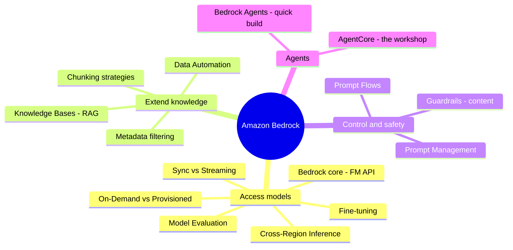

# 01. Amazon Bedrock Services

[← Basic Knowledge に戻る](./README.md)

> AWS で GenAI を行うための **中核** サービス群。**Amazon Bedrock** は *AI の頭脳（Foundation Model）のショッピングモール* と考えると分かりやすい。モデルを自前でホストせず、API 経由で「頭脳を選んで使う」だけ。その周りに RAG、安全性、prompt 管理、agent といったエコシステムが広がる。

## このカテゴリのマインドマップ

## クイックリファレンス

| サービス | 1 文の説明 | 関連 domain |
|---|---|---|
| Amazon Bedrock (core) | 多数の FM を呼べる統一 API、serverless | D1, D2 |
| Foundation Model & Fine-tuning | 「優秀な新卒」 vs 「大学院に通わせる」 | D1 |
| Model Evaluation | FM 性能を比較して選ぶ | D1, D5 |
| Cross-Region Inference | 推論を別 region に振る | D1, D4 |
| Knowledge Bases (RAG) | AI に社内文書で「オープンブック試験」を受けさせる | D1 |
| Data Automation | GenAI で乱雑な文書を読む | D1 |
| Guardrails | ガードレール: **CONTENT**（PII・有害）を制御 | D3, D1 |
| Prompt Management | 「prompt 用の Git」: versioning + 承認 | D1, D3 |
| Prompt Flows | 複数 prompt を連結（DAG、ドラッグ&ドロップ） | D1, D2 |
| Bedrock Agents | Console で素早く作る agent | D2 |
| AgentCore | agent を本番規模で動かす基盤（8 部品） | D2 |

---

## サービスカード

### Amazon Bedrock (core)

> **1 文の説明:** AI の頭脳の「ショッピングモール」。サーバ購入も学習も不要、API を呼ぶだけで Claude・Llama・Titan… を使える。

- **解決する問題:** **1 つの** API で多数の Foundation Model にアクセス。**Serverless** — API を呼んで結果を得て、使った分だけ支払う。
- **使うべきとき:** ほぼ全ての GenAI 案件はここから。高速 PoC、モデル切り替え。
- **使わないとき／混同しやすいもの:** OSS モデルを自前インフラで深くカスタマイズして自己ホストしたい → **SageMaker**。Bedrock は *managed* であり、ゼロから学習する場所ではない。
- **関連 exam domain:** D1, D2。
- **⚠️ 必ず覚える:**
  - **Sync vs Streaming:** *Synchronous* は回答全体を待つ。*Streaming* は token ごとに返す — chatbot は streaming 必須（ユーザーを待たせない）。
  - **2 つの料金モード:** **On-Demand**（従量課金） vs **Provisioned Throughput**（先払い、安定 latency）。**Spot は無い**。
  - **セキュリティ:** **VPC Endpoint (PrivateLink)** 経由で呼べばデータがインターネットに出ない。Bedrock はあなたのデータを第三者モデルの学習に使わないと明言。
  - **よくあるエラー:** Console で **「Request Model Access」** をしていない + IAM `bedrock:InvokeModel` 不足 → `AccessDeniedException`。
- **🧪 1 行の例:** 社内 chatbot が Bedrock 経由で Claude を `temperature=0` で呼び、安定回答を得る。

💰 深掘り: On-Demand vs Provisioned Throughput（試験頻出）

- **On-Demand（従量）:** タクシーのように距離（token 数）で支払う。**新規案件・スパイク型トラフィック・Dev/Test** に最適。ピーク時に遅くなることあり（共有キュー）。
- **Provisioned Throughput:** 24/7 で運転手付きの車を借りる感覚。先払い（通常 **1〜6 ヶ月コミット**）だが **latency が常に安定・キューなし**。**大規模で安定した本番、latency 一定が必要** な場合に最適。
- **問題例:** 「スタートアップ、トラフィック予測不能」→ On-Demand。「銀行が毎晩 10 万件の契約を処理、latency 安定必須、予算固定」→ Provisioned。
- **🔴 罠:** Bedrock に EC2 Spot のような料金は **無い**。上記 2 種のみ。

---

### Foundation Model (FM) & Fine-tuning

> **1 文の説明:** FM は「広く浅く知っている優秀な新卒」。Fine-tuning は「その新卒を自社の大学院に通わせる」こと。

- **解決する問題:** FM は一般知識（ネットの大半を「読んだ」）を持つが、**あなたの会社の機密データは知らない**。Fine-tuning はモデルの「重み」を調整し、文体・専門用語を吸収させる。
- **fine-tuning を使うべきとき:** prompt では解決できない **深い** ドメイン専門用語が必要なとき。
- **使わないとき／混同しやすいもの:** AI に **常に最新の社内知識** を持たせたい → **RAG (Knowledge Bases)** を使う。fine-tuning ではない。fine-tuning は **高価・遅く**、文書が変わるたびにやり直し。
- **関連 exam domain:** D1。
- **⚠️ 必ず覚える:** これは AWS **最古典の罠**。「社内知識を更新」と見たら、まず RAG、後で fine-tune。
- **🧪 1 行の例:** 2025 年の休暇規程に答える chatbot → RAG（PDF を差し替えるだけ）、fine-tune ではない。

---

### Amazon Bedrock Knowledge Bases (RAG)

> **1 文の説明:** AI に「オープンブック試験」を受けさせる。社内文書を読み込ませ、AI がそれを参照して答える（managed RAG）。

- **解決する問題:** 自動で **chunk → embed → vector 保存 → 検索** を行い、文書に基づいて答えさせ、hallucination を減らす。**fine-tuning 不要**。
- **仕組み:** 文書（PDF/Word）→「chunk 化」→ 数値 vector（embeddings）に変換 → Vector DB に保存。質問が来ると質問も vector 化 → **意味が最も近い** chunk を探す → prompt に注入して AI に渡す。
- **使うべきとき:** 高速で低コードな RAG。connector が **S3 / SharePoint / Confluence** に直結。
- **使わないとき／混同しやすいもの:** **fine-tuning**（知識を重みに焼き込む）と混同しない。RAG はモデルの「頭脳」をそのままに、「本を開く」だけ。
- **関連 exam domain:** D1。
- **⚠️ 必ず覚える:** **metadata filtering** は高速化と **アクセス制御** の両方に効く。**SEMANTIC vs HYBRID** は `OverrideSearchType` で選ぶ。
- **🧪 1 行の例:** S3 にある 1 万ページの PDF から、社内アシスタントが業務手順に答える。

✂️ 深掘り: 3 つの chunking 戦略 + metadata filtering

| 戦略 | やり方 | 長所 | 短所 | 向くもの |
|---|---|---|---|---|
| **Fixed-size** | N token ごとに切る | 速い・安い・単純 | 文の途中で切れ意味が壊れる | 短い Q&A/FAQ、独立した内容 |
| **Semantic** | 1 つの考え/段落を保つ | 文脈を保持 | 計算が重い、chunk が不揃い（短すぎ/context window 超え） | 契約書、法務文書 |
| **Hierarchical** | parent–child（章→節→項）で保存 | 広い文脈を捕捉 | 複雑、見出し構造が必要、検索が難しめ | 大型技術マニュアル（例: 車の整備書） |

- **Hybrid chunking（本番でよくある）:** Hierarchical で構造を保ち → Semantic で考え単位に切り → 最後に Fixed-size で上限（「1 chunk 500 token まで」）。
- **Metadata filtering:** 文書にタグ（`department=HR`, `year=2025`）を付け **事前フィルタ** → 高速 & **漏洩防止**（HR 担当が Finance の給与文書を見ない）。
- **Vector Embeddings:** 旧来の Google のようなキーワード一致ではなく、**意味**（vector 間距離）で検索。

---

### Amazon Bedrock Data Automation

> **1 文の説明:** 乱雑な文書のための「賢いアナリスト」。GenAI で文脈を理解する（単なるテキスト抽出ではない）。

- **解決する問題:** **構造が一定でない** 文書（多数のベンダーの請求書、診療記録…）からデータを抽出し、正規化 JSON を出力。「Amount Due」=「Total」=「Balance Due」を同一と理解する。
- **使うべきとき:** **不規則** データ、多様なフォーマット、AI に文脈理解が必要。
- **使わないとき／混同しやすいもの:** プレーンテキストや **100% 固定フォーム** をデジタル化 → **Amazon Textract**（速い・安い・安定）。Data Automation は遅く高価だが「賢い」（内部で Textract を使い FM で解析することが多い）。
- **関連 exam domain:** D1。
- **⚠️ 必ず覚える:** 「固定フォーム/テキスト抽出」→ Textract。「多様で乱雑/文脈理解」→ Data Automation。
- **🧪 1 行の例:** 500 ベンダーから異なるレイアウトの請求書を受け取るシステム → Data Automation が `{"total_due": 500000}` に統一。

---

### Amazon Bedrock Guardrails

> **1 文の説明:** AI の安全ガードレール。**CONTENT** を制御 — 有害語をブロックし、PII をマスクする。

- **解決する問題:** 憎悪/侮辱/性的/暴力（low/medium/high）をフィルタ、**PII マスク**、禁止トピックのブロック、prompt injection 防御。モデルをまたいで一律適用。
- **使うべきとき:** 出力がエンドユーザーに届く可能性。「最小の開発工数」で PII をブロックしたい。
- **使わないとき／混同しやすいもの:** **🔑 Guardrails は CONTENT を制御。ACTION（agent がどの tool を呼べるか）の制御は AgentCore Policy の役目**（後述）。これが古典的な罠ペア。
- **関連 exam domain:** D3（主）, D1。
- **⚠️ 必ず覚える:** *managed* サービス → 「最小の開発工数」と書かれたら手書き regex より優先。**防止（block）** と **アラートのみ（CloudWatch）** を区別。
- **🧪 1 行の例:** 保険 chatbot が PII フィルタ + 禁止トピックを有効化し、証券番号を漏らさない。

---

### Amazon Bedrock Prompt Management

> **1 文の説明:** 「prompt 用の Git」。version・変数・本番前の承認ワークフローを管理。

- **解決する問題:** prompt を **ソースにハードコードしない**。クラウドに保存し version 管理（v1, v2）、ARN で呼ぶ。承認ワークフローあり。
- **使うべきとき:** ガバナンスが必要な多数アプリの企業。非 IT チームがコード再デプロイなしで prompt を編集。
- **使わないとき／混同しやすいもの:** この managed サービスがあるのに自前 Git CI/CD や DynamoDB で prompt 管理を作らない（Pro 試験の罠）。
- **関連 exam domain:** D1, D3。
- **⚠️ 必ず覚える:** prompt 変更 = Console で version を変える。backend の再デプロイではない。
- **🧪 1 行の例:** 50 アプリが version + 承認付きの prompt ライブラリを共有 → Prompt Management + CloudTrail 監査。

---

### Amazon Bedrock Prompt Flows

> **1 文の説明:** 複数の AI ステップを **DAG**（有向非巡回グラフ）にドラッグ&ドロップで連結。orchestration コードを書かない。

- **解決する問題:** **分岐付きの線形・複数ステップ AI フロー**（例: テキスト受信 → 分類 → 要約 → 返信生成）、再利用可能な部品、前後処理。
- **使うべきとき:** 明確で一方向、条件分岐のあるフロー。
- **使わないとき／混同しやすいもの:** **柔軟に推論して tool を選ぶ** agent が必要 → Bedrock Agents/AgentCore。数日にわたる long-running な状態管理 → Step Functions。
- **関連 exam domain:** D1, D2。
- **⚠️ 必ず覚える:** DAG = 一方向、開始/終了あり、**ループで戻らない**。
- **🧪 1 行の例:** 顧客メール → 感情分析 →（ネガ）謝罪文作成 /（ポジ）Slack に投稿。

---

### Amazon Bedrock Agents

> **1 文の説明:** 「組み立て済みおもちゃ」。Console で自律 AI agent を素早く作れる。orchestration コード不要。

- **解決する問題:** AI が推論し、どの tool を呼ぶか判断。次の 4 つを与える:
  - **Instructions:** *必須* — 「サポート担当として振る舞え…」。
  - **Action groups:** *任意* — 行動用の API/Lambda（航空券予約、ticket 作成）。
  - **Knowledge bases:** *任意* — 参照データ。
  - **Guardrails:** *任意* — 不正コンテンツ/PII をブロック。
- **使うべきとき:** Console で **素早く設定** する中規模タスクの agent。
- **使わないとき／混同しやすいもの:** カスタム framework（LangGraph/CrewAI）、long-running、大規模が必要 → **AgentCore**。
- **関連 exam domain:** D2。
- **⚠️ 必ず覚える:** **Instructions** が無いと保存不可。他は無くても動くが「機能低下」（KB 無し→hallucination、Action 無し→喋るだけ、Guardrails 無し→jailbreak されやすい）。
- **🧪 1 行の例:** 顧客対応の予約 agent: Instructions + Action group（予約 API） + KB（規程） + Guardrails。

---

### Amazon Bedrock AgentCore

> **1 文の説明:** Bedrock Agents が「組み立て済みおもちゃ」なら、**AgentCore は機械工房** — agent を **本番規模** で動かす基盤。framework 非依存・モデル非依存。

- **解決する問題:** 複雑なエンタープライズ級 agent を運用。**8 つのモジュール部品** で構成。
- **使うべきとき:** long-running agent、複雑な状態、カスタム framework、本番級のセキュリティ/可観測性。
- **使わないとき／混同しやすいもの:** 小タスク・素早い設定 → Bedrock Agents。
- **関連 exam domain:** D2（主）。*メモ: AgentCore は Domain 2 寄り。Bedrock ファミリーの一部としてここに配置。*

#### AgentCore の 8 コンポーネント

| コンポーネント | 1 行 | 覚える/罠 |
|---|---|---|
| **Runtime** | 専用 agent ランタイム、隔離 microVM | session 最大 **8 時間**（Lambda は 15 分） |
| **Memory** | 短期（session） + 長期（要約 → Vector DB） | 長期は session をまたぐ |
| **Gateway** | API/Lambda を agent の「tool」に変換 | OpenAPI Schema/MCP で **新 tool を自動発見**、コード変更不要 |
| **Identity** | agent がユーザー **本人に代わって** 行動 | 一時 token（**AWS STS**）、パスワードのハードコードなし |
| **Code Interpreter** | agent が Python を書いて実行する sandbox | 正確な計算/ファイル処理向け（AI の計算ミス回避） |
| **Browser** | agent 用の仮想ブラウザ | partner に API が無い時の web 自動化・フォーム入力・CAPTCHA |
| **Observability** | 各ステップ・token・latency を trace/log | 本番デバッグ。**⚠️ ログへの PII 漏洩リスク** |
| **Policy** | Cedar — **ACTION**（呼べる tool）を制御 | default-deny、forbid-wins、例「refund < $500」 |

> **🔑 最重要の罠ペア:** **Guardrails = CONTENT 制御**（有害語フィルタ、PII マスク）。**AgentCore Policy (Cedar) = ACTION 制御**（delete-DB や 1 万ドル超の取引を agent にさせない）。

🔬 深掘り: 各コンポーネント（「もし…なら」シナリオ）

- **Runtime が 8 時間超えたら?** 8 時間超でタイムアウト。agent に「徹夜」させず、**Step Functions** で大タスクを小タスクに分割し Runtime を繰り返し呼ぶ（堅牢で安価）。
- **Memory 短期 vs 長期:** 短期 = 1 session 内の全チャット、アプリを閉じると消える。長期 = 背景の AI が **要約・事実抽出**（「ユーザーは Minh、ピーナッツアレルギー」）して Vector DB に保存、次 session で semantic 検索。
- **Gateway の「tool 自動発見」:** API + OpenAPI Schema を Gateway に宣言 → Gateway が FM 用の Tool に変換。IT が新 API を挿せば agent が見て使う。**agent のコード変更不要**。
- **Code Interpreter に sandbox が必要な理由:** 攻撃者が prompt injection で AI にデータ削除/パスワード窃取のコードを書かせ得る。sandbox は隔離された箱、外部ネットワーク無し、実行後に **自己破壊** → マルウェアは空箱を壊すだけ。
- **Browser とパスワード/CAPTCHA:** AI はパスワードを **保持しない** — **Secrets Manager** や OAuth 2.0 から取得し headless browser に注入。CAPTCHA: マウス/User-Agent をシミュレート + 簡単な画像は vision モデルで。銀行級セキュリティはなお弾く場合あり（技術的限界）。
- **Identity のなりすまし対策:** **STS** で一時 token（15 分〜1 時間）。IAM が暗号署名を検証 → ID を知ってもシークレットキーが無ければ偽装不可。
- **Observability と PII:** ログは **CloudWatch Logs** に（保持期間は設定、GB あたり課金）。⚠️ ユーザーの「card 4508…」がログに入り得る → **CloudWatch Logs Data Protection**（*** でマスク）か **Guardrails** で記録前に PII マスク。
- **Evaluations（確度メモ）:** AWS ドキュメントは **Policy/Runtime/Memory/Gateway/Identity/Code Interpreter/Browser/Observability** を明確に確認できる。「**Evaluations**」は一部の最近の記事に出るが、独立した命名サービスとしては **確認できなかった**。概念自体は実在し有用: **Golden Dataset**（SME による [質問]–[期待回答] のペア） + **👍/👎 feedback loop** で agent を評価/A-B テスト、規程変更時に更新（陳腐化回避）。

---

### Model Evaluation & Cross-Region Inference（まとめ）

> Bedrock のよく使う 2 機能。より深いメモは後日追加。

- **Model Evaluation:** 複数 FM を標準タスクでベンチマーク（accuracy、latency、throughput、cost）して、勘ではなく TCO で選ぶ。(D1, D5)
- **Cross-Region Inference (CRIS):** 推論を自動で別 region に振り、**モデル層** で可用性/throughput を上げる。⚠️ CRIS **≠** システム全体の DR — スタック全体の障害に耐えるには **multi-region + Route 53 health check + failover** も必要。(D1, D4)

---

## 「試験の武器」比較表

| 状況 / キーワード | 選ばない（罠） | 選ぶ（正解） |
|---|---|---|
| 社内文書（PDF/Word）から答えるアシスタント | Fine-tuning | **Knowledge Bases (RAG)** |
| 数千の異なるフォーマットの請求書から抽出 | Textract（固定フォーム） | **Data Automation** |
| 固定フォームを速く安くデジタル化 | Data Automation | **Textract** |
| AI に PII を漏らさせない/暴言させない | AgentCore Policy | **Guardrails**（content） |
| agent に delete-DB / 1 万ドル超の取引をさせない | Guardrails | **AgentCore Policy**（Cedar, action） |
| Console で素早く組む agent | AgentCore | **Bedrock Agents** |
| カスタム framework・long-running・大規模 agent | Bedrock Agents | **AgentCore Runtime** |
| agent タスクが 8 時間超 | Runtime をぶっ通しで実行 | **Step Functions** で分割し Runtime を繰り返し呼ぶ |
| 数ヶ月にわたりユーザー嗜好を覚える | session memory | **AgentCore Memory**（長期） |
| agent が CSV を安全に Python 解析 | 本番サーバで実行 | **AgentCore Code Interpreter**（sandbox） |
| 分岐ありの線形・複数ステップ AI フロー | Step Functions（汎用すぎ） | **Prompt Flows** |
| prompt の version + 承認 | ハードコード/自前 Git | **Prompt Management** |
| 大規模・安定アプリ、latency 一定 | On-Demand | **Provisioned Throughput** |
| スタートアップ、スパイク型/Dev-Test | Provisioned | **On-Demand** |

## ⚠️ よくある罠（まとめ）

- 「社内知識を更新」→ **RAG**、fine-tune ではない（罠 #1）。
- **Guardrails（content） vs Policy（action）** — このペアを覚える。
- **Bedrock に Spot 料金は無い** — On-Demand と Provisioned のみ。
- **AgentCore Runtime は最大 8 時間** — 超えるなら Step Functions と併用。
- **Observability は PII を漏らし得る** — Data Protection / Guardrails マスクを有効化。
- リアルタイム chatbot → **Streaming**、Synchronous ではない。

## 関連 exam domain

このグループは **D1 (31%)** と **D2 (26%)** を厚くカバーし、**D3**（Guardrails）、**D4**（CRIS, cost）、**D5**（Model Evaluation）に触れる。[対応表](./README.md#service--5-exam-domain-対応表) を参照。

🔗 **関連:** [Case studies](../02-case-studies/) · [Practice exam](../03-practice-exam/) · [02. SageMaker →](./02-sagemaker-services.md)
