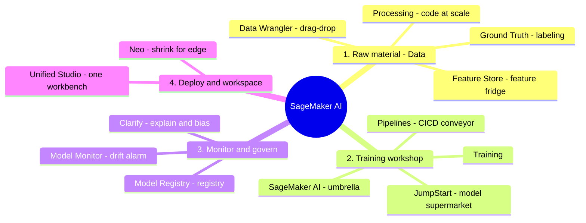

# 02. SageMaker Services

[← Basic Knowledge に戻る](./README.md)

> **Bedrock が「レストラン」**（注文 = API を呼んで食べる）なら、**SageMaker は「業務用厨房」** — データをこね、学習し、モデルを自分でパッケージしたいエンジニア向け。
> **合言葉:** SageMaker は単一ツールではなく **pipeline**。試験問題は通常、壊れた/最適化が必要な「1 つの工程」を描写し、その工程に正しいサービスを答えさせる。

## このカテゴリのマインドマップ（ML ライフサイクル順）

## クイックリファレンス

| サービス | 1 文の説明 | 関連 domain |
|---|---|---|
| SageMaker AI (core) | モデルを学習/ホストする「傘」（SageMaker の新名称） | D1, D2 |
| Ground Truth | データラベリング部隊（+ 自動ラベリング） | D1 |
| Data Wrangler | **ドラッグ&ドロップ** でデータ整形（visual, no-code） | D1 |
| Processing | **コード/Spark** で大規模データを処理する「トラクター」 | D1 |
| Feature Store | 再利用可能な feature の「冷蔵庫」 | D1 |
| JumpStart | OSS モデルの「スーパー」（Llama, FLAN-T5, Stable Diffusion） | D1, D2 |
| Pipelines | ML の CI/CD を自動化する「ベルトコンベア」 | D2, D5 |
| Model Registry | 「登記簿」: version + 承認 + lineage | D1, D5 |
| Model Monitor | 本番で drift を見張る「警備員」 | D5 |
| Clarify | 「監査官」: explainability + bias | D3, D5 |
| Neo | edge/IoT 向けにモデルを縮める「チューナー」 | D4（周辺） |
| Unified Studio | 「オールインワン作業台」 + AI がコードを書く | D2 |

---

## グループ 1 — 原材料（Data）

### Amazon SageMaker Ground Truth

> **1 文の説明:** 「ラベリング部隊」。実在の人にデータを箱囲み/ラベル付けさせて AI を教える。簡単なものは AI 補助で安く。

- **解決する問題:** ラベル付きデータセットを作る（例: 5 万枚の交通画像でバイク/車を箱囲み）。自社スタッフや Mechanical Turk で。
- **使うべきとき:** computer vision/NLP 用の高品質ラベルデータが必要。
- **使わないとき／混同しやすいもの:** これは **ラベリング** 工程。整形（Data Wrangler/Processing）とは別。
- **関連 exam domain:** D1。
- **⚠️ 必ず覚える（お金のポイント）:** **Automated Data Labeling** = AI が「易しい」サンプルを自動ラベル、「難しい」ものだけ人へ → **ラベリングコスト削減**。
- **🧪 1 行の例:** 自動運転案件で歩行者の bounding box を描く。

🔬 深掘り: 「易しい/難しい」をどう判定?（Active Learning）

**Active Learning** は「感覚」ではなく **Confidence Score** を使う:
1. 人が最初の 1,000 件をラベル → Ground Truth が小さな *labeling model* を学習。
2. そのモデルが次のサンプルに confidence 付きで予測。
3. confidence **≥ 閾値**（例 90%）→ 自動採用（「易しい」）。**< 閾値**（例 45%）→ 人へ（「難しい」）。
4. 人が難しいものをラベル → モデル再学習 → 徐々に人手が減る。

### Amazon SageMaker Data Wrangler

> **1 文の説明:** **ドラッグ&ドロップ** でデータ整形（visual、ほぼノーコード）。

- **解決する問題:** S3 から接続し、空列削除、ゴミ除去、正規化をマウスで。
- **使うべきとき:** **小さなサンプル** で探索し「レシピ」（pipeline）を作る。
- **使わないとき／混同しやすいもの:** 巨大データ（テラバイト）→ ドラッグ&ドロップが固まる → **Processing**。
- **関連 exam domain:** D1。
- **⚠️ 必ず覚える:** Wrangler は S3 / **Feature Store** / Python スクリプト・Pipeline に **export** 可。ベスト MLOps: サンプルでレシピを作り、Processing で全量実行。
- **🧪 1 行の例:** 100 枚のサンプル画像をドラッグ&ドロップで余分な GPS 列削除 + timestamp 正規化。

### Amazon SageMaker Processing

> **1 文の説明:** 「データトラクター」。Python/Spark コードを渡すと cluster を立てて巨大データを処理し、終わると落ちる。

- **解決する問題:** **大規模データ（テラバイト）** の前後処理、feature engineering、モデル評価。
- **使うべきとき:** スクリプトと自動化が必要な重い処理。通常 Pipeline 内の 1 ステップ。
- **使わないとき／混同しやすいもの:** サンプルへの軽いドラッグ&ドロップ → Data Wrangler。
- **関連 exam domain:** D1。
- **⚠️ 必ず覚える:** 重いジョブは **Managed Spot** を有効化して On-Demand 比 **最大 ～90%** 削減。
- **🧪 1 行の例:** 50TB の dashcam 画像を学習前に解凍 + 1080p にリサイズ。

### Amazon SageMaker Feature Store

> **1 文の説明:** 全チームが再利用する、計算済み **feature** の共有「冷蔵庫」。再計算を避ける。

- **解決する問題:** feature（例 `user_failed_logins_last_5_mins`）を明確な schema で保存・共有。チーム間の重複作業を回避。
- **使うべきとき:** 多くのモデル/チームが共有 feature を必要。推論時に **リアルタイム** feature 取得が必要。
- **使わないとき／混同しやすいもの:** 生ファイル（画像/ログ/動画）の保存 → **S3**。Feature Store ではない。
- **関連 exam domain:** D1。
- **⚠️ 必ず覚える:** **Online Store** = **< 10ms** のリアルタイム（例: カード利用時の不正検知）。**Offline Store** = 学習用（内部は S3）。
- **🧪 1 行の例:** カード利用時、AI が Online Store から `failed_logins_5m` を 0.1 秒で取得し不正判定。

🔬 深掘り: Feature Store vs S3 と「data swamp」対策のガバナンス

| 基準 | Amazon S3 | Feature Store |
|---|---|---|
| データ種別 | 何でも（画像/動画/生ログ） | 計算済み **feature** のみ（数値/文字列） |
| 速度 | 数十 ms〜秒 | **Online < 10ms** |
| 構造 | 乱雑、何でも投入 | 厳格な **schema** 型付け |

ガバナンス（data swamp 対策）: (1) 厳格 schema で **Feature Group** を作る; (2) 名前・式・所有者の **metadata/catalog** で発見と正しい利用; (3) timestamp による **versioning/time-travel** — 旧モデルは当時の feature 値を取得。

---

## グループ 2 — 学習工房

### Amazon SageMaker AI (core)

> **1 文の説明:** 全 SageMaker サービスを覆う「傘」。モデルを学習/ホストするサーバとアルゴリズムを提供。これは Amazon SageMaker の **新名称**（re:Invent **2024 年後半** に改名）。

- **解決する問題:** build → train → deploy のフルライフサイクル ML プラットフォーム。
- **使うべきとき:** 学習/ホスティングを深く制御したい（Bedrock の API 呼び出しだけとは違う）。
- **使わないとき／混同しやすいもの:** infra 管理なしで素早く FM を呼びたい → Bedrock。
- **関連 exam domain:** D1, D2。
- **⚠️ 必ず覚える:** 改名で中核アーキは壊れていない。「Amazon SageMaker AI」+「Unified Studio」は 2024 後半の大改編、サブサービスの役割は維持。
- **🧪 1 行の例:** SageMaker の GPU cluster で不正検知モデルを学習。

### Amazon SageMaker JumpStart

> **1 文の説明:** 「モデルのスーパー」。出来合いの OSS Foundation Model（Llama, FLAN-T5, Stable Diffusion）をゼロから作らず入手。

- **解決する問題:** SageMaker 内で出来合いモデルを素早くデプロイ/fine-tune。
- **使うべきとき:** モデルを **自分の endpoint** で **完全制御** して深く調整したい。
- **使わないとき／混同しやすいもの:** **JumpStart**（他人のモデルのスーパー）と **Model Registry**（**社内** モデルの登記簿）を混同しない。Bedrock とも違う: JumpStart は **自分の SageMaker endpoint** にデプロイ（instance を自分で管理）、Bedrock は token 従量・完全 managed。
- **関連 exam domain:** D1, D2。
- **⚠️ 必ず覚える — モデル選定基準:** *task 別*（要約→FLAN-T5/BART、画像→Stable Diffusion、多言語 chat→Llama/Mistral）、*パラメータ数*（7–8B 速い安い vs 70B+ 賢い高い）、*context window*（4K vs 128K/200K）、**ライセンス**（商用は Apache 2.0/MIT が必要）。
- **🧪 1 行の例:** JumpStart の Llama を取り、ベトナム語 chatbot 用に fine-tune して自前 endpoint にデプロイ。

---

## グループ 3 — 監視・ガバナンス・説明（試験重点）

### Amazon SageMaker Pipelines

> **1 文の説明:** ML ステップを自動プロセスに連結する「ベルトコンベア」 — **Machine Learning の CI/CD（MLOps）**。

- **解決する問題:** ingest → process → train → evaluate → register → deploy を手作業ではなく自動化。
- **使うべきとき:** 定期再学習 / 新データ時 / Model Monitor のアラーム時。
- **使わないとき／混同しやすいもの:** 推論する GenAI agent の orchestration → Bedrock Agents/Step Functions。Pipelines ではない。
- **関連 exam domain:** D2, D5。
- **⚠️ 必ず覚える:** **CI** = コード/データ変更で自動再実行。**CD** = **Model Registry の承認ステップ** 経由で管理デプロイ（壊れたモデルを本番に出さない）。
- **🧪 1 行の例:** Monitor が drift アラーム → Pipeline 起動 → 数時間後に v5.0 が自動リリース。

🔬 深掘り: 不正検知の MLOps コンベア

1. **Processing** — S3 からデータ取得、クリーニング。
2. **Training** — GPU cluster で学習。
3. **Evaluation**（Processing + **Clarify**） — accuracy < 95% で Pipeline 停止 + 通知。通過すれば継続、Clarify が bias チェック。
4. **Model Registry** — v5.0 を登録、status *Pending Approval*。
5. **Approval & Deploy** — 人が承認 → CD が **SageMaker Endpoint** を自動更新。

### Amazon SageMaker Model Registry

> **1 文の説明:** 「モデルの登記簿/GitHub」。version、作成者、status を管理し、使用前に **承認** が必要。

- **解決する問題:** 社内モデルのライフサイクル（v1, v2, v3）、lineage、承認（Dev → Prod）を管理。
- **使うべきとき:** 多人数・多モデルで、本番にどれが居るか把握。
- **使わないとき／混同しやすいもの:** 他人のモデル入手 → JumpStart。これは **自社** モデル管理。
- **関連 exam domain:** D1, D5。
- **⚠️ 必ず覚える:** **rollback** は `git revert` ではない — v3 を **Rejected** にして Endpoint config を **v2** に戻す。**Model Lineage** が由来（どのデータ・コード版・誰が承認）を追跡 → 監査の透明性。
- **🧪 1 行の例:** v3 が本番で失敗 → v3 を Reject、安定版 v2 にトラフィックを戻す。

### Amazon SageMaker Model Monitor

> **1 文の説明:** 「門番」。本番のモデルを見張り、精度が落ちたら（CloudWatch で）警報を鳴らす。

- **解決する問題:** 実世界データが学習データから乖離する **drift** を検知。
- **使うべきとき:** モデル稼働中、24/7 の健全性監視が必要。
- **使わないとき／混同しやすいもの:** **Monitor は結果が drift した *とき*（症状）に警報**。**Clarify は *根本原因*（bias/理由）を見つける**。混同しやすいペア。
- **関連 exam domain:** D5。
- **⚠️ 必ず覚える:** 原因が何であれ、最終的な対処は新データでの **Pipeline 再学習**。
- **🧪 1 行の例:** 2020 年データに対し 2024 年に住宅価格が急騰 → Monitor が drift を検知 → 再学習。

🔬 深掘り: Data Drift vs Concept/Model Drift

- **Data Drift:** モデルは正常、「世界」が変わった — **入力** 分布がシフト（平均所得 10M→20M）。検知: 現在分布 vs **baseline** を比較。
- **Concept/Model Drift:** 入力は不変だが **ルール** が変わった（「マスクを買う」2019=医療、2026=ファッション）。検知: 実際の **ground-truth ラベル** と予測を比較する必要。

### Amazon SageMaker Clarify

> **1 文の説明:** 「公正監査官」。AI が **なぜ** その判断をしたか説明（explainability）し、**bias** を検知。

- **解決する問題:** 各要因の判断への寄与を説明。sensitive group 間の不均衡を測定。
- **使うべきとき:** 融資拒否の理由を顧客に説明する。性別/年齢差別が無いかチェック。
- **使わないとき／混同しやすいもの:** Clarify = **根本原因**。Model Monitor = **症状/drift**。
- **関連 exam domain:** D3（bias/responsible AI）, D5。
- **⚠️ 必ず覚える:** **Shapley Values (SHAP)** や **Partial Dependence Plots (PDP)** を見たら → 99% **Clarify**。bias は **DPL (Difference in Proportions of Labels)** などの統計指標で **sensitive facet**（例: Gender 列）に対し測定。
- **🧪 1 行の例:** ある申請が 70% 延滞、30% 低所得で拒否（SHAP で説明）。

🔬 深掘り: SHAP & PDP

- **Shapley Values (SHAP):** *ゲーム理論* 由来 — 各 feature の「寄与度」を算出（「所得」50%、「延滞」40%、「年齢」10%）。
- **PDP (Partial Dependence Plot):** 他を固定し 1 要因だけ変える（例 Age 20→60）と結果確率の曲線がどう動くか。
- **Bias (DPL):** 男性 vs 女性の承認率を比較（他条件同一）、差が大きすぎれば bias 警報。Clarify は **統計的不均衡** を見るだけで、性別を「理解」はしない。

---

## グループ 4 — デプロイ & 作業環境

### Amazon SageMaker Neo

> **1 文の説明:** 「車のチューナー」。重いモデルを compile/最適化し、小さな edge/IoT/mobile でも滑らかに動かす。

- **解決する問題:** 対象ハード向けに compile、RAM/latency を削りつつ精度はほぼ維持。
- **使うべきとき:** 監視カメラ、IoT、mobile にモデルを収める。
- **使わないとき／混同しやすいもの:** Neo は **ハード向け compile**、Processing（**データ処理**）とは別。
- **関連 exam domain:** D4 — *かつこの GenAI 認定では周辺寄り、学習優先度は低い。*
- **⚠️ 必ず覚える:** Neo の確実な手法は **対象ハード向け compile 最適化 + Quantization**（Float-32 → Int-8 に丸め、約 4 倍軽量化）。*確度メモ:* 元ノートには「Pruning」もあるが、これが Neo の命名機能かは **不確か**（pruning は通常別の圧縮手法）。試験で pruning を Neo の識別子として扱わないこと。
- **🧪 1 行の例:** 物体検知モデルを縮め、交差点カメラで動かす。

### Amazon SageMaker Unified Studio

> **1 文の説明:** 「オールインワン作業台」。Athena/SageMaker/Bedrock を 1 画面に集約、AI（Amazon Q）が横でコードを書く。

- **解決する問題:** data engineer + ML + GenAI 向けの統合 IDE。**open lakehouse アーキ** 上に構築。
- **使うべきとき:** 多ツール作業を 1 箇所でシームレスに。
- **使わないとき／混同しやすいもの:** これは **workspace/UI**、処理エンジンではない。
- **関連 exam domain:** D2。
- **⚠️ 必ず覚える:** キーワードは **Open Lakehouse** + **AI code generation (Amazon Q)**。
- **🧪 1 行の例:** 「VIP 顧客を絞る SQL を書いて」と打つと Q が生成し実行。

🔬 深掘り: なぜ Lakehouse は S3 を高速クエリできるか

Lakehouse = Data Lake（S3、安い、生） + Data Warehouse（高速クエリ）、S3 上に重ねる 2 技術で実現:
- **Columnar storage (Parquet):** **列** 単位で保存 → 「Revenue」合計は当該列のみ読み、無関係な 90% をスキップ。
- **Open Table Format (Apache Iceberg / Delta Lake):** metadata の「スーパー索引」 → SQL がまず索引を読み、2026 年 5 月のデータを持つ数ファイルへ直行、数百万を飛ばす。
→ 安い S3 ストレージで warehouse 並みの高速クエリ。

---

## 「試験の武器」比較表

| 状況 / キーワード | 選ばない（罠） | 選ぶ（正解） |
|---|---|---|
| visual・ドラッグ&ドロップのデータ整形（no-code） | Processing | **Data Wrangler** |
| 巨大バッチ（テラバイト）をスクリプトで | Data Wrangler | **Processing**（+ Managed Spot） |
| なぜそう判断したか説明/bias チェック | Model Monitor | **Clarify**（SHAP, PDP, DPL） |
| 本番で精度低下（drift）を警報 | Clarify | **Model Monitor** |
| 出来合い GenAI モデル取得（Llama, FLAN） | Model Registry | **JumpStart** |
| 社内モデルの version 管理（Dev→Prod） | JumpStart | **Model Registry** |
| edge/IoT で動かすためモデル最適化 | Processing | **Neo** |
| train→deploy 全体を自動化（CI/CD） | 手作業 | **Pipelines** |
| 再利用 feature を保存、リアルタイム < 10ms | S3 | **Feature Store**（Online） |

## ⚠️ よくある罠（まとめ）

- **Data Wrangler（マウス） vs Processing（コード）** — 規模で決める。
- **Clarify（原因/bias） vs Model Monitor（症状/drift）** — 古典ペア。
- **JumpStart（他人のモデル） vs Model Registry（社内モデル）**。
- 重いジョブの節約 → **Managed Spot**（～90%）。
- どんな drift も最終解は **Pipelines で再学習**。
- SHAP/PDP/DPL が出たら → **Clarify**。

## 関連 exam domain

**D1**（data pipeline、FM customization/lifecycle）と **D5**（testing/validation/troubleshooting: Monitor, Pipelines, Registry）を厚くカバーし、**D2**（deploy）と **D3**（Clarify bias）に触れる。[対応表](./README.md#service--5-exam-domain-対応表) を参照。

🔗 **関連:** [Case studies](../02-case-studies/) · [Practice exam](../03-practice-exam/) · [← 01. Bedrock](./01-amazon-bedrock-services.md) · [03. AI/ML Supporting →](./03-ai-ml-supporting-services.md)
