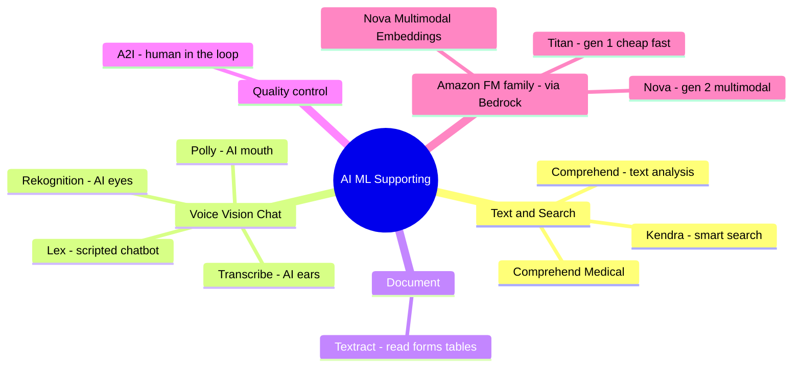

# 03. AI/ML Supporting Services

[← Basic Knowledge に戻る](./README.md)

> 「優秀な脇役」 — AWS の **従来型** AI サービス（長く存在）。AIP-C01 は純粋な GenAI だけでなく、**従来型 AI + FM を組み合わせて** コスト・性能が最適なアーキを作れるかを問う。
>
> **「ハンマーとメス」ルール:** FM（Claude, Nova）は高価な万能「メス」。釘を打つだけ（感情分析、画像内の人数カウント）なら「ハンマー」（Comprehend, Rekognition）を使う — 速く・安く・構造化出力。従来型 AI は通常 **前処理** 層、FM は深い推論の中核。

## このカテゴリのマインドマップ

## クイックリファレンス

| サービス | 1 文の説明 | 関連 domain |
|---|---|---|
| Comprehend | テキスト解析: 感情、entity、PII | D1, D2 |
| Comprehend Medical | 医療特化の Comprehend | D1, D3 |
| Kendra | semantic 検索エンジン（文書を返す、生成しない） | D1, D2 |
| Lex | スクリプト型 chatbot/voicebot（intent + slot） | D2 |
| Rekognition | 「AI の目」: 画像/動画解析、content moderation | D1, D3 |
| Transcribe | 「AI の耳」: speech-to-text + speaker diarization | D1 |
| Polly | 「AI の口」: text-to-speech | D2 |
| Textract | フォーム/表/OCR を読む（固定フォーム） | D1 |
| A2I (Augmented AI) | 低 confidence 時に human-in-the-loop | D3, D5 |
| Amazon Titan | Amazon の「第 1 世代」FM（安い、速い） | D1 |
| Amazon Nova | Amazon の「第 2 世代」multimodal FM + embeddings | D1 |

---

## Text & Search

### Amazon Comprehend

> **1 文の説明:** 「テキスト解析の専門家」。文章を読み、構造化された洞察（JSON）を抽出。

- **解決する問題:** Sentiment（pos/neg/neutral）、Entity Recognition（人名/日付/地名）、Language Detection、Topic Modeling、**PII detection/redaction**。
- **使うべきとき（FM の代わりに）:** **大量・ミリ秒速度・低コスト・100% きれいな JSON** が必要なとき。FM は単純分類には高く遅く、「饒舌」になって JSON を壊し得る。
- **使わないとき／混同しやすいもの:** *文章を書く*、皮肉を理解、未知の文書を分類 → FM（Bedrock）。Comprehend は **抽出** のみ、「作文」しない。
- **関連 exam domain:** D1, D2。
- **⚠️ 必ず覚える:** 出力が決まっている（sentiment/entity）→ Comprehend を優先。フロー内で Comprehend の **PII Redaction** は FM にマスクさせるより安く確実。
- **🧪 1 行の例:** Bedrock に送る前に、文字起こしのクレカ番号を `***` でマスク。

🏥 Amazon Comprehend Medical

医療特化に学習された Comprehend: 乱雑な記録を読み、**症状・薬剤・用量・習慣** を正確に抽出。記録に FM を使うのは *要約* や *患者向け指示の作文*（生成）が必要なときだけ。医療データの *抽出* → Comprehend Medical。

### Amazon Kendra

> **1 文の説明:** 「社内向けミニ Google」。**意味** で検索し、**元の文章 + confidence score** を返す。答えを創作しない。

- **解決する問題:** 自然な質問を理解するエンタープライズ検索。
- **使うべきとき:** 問題が **「関連文書を探して返す」だけ** のとき。
- **使わないとき／混同しやすいもの:** **🔑 Kendra は文書を返す。Knowledge Bases (RAG) は文書を読んで *完全な答えを生成* する。**「文書を読んで答える/複数ソースを統合」→ Knowledge Bases。（Kendra は RAG の retriever になれる。）
- **関連 exam domain:** D1, D2。
- **⚠️ 必ず覚える:** Kendra は複数文書を 1 つの答えに統合/比較しない — それは RAG の役目。
- **🧪 1 行の例:** 「産休規程」と聞く → Kendra がリンク 2 件 + 抜粋を返す。*2023 vs 2024 を表に比較* → Knowledge Bases。

---

## Voice / Vision / Chat

### Amazon Lex

> **1 文の説明:** 「スクリプト型 chatbot ビルダー」。**Intent + Slot** ベースで規律正しく、hallucination しない。

- **解決する問題:** 明確なプロセス（予約、注文）の chatbot/voicebot を slot-filling で。
- **使うべきとき:** 必須情報を全て集める必要のある **構造化** タスク。
- **使わないとき／混同しやすいもの:** オープン/柔軟な質問 → FM に渡す。
- **関連 exam domain:** D2。
- **⚠️ 必ず覚える:** Lex は **推測しない** — slot 不足なら正しくなるまで再質問。**Fallback Intent** で GenAI と連携。
- **🧪 1 行の例:** Lex が予約の規律を保ち、雑多な質問は Bedrock へ。

🔀 深掘り: Lex → Bedrock への引き渡し（Fallback Intent）

ユーザーが **どのスクリプトにも一致しない** 発話（予約中に突然「今日の東京は何を着る?」）をすると、Lex が **Fallback Intent** を発火 → **Lambda** を呼ぶ → Lambda が質問を **Bedrock** へ → FM が回答 → Lambda が Lex に返して表示。Lex はビジネス規律を守る「門番」、Bedrock はオープンな質問を扱う「学者」。

### Amazon Rekognition

> **1 文の説明:** 「AI の目」。画像/動画を解析: 物体・顔・画像内テキスト検出、**content moderation**。

- **解決する問題:** 物体/顔検出、画像内テキスト、**Content Moderation**（`DetectModerationLabels`）、**Custom Labels**（自社ロゴ/部品を教える）。
- **使うべきとき:** FM の前の **画像前処理**（安く速い moderation）、特化認識。
- **使わないとき／混同しやすいもの:** **画像検索（RAG）** タスク → **Nova Multimodal Embeddings**、Rekognition ではない（頻出の罠）。
- **関連 exam domain:** D1, D3。
- **⚠️ 必ず覚える:** まず安く画像を選別（Rekognition）してゴミ/不適切を弾く → FM の無駄コスト・規約違反でのクラッシュを回避。
- **🧪 1 行の例:** FM 解析の前に `DetectModerationLabels` で 18+ 画像をブロック。

### Amazon Transcribe

> **1 文の説明:** 「AI の耳」。音声 → テキスト（speech-to-text）。

- **解決する問題:** 音声を文字起こし。**Speaker Diarization**（話者識別）、**Custom Vocabulary**（業界用語）。
- **使うべきとき:** FM が要約/解析する前に音声/通話を処理。
- **使わないとき／混同しやすいもの:** Transcribe = 聞く、Polly = 話す（逆方向）。
- **関連 exam domain:** D1。
- **⚠️ 必ず覚える:** 弱点は **crosstalk**（声の重なり）→ 分離/多方向マイクを使う。Transcribe には PII redaction 内蔵。
- **🧪 1 行の例:** 会議録音 → Transcribe（diarization）→ Bedrock が話者別に要約。

🔬 深掘り: Speaker Diarization の仕組み

3 ステップ: (1) **音響特徴抽出**（ピッチ・声色…）→ **声紋**（声の指紋）にエンコード; (2) 近い声紋を **clustering** し「Speaker 0/1…」に; (3) cluster でラベル付け（実名不要）。背景ノイズはよく除けるが **crosstalk** が弱点。

### Amazon Polly

> **1 文の説明:** 「AI の口」。text-to-speech、テキストを自然な声で読み上げ。

- **使うべきとき:** ユーザーに答えを読み返す（音声 UX）、会話フローの最終ステップ。
- **混同しやすい:** Polly = テキスト→音声、Transcribe = 音声→テキスト。(D2)
- **🧪 1 行の例:** Bedrock が答えを作る → Polly が電話で顧客に読み上げ。

---

## Document

### Amazon Textract

> **1 文の説明:** 「フォーム/表のリーダー」。OCR + Key-Value + PDF/画像の表構造を保持。

- **使うべきとき:** **固定フォーム**、標準請求書、速く安く安定（deterministic）なデジタル化。
- **使わないとき／混同しやすいもの:** **乱雑で多様、文脈理解が必要な文書** → **Bedrock Data Automation**（[カテゴリ 01](./01-amazon-bedrock-services.md)）。Textract は *ページ上の内容* を抽出、Data Automation は *意味を推論*。
- **関連 exam domain:** D1。
- **🧪 1 行の例:** 銀行の標準登録フォームから数値表を抽出。

---

## Quality Control

### Amazon Augmented AI (A2I)

> **1 文の説明:** 「人間のループ」。AI の confidence が低いとき結果を保留し、人のレビューへ回す。

- **解決する問題:** **Confidence Score < 閾値**（例 < 80%）のとき人を挿入。
- **使うべきとき:** 「**人手レビュー / 品質管理 / 低 confidence の結果**」を見たら A2I。
- **使わないとき／混同しやすいもの:** Model Monitor（drift 監視）と混同しない。A2I は **結果ごとの人間レビュー**。
- **関連 exam domain:** D3, D5。
- **⚠️ 必ず覚える:** A2I は Textract/Rekognition/FM/custom と統合。**CI/CD Pipeline 内の手動承認ゲート** にもなる。
- **🧪 1 行の例:** Bedrock が融資申請書を読み、confidence < 80% → A2I が与信担当へ。

🔬 深掘り: CI/CD 内の A2I（高リスク業界）

X 線読影フロー: **CI** が自動学習 + 精度チェック → デプロイ前に Pipeline が **A2I** を呼び、最も難しい 100 件を医師団へ → Pipeline は *Paused* → 医師が承認 → **CD** が自動デプロイ、reject なら更新中止。A2I = 自動システム内の安全な「ハンドブレーキ」。

---

## Amazon の Foundation Model ファミリー（Bedrock 経由でアクセス）

> *配置メモ:* Titan/Nova は **Bedrock（カテゴリ 01）経由** で使う Amazon の FM。元のグルーピングに従いここに配置。AWS は「自社の子供」をよく問う。

### Amazon Titan（第 1 世代 — 安い、速い）

> **1 文の説明:** 「インターン」。明確なルールの基本テキストタスクを、低コスト優先で処理。

- **含むもの:** Titan Text、Titan Image Generator、Titan Embeddings（および Titan Multimodal Embeddings）。
- **使うべきとき:** 単純で大量のタスク（メール要約、部署別分類）— 速く非常に安い。
- **関連 exam domain:** D1。
- **🧪 1 行の例:** Titan Text が毎日 1 万通のメールを 2 行に要約。

### Amazon Nova（第 2 世代 — multimodal）

> **1 文の説明:** 「シニア専門家」。multimodal（text/image/video）、長 context、優れた価格。

- **モデルと仕様（確認済み）:**
  - **Nova Micro** — text のみ、**128K** context。
  - **Nova Lite / Nova Pro** — multimodal、**300K** context。
  - **Nova Premier** — 最高性能、**1M token** context（distillation 用の「教師」モデル）。
  - **Nova Canvas** — 画像生成。**Nova Reel** — 動画生成（当初 ～6 秒、新しい Reel 1.1 で ～2 分まで）。
- **使うべきとき:** RAG/agentic、画像-動画理解、大 context。
- **関連 exam domain:** D1。
- **⚠️ 必ず覚える — 訂正:** 「1M token」は **Premier のみ**（ファミリー全体ではない）。*（2025 年後半に新しい Nova 2 世代が登場。AIP-C01 では Nova 1 ファミリーに集中すれば十分。）*
- **🧪 1 行の例:** Nova Pro が図表付きの財務報告を解析。

### Amazon Nova Multimodal Embeddings ⭐（RAG の武器）

> **1 文の説明:** **text・image・video・audio を同じ vector 空間** に変換 → cross-modal 検索。

- **解決する問題:** テキストクエリで一致動画を探す、画像で商品を探す。（AWS が **2025 年 11 月** リリース、「業界初の統合 embedding」）
- **使うべきとき:** multimodal RAG —「画像で検索し、text/video を返す」。
- **使わないとき／混同しやすいもの:** **🔑 画像 *検索/RAG* → Nova Multimodal Embeddings、Rekognition ではない**（Rekognition は *認識/moderation*、検索用 vector は作らない）。
- **関連 exam domain:** D1。
- **🧪 1 行の例:** 顧客がソファを撮影 → embed → DB で最近傍 vector を探す → 商品 +「98% 一致」動画を返す。

---

## データフロー思考（安い前処理が先、FM は後）

> AWS はサービスの **組み立て** をよく問う。原則: 従来型 AI は前処理層（速い、安い、構造化）→ FM は推論の中核。

🔗 4 つの古典フロー

1. **通話後分析（PII を漏らさない）:** `Audio (S3) → Transcribe (diarization) → Comprehend (PII redaction) → Bedrock (要約)`。*なぜ Comprehend がマスク、FM でない?* 安く速く 100% 正確、FM は「hallucination」して PII を漏らし得る。
2. **融資書類処理（IDP）:** `PDF (S3) → Textract（標準フォーム） → Data Automation（乱雑な手書き書状） → A2I（confidence < 80% → 人手レビュー）`。
3. **multimodal RAG（保守エンジニア）:** `画像 + 質問 → Nova Multimodal Embeddings → Vector DB (OpenSearch) → Bedrock (Nova Pro) が手順書を書く`。*罠:* 検索ステップに Rekognition を使わない。
4. **子供向け安全コンテンツ生成（多層防御）:** `ユーザー画像 → Rekognition (moderation) → Prompt → Bedrock Guardrails → Bedrock が物語生成`（Guardrails は出力もチェック）。

---

## 「試験の武器」比較表

| 状況 / キーワード | 選ばない（罠） | 選ぶ（正解） |
|---|---|---|
| 感情/entity 分類、大量、安い | FM (Bedrock) | **Comprehend** |
| 診療記録からデータ抽出 | 通常の Comprehend | **Comprehend Medical** |
| 関連文書を探して返すだけ | Knowledge Bases | **Kendra** |
| 文書を読んで答える/ソース統合 | Kendra | **Knowledge Bases (RAG)** |
| 厳格プロセスの chatbot（予約）、hallucination 無し | 純 FM | **Lex**（+ Fallback → Bedrock） |
| 画像 moderation / 物体検出 | FM Vision（高い） | **Rekognition**（前処理） |
| 画像検索（RAG）で text/video を返す | Rekognition | **Nova Multimodal Embeddings** |
| speech-to-text + 話者識別 | — | **Transcribe**（diarization） |
| 固定フォーム読取、表 OCR | Data Automation | **Textract** |
| 文脈理解が必要な乱雑な文書 | Textract | **Bedrock Data Automation** |
| 「人手レビュー / 低 confidence / 品質管理」 | Model Monitor | **A2I** |

## ⚠️ よくある罠

- **ハンマーとメス:** 単純タスク → 安く速い従来型 AI、深い推論 → FM。
- **Kendra（文書を返す） vs Knowledge Bases（答えを生成）**。
- **Rekognition（認識/moderation） vs Nova Multimodal Embeddings（画像検索/RAG）**。
- **A2I** = キーワード「人手レビュー / 低 confidence」。
- 従来型 AI = 安い **前処理** 層、FM = 中核。

## 関連 exam domain

**D1**（data processing Task 1.3）と **D2**（integration）を厚くカバーし、**D3**（Rekognition moderation、A2I）に触れる。[対応表](./README.md#service--5-exam-domain-対応表) を参照。

🔗 **関連:** [Case studies](../02-case-studies/) · [Practice exam](../03-practice-exam/) · [← 02. SageMaker](./02-sagemaker-services.md) · [04. Amazon Q →](./04-amazon-q-services.md)
