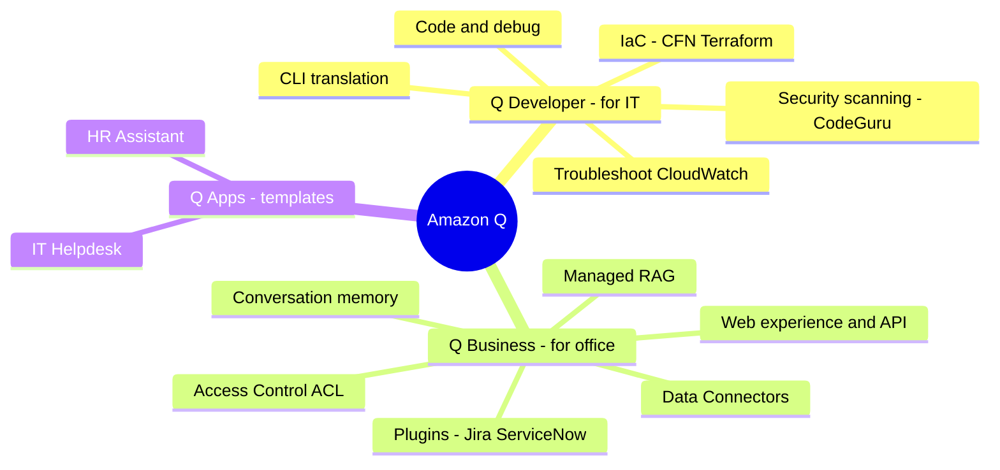

# 04. Amazon Q Services

[← Basic Knowledge に戻る](./README.md)

> Bedrock/SageMaker が AI を **作る** 場所なら、**Amazon Q は AWS のパッケージ済み AI 製品** — すぐ使える Productivity ファミリー。会社が AI 社員を 3 人雇ったイメージ: **Q Developer**（コーダー）、**Q Business**（社内司書）、**Q Apps**（インスタント麺）。
>
> *スコープメモ:* Amazon Q は AIP-C01 に **中程度** で出る（主に D2）。主眼は Bedrock Knowledge Bases との **区別**。

## このカテゴリのマインドマップ

## クイックリファレンス

| サービス | 1 文の説明 | 関連 domain |
|---|---|---|
| Amazon Q Developer | コーディング + AWS インフラ支援（IDE & Console 内） | D2 |
| Amazon Q Business | パッケージ済みエンタープライズ RAG + アクセス制御 | D2, D3 |
| Amazon Q Apps | Q Business 上の出来合いアプリ template（HR, IT） | D2 |

---

## サービスカード

### Amazon Q Developer

> **1 文の説明:** 「シニアコーダー + AWS 専門家」が IDE（VS Code, JetBrains）**と** AWS Console の中に居る。

- **解決する問題:** コーディングと AWS インフラ管理を高速化。
- **主な機能:**
  - **Code & debug:** プロジェクトを理解、あなたの流儀で書く、コードを説明。
  - **Security Scanning（頻出）:** 背景で動き、**commit 前** にセキュリティバグ（ハードコードされた credential、SQL injection）を捕捉。
  - **IaC:** Well-Architected に沿って CloudFormation/Terraform を生成。
  - **CLI translation:** 「動いてるサーバを見せて」→ `aws ec2 describe-instances`。
  - **Troubleshooting:** Console 内で CloudWatch Logs を読み → 根本原因（例: IAM 権限不足）を特定 → 修正を提案。
- **使うべきとき:** **コード・インフラ・AWS コマンド・IDE・インフラ debug** が絡む全て。
- **使わないとき／混同しやすいもの:** **Q Developer ≠ Q Business**。Q Developer は開発者向け、Q Business は社員が文書を照会。Security Scanning は Bedrock Guardrails とは別（Guardrails は prompt の content/PII をフィルタ、コードは scan しない）、CodeGuru Profiler とも別（実行時性能を測る）。
- **関連 exam domain:** D2。
- **⚠️ 必ず覚える:** Security Scanning は **CodeGuru Security** を継承 → CVE/OWASP 更新が **クラウド上でリアルタイム**（静的 AI ではない）。Q Developer の前身は **CodeWhisperer**。
- **🧪 1 行の例:** Lambda が DB パスワードをハードコードした瞬間、入力中に Q Developer が捕捉。

🔬 深掘り: 大規模プロジェクトをどう扱うか（context 制限）

Q Developer は数百万行をクラウドに送らない。IDE 内で **Local Semantic Indexing** + RAG を使う: 隠れた「索引」を作り、最も関連するコードだけ送る（開いているファイル、ハイライト関数、直接 import するファイル）。複雑なプロジェクトは「context を失う」ことあり → **@workspace** タグ（Pro）で全索引を強制、または GitHub/GitLab/CodeCommit に接続して repo 全体を索引化。

### Amazon Q Business

> **1 文の説明:** 「社内司書」。**100% パッケージ化された RAG** システム: 社内データソースに繋ぐだけで、すぐに chat UI が手に入る。

- **解決する問題:** 社員（Sales/HR/Marketing）が社内文書を照会。**Data Connectors**（S3, SharePoint, Google Drive, Salesforce）に繋ぐ → 自動で取込・chunk・vector 化し、chat UI を提供。
- **使うべきとき:** **最小工数** のエンタープライズ検索/RAG、**厳格なアクセス制御** が必要、multi-turn。
- **使わないとき／混同しやすいもの:** **自分でコードを書き、自前 UI、RAG フローを深く制御** したい、または外部顧客向け RAG アプリ → **Bedrock Knowledge Bases**（Q Business は SaaS、深い介入不可）。コード生成ツールでもない（それは Q Developer）。
- **関連 exam domain:** D2, D3。
- **⚠️ 必ず覚える:** 「最大」の機能 = ソースシステムから **アクセス制御 (ACL) を継承** → データ越境漏洩を防止。**Conversation memory** がコード無しで multi-turn の文脈を保持。**Web experience** は出来合い（ロゴ/色を変えて公開）、または **Q Business API** でカスタム UI に埋め込み。
- **🧪 1 行の例:** 業務委託者が「CEO の給与は?」と聞く → Q が ACL を確認、`finance/` に DENY → 「その情報は持っていません」。

🔐 深掘り: Access Control (ACL) & Plugins

- **ACL:** Q Business はソースの権限を尊重。例: JSON ACL で group `finance-team` = ALLOW、`contractors` = prefix `finance/` に DENY。DENY された人がその文書を聞く → Q は **存在しない** かのように振る舞う。
- **Plugins（手 — 書き込みアクション）:** Jira/ServiceNow/Salesforce/Zendesk への内蔵 connector。社員が「マウスが壊れた」と chat → Q が「Jira ticket を作る?」→ ワンクリックで作成。*vs Bedrock Agents:* Agents は柔軟だが Lambda/OpenAPI を書く、Plugins は **出来合いのエンタープライズ connector** をクリック設定。
- **Data Connectors** は文書取込のため **読取り (read-only)** のみ。**行動 (write)** には **Plugins**。

### Amazon Q Apps（Q Business Apps）

> **1 文の説明:** 「インスタント麺」。Q Business の **上に乗る** 出来合いアプリ template（HR Assistant, IT Helpdesk）。

- **解決する問題:** 非常に速くデプロイ（数日）。ドメイン System Prompt + UI 付き、prompt/UI を書かない。
- **使うべきとき:** HR/IT bot を **最速** で、カスタマイズ少なめ。
- **使わないとき／混同しやすいもの:** **正しく理解:** Q App は他社の HR データを含まない — 単なる「型」（template prompt + UI）。**魂はあなたのデータ**（connector を S3/SharePoint の社内ハンドブックに向ける）。RAG なので、汎用知識ではなく **自社のルール** で答える。
- **関連 exam domain:** D2。
- **⚠️ 必ず覚える:** 速いが、Q Business を自分で組むより **柔軟性は劣る**。
- **🧪 1 行の例:** HR App + 「従業員ハンドブック」の S3 を指定 → 数日で休暇規程に答える bot。

---

## 「試験の武器」比較表

| 状況 / キーワード | 選ばない（罠） | 選ぶ（正解） |
|---|---|---|
| コードのセキュリティバグ検出、CFN/Terraform 生成、CLI 翻訳 | Q Business | **Q Developer** |
| Console で CloudWatch Logs からインフラ debug | Comprehend / IDE explain | **Q Developer in Console** |
| 社内文書（SharePoint/S3）を chat + 厳格権限、最小工数 | Bedrock KB（ACL 自作） | **Q Business** |
| RAG だがコードを書く、UI 構築、深い制御 / 外部顧客 | Q Business（SaaS） | **Bedrock Knowledge Bases** |
| HR/IT bot を速くデプロイ、prompt/UI 不要 | Q Business native / Bedrock | **Q Apps** |
| chatbot が Jira/ServiceNow ticket を自動作成 | Data Connectors | **Q Business Plugins** |
| S3/SharePoint から読取り取込 | Plugins | **Data Connectors** |
| コードのセキュリティバグ scan | Bedrock Guardrails / CodeGuru Profiler | **Q Developer (Security Scanning)** |

## ⚠️ よくある罠

- **Q Developer（コード/インフラ） vs Q Business（社内文書） vs Bedrock KB（自前 RAG を作る）**。
- **Q Apps** は template、データは依然として自社のもの（依然 RAG）。
- **Plugins = アクション（write）**、**Data Connectors = 読取り**。
- Q Developer の Security Scanning **≠** Guardrails（content）**≠** CodeGuru Profiler（性能）。
- 低 latency/深い制御、カスタム UI、外部顧客が必要 → Q ではなく **Bedrock** 寄り。

## 関連 exam domain

**D2**（implementation/integration）を厚くカバーし、**D3**（Q Business ACL/governance）と **D1** に触れる。Amazon Q は AIP-C01 全体で **中程度** のトピック。[対応表](./README.md#service--5-exam-domain-対応表) を参照。

🔗 **関連:** [Case studies](../02-case-studies/) · [Practice exam](../03-practice-exam/) · [← 03. AI/ML Supporting](./03-ai-ml-supporting-services.md) · [05. Data & Analytics →](./05-data-analytics-services.md)
