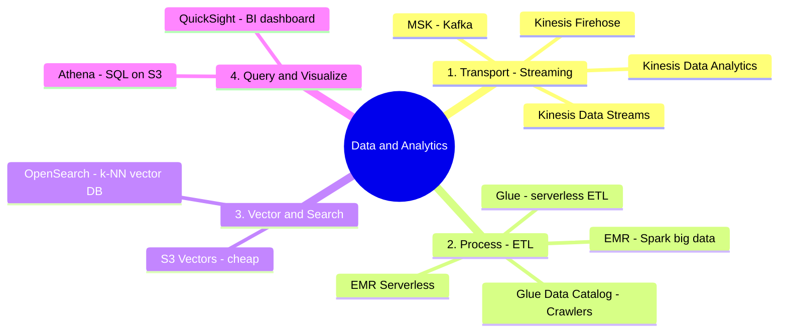

# 05. Data & Analytics Services

[← Basic Knowledge に戻る](./README.md)

> **配点の高い** 層（D1 = 31% に大きく寄与）。AI シェフがどれだけ優秀でも、腐った/乱雑な「食材」（データ）では料理が台無し。このグループはデータを **準備・運搬・保存検索・レポート** する。
>
> **データ工場の 4 段階** として覚える: 運搬 → 処理 (ETL) → 保存 & 検索 (Vector) → クエリ & 可視化。

## このカテゴリのマインドマップ



## クイックリファレンス

| サービス | 1 文の説明 | 関連 domain |
|---|---|---|
| Kinesis Data Streams | リアルタイム取込パイプ（処理は自分でコード） | D1 |
| Kinesis Firehose | 自動圧縮 + partition + S3 投入の漏斗（no-code） | D1, D4 |
| Kinesis Data Analytics | パイプ内で SQL によりフィルタ/異常検知 | D1, D5 |
| Amazon MSK | Kafka 形式の Kinesis（OSS） | D1 |
| AWS Glue | serverless ETL + Data Catalog（データの心臓） | D1 |
| Amazon EMR | 重い big data 用 Spark/Hadoop cluster | D1 |
| OpenSearch Service | Vector DB（k-NN）— 標準 RAG backend | D1 |
| Amazon Athena | S3 上で直接 serverless SQL | D1, D4 |
| QuickSight | 経営層向け BI dashboard | D4 |

---

## 段階 1 — 運搬（Streaming）

### Amazon Kinesis

> **1 文の説明:** 「AWS 内部のパイプライン」。絶え間なく流れるデータをリアルタイムに受ける。

- **3 コンポーネント:**
  - **Data Streams:** リアルタイム取込。各レコードの処理は **自分でコード (Lambda)**。
  - **Firehose（頻出）:** 「自動漏斗」 — 流入を自動 **圧縮 + 日付 partition + S3 投入**、no-code。
  - **Data Analytics:** **パイプ内** で SQL によりフィルタ/異常検知（例: AI が 1 分に 10 回誤答）。
- **使うべきとき:** リアルタイムのログ/クリック/イベント取込。
- **使わないとき／混同しやすいもの:** 「データを集め、自動圧縮、partition、S3 投入」→ **Firehose**（Data Streams を選ばない、コードを強いられる）。
- **関連 exam domain:** D1（Firehose の圧縮/partition 節約で D4 も）。
- **🧪 1 行の例:** Epic Games が Data Streams でゲーマーから毎秒数百万イベントを取込。

### Amazon MSK（Managed Apache Kafka）

> **1 文の説明:** Kinesis に似るが **OSS の Apache Kafka** を AWS が managed 化。

- **使うべきとき:** 会社が **既に Kafka を運用**（書き換えずクラウドへ）、または極端な負荷。
- **使わないとき／混同しやすいもの:** 問題に **「Kafka」が無い** → 既定で **Kinesis**。
- **関連 exam domain:** D1。
- **🧪 1 行の例:** Uber/Netflix が旧 Kafka アーキを MSK で AWS へ移行。

---

## 段階 2 — 処理（ETL）

### AWS Glue

> **1 文の説明:** 「自動ミキサー」。終わると落ちる **serverless** ETL。RAG データ準備に最適。

- **解決する問題:** S3 のデータを数行の Python/Scala で Extract–Transform–Load。
- **主要コンポーネント:**
  - **Glue Data Catalog** = AWS データの「心臓」: **Crawlers** が S3 を自動巡回し schema（列・型）を読む → 共有 catalog に書き、他サービス（Athena…）が S3 の中身を把握。
  - **Glue Studio:** コードが苦手な人向けのドラッグ&ドロップ UI。
- **使うべきとき:** 単純・serverless・自動の ETL。
- **使わないとき／混同しやすいもの:** **数十 TB** や非常に複雑な ML 変換 → **EMR**（Glue は苦しい）。
- **関連 exam domain:** D1。
- **🧪 1 行の例:** Glue Crawler が S3 を scan して Catalog を作り、Athena がクエリできるように。

### Amazon EMR

> **1 文の説明:** 「big data の工業団地」。Apache Spark/Hadoop の cluster、極めて強力。

- **使うべきとき:** **数十 TB**、Glue では無理な複雑 ML 変換、数千ノードに分散。
- **使わないとき／混同しやすいもの:** 高速クエリや軽い ETL → Athena/Glue。EMR は cluster 管理を伴う（**EMR Serverless** を除く）。
- **関連 exam domain:** D1。
- **⚠️ 必ず覚える — 訂正:** **Amazon EMR Serverless は存在する**（PySpark コードを投げると AWS が自動起動/停止、秒課金）。Glue が対応しない **特殊な Spark/ML ライブラリ** が必要なら EMR Serverless を Glue より選ぶ。
- **🧪 1 行の例:** 毎晩 50TB の自動運転データを処理: 顔のぼかし + GPS 同期を EMR の Spark で。

---

## 段階 3 — Vector & Search

### Amazon OpenSearch Service

> **1 文の説明:** full-text 検索エンジンであり **Vector Database (k-NN)** でもある — RAG の最も標準的な「本棚」。

- **解決する問題:** embeddings を保存し **最近傍 (k-NN)** を探す。リアルタイムログ分析も。
- **使うべきとき:** Bedrock Knowledge Bases の Vector DB backend、ミリ秒の semantic 検索。
- **使わないとき／混同しやすいもの:** **OpenSearch = vector/semantic 検索**、**Athena = S3 上の静的 SQL**。安い vector・低頻度クエリ → **S3 Vectors**（[カテゴリ 06](./06-integration-orchestration-services.md)）。
- **関連 exam domain:** D1。
- **🧪 1 行の例:** 文書 vector を保存、RAG 用に k-NN で意味的に近い top-5 chunk を取得。

<details><summary>🔑 深掘り: k-NN ≠ Top-k / Top-p / Temperature（非常に混同しやすい）</summary>

- **k-NN**（OpenSearch 内）: **検索** —「質問に意味が最も近い文書を 5 件くれ」。
- 次の 3 つの「つまみ」は Bedrock の **テキスト生成** を制御（検索とは無関係）:
  - **Temperature:** 「創造性」。～0 = 最高確率 token を常に選ぶ（正確、機械的 → **RAG/コード/法務** 向け）。高い（例 0.9）= 確率を平坦化し珍しい語を選ぶ（創作/詩/マーケ）。
  - **Top-k:** 最高確率の **k** 個だけ残してサンプリング（例 k=3）。
  - **Top-p (nucleus):** 確率を **p%** に達するまで足して切る（例 p=0.85）。
- **試験のコツ:** **正確な RAG・捏造なし** → **Temperature を 0**。創造性が欲しい → Temperature + Top-p を上げる。
</details>

---

## 段階 4 — クエリ & 可視化

### Amazon Athena

> **1 文の説明:** 「S3 エクスプローラ」。S3 のファイルに対して直接 **serverless SQL**、DB に取り込む必要なし。

- **使うべきとき:** S3 にある JSON/CSV/Parquet への SQL（例: エラーログのフィルタ）。
- **使わないとき／混同しやすいもの:** 複雑/重い ML → EMR。vector/semantic → OpenSearch。
- **関連 exam domain:** D1, D4。
- **⚠️ 必ず覚える（節約）:** Athena は **scan したデータ量** で課金。**日付で partition** 必須 → 5/15 のクエリは当該フォルダだけ scan → 安く速い。（列指向 Parquet も scan コストを削減。）
- **🧪 1 行の例:** `SELECT * FROM logs WHERE error=true AND dt='2026-05-15'` を S3 上で直接実行。

### Amazon QuickSight（Quick Suite）

> **1 文の説明:** 「チャート職人」。経営層向けの綺麗なビジネス dashboard を描く BI ツール。

- **使うべきとき:** Athena の結果を取り、**ビジネス関係者** 向けに棒/円グラフを描く。
- **使わないとき／混同しやすいもの:** **QuickSight = 経営層向けビジネスチャート、CloudWatch = IT 向け技術チャート（latency/error）**。
- **関連 exam domain:** D4。
- **🧪 1 行の例:** 役員向け「今月 AI にいくら使ったか」dashboard。

---

## 標準的な GenAI データフロー（頻出）

```
システムログ → Kinesis Firehose（圧縮 + partition）→ S3
   → Glue Crawler が Data Catalog を作る
   → Athena が SQL でエラーをフィルタ（Catalog に基づく）
   → QuickSight が Athena に接続し上司向けレポートを描く
```

## 「弱点」比較表

| 要件（キーワード） | 選ぶ | なぜ他はダメか |
|---|---|---|
| S3 にある JSON/CSV ファイルへの SQL | **Athena** | EMR は複雑処理用、高速クエリではない |
| 単純・serverless・自動の ETL | **Glue** | EMR は cluster 管理で重い |
| 50TB に Spark で複雑 ML 変換 | **EMR** | Glue は大きすぎ/複雑すぎで苦しい |
| データを集め自動圧縮・partition・S3 投入 | **Kinesis Firehose** | Data Streams はコードを強いる |
| vector 保存 + RAG の semantic 検索 | **OpenSearch** | Athena は静的 SQL、Vector DB ではない |
| 大量 vector・低頻度クエリ・コスト最適 | **S3 Vectors** | OpenSearch は速いが高い |
| 経営層向け dashboard | **QuickSight** | CloudWatch は IT 向け技術 metrics |
| 既に Kafka / 極端な負荷 | **MSK** | 問題に Kafka が無ければ Kinesis |

## ⚠️ よくある罠

- **Firehose（no-code、圧縮/partition） vs Data Streams（自分でコード）**。
- **Glue（軽い serverless ETL） vs EMR（重い Spark big data）** — **EMR Serverless** もある。
- **OpenSearch（vector/semantic） vs Athena（静的 SQL）**。
- **QuickSight（経営層） vs CloudWatch（IT）**。
- **Athena:** 安くするには常に **partition + Parquet** を覚える。
- **k-NN ≠ Top-k/Top-p/Temperature**。

## 関連 exam domain

**D1 を非常に厚く** カバーし（data pipeline、vector store、RAG backend — Task 1.3/1.4）、**D4**（コスト: Firehose、Athena partition）に触れる。[対応表](./README.md#service--5-exam-domain-対応表) を参照。

🔗 **関連:** [Case studies](../02-case-studies/) · [Practice exam](../03-practice-exam/) · [← 04. Amazon Q](./04-amazon-q-services.md) · [06. Integration & Orchestration →](./06-integration-orchestration-services.md)
