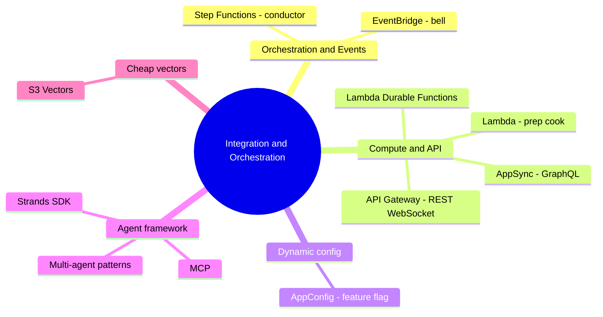

# 06. Integration & Orchestration Services

[← Basic Knowledge に戻る](./README.md)

> **D2 (26%)** の「ホール係」。FM（Claude, Titan）が「料理長」なら、レストランにはなお: **注文を取る人**（API Gateway/AppSync）、**指揮するマネージャ**（Step Functions）、**下ごしらえ係**（Lambda）、**料理完成のベル**（EventBridge）、**閉店せずにメニューを変える配電盤**（AppConfig）が要る。

## このカテゴリのマインドマップ

## クイックリファレンス

| サービス | 1 文の説明 | 関連 domain |
|---|---|---|
| Step Functions | 分岐/retry 付きの複数ステップを orchestration（state machine） | D2 |
| EventBridge | システムを疎結合にする event bus | D2 |
| Lambda | serverless の「のり」compute（≤15 分） | D2 |
| Lambda Durable Functions | 最大 1 年動く Lambda、checkpoint/replay | D2, D4 |
| API Gateway | REST/WebSocket の受付: 認証、rate-limit、streaming | D2 |
| AppSync | GraphQL の受付: 1 回で柔軟に複数取得 | D2 |
| AppConfig | **再デプロイなし** でモデル/設定を変更 | D2, D4 |
| Strands Agents SDK | 自律 agent をコードで書く framework（model-driven） | D2 |
| Amazon S3 Vectors | RAG 用の超低コスト vector ストレージ | D1 |

---

## グループ 1 — Orchestration & Events

### AWS Step Functions

> **1 文の説明:** 「レストランのマネージャ」。フローチャート（state machine）に沿ってステップを orchestration、強力なエラー処理 & retry。

- **解決する問題:** 多数の AWS サービスを **分岐・待機・retry・人の承認** 付きプロセスに連結。
- **使うべきとき:** 「**visual workflow / 複数 AWS サービスの orchestration / エラー処理 / retry**」を見たら。
- **使わないとき／混同しやすいもの:** 単純な一直線フロー → Lambda だけ。**AI が推論してステップを選ぶ**（事前定義なし）プロセス → **Strands/AgentCore**、Step Functions ではない。
- **関連 exam domain:** D2。
- **⚠️ 必ず覚える:** **Standard workflow** は状態を最大 **1 年** 保持。JSON（Amazon States Language）で定義。
- **🧪 1 行の例:** 融資承認: 分析 → 3 日間部長を待つ → 銀行 API を呼ぶ。

🔬 深掘り: Step Functions vs Bedrock Prompt Flows

| | Prompt Flows | Step Functions |
|---|---|---|
| 範囲 | Bedrock 内（prompt/モデル/RAG の連結） | 200+ AWS サービス（Lambda, SQS, DynamoDB…） |
| 期間 | 秒/分 | 最大 **1 年** |
| インタフェース | AI/Prompt Engineer 向けドラッグ&ドロップ | backend/DevOps 向け JSON (ASL) |
| エラー/分岐 | 基本的 | 非常に強力（retry, catch, loop） |

「料理長」（Prompt Flows、厨房内） vs 「レストランのマネージャ」（Step Functions、数日にわたる業務プロセス全体）。

### Amazon EventBridge

> **1 文の説明:** 「ベルシステム」。event でシステムを **疎結合** にする。

- **解決する問題:** A が event を発する → EventBridge が多数の target に配送、A は誰が聞くか知らない。
- **使うべきとき:** 「**疎結合 / 複数 target に event 配送 / event-driven**」を見たら。
- **使わないとき／混同しやすいもの:** 逐次・状態付きプロセス → Step Functions、EventBridge ではない。
- **関連 exam domain:** D2。
- **🧪 1 行の例:** AI が調理完了で「ベルを鳴らす」→ EventBridge が関心ある全サービスに通知。

---

## グループ 2 — Compute & API

### AWS Lambda

> **1 文の説明:** 「万能な下ごしらえ係」。serverless compute、要求時に動き、終わると落ちる。「のりコード」。

- **使うべきとき:** 前後処理（入力のスペルチェック、出力 JSON の整形）、短いタスク。
- **⚠️ 必ず覚える:** Lambda は通常 **15 分上限**。
- **関連 exam domain:** D2。
- **🧪 1 行の例:** client に返す前に Lambda が FM の回答 JSON を正規化。

### AWS Lambda Durable Functions

> **1 文の説明:** 「長寿命・状態付き」の Lambda。逐次コードを書きつつ最大 **1 年** 動き、自動 checkpoint、待機中は無課金で眠る。

- **解決する問題:** 複数ステップ/長待機の workflow（人の承認、long-running AI）を **1 つの Lambda** で、Step Functions 不要。
- **使うべきとき:** 慣れた Lambda モデルを保ちつつ耐障害性が要る複数ステップ AI workflow。
- **関連 exam domain:** D2, D4（眠っている間は compute 無課金）。
- **⚠️ 必ず覚える（確認済み）:** **re:Invent 2025 年 12 月にローンチ**。checkpoint/replay、最大 ～366 日中断、動いている間だけ課金。
- **🧪 1 行の例:** ticket pipeline: triage → 人の返信待ち → close を 1 つの関数で。

### Amazon API Gateway

> **1 文の説明:** 「REST/WebSocket の受付」。Lambda の前に立ち、request を受ける扉。

- **使うべきとき:** 「**REST / rate limiting / 認証 / streaming 応答**」を見たら。
- **⚠️ 必ず覚える:** **Auth**（バッジ確認）、**Rate Limiting**（spam 防止）、**WebSocket**（AI テキストを行ごとに stream）を扱う。
- **関連 exam domain:** D2。
- **🧪 1 行の例:** WebSocket が Bedrock の回答を UI にリアルタイム stream。

### AWS AppSync

> **1 文の説明:** 「GraphQL の受付」。1 回の呼び出しで多種のデータを取得。

- **使うべきとき:** 「**GraphQL / 柔軟なクエリ**」を見たら（例: AI 回答 + avatar + チャット履歴を 1 request で）。
- **混同しやすい:** REST/WebSocket → API Gateway、GraphQL → AppSync。
- **関連 exam domain:** D2。

---

## グループ 3 — 動的設定

### AWS AppConfig

> **1 文の説明:** 「魔法のスイッチ」。**Feature Flag** でモデル/設定を **コード再デプロイなし** に変更。

- **解決する問題:** Claude ↔ Llama を即切替。**Canary** でまず 10% 開け、エラーで自動で戻す。
- **使うべきとき:** 「**再デプロイなしでモデル変更 / A-B testing / 段階的 rollout**」を見たら。
- **使わないとき／混同しやすいもの:** **rotation が要るパスワード/API key** → Secrets Manager、静的 env var → Parameter Store（[カテゴリ 07](./07-security-governance-services.md)）。
- **関連 exam domain:** D2, D4。
- **🧪 1 行の例:** トラフィックの 10% を Sonnet に振り、CloudWatch がエラー報告 → AppConfig が自動で Haiku に戻す。

---

## グループ 4 — Agent framework（2026 でフォーカス急上昇）

### Strands Agents SDK

> **1 文の説明:** **自律 agent** を **model-driven** に書くコードライブラリ（Python/TypeScript）。AI に目標 + tool を与えると、ステップを自分で考える。

- **解決する問題:** **自分で判断する** agent を作る（Step Functions の固定フローと違う）。
- **使うべきとき:** 「**動的判断 / plan and execute / multi-agent / model-driven orchestration**」を見たら。
- **使わないとき／混同しやすいもの:** 固定・事前定義分岐のフロー → Step Functions。素の RAG（文書を読んで答える）→ Knowledge Bases。
- **AgentCore との関係:** **Strands = framework（agent コードを書く）、AgentCore = infrastructure（その agent を AWS で動かす）** — セット。（公式試験ガイドは **AWS Agent Squad** も挙げる。）
- **関連 exam domain:** D2（Task 2.1 — agentic AI）。
- **🧪 1 行の例:** 投資 agent がニュース読取 agent + 数値分析 agent を自動で呼び、統合する。

🔬 深掘り: 4 つの multi-agent パターン + AI の「手綱の締め方」

- **Agents-as-Tools（上司–部下、階層）:** 1 つの orchestrator が専門 agent を「tool」として割り振り、結果を統合。制御しやすい。
- **Swarms（peer-to-peer）:** 上司なし、agent が context で互いに「hand off」して完了まで。
- **Graphs（決定論的な流れ作業）:** ステップ順を「固定」（step 1 完了後に step 2）だが、**各ステップ内では agent が自由に推論**。
- **Handoffs（人へ引き渡し）:** agent が難しい/危険なケースに当たる → チャット全体を **実在の人** に引き渡す（例: 医療「胸の痛み」→ 医師に通知）。

**AI の手綱（3 層）:** (1) 厳格な **Tool Schema** JSON（param 不足は SDK がブロック）; (2) 規律ある **System Prompt**（「送金 *前* に必ず残高を確認せよ」）; (3) Gateway での **AgentCore Policy (Cedar)** が過剰権限のアクションをブロック（例: > $5M は人の承認が必要）。

🔌 MCP (Model Context Protocol) — 「AI の USB-C」

agent が外部 tool/システム（Google Drive, SQL, Slack/Jira）に、tool ごとの個別のりコードなしで繋ぐ標準。コミュニティ/AWS が出来合いの **MCP Server** を提供、Strands では MCP Client を 1 つ宣言して指すだけ。AgentCore Gateway は MCP を「万能ソケット」として IAM 権限管理付きで使う。

---

## グループ 5 — 超低コスト vector ストレージ

### Amazon S3 Vectors

> **1 文の説明:** vector 専用の新しい S3 bucket — OpenSearch より **～90% 安い**、少し遅い（～1 秒未満）。

- **使うべきとき:** 「**コスト最適な vector ストレージ / 数十億 vector / 低頻度クエリ**」を見たら。Bedrock Knowledge Bases に直接統合。
- **使わないとき／混同しやすいもの:** **ミリ秒・高頻度** の取得が必要 → OpenSearch（[カテゴリ 05](./05-data-analytics-services.md)）。
- **関連 exam domain:** D1。
- **🧪 1 行の例:** めったに照会されない 10 億の旧文書 → コスト節約に OpenSearch ではなく S3 Vectors。

---

## 誤答消去のコツ（キーワード → サービス）

| 問題のキーワード | 選ぶ |
|---|---|
| visual workflow / 複数 AWS サービスの orchestration / エラー処理, retry | **Step Functions** |
| streaming 応答 / REST / rate limiting / 認証 | **API Gateway** |
| GraphQL / 柔軟なクエリ | **AppSync** |
| 疎結合 / 複数 target に event 配送 / event-driven | **EventBridge** |
| 再デプロイなしでモデル変更 / A-B testing / 段階的 rollout | **AppConfig** |
| multi-agent / swarms / model-driven / plan and execute | **Strands SDK**（+ AgentCore） |
| コスト最適な vector ストレージ / 数十億 vector / 低頻度 | **S3 Vectors** |
| long-running 耐障害の複数ステップ AI workflow、なお Lambda | **Lambda Durable Functions** |

## ⚠️ よくある罠

- **Step Functions（固定フロー） vs Strands/AgentCore（AI が自分で判断）**。
- **API Gateway（REST/WebSocket） vs AppSync（GraphQL）**。
- **AppConfig（動的設定） vs Secrets Manager（secret） vs Parameter Store（静的）** — 07 参照。
- **Strands = framework、AgentCore = infrastructure**（セット）。
- **S3 Vectors（安い、遅め） vs OpenSearch（高い、速い）**。

## 関連 exam domain

**D2 を非常に厚く** カバーし（implementation/integration、agentic）、**D1**（S3 Vectors）と **D4**（AppConfig、Durable Functions の節約）に触れる。[対応表](./README.md#service--5-exam-domain-対応表) を参照。

🔗 **関連:** [Case studies](../02-case-studies/) · [Practice exam](../03-practice-exam/) · [← 05. Data & Analytics](./05-data-analytics-services.md) · [07. Security & Governance →](./07-security-governance-services.md)
