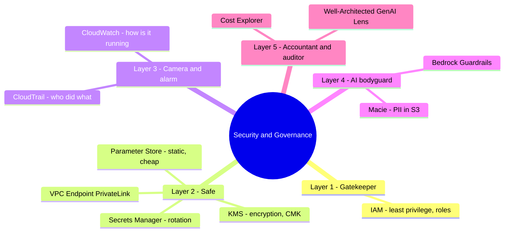

# 07. Security & Governance Services

[← Basic Knowledge に戻る](./README.md)

> 「防御」層、**D3 (20%)** — GenAI システムを **本番に出してよいか** を決める。システムを多層防御の **AI 銀行** と想像する。

## このカテゴリのマインドマップ

## クイックリファレンス

| サービス | 1 文の説明 | 関連 domain |
|---|---|---|
| IAM | 誰がどのリソースに何をできるか（least privilege） | D3 |
| KMS | data-at-rest 暗号化の鍵を管理 | D3 |
| Secrets Manager | secret の金庫 + 自動 rotation | D3 |
| Parameter Store | 静的 config の引き出し、安い | D3 |
| VPC Endpoint (PrivateLink) | インターネットなしで Bedrock を呼ぶ | D3 |
| CloudTrail | 「監査カメラ」: 誰がどの API を呼んだか | D3, D5 |
| CloudWatch | 「計器」: latency、error、log | D5, D4 |
| Bedrock Guardrails | AI ボディガード: content フィルタ、PII マスク、topic ブロック | D3 |
| Macie | S3 の PII/機密データを検出 | D3 |
| Cost Explorer | token コスト確認、異常検知 | D4 |
| Well-Architected (GenAI Lens) | アーキを評価する「教科書」 | D3, D4 |

---

## Layer 1 — 門番

### AWS IAM

> **1 文の説明:** **誰 (Principal)** が **どのリソース** に **何 (Action)** をできるかを決める。

- **解決する問題:** リソースへのアクセス制御。
- **使うべきとき:** 「**アクセス制御 / 誰がモデルを呼べるか**」を見たら。
- **⚠️ 必ず覚える:** **Least Privilege** — `bedrock:*` を与えず、必要なモデルだけ許可。**IAM Roles**: Lambda/EC2 はユーザー/パスワードを持たず、Role で一時 credential を借りる。
- **関連 exam domain:** D3。
- **🧪 1 行の例:** Role で Lambda が Claude 3 のみに `bedrock:InvokeModel` を許可、他モデルは不可。

---

## Layer 2 — 金庫 & 鍵箱

### AWS KMS

> **1 文の説明:** S3/DynamoDB の data-at-rest（保存時暗号化）用の **暗号鍵** を管理。

- **使うべきとき:** 「**データ暗号化 / 鍵管理**」を見たら。
- **⚠️ 必ず覚える:** 問題に **Compliance/Audit** が出たら → AWS デフォルトより **Customer-Managed Keys (CMK)** を選ぶ。CMK は **完全な制御 & 鍵利用ログ** を与えるため。
- **関連 exam domain:** D3。
- **🧪 1 行の例:** S3 の RAG 文書を CMK で暗号化し監査可能に。

### AWS Secrets Manager vs Parameter Store（古典の罠）

> **Secrets Manager — 1 文:** 機密 secret の「賢い金庫」、**自動 rotation** 付き。
> **Parameter Store — 1 文:** 静的/非機密 config の「引き出し」、**安い/無料**。

- **Secrets Manager:** DB パスワード、API key（OpenAI/Anthropic）— 目玉機能は **Automatic Rotation**（アプリを壊さず 30 日ごとに DB パスワードを更新）。secret あたり課金。
- **Parameter Store (Systems Manager):** モデル ID、URL、Dev/Prod env 名 — 安く、`/dev/db/url` のように階層的。
- **🔑 AppConfig との違い**（[カテゴリ 06](./06-integration-orchestration-services.md)）: AppConfig = **動的 config/feature flag** を再デプロイなしで変更。
- **関連 exam domain:** D3。
- **🧪 1 行の例:** DB パスワードに rotation 必要 → Secrets Manager、固定の補助 API URL → Parameter Store。

🔬 深掘り: Secrets Manager vs Parameter Store vs AppConfig

| | Secrets Manager | Parameter Store | AppConfig |
|---|---|---|---|
| 目的 | 高セキュリティの secret | 静的 config/env var | 動的 config、feature flag |
| 目玉 | 自動 rotation | 無料（standard）、階層的 | 再デプロイなし変更 + canary |
| コスト | 高い（$/secret） | 安い/無料 | ストレージ & API ごと |

**rotation が要るパスワード/API key** → Secrets Manager · **静的 env var** → Parameter Store · **機能トグル、A/B、段階 rollout** → AppConfig。

### VPC Endpoint (PrivateLink)

> **1 文の説明:** アプリが Bedrock/S3 を **公衆インターネットでなく AWS の private network** 経由で呼べるようにする。

- **使うべきとき:** データが社内ネットから出てはいけない（compliance、機密データ）。
- **関連 exam domain:** D3。
- **🧪 1 行の例:** Lambda が VPC Endpoint 経由で Bedrock を呼び、prompt/PII がインターネットを通らない。

---

## Layer 3 — カメラ & アラーム（最も混同しやすいペア）

### AWS CloudTrail vs Amazon CloudWatch

> **CloudTrail — 1 文:** 「監査カメラ」 — **誰が・いつ・どの API を呼んだか** を記録。
> **CloudWatch — 1 文:** 「計器」 — **システムがどう動いているか**（latency、error、log）。

| 基準 | CloudTrail | CloudWatch |
|---|---|---|
| 核心の問い | **誰が・いつ・何をしたか?** | **システムはどう動いているか?** |
| データ | API 呼び出し（呼出履歴） | metrics（latency, error）& log |
| GenAI | 監査: Role A だけが FM を呼べたと証明 | AI 応答が > 5 秒、error 率が急増したら警報 |

- **関連 exam domain:** D3（CloudTrail 監査）、D5/D4（CloudWatch 監視）。
- **⚠️ 必ず覚える:** 「**誰が** API を呼んだ証拠を探す」→ **CloudTrail**。「**latency/error** を監視、技術チャートを描く」→ **CloudWatch**。（CloudWatch Logs には log 内 PII をマスクする **Data Protection** がある。）
- **🧪 1 行の例:** 監査人が「午前 2 時に誰が S3 ファイルを DL したか?」→ CloudTrail。

---

## Layer 4 — AI 専用ボディガード

### Amazon Bedrock Guardrails

> **1 文の説明:** 中央に立つ「監督者」、**二重防御** — **入力 (prompt)** と **出力 (response)** の両方をチェック。

- **解決する問題:** 有害コンテンツのブロック、**PII マスク**、AI を本題に留める、prompt injection 防御。（このカードは [カテゴリ 01](./01-amazon-bedrock-services.md) と重複するが、ここでは governance 設定を深掘り。）
- **使うべきとき:** 「**AI に暴言させない / PII マスク / topic 禁止**」を見たら。
- **使わないとき／混同しやすいもの:** Guardrails = **CONTENT**、agent の **ACTION** 制御 = **AgentCore Policy**。
- **関連 exam domain:** D3（主）。
- **🧪 1 行の例:** 靴販売 chatbot に株購入を聞く → Topic Filter がブロック。

🔬 深掘り: Guardrails の設定（試験頻出）

- **PII:** 2 つの挙動 — **BLOCK**（強制停止、エラー） or **MASK/REDACT**（`[PHONE_NUMBER]` に置換、滑らか、**推奨**）。
- **Content Filters:** 6 カテゴリ — Hate, Insults, Sexual, Violence, Misconduct/self-harm, **Prompt Injection** — 各 **Low/Medium/High** スライダー。
- **Topic Filters:** 禁止 topic を **自然言語** で定義（例「Medical_Advice: 症状・診断・薬に関する質問」）、キーワードリスト不要。
- **Word Filters:** 語の blocklist（競合名、スラング）。
- **Blocked Messaging:** 赤いエラーでなく丁寧なカスタム応答。
- **試験のコツ:** 「クレカ番号を隠す」→ **PII Masking**、「靴 chatbot に株購入を助言させない」→ **Topic Filters**。

### Amazon Macie

> **1 文の説明:** ML で **S3 に置かれた PII/機密データを検出**（例: 学習データに ID やクレカ番号が紛れる）。

- **使うべきとき:** RAG/fine-tune に渡す前に data lake/学習データの PII 漏洩を scan。
- **混同しやすい:** Macie は **S3 の保存データ** を scan、Guardrails は **チャット中の content** をフィルタ、Comprehend PII は **処理 pipeline で抽出/redaction**。
- **関連 exam domain:** D3。
- **🧪 1 行の例:** Macie が学習用 bucket を scan し、カード番号を含むファイルを警告。

---

## Layer 5 — 会計士 & 監査人

### AWS Cost Explorer

> **1 文の説明:** コスト確認（token は急騰し得る）、異常検知（Anomaly Detection）、**Tag** で請求を分割。

- **使うべきとき:** 部署別に GenAI コストを制御/分割。
- **関連 exam domain:** D4。
- **🧪 1 行の例:** 月末に Bedrock コストが急増したら警報。

### AWS Well-Architected Tool（Generative AI Lens）

> **1 文の説明:** AWS の「教科書」 — GenAI アーキを security/cost/reliability のベストプラクティスで **評価**。

- **使うべきとき:** 「**GenAI アーキをベストプラクティスでどう評価/レビューするか**」を見たら、これが答え。
- **関連 exam domain:** D3, D4。
- **🧪 1 行の例:** 本番前に RAG システムを GenAI Lens でレビュー。

---

## キーワード → サービスの早見

| 問題が問うこと | 選ぶ |
|---|---|
| アクセス制御 | **IAM**（least privilege） |
| データ暗号化、鍵管理、compliance/audit | **KMS (CMK)** |
| API key/パスワード保存 + 自動 rotation | **Secrets Manager** |
| env var/静的 config、安い | **Parameter Store** |
| 再デプロイなしで config 変更 / A-B / rollout | **AppConfig**（カテゴリ 06） |
| 誰が API を呼んだ証拠を探す | **CloudTrail** |
| latency/error 監視、技術チャート | **CloudWatch** |
| AI に暴言させない / PII マスク / topic 禁止 | **Bedrock Guardrails** |
| agent のアクション（呼べる tool）を制御 | **AgentCore Policy**（カテゴリ 01） |
| S3 の PII を検出 | **Macie** |
| データをインターネットに出さない | **VPC Endpoint (PrivateLink)** |
| GenAI アーキを適切に評価 | **Well-Architected GenAI Lens** |

## ⚠️ よくある罠

- **CloudTrail（誰が何をしたか — 監査） vs CloudWatch（どう動くか — metrics）**。
- **Secrets Manager（rotation） vs Parameter Store（静的） vs AppConfig（動的）**。
- **Guardrails（content） vs AgentCore Policy（action） vs Macie（S3 の PII）**。
- compliance/audit が出たら KMS + **CMK**。
- 常に **Least Privilege** を優先、`bedrock:*` は使わない。

## 関連 exam domain

**D3 を非常に厚く** カバーし（security/governance/responsible AI）、**D4**（Cost Explorer、Well-Architected）と **D5**（CloudWatch、CloudTrail）に触れる。[対応表](./README.md#service--5-exam-domain-対応表) を参照。

🔗 **関連:** [Case studies](../02-case-studies/) · [Practice exam](../03-practice-exam/) · [← 06. Integration & Orchestration](./06-integration-orchestration-services.md) · [目次に戻る ↑](./README.md)
