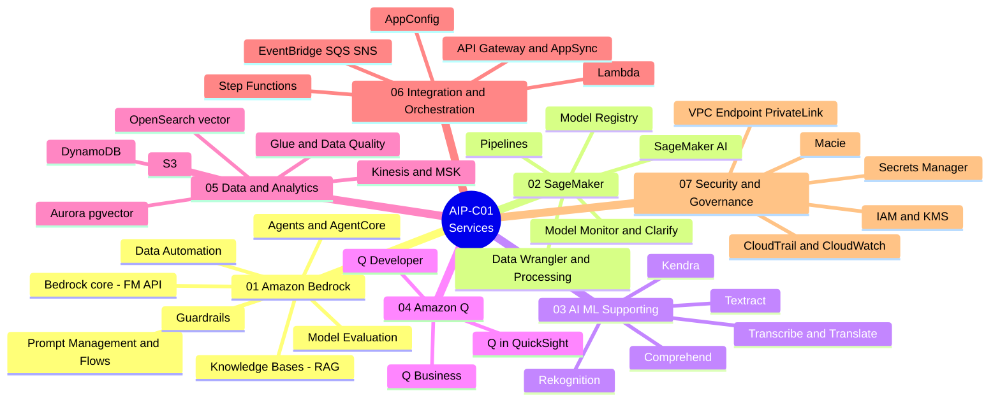

# 📚 Basic Knowledge — サービスカテゴリ別

[← ホーム](../../README.md)

このセクションは、知識を **AWS のサービスカテゴリ別** に整理しています（5 つの試験ドメイン別ではなく）。検索しやすさ重視で、Bedrock は一箇所、security は一箇所にまとまっています。

> ⚠️ 試験の採点は依然として **5 つの domain** ベースです。試験との対応を保つため、各サービスには *関連 domain* のタグを付け、下に [service ↔ domain 対応表](#service--5-exam-domain-対応表) を用意しています。

## 📌 2026 年のフォーカス更新（Agentic AI）

2026 年の GenAI のフォーカスは、**RAG**（検索して答える）から **Agentic AI**（推論して行動する）へシフトします。これは AIP-C01 の公式試験ガイドで **確認済み** です。専用の **Task 2.1「Implement agentic AI solutions and tool integrations」** があり、**Strands Agents**、**AWS Agent Squad**、ReAct、**Amazon Bedrock AgentCore** が明記されています。

- **重点学習:** AgentCore（Runtime/Memory/Gateway/Policy — [カテゴリ 01](./01-amazon-bedrock-services.md)）と Strands SDK + multi-agent パターン + MCP（[カテゴリ 06](./06-integration-orchestration-services.md)）。
- **選択のコツ:** 問題が単に「ドキュメントを読んで顧客に答える」なら → **Knowledge Bases (RAG)**。「どのツールを使うか判断する／plan-and-execute／不定の複数ステップ／multi-agent」なら → **Strands SDK + AgentCore**。「自律的に推論する」タスクで Step Functions を選ばないこと。
- **関係:** **Strands = framework（コードを書く）**、**AgentCore = infrastructure（実行する）** — セットで使う。

> *確度メモ:* RAG／MLOps／Security／Data は今も土台（知識の約 90% は変わらない）。**agentic 部分は公式フォーカス** です。ただし「Standard 版 2026-03-18 リリース」「Agentic AI microcredential」という具体的な記述は **未確認** です（beta は ～2026-03-31 まで、正式リリース日は AWS から明確な発表なし）。この 2 点は確定として扱わないこと。

## マインドマップ — 7 つのサービスカテゴリ

## 7 つのサービスカテゴリ

| # | カテゴリ | 含まれるもの（例） | ファイル |
|---|---|---|---|
| 01 | **Amazon Bedrock Services** | Bedrock core、Knowledge Bases、Guardrails、Prompt Management/Flows、Agents/AgentCore、Model Evaluation、Data Automation | [→](./01-amazon-bedrock-services.md) |
| 02 | **SageMaker Services** | SageMaker AI、Model Registry、Pipelines、Data Wrangler、Processing、Model Monitor、Clarify、JumpStart | [→](./02-sagemaker-services.md) |
| 03 | **AI/ML Supporting Services** | Comprehend、Textract、Transcribe、Translate、Rekognition、Polly、Kendra | [→](./03-ai-ml-supporting-services.md) |
| 04 | **Amazon Q Services** | Q Business、Q Developer、Q in QuickSight | [→](./04-amazon-q-services.md) |
| 05 | **Data & Analytics Services** | S3、OpenSearch (vector)、Aurora pgvector、DynamoDB、Glue (Data Quality)、Kinesis、MSK、Athena | [→](./05-data-analytics-services.md) |
| 06 | **Integration & Orchestration Services** | Lambda、Step Functions、API Gateway、AppSync、EventBridge、SQS、SNS、AppConfig | [→](./06-integration-orchestration-services.md) |
| 07 | **Security & Governance Services** | IAM、KMS、VPC Endpoint/PrivateLink、CloudTrail、CloudWatch、Macie、Secrets Manager | [→](./07-security-governance-services.md) |

## Service ↔ 5 exam domain 対応表

各カテゴリが主にどの domain を「カバー」するかを示します。サービス別に学んでも、どの採点領域を押さえているか分かるようにするためです。

| カテゴリ \ Domain | D1 (31%) | D2 (26%) | D3 (20%) | D4 (12%) | D5 (11%) |
|---|:---:|:---:|:---:|:---:|:---:|
| 01 Bedrock | ●●● | ●●● | ●● | ●● | ●● |
| 02 SageMaker | ●● | ●● | ● | ● | ●● |
| 03 AI/ML Supporting | ●● | ●● | ● | | |
| 04 Amazon Q | ● | ●● | ● | | |
| 05 Data & Analytics | ●●● | ● | ● | ● | |
| 06 Integration & Orchestration | ●● | ●●● | | ●● | ● |
| 07 Security & Governance | ● | | ●●● | ● | ● |

> ● 補助 · ●● 中 · ●●● 主要。（レベルは学習の方向づけ用の目安であり、AWS 公式の数値ではありません。）
> 5 つの domain: **D1** FM Integration & Data · **D2** Implementation & Integration · **D3** AI Safety/Security/Governance · **D4** Operational Efficiency · **D5** Testing/Validation/Troubleshooting。

## 各「service card」の読み方

各サービスは、平易な言葉で、次の形で簡潔に説明します。

- **1 文の説明** — 分かりやすい比喩で。
- **解決する問題** — 実際に何に使うか。
- **使うべきとき** — 問題文／案件のどんなシグナルで選ぶか。
- **使わないとき／混同しやすいもの** — 他サービスとの境界線。
- **関連 exam domain** — D1…D5 のタグ。
- **⚠️ 必ず覚える** — よくある罠。
- **🧪 1 行の例** — 手早いイメージ。
