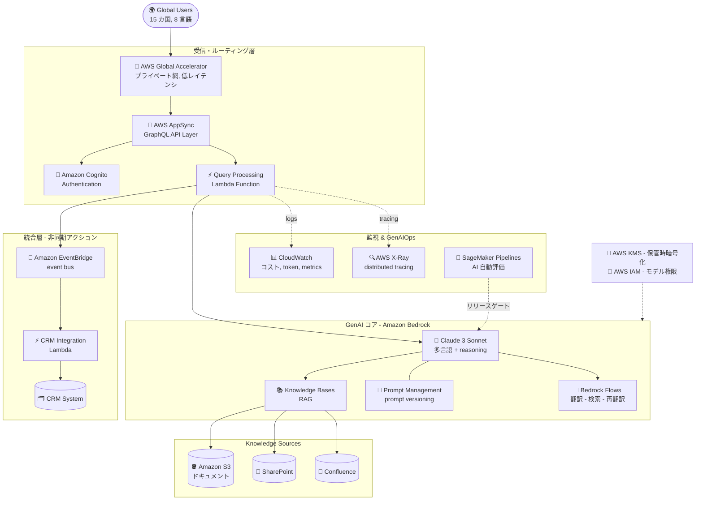

# ケーススタディ 01 — 多国籍銀行のカスタマーサポート Chatbot

[← ケーススタディに戻る](./README.md)

| | |
|---|---|
| **中心概念** | エンドツーエンドの GenAI アーキテクチャ: FM 選定 → 安全な RAG → CRM 統合 → グローバルネットワーク → GenAIOps |
| **関連ドメイン** | D1 (FM & Data), D2 (Integration), D3 (Security/Governance), D4 (Operational Efficiency) |
| **主要サービス** | Bedrock (Claude 3 Sonnet, Knowledge Bases, Prompt Management, Flows), AppSync, EventBridge, Global Accelerator, Cognito, KMS, IAM, CloudWatch, X-Ray, SageMaker Pipelines |

---

## 1. ユースケース要約

> **多国籍金融サービス企業**が、**15 カ国・8 言語**にまたがるカスタマーサポート (CS) を強化したい。顧客の質問を理解し、**社内ナレッジに基づいて正確に**回答し、既存の **CRM とシームレスに統合**する GenAI ソリューションが必要。さらに **金融規制を遵守**し、**データプライバシーを保護**し、**地域間で一貫した体験**を提供し、**応答時間を 70% 削減**しなければならない。

「国際銀行向けの AI カスタマーサポートセンター」を作る、と想像してほしい。遊びの chatbot ではなく、8 言語を話し、銀行業務を理解し、金利を捏造せず、「人間に引き継ぐ」タイミングを知り、東京でもサンパウロでも同じ速さで動く仮想エージェントだ。

### 解くべき要件

ユースケースを具体的な要件に分解する — これが下のアーキテクチャが 1 つずつ満たすべき「試験問題」になる:

| # | 要件 | なぜ難しいか |
|---|---|---|
| R1 | **多言語 + 金融推論** | 8 言語・複雑な金融質問 → 言語と reasoning の両方に強い「頭脳」が必要 |
| R2 | **社内ソースから正確に回答、捏造なし** | 金利を 1 つ間違えれば法的リスク → RAG 必須、hallucination 禁止 |
| R3 | **安全な CRM 統合** | 顧客が「クレジットカードを開設」と言う → システムは行動すべきだが、AI は core banking に直接触れては**ならない** |
| R4 | **高速かつグローバルに一貫した応答** | 時間 70% 削減、15 カ国の顧客が同じ体験 |
| R5 | **セキュリティ & 金融コンプライアンス** | ユーザー認証、機微データの暗号化、厳格な権限 |
| R6 | **信頼できる運用 (GenAIOps)** | コスト/token の計測、ボトルネック発見、リリース前の AI 品質検証 |

---

## 2. アーキテクチャ図

---

## 3. なぜこのアーキテクチャが要件を満たすか (Design Rationale)

### R1 → 「頭脳」: Claude 3 Sonnet（最安モデルではない）

英語しか話せず思考も遅い CS 担当者を、8 カ国の複雑な金融質問に対応させるのは無理だ。

複数の FM（Titan, Llama, Cohere, Claude）から選ぶとき、**Claude 3 Sonnet** を選ぶのは、合理的なコスト帯で **多言語 (multilingual)** と **複雑な推論 (reasoning)** の最良のバランスを持つから。他モデルは安いかもしれないが、言語能力で落ちたり金融文脈を掴めなかったりしやすい。*(注: 元の図は "Claude 3 Sonnet" 表記; 選定原則は新しい Claude でも有効 — reasoning + 多言語に強いモデルを優先。)*

### R2 → 「記憶ノート」: Bedrock Knowledge Bases (RAG)、fine-tuning ではない

銀行規則をすべて丸暗記させる（そして覚え違える）代わりに、書庫に直結した **参照ノート** を渡す。顧客が質問 → ノートを開く → 調べる → 回答。

**Knowledge Bases** は自動で chunk → embed → ベクトル保存 → 検索を行い、AI が実際の文書に基づいて回答し、金融数値の **捏造 (hallucinate) を防ぐ**。重要なのは **S3, SharePoint, Confluence** に直結する **connector** が標準装備 → データ取込コードを手書きしなくてよい。

- **なぜ fine-tuning でない?** 規制/金利は常に変わる; 変更のたびに再 fine-tune は極めて高コストで遅い。RAG はソース文書を更新するだけ — これが古典的な罠: 「社内知識を更新」→ 常にまず RAG を考える。

### R3 → 規律ある「手足」: EventBridge、AI に DB を直接呼ばせない

顧客が「クレジットカードを開設して」と言っても、AI が **金庫 (core banking) に自分で手を突っ込んでは**いけない。AI は **「依頼票」** を書いてポストに入れるだけ; 業務部門 (CRM) が票を受け取り処理する。

その「ポスト」が **Amazon EventBridge**: AI/Lambda が **Event** を発行 → EventBridge が **CRM Integration Lambda** にルーティング → CRM が **非同期 (async)** でチケットを開く。

- **なぜ AI に API/DB を直接呼ばせず EventBridge?** 疎結合 (decoupling) → 安全 (AI は core banking への書込権限を持たない)、耐障害 (CRM が忙しくても event は待機)、拡張容易。金融 DB への直接書込権限を AI に与えるのは許容できないセキュリティリスク。
- **なぜ REST でなく AppSync (GraphQL)?** 顧客は **モバイルアプリ** を使う; GraphQL はアプリが必要なデータだけを取得 → 3G/4G 帯域を節約、over-fetching を削減。

### R4 → 「VIP 高速道路」: Global Accelerator、CloudFront ではない

CloudFront は **自宅近くの冷凍倉庫**（静的な画像/動画を事前キャッシュ）のようなもの。だが AI チャットは **毎回新規生成される動的データ** — キャッシュできない。海を越える **専用高速道路** が要る。

> ⚠️ **間違えやすい点:** 多くのエンジニアが「グローバル高速化」に反射的に **CloudFront** を選ぶ。このケースでは誤り。CloudFront は **キャッシュ可能な静的コンテンツ** に最適。**グローバル低レイテンシ** が必要な GenAI API（動的・非キャッシュ）の答えは **AWS Global Accelerator** — トラフィックを公衆インターネットでなく **AWS のプライベートバックボーン** 経由でルーティングし、低く安定したレイテンシを実現。これが **応答時間 70% 削減** と 15 カ国での **一貫した体験** の鍵。

### R5 → 「警備チーム」: Cognito + KMS + IAM（最強トリオ）

**Cognito** = 入口で身分証を確認する警備員; **KMS** = 暗号化の金庫; **IAM** = 社内の権限バッジ。

- **Amazon Cognito** — 認証 (authentication): 本物の銀行顧客だけ入場可。
- **AWS KMS** — 機微な金融データの保管時暗号化 (encryption at rest)。
- **AWS IAM** — role 別権限: 例えば Role A だけが Claude 3 Sonnet（高価・強力）を呼べ、Role B は安価なモデルのみ。これが **金融コンプライアンス + データプライバシー** に直接対応。

### R6 → 「探偵 & 検査官」: X-Ray + CloudWatch + SageMaker Pipelines

**CloudWatch** = 今日 AI がいくら金/token を使ったか記帳する会計係。**X-Ray** = 各工程をストップウォッチで測る探偵。**SageMaker Pipelines** = 本番投入前にゲートに立つ品質検査官。

- **CloudWatch** — コスト, token, 運用 metric のダッシュボード。
- **AWS X-Ray:** 顧客が「チャットが遅い」と訴えたとき、遅いのが **Vector DB クエリ** か **LLM の応答** か、どう分かる? → **X-Ray (distributed tracing)** が各ステップを計測しボトルネックを特定。CloudWatch は「遅い」を、X-Ray は「どこで遅い」を教える。
- **SageMaker Pipelines:** 通常ソフトは CodePipeline/GitLab CI でテストする。だが AI では **コードは正しくても AI が言う内容が誤り** になりうる（金利捏造、基準逸脱、バイアス）。AWS は **SageMaker Pipelines** で **自動評価 (automated evaluation)** フロー — 精度・バイアス・コンプライアンスの検査 — を新モデル版のリリース前に構築する。

---

## 4. 代替案とトレードオフ (Alternatives & trade-offs)

| 決定 | 正しい選択 | よくある誤り | 理由 |
|---|---|---|---|
| 社内知識の更新 | **Knowledge Bases (RAG)** | Fine-tuning | 文書は常に変化; RAG はファイル差替のみ、fine-tune は高コスト・遅い |
| 動的グローバル API の高速化 | **Global Accelerator** | CloudFront | CloudFront は静的のみキャッシュ; AI チャットは動的 |
| AI のアクション実行（カード開設） | **EventBridge** (async) | AI に DB/API を直接呼ばせる | 疎結合 = 安全 + 耐障害; AI は core banking に触れない |
| モバイル向け API | **AppSync (GraphQL)** | 多数の REST endpoint | GraphQL は必要十分なデータ取得、帯域節約 |
| レイテンシのボトルネック特定 | **X-Ray** | CloudWatch のみ | CloudWatch は「遅い」、X-Ray は「どのステップで遅い」 |
| AI 品質の検証 | **SageMaker Pipelines** | CodePipeline/GitLab CI | CI はコードをテスト; AI は精度/バイアス/コンプラのテストが必要 |

---

## 5. 💡 学び (Lesson learned)

> **「グローバル企業 + 安全な RAG + 高速チャット応答 + コンプライアンス」** という問題を見たら、すぐにこの 4 点セットを思い浮かべる:
> **Claude 3 (頭脳) + Bedrock Knowledge Bases (RAG ノート) + Global Accelerator (ネットワーク) + SageMaker Pipelines (QA 検査官)。**

- **RAG ≠ fine-tuning:** 「社内知識を更新」→ 常にまず RAG。
- **Global Accelerator ≠ CloudFront:** 動的・低レイテンシのグローバル API → Global Accelerator; キャッシュ可能な静的 → CloudFront。
- **AI はコアシステムに直接アクションしない:** 常に **EventBridge** (event-driven, async) 経由で疎結合かつ安全に。
- **X-Ray ≠ CloudWatch:** CloudWatch = 「遅い」; X-Ray = 「どこで遅い」。
- **GenAIOps ≠ 通常の DevOps:** AI の検証（精度/バイアス/コンプラ）→ **SageMaker Pipelines**、純粋なコード CI/CD ではない。

🔗 **関連:** [01. Bedrock](../01-basic-knowledge/01-amazon-bedrock-services.md) · [06. Integration & Orchestration](../01-basic-knowledge/06-integration-orchestration-services.md) · [07. Security & Governance](../01-basic-knowledge/07-security-governance-services.md) · [Practice exam](../03-practice-exam/)
