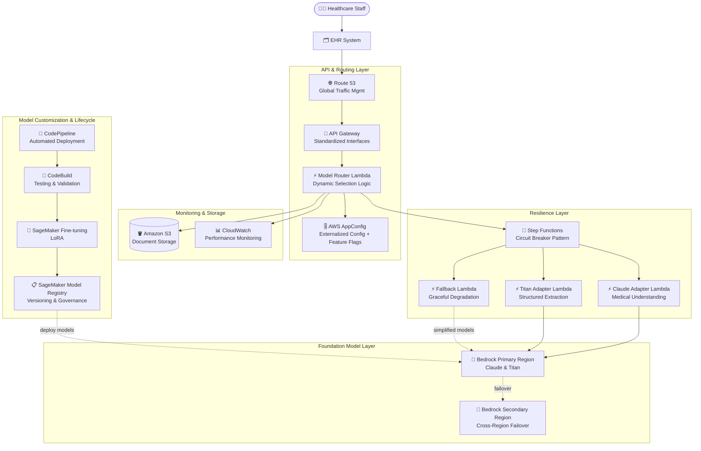

# ケーススタディ 02 — ヘルスケアプロバイダー向け医療記録分析システム

[← ケーススタディに戻る](./README.md)

| | |
|---|---|
| **中心概念** | マルチ FM の abstraction layer + resilience（耐障害）+ GenAIOps（ミッションクリティカルな医療システム向け） |
| **関連ドメイン** | D1 (FM Selection & Data), D2 (Integration), D4 (Operational Efficiency), D5 (Testing/Resilience) |
| **主要サービス** | Bedrock (Model Evaluation, Cross-Region Inference), Lambda, API Gateway, AppConfig, Step Functions, Route 53, SageMaker (Fine-tuning + LoRA, Model Registry, Model Monitor), CodePipeline/CodeBuild, S3, CloudWatch |

---

## 1. ユースケース要約

> 北米の**大手ヘルスケアプロバイダー**が、**医療記録を分析し、重要な臨床情報を抽出し、構造化レポートを生成**して電子カルテ (EHR) に取り込む AI システムを必要としている。多様な文書（臨床ノート、検査結果、放射線所見、患者履歴）を扱い、**HIPAA を厳格に遵守**し、**99.9% availability**、**医療用語の高精度**、**医学/用語の変化への適応**を実現すること。

大病院向けの「AI 医療記録処理室」を作ると想像してほしい。ここでの死活問題は賢い AI モデルを 1 つ選ぶことではなく、そのモデルが **処理中に故障** したり AWS の region が **ダウン** したりしてもシステムが止まってはならない点だ — 背後に患者に関わる臨床ワークフローがあるから。この問題は **単一 FM に依存しない** システムと **障害時に自己回復** する設計力を試す。

### 解くべき要件

| # | 要件 | なぜ難しいか |
|---|---|---|
| R1 | **医療に適した FM を根拠を持って選ぶ** | 医療知識 + 構造化抽出で複数 FM を客観的に比較する必要、勘で選ばない |
| R2 | **単一 FM へのハードロックインを避ける** | 医学は変化; コード全体を書き直さずに新モデルへ切替/試行できること |
| R3 | **99.9% availability、耐障害** | 医療記録は重要; FM 1 つの故障や region ダウンでシステムを止めない |
| R4 | **HIPAA 遵守 + PHI 保護** | 個人健康情報 (PHI) を検出して秘匿 (redact) |
| R5 | **固有の医療用語へのカスタマイズ** | 汎用 FM では不十分; fine-tune が必要だが計算コストを抑える |
| R6 | **モデルのライフサイクル統治 + 臨床検証** | version 管理、lineage 追跡、本番前に医師承認のステップが必要 |

---

## 2. アーキテクチャ図

---

## 3. なぜこのアーキテクチャが要件を満たすか (Design Rationale)

### R1 → データで FM を選ぶ: Bedrock Model Evaluation

医療システムの「頭脳」を勘で選ぶべきではない。**Amazon Bedrock Model Evaluation** は複数 FM を正しい医療基準で体系的にベンチマークできる: 用語抽出の精度、PHI の検出・秘匿能力、複雑な医療推論。結果は運用制約（latency、ピーク throughput、コスト）と併せて評価され、モデル選定を好みでなく TCO ベースの決定に変える。

### R2 → FM ロックイン回避: Abstraction Layer (Lambda + API Gateway + AppConfig)

各 FM を交換可能な「サプライヤー」と捉える。business logic を 1 つのサプライヤーに溶接しない。

- **API Gateway** が標準の request/response インタフェースを提供 — アプリは背後の FM を知らずに「文書分析」を呼ぶ。
- **Adapter Lambda** が異なる FM 間の入出力を正規化（Claude adapter, Titan adapter）し、どのモデルでもアプリの挙動を一貫させる。
- **AWS AppConfig** がモデル選定基準をコード外に出す (externalized)。モデル切替や特定部門の **A/B testing** 有効化 → **feature flag** を変えるだけ、**コード再デプロイ不要**。

> ⚠️ **間違えやすい点:** モデル選定をソースに hard-code しない。「runtime でモデル切替 / 再デプロイなしの A-B testing」→ **AppConfig**、コード編集ではない。

### R3 → 耐障害: Step Functions (Circuit Breaker) + Cross-Region Inference + Route 53

ミッションクリティカルな医療システムで最も重要な部分。

- **Step Functions** が **circuit breaker（自動遮断器）** 役: FM 性能を監視し、モデルが劣化/故障したら **代替モデルへ自動ルーティング**、**exponential backoff** で retry。
- **Bedrock Cross-Region Inference + Route 53 health checks**: region が不調なら traffic を **健全な region** へ自動切替。AWS region 障害時に停止を約 3 分に抑える（数時間でなく）仕組みがまさにこれ。
- **Fallback Lambda（graceful degradation）**: 高級 FM が利用不可でも、簡易モデルや rule-based でコア機能を維持。

> ⚠️ **間違えやすい点:** 「circuit breaker / 故障時に別モデルへ自動切替」→ **Step Functions**、ばらばらの自前 try/catch ではない。「モデル層のマルチ region HA」→ **Cross-Region Inference + Route 53**、単一 region と混同しない。

### R4 → HIPAA 遵守 + PHI 保護

PHI（protected health information）の検出と **秘匿 (redact)** は FM 評価基準 (R1) に組み込まれ、フロー内で処理される。CloudWatch 監視 + 統制された S3 保存と組み合わせ、コンプライアンスの証跡を確保。

### R5 → コスト効率的なカスタマイズ: SageMaker Fine-tuning with LoRA

汎用 FM は固有の医療用語に十分な深さがない。**SageMaker AI** で fine-tune するが、**LoRA (Low-Rank Adaptation)** — **parameter-efficient** な手法 — を使う: フルファインチューンに近い性能を、**計算コストを大幅削減**して達成（モデル全体でなくごく一部のパラメータのみ学習）。

### R6 → ライフサイクル統治: Model Registry + Model Monitor + CodePipeline

- **SageMaker Model Registry**: カスタムモデルの version 管理、lineage 追跡（dataset → デプロイ済モデル）、本番前の **臨床検証ステップ付き approval workflow**（医師承認）。
- **CodePipeline + CodeBuild**: 自動テスト（医療精度、HIPAA 遵守、EHR 統合）→ デプロイのパイプライン。Lambda alias 経由の **blue-green deployment** で version をスムーズに切替。
- **SageMaker Model Monitor**: 医療用語、文書フォーマット、抽出精度の **drift** を追跡。

---

## 4. 代替案とトレードオフ (Alternatives & trade-offs)

| 決定 | 正しい選択 | よくある誤り | 理由 |
|---|---|---|---|
| FM 選定 | **Bedrock Model Evaluation** | 勘/価格で選ぶ | 医療基準で客観的にベンチマークが必要 |
| runtime でモデル切替 | **AppConfig (feature flags)** | Hard-code + 再デプロイ | AppConfig はデプロイなしで config 変更 |
| 故障時のモデル自動切替 | **Step Functions (circuit breaker)** | ばらばらの try/catch | SF が retry/failover を体系的に編成 |
| モデル層のマルチ region HA | **Cross-Region Inference + Route 53** | 単一 region | region ダウンで全システム喪失 |
| コスト効率的な fine-tune | **SageMaker 上の LoRA** | フルファインチューン | LoRA は同等性能をはるかに安く |
| モデル統治 | **Model Registry + approval** | 直接デプロイ | 医療は本番前に医師検証が必要 |

---

## 5. 💡 学び (Lesson learned)

> **「ミッションクリティカル（医療/金融）+ 複数 FM + 高い耐障害 + ドメインカスタマイズ」** を見たら、すぐにこの combo を:
> **Bedrock Model Evaluation (FM 選定) + AppConfig 経由の Abstraction Layer (柔軟なモデル切替) + Step Functions circuit breaker + Cross-Region Inference (耐障害) + LoRA + Model Registry (ライフサイクル)。**

- **Abstraction layer = FM ロックインなし:** API Gateway 標準化 + Adapter Lambda + AppConfig 外部化 → コード変更なしでモデル切替。
- **Resilience = Circuit breaker + Cross-Region + Graceful degradation:** この 3 層が region 障害時に数分の停止で済む理由。
- **LoRA:** フルに近い性能をはるかに安く — 「コスト効率的なカスタマイズ」に選ぶ。
- **Model Registry + 臨床承認:** 重要産業は本番前に human-in-the-loop のモデル承認が必須。
- **AppConfig ≠ Secrets Manager ≠ Parameter Store:** AppConfig は A-B testing & rollout 用の dynamic config/feature flag。

🔗 **関連:** [01. Bedrock](../01-basic-knowledge/01-amazon-bedrock-services.md) · [02. SageMaker](../01-basic-knowledge/02-sagemaker-services.md) · [06. Integration & Orchestration](../01-basic-knowledge/06-integration-orchestration-services.md) · [Practice exam](../03-practice-exam/)
