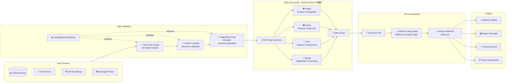

# ケーススタディ 03 — 保険金請求査定のためのマルチモーダルパイプライン

[← ケーススタディに戻る](./README.md)

| | |
|---|---|
| **中心概念** | 編成されたマルチモーダルパイプライン（text + image + audio + tabular）、data fusion を経て FM へ |
| **関連ドメイン** | D1 (Data & FM), D2 (Integration & Orchestration), D5 (Validation) |
| **主要サービス** | Step Functions, Glue Data Quality, SageMaker (Data Wrangler, Processing), Lambda, Comprehend, Transcribe, Rekognition, Bedrock, CloudWatch |

---

## 1. ユースケース要約

> **大手保険会社**が、**多様なデータソース**を分析できる AI で請求処理を近代化したい: 請求フォーム、**損害写真**、**顧客通話録音**、**過去の請求データ**。目標は請求の妥当性査定、修理費見積、**不正検知**、そして査定担当 (adjuster) への包括的な洞察提供。

「自動請求査定室」を作ると想像してほしい。難しいのは 1 種類のデータ処理ではなく、**まったく異なる 4 種類のデータ**が同時に届くこと — 文字、画像、音声、表 — それらを AI が読める **一貫した 1 枚の絵に統合** しなければならない。この問題は、各データ型に専用ツールを当て、編成と入力品質チェックを備えた並列処理ラインの設計力を試す。

### 解くべき要件

| # | 要件 | なぜ難しいか |
|---|---|---|
| R1 | **入力データ品質の検証** | レガシーデータは規格外（policy 番号の不正フォーマット…）; garbage in → garbage out |
| R2 | **異なる 4 種類のデータを並列処理** | text/画像/audio/tabular — 各々専用ツール、高速化のため並列実行 |
| R3 | **マルチモーダルデータの統合** | 4 ソースの情報を FM 向けの一貫した「請求ファイル」に統合 |
| R4 | **複雑なフローの編成、データ関係の保持** | 多数の並列ステップだが関連部分の論理的リンクを保持 |
| R5 | **FM 前の入力正規化** | 規格外の損害記述、保険略語 → FM の精度低下 |
| R6 | **品質の継続監視** | 品質指標が閾値を下回ったら警告 |

---

## 2. アーキテクチャ図

---

## 3. なぜこのアーキテクチャが要件を満たすか (Design Rationale)

### R1 → 入力品質の検証: Glue Data Quality + Lambda + Data Wrangler

「garbage in, garbage out」— 保険請求では汚いデータが誤査定と損失を招く。補完し合う 3 層のチェック:

- **AWS Glue Data Quality**: 構造化データの rule-based チェック — policy 番号の有効性、損害日が補償期間内か、請求額が policy 上限内か。
- **SageMaker Data Wrangler**: データ分布を視覚的に探索し異常を発見（例: レガシー間で policy 番号のフォーマット不一致）。
- **Custom Lambda**: 保険固有ロジック — VIN が make/model と一致、医療手技コードの有効性、損害記述が写真と一致。

### R2 + R4 → 並列処理と編成: Step Functions、各型に専用ツール

アーキテクチャの心臓部。**Step Functions** が **並列** フローを編成し、各データ型をそれが最も得意なツールに割り当てる:

- **Text（請求記述）** → **Amazon Comprehend**: 言語・sentiment・エンティティ検出。
- **Image（損害写真）** → **Amazon Rekognition**: 物体・損害パターン・画質を検出; SageMaker Processing で深刻度分析。
- **Audio（録音）** → **Amazon Transcribe**: 音声→テキスト; Transcribe Call Analytics で sentiment + 不正の兆候。
- **Tabular** → **SageMaker Processing**。

> ⚠️ **間違えやすい点:** 論理関係を保つ多段並列パイプライン → **Step Functions**（編成）、巨大な 1 つの Lambda に詰め込まない。1 つのツールで全データ型をやらせない — modality ごとに専用サービス（text→Comprehend、画像→Rekognition、audio→Transcribe）。

### R3 → データ統合: Data Fusion

4 つの分岐処理が終わると、**Data Fusion**（Step Functions が編成）が modality 間の情報を整合させ、FM が消費する一貫した包括的な「請求ファイル」を作る。

### R5 → 入力正規化: Bedrock 自身で推論前に「洗浄」

規格外の入力（一貫しない損害記述、保険略語、文法誤り）は FM 精度を下げる。巧妙な解: **Amazon Bedrock 自身を専用 prompt で使い** 入力を正規化 — 略語展開、誤り修正 — してから主査定モデルへ送る。Comprehend がエンティティ抽出を担当; ナレッジベースから文脈を補完（車両仕様、修理費ベンチマーク）。

### R6 → 監視: CloudWatch

CloudWatch metrics + alarms が validation 結果を経時追跡し、品質が閾値を下回ると自動警告。

---

## 4. 代替案とトレードオフ (Alternatives & trade-offs)

| 決定 | 正しい選択 | よくある誤り | 理由 |
|---|---|---|---|
| 多段パイプラインの編成 | **Step Functions** | 巨大な 1 Lambda | SF は論理関係保持・並列・retry 容易 |
| text 分析 | **Comprehend** | 自前 NLP | Managed、entity/sentiment 標準装備 |
| 画像分析 | **Rekognition** | 自前で vision モデル学習 | Managed、物体/損害を即検出 |
| audio→text | **Transcribe** | 自前処理 | Call Analytics + sentiment + 不正兆候 |
| 構造化データ品質検証 | **Glue Data Quality** | ばらばらの自前ルール | 集中 rule-based + 監視 |
| FM 向け入力正規化 | **正規化 prompt の Bedrock** | 省略 | クリーンな入力 → FM 精度が顕著に向上 |

---

## 5. 💡 学び (Lesson learned)

> **「複数のデータ型（text/画像/audio/表）を処理して FM へ」** を見たら、すぐにこの combo を:
> **Step Functions（並列編成）+ Comprehend/Rekognition/Transcribe（modality ごとに 1 ツール）+ Data Fusion + Bedrock（入力正規化 & 推論）。**

- **modality ごとに専用サービス:** text→Comprehend、画像→Rekognition、audio→Transcribe。1 ツールに全部やらせない。
- **複雑な編成 = Step Functions:** 論理関係 + 並列、1 Lambda に詰めない。
- **「garbage in, garbage out」:** パイプライン前に data quality 層（Glue Data Quality + Data Wrangler + Lambda）へ投資。
- **FM 自身で入力洗浄:** 効果的な技 — 主モデル前に Bedrock で入力を正規化/展開。

🔗 **関連:** [03. Data & RAG](../01-basic-knowledge/03-data-rag-knowledge-services.md) · [05. Specialized AI](../01-basic-knowledge/05-specialized-ai-services.md) · [06. Integration & Orchestration](../01-basic-knowledge/06-integration-orchestration-services.md) · [Practice exam](../03-practice-exam/)
