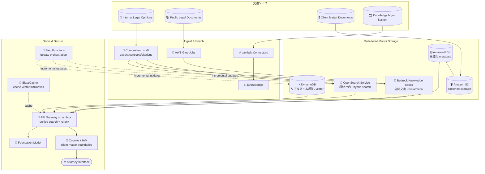

# ケーススタディ 04 — グローバル法律事務所向け法務リサーチアシスタント

[← ケーススタディに戻る](./README.md)

| | |
|---|---|
| **中心概念** | マルチ階層 (multi-tiered) ベクトルデータベース構成 — 法務データの種類ごとに正しいストアを選ぶ |
| **関連ドメイン** | D1 (Data & RAG), D2 (Integration), D3 (Security) |
| **主要サービス** | Bedrock Knowledge Bases, OpenSearch Service (neural plugin), RDS, S3, DynamoDB, Comprehend, Glue, EventBridge, Step Functions, ElastiCache, API Gateway, Lambda, Cognito, IAM |

---

## 1. ユースケース要約

> **30 カ国**にオフィスを持つ**グローバル法律事務所**が、弁護士が **数百万件・多言語の文書** から判例・法令・規制・社内法務意見を素早く見つけられる AI 法務リサーチアシスタントを必要としている。旧システムは keyword matching のみ → 弁護士は平均 **週 15 時間** をリサーチに費やし結果も不安定。

法律事務所向けの「AI 司書」を作ると想像してほしい。核心の難しさ: 法務データは **不均質** — 公開文書、極秘の社内意見、構造化メタデータ、リアルタイムで変わる規制。各々セキュリティ・速度・クエリ方式の要件が異なる。この問題は、すべてを 1 箇所に詰め込まず **データ型ごとに正しいストアを選ぶ** 力を試す。

### 解くべき要件

| # | 要件 | なぜ難しいか |
|---|---|---|
| R1 | **keyword でなく意味検索** | keyword matching は結果が悪い; 法務文脈を理解する semantic search が必要 |
| R2 | **多様なデータ型、各々別要件** | 公開 vs 極秘社内 vs metadata vs リアルタイム規制 — 1 ストアでは無理 |
| R3 | **client-matter 境界のセキュリティ** | 弁護士は権限のある結果だけ閲覧 (privilege boundaries) |
| R4 | **1,500 万文書での性能** | 巨大量で sub-second クエリ |
| R5 | **法務情報のリアルタイム更新** | 新判例/法令は公表後数時間で検索に出現 |
| R6 | **既存の文書管理システムと統合** | 複数 DMS、knowledge management system を接続 |

---

## 2. アーキテクチャ図

---

## 3. なぜこのアーキテクチャが要件を満たすか (Design Rationale)

### R1 + R2 → マルチ階層ストレージ: データ型ごとに正しいツール

このケースの主旨。すべての法務データに最適な単一ストアは存在しないので **multi-tiered** を使う:

- **Bedrock Knowledge Bases** = **公開法務文書** 用: 管轄 (jurisdiction) と分野で階層 (hierarchical) 整理し、chunking 時に文書の論理構造を保持。Managed RAG で運用が軽い。
- **OpenSearch Service (neural plugin)** = **機微な社内意見 & 顧客文書** 用: トピック別セグメント化を可能にし、**厳格なセキュリティ境界** を保ち、**hybrid search**（意味 + keyword）に対応 — 1 文字単位の精度が要る法務用語に重要。
- **RDS**（構造化 metadata）+ **S3**（文書保存）: 複雑な metadata フィルタを semantic search と並行可能に。
- **DynamoDB (vector storage)** = **リアルタイムで変わる規制** 用: 最新更新の低レイテンシ取得。

> ⚠️ **間違えやすい点:** すべてを 1 つの vector store に詰めない。公開文書（managed, hierarchical）→ Knowledge Bases; hybrid search + 厳格セキュリティが要る機微社内 → OpenSearch; リアルタイム低レイテンシ → DynamoDB。

### R3 → client-matter セキュリティ: Cognito + IAM

法律事務所には厳格な privilege 制約 — 弁護士 A は担当外の顧客文書を見てはならない。**Cognito + IAM** が **client-matter boundaries** を尊重する認証フレームワークを構築し、検索結果を弁護士の権限内に限定。機微データを OpenSearch に分離 (R2) するのもこの目的に寄与。

### R4 → 1,500 万文書での sub-second: sharding + ElastiCache

- **OpenSearch cluster** を **practice area での sharding** + **時間ベースの sub-sharding** で構成 → 関連分野の最近文書を高速取得。
- **Multi-index** で法務分野ごとに専用 similarity アルゴリズム。
- **ElastiCache** が頻出クエリパターンの similarity を事前計算 → 頻繁なリサーチのレイテンシを大幅削減。

### R5 → リアルタイム更新: EventBridge + Lambda + Step Functions

- **EventBridge rules + Lambda** が新判例を公表時に処理（incremental update）。
- リアルタイム変更検知が公式ソースを監視し、影響文書の即時更新を起動。
- **Step Functions** が複雑な更新フロー（内容抽出 → vector 保存）を編成。定期 refresh パイプラインが最新 embedding model で corpus 全体を再処理; CloudWatch が取得精度を追跡。

### R6 → 既存 DMS と統合: Lambda Connectors + Glue + API Gateway

- **Lambda-based connectors** で複数の文書管理システムに対応、**EventBridge** でイベント取得。
- **AWS Glue jobs** が厳選法務インサイトを vector 互換フォーマットに変換。
- **API Gateway + Lambda** が統合検索インタフェースを作り、複数 vector store + 従来法務 DB の結果を集約、適切なソースへルーティングし関連度 + 判例価値で **rerank**。

---

## 4. 代替案とトレードオフ (Alternatives & trade-offs)

| データ型 / ニーズ | 正しい選択 | 他を使わない理由 |
|---|---|---|
| 公開文書、managed RAG | **Bedrock Knowledge Bases** | Hierarchical + 低運用; cluster 自己管理不要 |
| 機微社内、hybrid search | **OpenSearch (neural plugin)** | 厳格セキュリティ + semantic/keyword; KB はセグメント制御不足 |
| 構造化 metadata | **RDS** | 複雑フィルタ; 純 vector store は構造化クエリが弱い |
| リアルタイム規制 | **DynamoDB (vector)** | 低レイテンシ、継続更新 |
| ホットクエリのキャッシュ | **ElastiCache** | 反復クエリのレイテンシ削減 |
| 権限ベースのセキュリティ | **Cognito + IAM** | client-matter/privilege 境界を尊重 |
| リアルタイム更新 | **EventBridge + Lambda + Step Functions** | event-driven、遅い cron でない |

---

## 5. 💡 学び (Lesson learned)

> **「大量データ + セキュリティ/速度/クエリ方式が異なる多様なデータ型」** を見たら、すぐに **multi-tiered vector storage** 構成を — 型ごとに正しいストア、1 箇所に詰めない。

- **Knowledge Bases vs OpenSearch:** 公開データ向け managed RAG vs 機微データ向け厳格制御 + hybrid search。
- **リアルタイム vector に DynamoDB:** 低レイテンシ + 継続更新が要るとき。
- **RDS + S3** で構造化 metadata + 文書保存を semantic search と並行。
- **ElastiCache** で巨大 corpus の反復クエリのレイテンシ削減。
- **リアルタイム更新 = EventBridge + Lambda + Step Functions**、cron job でない。
- **法務セキュリティ = Cognito + IAM** で client-matter 境界を尊重。

🔗 **関連:** [01. Bedrock](../01-basic-knowledge/01-amazon-bedrock-services.md) · [03. Data & RAG](../01-basic-knowledge/03-data-rag-knowledge-services.md) · [07. Security & Governance](../01-basic-knowledge/07-security-governance-services.md) · [Practice exam](../03-practice-exam/)
