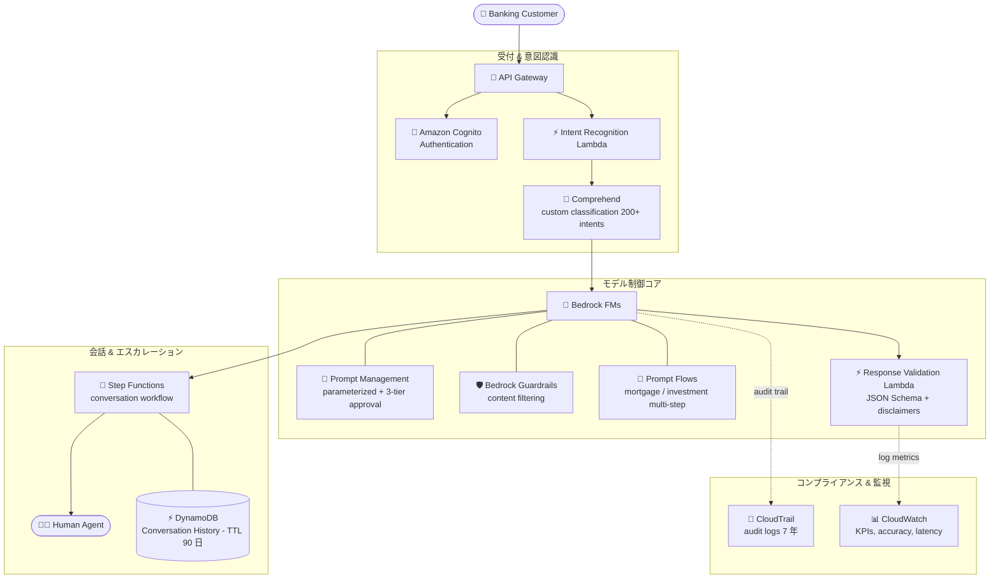

# ケーススタディ 05 — グローバル金融機関向け AI カスタマーサービスプラットフォーム

[← ケーススタディに戻る](./README.md)

| | |
|---|---|
| **中心概念** | モデル制御フレームワーク（prompt governance + guardrails + JSON Schema）で大規模にコンプライアンス & 一貫性を確保 |
| **関連ドメイン** | D2 (Integration), D3 (Security/Governance/Compliance), D4 (Operational Efficiency) |
| **主要サービス** | Bedrock (Prompt Management, Guardrails, Prompt Flows, FMs), Step Functions, Comprehend (custom classification), DynamoDB (TTL), CloudTrail, CloudWatch, Lambda |

---

## 1. ユースケース要約

> **30 カ国・5,000 万顧客**にサービスする**グローバル金融機関**が AI カスタマーサービスプラットフォームを展開: 定型的な銀行クエリ処理、パーソナライズされた金融ガイダンス、そして **複雑な問題を完全な文脈付きで人間エージェントへエスカレーション**。業務要件: 地域/言語間で一貫した処理; **金融規制 & プライバシー法の厳格な遵守**; **全 AI 対話の audit trail 保存**; 顧客履歴に基づくパーソナライズ; 人間へのスムーズなエスカレーション。

国際銀行向けの「AI コールセンター」を作ると想像してほしい。難しいのは AI に回答させることではなく、**AI が言ってよいことを制御** すること。規制違反の金融助言 1 つが重大な法的リスクになる。この問題は、モデルの周りに **ガバナンスフレームワーク** を構築する力を試す: prompt の標準化、禁止コンテンツのブロック、出力フォーマットの強制、そして監査向けに全記録を残すこと。

### 解くべき要件

| # | 要件 | なぜ難しいか |
|---|---|---|
| R1 | **地域 & 言語間の一貫性** | 30 カ国・多言語 — 回答は内容 & フォーマットで統一されるべき |
| R2 | **無許可の金融助言をブロック** | AI は市場予測や権限外の助言をしてはならない |
| R3 | **監査向け 7 年の audit trail** | 金融規制は全対話の数年保存を要求 |
| R4 | **顧客の意図に応じた正確なルーティング** | 200+ 種類の意図を正しく識別してルーティング |
| R5 | **会話文脈の管理、規制に沿った失効** | 再質問を避けるため履歴保存、だが法に従い自動削除 |
| R6 | **文脈付きで人間へエスカレーション** | 複雑な問題を情報を失わずエージェントへ |

---

## 2. アーキテクチャ図

---

## 3. なぜこのアーキテクチャが要件を満たすか (Design Rationale)

### R1 → 一貫性: Prompt Management + JSON Schema templates

- **Bedrock Prompt Management** が各銀行シナリオの prompt を標準化し、明確な役割定義（「AI は制限のある銀行アシスタント」）を持つ。顧客/口座/規制情報の変数を持つ **parameterized prompts** を使い → 1 つの prompt フレームを全地域に適用。
- **JSON Schema templates** が出力構造（口座詳細、取引履歴、手数料体系）を標準化 → 言語を問わず一貫した表示。このフレームでコンプライアンス違反を 97% 削減。

### R2 → 禁止コンテンツのブロック: Bedrock Guardrails

金融にとって鍵となる防御線。**Bedrock Guardrails** は厳格な content-filtering ポリシーで **AI が無許可の金融助言や市場変動の予測をするのを防ぎ**、規制対象活動に高い severity 閾値を設定。Response Validation Lambda が出力に必要な disclaimer、正確な手数料、適切なエスカレーション trigger があるか確認。

> ⚠️ **間違えやすい点:** 「AI に禁止コンテンツ / 無許可助言を言わせない」→ **Bedrock Guardrails**、prompt の指示だけではない（prompt は回避されうる）。

### R3 → 7 年監査: CloudTrail + CloudWatch Logs

**CloudTrail** が Bedrock への全 API call をログし、金融規制を満たすため **7 年保持**。**CloudWatch Logs** が全顧客対話をコンプライアンス監視のため記録。

> ⚠️ 区別: CloudTrail は **API の証跡（誰が何をいつ呼んだ）** を保存 — コンプライアンス audit trail に適する。**prompt/response の全内容** を保存する必要があれば Bedrock Model Invocation Logging を使う（他ケース参照）。ここでは対話の audit trail が要件 → CloudTrail + CloudWatch Logs。

### R4 → 意図ルーティング: Comprehend custom classification

**Amazon Comprehend** の **custom classification model** を銀行用語で学習し、**200+ の異なる意図** を識別して正確にルーティング。これが、FM に制御なく意図を推測させるのでなく Comprehend（managed NLP、自前 classifier 学習）を使う理由。

### R5 → 会話文脈 + 合法的失効: TTL 付き DynamoDB

**DynamoDB** が高速取得に最適化したスキーマで会話履歴を保存し、規制に従い **TTL (Time To Live) で 90 日後にデータを自動削除**。顧客が情報を繰り返す手間を 78% 削減。

> ⚠️ **間違えやすい点:** 「規制に従い N 日後にデータ自動削除」→ **DynamoDB TTL**、自前のクリーンアップ job ではない。

### R6 → 文脈付きエスカレーション + 複雑シナリオ: Step Functions + Prompt Flows

- **Step Functions** が会話フローを編成し、曖昧な要求への clarification loop と、完全な文脈付きで **Human Agent** へのエスカレーションを含む。
- **Bedrock Prompt Flows** が複雑な多段シナリオ（住宅ローン審査、投資計画）を金融プロファイル別の条件分岐で処理。Pre-processing が用語を正規化; post-processing が法的 disclaimer + 地域フォーマットを追加。

---

## 4. 代替案とトレードオフ (Alternatives & trade-offs)

| 決定 | 正しい選択 | よくある誤り | 理由 |
|---|---|---|---|
| 無許可コンテンツのブロック | **Bedrock Guardrails** | prompt の指示のみ | Guardrails はシステム層で強制; prompt は回避されうる |
| prompt の標準化 & version | **Prompt Management** | アプリに prompt を hard-code | version 管理 + approval workflow をデプロイなしで |
| 一貫した出力フォーマット | **JSON Schema templates** | FM に自由整形させる | Schema が言語横断で一貫構造を強制 |
| 意図認識 | **Comprehend custom classification** | FM に推測させる | 学習済 classifier は正確 & 制御可能 |
| 文脈の保存 & 失効 | **DynamoDB TTL** | 自前クリーンアップ job | TTL が規制通り自動削除、コード不要 |
| 長期コンプライアンス監査 | **CloudTrail (7 年)** | 一時ログ | 金融規制は数年保持を要求 |
| 多段シナリオ | **Prompt Flows** | 巨大な 1 prompt | Flows は条件分岐 + component 再利用 |

---

## 5. 💡 学び (Lesson learned)

> **「規制の厳しい産業（金融/医療）を支える AI + 出力制御 + コンプライアンス + 監査」** を見たら、すぐにこの制御フレームを:
> **Prompt Management (標準化) + Guardrails (コンテンツブロック) + JSON Schema (フォーマット強制) + CloudTrail (監査) + DynamoDB TTL (データライフサイクル)。**

- **Guardrails ≠ prompt の指示:** コンテンツブロックを強制したい → システム層の Guardrails。
- **ガバナンスには Prompt Management:** parameterized prompt + 3-tier approval + versioning、hard-code しない。
- **JSON Schema = 出力の一貫性**（言語/地域横断）。
- **Comprehend custom classification** で正確な意図ルーティング（200+ intents）。
- **DynamoDB TTL** = 規制通りにデータを自動失効。
- **CloudTrail** = 長期コンプライアンス audit trail（7 年）。

🔗 **関連:** [01. Bedrock](../01-basic-knowledge/01-amazon-bedrock-services.md) · [05. Specialized AI](../01-basic-knowledge/05-specialized-ai-services.md) · [07. Security & Governance](../01-basic-knowledge/07-security-governance-services.md) · [Practice exam](../03-practice-exam/)
