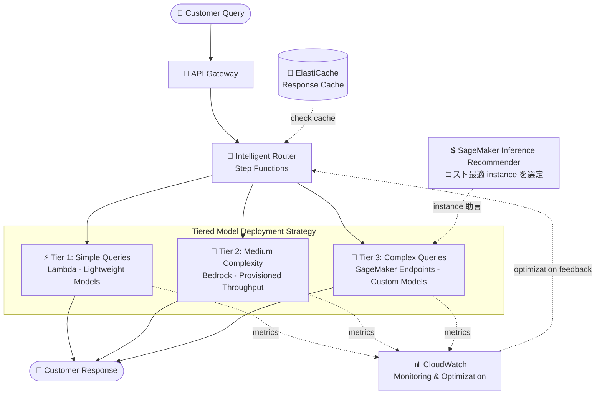

# ケーススタディ 06 — グローバル EC プラットフォーム向け スケーラブル AI カスタマーサポート

[← ケーススタディに戻る](./README.md)

| | |
|---|---|
| **中心概念** | 階層化モデルデプロイ (tiered deployment) — クエリの複雑さでインフラを選び、性能 & コストをバランス |
| **関連ドメイン** | D2 (Integration), D4 (Operational Efficiency & Cost), D5 (Optimization) |
| **主要サービス** | Lambda, Bedrock (Provisioned Throughput), SageMaker (Real-time endpoints, custom containers, Inference Recommender), API Gateway, Step Functions, CloudWatch, ElastiCache |

---

## 1. ユースケース要約

> 急成長中の**グローバル EC プラットフォーム**が、基本 FAQ から **複雑な製品トラブルシューティング** まで扱い、**繁忙期に高性能を維持**し、**通常時にコストを最適化**する AI サポートシステムを必要としている。要件: **20+ 言語** 対応; ピーク時に **10,000+ 同時セッション**; 定型クエリに **1 秒未満のレイテンシ**; 正確で詳細なトラブルシューティング; オフピークのコスト最適化; 地域ごとのデータ主権 (data sovereignty) 遵守。

EC プラットフォーム向けの AI コールセンターを作ると想像してほしい。難しいのは **変動の大きさ**: Black Friday には 10,000 同時セッション、通常はわずか。クエリも大きく異なる — 「注文はどこ?」（簡単）vs「この製品の firmware をどう直す?」（複雑）。すべてに 1 種類のインフラを使うと、莫大に高いか、ピークで遅いかになる。この問題は **階層化** の力を試す: 簡単な仕事は安いマシン、難しい仕事は強力なマシンへ。

### 解くべき要件

| # | 要件 | なぜ難しいか |
|---|---|---|
| R1 | **簡単なクエリを安く、自動スケール** | FAQ が大多数; 軽い仕事に高価な GPU を使うべきでない |
| R2 | **持続的 & 中程度の複雑さの負荷** | ピーク時に安定し予測可能な throughput が必要 |
| R3 | **複雑なトラブルシューティング、カスタムモデル** | カスタムモデル + 大きな context window が必要 |
| R4 | **複雑さに応じたスマートルーティング** | 正しいクエリを正しいモデル層へ |
| R5 | **オフピークのコスト最適化** | 各層に最も効率的な instance を選ぶ |
| R6 | **レイテンシ < 1s + 10,000 同時セッション** | 高速かつピーク負荷に耐える |

---

## 2. アーキテクチャ図

---

## 3. なぜこのアーキテクチャが要件を満たすか (Design Rationale)

### R1 + R2 + R3 → 3 つのデプロイ層、各々別インフラ

核心の思想: 「one size fits all」でなく **複雑さでインフラを選ぶ**。

- **Tier 1 — 簡単な FAQ → Lambda (serverless):** Lambda 上の軽量モデル、**on-demand・自動スケール**、呼び出し課金。予測される繁忙期には **provisioned concurrency** で cold start を回避。軽い大量の仕事、GPU 不要に適する。
- **Tier 2 — 中程度の複雑さ・持続負荷 → Bedrock Provisioned Throughput:** 過去トラフィック分析に基づき専用 throughput を割当（例: 通常 10 model units、プロモ時 **25 に自動スケール**、utilization が 5 分超 70% で CloudWatch alarm 発火）。高い **安定・予測可能** な負荷に適する。
- **Tier 3 — 複雑なトラブルシューティング・カスタムモデル → SageMaker Real-time endpoints + custom containers:** invocation metrics で auto scaling; 大きな context window 向けに custom container がメモリを効率管理（lazy loading, quantization, dynamic batching, KV-cache）。

> ⚠️ **間違えやすい点:** 軽い仕事に Provisioned Throughput（無駄）や、重いカスタムモデルに Lambda（処理不可）を使わない。**スパイク・軽い** 負荷 → Lambda serverless; **安定・予測可能** な負荷 → Provisioned Throughput; **重いカスタムモデル** → SageMaker endpoints。

### R4 → スマートルーティング: API Gateway + Step Functions

**API Gateway + Step Functions** が **言語・複雑さ・現在の負荷** に応じたスマートロジックで 3 層間のトラフィックをルーティング。さらに **model cascading**: 軽量モデルでクエリ分類 & 定型回答を始め、必要時のみ上位層へエスカレート。

### R5 → コスト最適化: ElastiCache + Inference Recommender + A/B testing

- **ElastiCache** マルチレベルキャッシュ: 頻出クエリの response caching + semantic search の embedding caching → ピーク時の冗長計算を最大 40% 削減。
- **SageMaker Inference Recommender** が各モデル層に最安・効率的な instance type を見つける。
- **A/B testing** でデプロイ構成を性能/コスト metric の自動収集とともに比較。

> ⚠️ **間違えやすい点:** 「モデルのコスト最適 instance type を見つける」→ **SageMaker Inference Recommender**、手動で推測しない。

### R6 → レイテンシ < 1s + 10,000 セッション: すべてを組み合わせ

低レイテンシは Tier 1（軽量 Lambda）+ 定型クエリの ElastiCache から; ピーク負荷は全 3 層の auto scaling + cascading + caching の負荷軽減で対応。CloudWatch ダッシュボードがクエリ型ごとに latency/throughput/error/cost を統合監視。

---

## 4. 代替案とトレードオフ (Alternatives & trade-offs)

| クエリ型 / ニーズ | 正しい選択 | 他を使わない理由 |
|---|---|---|
| 軽い FAQ、大量、スパイク | **Lambda (serverless)** | 自動スケール、呼出課金; Provisioned Throughput は無駄 |
| 安定・予測可能な負荷 | **Bedrock Provisioned Throughput** | コミット throughput; on-demand はピークで throttle |
| 重いカスタムモデル、大 context | **SageMaker endpoints + custom containers** | メモリ/GPU 制御; Lambda は重いモデル不可 |
| 複雑さによるルーティング | **API Gateway + Step Functions** | スマートルーティング + cascading |
| コスト最適 instance 選定 | **SageMaker Inference Recommender** | データ駆動の決定、推測でない |
| 冗長計算の削減 | **ElastiCache (multi-level cache)** | response + embedding をキャッシュ、40% 削減 |

---

## 5. 💡 学び (Lesson learned)

> **「変動の大きい負荷 + 複雑さの異なるクエリ + 高速かつ安価が必要」** を見たら、すぐに **tiered model deployment** を: 簡単な仕事は安いインフラ、難しい仕事は強力なインフラへ。

- **古典的な 3 層:** Lambda（軽い・スパイク）→ Bedrock Provisioned Throughput（安定・予測可能）→ SageMaker endpoints（重いカスタム）。
- **Provisioned Throughput** は **安定/予測可能** な負荷向け; on-demand/serverless は **スパイク** 向け。
- **Model cascading + caching (ElastiCache)** がピーク時のコストを大幅削減。
- **Inference Recommender** = データでコスト最適 instance を選ぶ。
- **複雑さによるルーティング** = API Gateway + Step Functions。

🔗 **関連:** [01. Bedrock](../01-basic-knowledge/01-amazon-bedrock-services.md) · [02. SageMaker](../01-basic-knowledge/02-sagemaker-services.md) · [04. Compute & Deployment](../01-basic-knowledge/04-compute-deployment-services.md) · [Practice exam](../03-practice-exam/)
