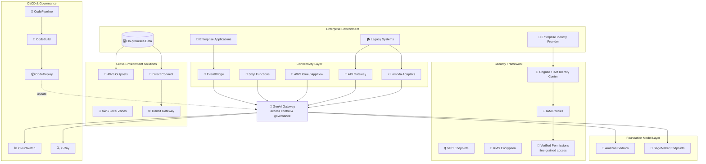

# ケーススタディ 07 — 金融機関向け全社的 GenAI 統合

[← ケーススタディに戻る](./README.md)

| | |
|---|---|
| **中心概念** | 全社的なレガシーシステムへの FM 統合 + セキュリティ/データ主権 + 集中型 GenAI gateway |
| **関連ドメイン** | D2 (Integration), D3 (Security/Governance), D4 (Operational Efficiency) |
| **主要サービス** | API Gateway, Lambda (adapters), EventBridge, Step Functions, Glue/AppFlow, IAM Identity Center/Cognito, Verified Permissions, KMS/ACM, VPC endpoints, Outposts/Local Zones/Wavelength, Direct Connect/Transit Gateway, CodePipeline/CodeBuild, CloudWatch/X-Ray/CloudTrail |

---

## 1. ユースケース要約

> **30+ カ国**で事業を展開する**多国籍金融機関**が **全社的** な GenAI 統合戦略を実行: 顧客体験向上、運用効率改善、イノベーション推進 — しかも **金融規制 & データ主権を遵守**。課題: **レガシー** システムは重要データを持つが **モダンな API がない**; 規制は管轄ごとに異なる; 高いセキュリティ基準; web/mobile/支店で一貫した AI 能力が必要; 規制対象通信での AI コンテンツに **人間の監視** が必要; 業務を止めない継続的デリバリ。

まったく新しい AI アプリを作るのではなく、**何十年も稼働する銀行マシンに AI を後付け** すると想像してほしい — API のないレガシーだらけ、一部の国の国境からデータを出せない。難しいのは **接続性**（legacy ↔ FM）、**多層セキュリティ**、**データ主権**。この問題は chatbot でなく、統合層 + エンタープライズセキュリティ層の設計力を試す。

### 解くべき要件

| # | 要件 | なぜ難しいか |
|---|---|---|
| R1 | **API のないレガシーと FM を接続** | 旧システムと FM 間で protocol/フォーマット変換が必要 |
| R2 | **疎結合 (loosely coupled)・event-driven** | FM を業務システムに固く溶接しない |
| R3 | **金融グレードのセキュリティ、細粒度権限** | identity federation + least-privilege + fine-grained access |
| R4 | **管轄ごとのデータ主権** | 機微データを一部の国の国境から出さない |
| R5 | **集中型ガバナンス & アクセス (GenAI gateway)** | 全社的なアクセス制御 + governance |
| R6 | **FM アプリの CI/CD、無停止** | quality gate 付きの継続デリバリ |

---

## 2. アーキテクチャ図

---

## 3. なぜこのアーキテクチャが要件を満たすか (Design Rationale)

### R1 + R2 → 接続層: API Gateway + Lambda adapters + EventBridge + Step Functions

レガシーにモダン API がないので「翻訳層」を構築:

- **API Gateway** が request/response mapping を持つ endpoint を作り、旧システムと FM 間でデータを変換。
- **Lambda adapters** が protocol/フォーマット変換を処理。
- **EventBridge** が **event-driven で疎結合** なアーキテクチャを作る — FM は業務システムに溶接されない。
- **Step Functions** が FM と複数システム間の複雑な相互作用を編成。
- **Glue / AppFlow** がデータを同期し FM が常に最新データを持つ。

> ⚠️ **間違えやすい点:** FM と業務システムを **疎結合 (loosely coupled)** にしたい → **EventBridge**（event-driven）、固い結合を生む直接同期呼出ではない。

### R3 → 多層セキュリティ

- **IAM Identity Center / Cognito** で企業 IdP との **identity federation**。
- **IAM least-privilege policies** + **Amazon Verified Permissions** でユーザー/リソース属性による **fine-grained access**。
- **KMS + ACM** で at-rest & in-transit 暗号化; **VPC endpoints, security groups, network ACLs** で network security。

> ⚠️ **間違えやすい点:** 「属性ベースの細粒度権限 (ABAC)」→ **Verified Permissions**、純粋な IAM policy を超える。

### R4 → データ主権: Outposts + Local Zones + Wavelength + Direct Connect/Transit Gateway

このケース固有の「得点」部分。機微データは一部の国を出てはならない:

- **AWS Outposts** が機微データ上で FM inference を **on-premises** 実行（データを国境内に保持）。
- **AWS Local Zones / Wavelength** が特定地域でレイテンシ削減。
- **Direct Connect + Transit Gateway** が cloud ↔ on-prem を安全に接続。
- replication 機構はコンプライアンス境界を尊重（filter/anonymize）。

> ⚠️ **間違えやすい点:** 「データは on-prem/国内に留めるが inference は必要」→ **Outposts**（AWS を on-prem へ持ち込む）、公衆 region へデータを送るのではない。

### R5 → 集中型ガバナンス: GenAI Gateway

**集中型 GenAI gateway** アーキテクチャで **全社的なアクセス制御 & governance** — すべての FM アクセスが 1 つのゲートを通り、一貫した policy を適用、制御が容易。

### R6 → CI/CD: CodePipeline + CodeBuild + observability

**CodePipeline + CodeBuild** が FM コンポーネントに security scanning + quality gate; 自動テストフレームワークがモデルの挙動/性能を検証。**CloudWatch + X-Ray + CloudTrail** で observability; 違反時に自動 remediation する集中 policy enforcement。

---

## 4. 代替案とトレードオフ (Alternatives & trade-offs)

| 決定 | 正しい選択 | よくある誤り | 理由 |
|---|---|---|---|
| legacy ↔ FM 接続 | **API Gateway + Lambda adapters** | legacy を書き直す | adapter が protocol 変換、旧システム再構築ではない |
| FM & 業務の疎結合 | **EventBridge (event-driven)** | 直接同期呼出 | 疎結合 = 堅牢 & 拡張可能 |
| 細粒度 ABAC | **Verified Permissions** | IAM policy のみ | 属性ベースの細粒度は純 IAM を超える |
| データを on-prem に留める | **Outposts / Local Zones** | 公衆 region へ送信 | data sovereignty を尊重 |
| identity federation | **IAM Identity Center / Cognito** | 個別 AWS user 作成 | IdP 連携、一時的な認証情報を使用 |
| FM アクセスのガバナンス | **集中型 GenAI Gateway** | 各アプリが FM を呼ぶ | 一貫した governance & access control |

---

## 5. 💡 学び (Lesson learned)

> **「レガシーを持つ大企業への GenAI 統合 + 多国籍 + データ主権」** を見たら、すぐにこの combo を:
> **API Gateway + Lambda adapters (接続) + EventBridge/Step Functions (疎な編成) + Outposts/Local Zones (データ主権) + Verified Permissions (細粒度権限) + GenAI Gateway (集中ガバナンス)。**

- **API のないレガシー → Lambda adapters + API Gateway**、旧システムを再構築しない。
- **疎結合 = EventBridge**、固い同期呼出でない。
- **Data sovereignty = Outposts/Local Zones/Wavelength** — データが留まる場所へ inference を持ち込む。
- **Fine-grained ABAC = Verified Permissions**、純 IAM policy を超える。
- **集中型 GenAI Gateway** = アクセス制御 & governance の 1 つのゲート。

🔗 **関連:** [04. Compute & Deployment](../01-basic-knowledge/04-compute-deployment-services.md) · [06. Integration & Orchestration](../01-basic-knowledge/06-integration-orchestration-services.md) · [07. Security & Governance](../01-basic-knowledge/07-security-governance-services.md) · [Practice exam](../03-practice-exam/)
