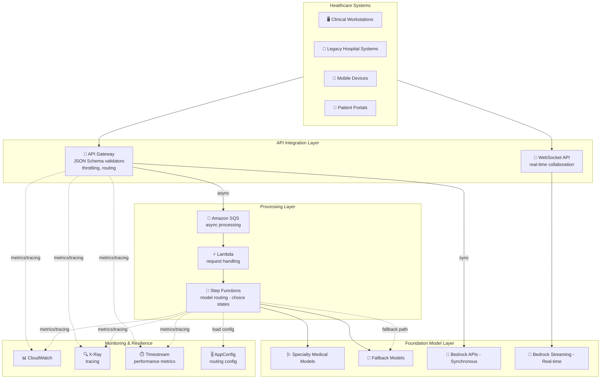

# ケーススタディ 08 — ヘルスケア向けエンタープライズ級 AI アシスタントプラットフォーム

[← ケーススタディに戻る](./README.md)

| | |
|---|---|
| **中心概念** | 柔軟なモデル対話システム — sync vs async、streaming、ミッションクリティカルな臨床ワークフロー向けの多層 fallback |
| **関連ドメイン** | D2 (Integration), D4 (Operational Efficiency), D5 (Resilience) |
| **主要サービス** | Bedrock (APIs, streaming), SQS, API Gateway (JSON Schema validators, throttling), Step Functions, AppConfig, X-Ray, Timestream, AWS SDK retry |

---

## 1. ユースケース要約

> あなたの会社が **医療従事者** 向け AI アシスタントプラットフォームを開発し、病院環境全体で **臨床意思決定、医療文書作成、患者エンゲージメント** を支援する。要件: 多様な病院システム/デバイスからの **複数の対話パターン** 対応; 時間に敏感な臨床ワークフローでの **リアルタイム AI 支援**; **ネットワーク中断やサービス劣化時の信頼性ある稼働**; **専門科 & 臨床文脈によるモデル選択**; スケール時の医療規制遵守。

病院の医師向け AI アシスタントを作ると想像してほしい。難しいのは **対話状況の多様性**: 即答が要る救急の質問 (sync)、診察後の文書作成は待てる (async)、ネットワークが不安定でも臨床手続きの最中なのでシステムが **死んではならない**。この問題は **正しい対話型** (sync/async/streaming) の選択と **多層の予備系** の構築力を試す。

### 解くべき要件

| # | 要件 | なぜ難しいか |
|---|---|---|
| R1 | **同期・高速な臨床クエリ** | 救急の質問は短い timeout + retry で即答が必要 |
| R2 | **診察後文書を非同期処理** | 医師が submit して診療を続け、バックグラウンドで処理 |
| R3 | **リアルタイム表示 (streaming)** | AI が生成中でも医師が結果を読み始める |
| R4 | **ネットワーク中断時の信頼性** | stream は resume 可能; 救急 request を優先 |
| R5 | **専門科 & 文脈によるモデル選択** | 複数専門科の症例は複数モデルの選択/並列実行が必要 |
| R6 | **医療文脈の検証 + 部門別 throttle** | 必須フィールド・標準コードの確認; 部門別の制限 |

---

## 2. アーキテクチャ図

---

## 3. なぜこのアーキテクチャが要件を満たすか (Design Rationale)

### R1 → 救急クエリ: 同期 Bedrock API + スマート retry

即答が要る臨床質問 → **同期 Bedrock API**（timeout 4–5 秒）、**exponential backoff + jitter** 付き custom retry logic で病院ピークに耐える。

### R2 → 診察後文書: 非同期 SQS

診察後文書作成は即時でなくてよい → **Amazon SQS**（visibility timeout 10 分）+ **dead letter queue**。医師は submit して患者ケアを続け、処理はバックグラウンド実行。

> ⚠️ **間違えやすい点:** **待てる** 仕事（バックグラウンド文書）→ **SQS async**; **今すぐ要る** 仕事（救急）→ **同期 API**。すべてを 1 つの型に詰めない。

### R3 → リアルタイム表示: Bedrock Streaming + Server-Sent Events

- **Bedrock streaming API** は臨床情報を先に表示する buffer management → 分析が生成中でも医師が decision support を読み始める。
- **Server-Sent Events (SSE)** は event ID 付きで患者教育アプリ向け — **ネットワーク中断後に stream を resume** できる。

### R4 → 信頼性 & 多層予備系

- 調整した retry policy の AWS SDK + **救急 request の priority queuing**。
- 病院規模に合わせた **多層 API Gateway throttling**、シフト交代/朝の回診向け burst capacity。
- **多層 fallback（degradation path）:** 専門医療モデル → 汎用モデル + 医療 prompt → 病院ナレッジベースの RAG → 最後に重要機能向け rule-based。

> ⚠️ **間違えやすい点:** 重要システムには明確な **fallback チェーン**（specialized → general → RAG → rule-based）が必要、1 モデルだけではない。

### R5 → 専門科によるモデル選択: Step Functions choice states + Timestream

- **Step Functions の choice states** が患者データ + 医療コードを評価して適切なモデルを選び、複数専門科の相談には **並列実行**。
- **Metrics-based routing** が診断精度、応答品質 & 時間を **Amazon Timestream**（time-series DB）で追跡し、モデル選択を継続最適化。

> ⚠️ **間違えやすい点:** routing 最適化のため **time-series metric** を保存 → **Timestream**、通常の DynamoDB でない。

### R6 → 検証 & throttle: API Gateway JSON Schema validators + AppConfig

- **API Gateway JSON Schema validators** が必須の医療文脈フィールドを確認、標準コードに対し用語を検証; 部門別 throttle 付き usage plan。
- **AppConfig** が静的 routing 設定 + 臨床文脈別に prompt/format を適用する mapping template を管理、A/B testing 付き。

---

## 4. 代替案とトレードオフ (Alternatives & trade-offs)

| ニーズ | 正しい選択 | よくある誤り | 理由 |
|---|---|---|---|
| 救急の質問 | **同期 Bedrock API + retry** | Async SQS | 救急は今すぐ、queue 待ちでない |
| 診察後文書 | **SQS async + DLQ** | 同期呼出 | 医師が作業継続、バックグラウンド処理 |
| 結果の段階表示 | **Bedrock streaming + SSE** | 全体を待つ | 医師が早く読む; SSE がネット切断時 resume |
| 複数専門科のモデル選択 | **Step Functions choice states** | Lambda の if-else | SF が分岐 + 並列実行 |
| metric による routing 最適化 | **Timestream** | DynamoDB | time-series が時系列 metric に最適 |
| 信頼性 | **多層 fallback** | 単一モデル | 重要システムは degradation path が必要 |

---

## 5. 💡 学び (Lesson learned)

> **「ミッションクリティカルな AI アシスタント + 複数の対話型 + 障害時の信頼性」** を見たら、すぐに: **正しい対話型 (sync/async/streaming) の選択 + 多層 fallback チェーン + スマートなモデル routing。**

- **Sync vs Async:** 今すぐ要る → 同期 API; 待てる → SQS（DLQ 付き）。
- **Streaming + SSE** = 段階表示 + ネット切断後の resume。
- **多層 fallback:** specialized → general+prompt → RAG → rule-based。
- **Step Functions choice states** = 文脈に応じモデルを選択/並列実行。
- **Timestream** = routing 最適化用に time-series metric を保存。
- **API Gateway JSON Schema validators** = 必須医療フィールド欠落の入力をブロック。

🔗 **関連:** [01. Bedrock](../01-basic-knowledge/01-amazon-bedrock-services.md) · [06. Integration & Orchestration](../01-basic-knowledge/06-integration-orchestration-services.md) · [04. Compute & Deployment](../01-basic-knowledge/04-compute-deployment-services.md) · [Practice exam](../03-practice-exam/)
