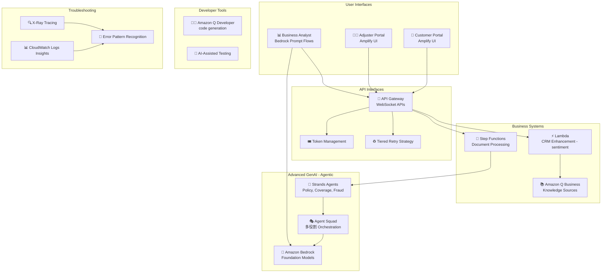

# ケーススタディ 09 — Agentic GenAI による保険金請求処理の変革

[← ケーススタディに戻る](./README.md)

| | |
|---|---|
| **中心概念** | 複数の専門 agent の編成 (multi-agent orchestration) + 開発生産性ツール (Amazon Q)（claims プロセス向け） |
| **関連ドメイン** | D2 (Integration), D4 (Operational Efficiency), D5 (Monitoring) |
| **主要サービス** | API Gateway (WebSocket), Bedrock (Prompt Flows), Lambda, Step Functions, Amazon Q Business, Amazon Q Developer, Strands Agents, Agent Squad, Amplify, CloudWatch Logs Insights, X-Ray |

---

## 1. ユースケース要約

> **月 50,000+ 件の請求**（auto, home, health, commercial）を扱う**多国籍保険会社**が、長い処理時間、**一貫しない裁定**、低い顧客満足、手作業の文書処理ボトルネックという問題に直面。包括的な GenAI 変革を実施し、claims ワークフローを近代化、顧客体験を向上、運用効率を高める。

単一の AI 応答者でなく、複雑な請求ファイルを共同処理する **「仮想専門家チーム」** を作ると想像してほしい: ある agent は policy を調べ、別の agent は損害を査定、別の agent は不正を調査、別の agent は顧客の権利を擁護する。難しいのは **これらの agent をスムーズに協調** させ、一貫して引き継ぎ (handoff)、ある agent が限界に達したら回復すること。これは **agentic AI** と開発生産性の問題。

### 解くべき要件

| # | 要件 | なぜ難しいか |
|---|---|---|
| R1 | **安定したリアルタイム請求レビューセッション** | 長いセッションは堅牢な接続 + token 制限内の context 管理が必要 |
| R2 | **複数の専門 agent が協調** | Policy lookup, coverage, fraud — 一貫した handoff、recovery が必要 |
| R3 | **複雑な商業請求、多数の役割** | 多 agent の編成が必要: policy expert, damage assessor, fraud investigator, customer advocate |
| R4 | **検証付きの並列文書処理** | 多数の文書を validation checkpoint 付きで並列処理 |
| R5 | **開発生産性の向上** | 保険ドメイン準拠のコード生成、refactor、GenAI シナリオ向けテスト |
| R6 | **非開発者がワークフロー設計** | ビジネスアナリストが dev なしでワークフローを構築 |

---

## 2. アーキテクチャ図

---

## 3. なぜこのアーキテクチャが要件を満たすか (Design Rationale)

### R1 → 安定したレビューセッション: WebSocket + token windowing + tiered retry

**API Gateway WebSocket**（timeout 20 分）で安定した請求レビューセッション; **token windowing** が context を制限内（例: 8,000 token）で管理; **tiered retry strategy** に **4 回失敗後の circuit breaker** でピークに耐える。

### R2 + R3 → 多 agent: Strands Agents + Agent Squad

agentic ケースの「得点」部分:

- **AWS Strands Agents**: **policy lookup, coverage verification, fraud detection** の専門 agent を編成ワークフローで、handoff 間で一貫した請求理解を保証し、agent が限界に達したときの **recovery 機構** を持つ。
- **AWS Agent Squad** は複雑な商業請求向け: 複数役割を編成 — **policy expert, damage assessor, fraud investigator, customer advocate**。**Step Functions** が handoff 間に validation ステップを挿入し一貫性 + 必要時の recovery を確保。

> ⚠️ **間違えやすい点:** 「複雑なタスクで多数の専門家が協調」が要る問題 → **multi-agent orchestration (Strands Agents / Agent Squad)** + handoff 間に validation を挿入する Step Functions、単一 prompt ではない。

### R4 → 並列文書処理: Step Functions + Lambda

**Step Functions** が **validation checkpoint 付きの並列文書処理ワークフロー** を編成; **Lambda** が請求 submit 時に sentiment 分析で CRM を強化。**Amazon Q Business** が日次 refresh + 請求型/coverage 別 metadata tag のナレッジソースとして機能。

### R5 → 開発生産性: Amazon Q Developer

**Amazon Q Developer** を保険ドメイン文脈で構成し **準拠コードを生成**、性能 impact 優先の refactoring パイプライン、GenAI シナリオ向け coverage を備えたテストフレームワーク。

> ⚠️ **間違えやすい点:** 「開発者の生産性向上、コード生成/refactor」→ **Amazon Q Developer**（coding companion）; 「業務向けナレッジソース」→ **Amazon Q Business**。2 つの Q 製品を混同しない。

### R6 → 非開発者のワークフロー構築: Bedrock Prompt Flows + Amplify

**Bedrock Prompt Flows** がビジネスアナリストに **dev なしで** カスタムワークフロー設計を可能に; **Amplify UI** が progressive enhancement で portal を素早く構築; パートナー統合向け OpenAPI spec。

### 監視: CloudWatch Logs Insights + X-Ray

**CloudWatch Logs Insights** が log を query して請求処理のパターンを発見; **X-Ray** が保険固有の annotation で trace; 一般的な failure mode 向けにエラー認識ルール + remediation 提案。

---

## 4. 代替案とトレードオフ (Alternatives & trade-offs)

| ニーズ | 正しい選択 | よくある誤り | 理由 |
|---|---|---|---|
| 多数の専門家が協調 | **Strands Agents / Agent Squad** | 巨大な 1 prompt | Multi-agent が専門役割 + handoff を処理 |
| agent 間の一貫した handoff | **Step Functions (validation steps)** | agent 同士で呼び合う | SF が checkpoint + recovery を挿入 |
| 長いリアルタイムレビュー | **WebSocket + token windowing** | REST | 堅牢な接続 + context 管理 |
| コード生成/refactor | **Amazon Q Developer** | Q Business | Q Developer は coding companion |
| 業務ナレッジソース | **Amazon Q Business** | Q Developer | Q Business は enterprise knowledge 向け |
| 非開発者のワークフロー | **Bedrock Prompt Flows** | dev にコードを書かせる | Prompt Flows はドラッグ&ドロップ、コード不要 |

---

## 5. 💡 学び (Lesson learned)

> **「複雑なタスクで多数の専門家が協調 + 多数の handoff ステップ」** を見たら、すぐに **multi-agent orchestration** を: Strands Agents / Agent Squad + handoff 間に validation を挿入する Step Functions。

- **Multi-agent ≠ 1 prompt:** 専門役割（policy/damage/fraud/advocate）に分割、編成 + recovery。
- **Step Functions** が agent 間の一貫した handoff を保証。
- **Amazon Q Developer ≠ Q Business:** Developer はコード生成/refactor; Business は業務ナレッジソース。
- **Bedrock Prompt Flows** で非開発者がワークフローを構築。
- **WebSocket + token windowing + circuit breaker** で安定した長セッション。

🔗 **関連:** [01. Bedrock](../01-basic-knowledge/01-amazon-bedrock-services.md) · [06. Integration & Orchestration](../01-basic-knowledge/06-integration-orchestration-services.md) · [05. Specialized AI](../01-basic-knowledge/05-specialized-ai-services.md) · [Practice exam](../03-practice-exam/)
