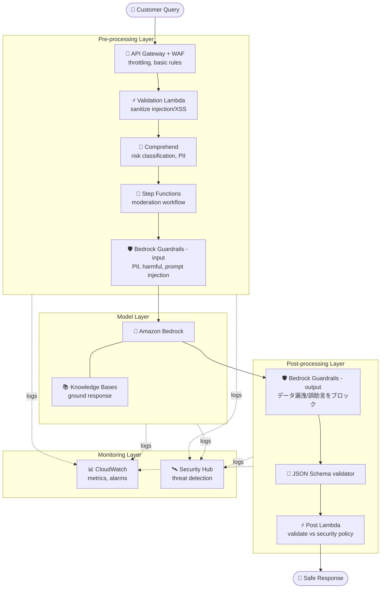
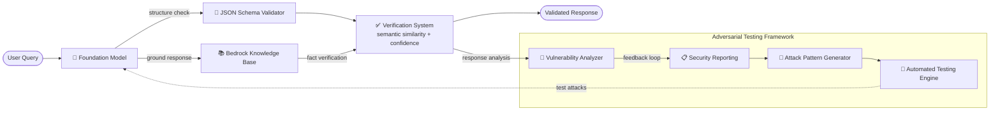

# ケーススタディ 10 — 金融 AI アシスタント向け入出力安全制御

[← ケーススタディに戻る](./README.md)

| | |
|---|---|
| **中心概念** | 入出力安全のための多層防御 (defense-in-depth) + hallucination 防止 + 敵対的テスト (adversarial) フレームワーク |
| **関連ドメイン** | D3 (Security/Safety/Guardrails), D5 (Testing) |
| **主要サービス** | Bedrock Guardrails, Knowledge Bases, Comprehend, Lambda, Step Functions, API Gateway + WAF, CloudWatch, Security Hub, AWS Organizations |

---

## 1. ユースケース要約

> **大手金融機関**が、口座・金融商品・一般的な銀行質問に答える AI アシスタントを構築したい。機微な金融情報を扱いながら **安全・正確・悪用に強い** こと。

悪意ある者が絶えず **口座情報を漏らさせよう** とし、**誤った助言をさせよう** とする銀行アシスタントを作ると想像してほしい。難しいのは AI に回答させることでなく、その周りに **多層の防御を巻く** こと: 悪意ある入力を filter、AI の捏造を防ぐ、返す前に出力を検査、そして脆弱性を見つけるため **自分自身を能動的に攻撃** する。この問題は **defense-in-depth** の思考と **adversarial testing** を試す。

### 解くべき要件

| # | 要件 | なぜ難しいか |
|---|---|---|
| R1 | **入力の安全 filtering** | PII、有害コンテンツ、prompt injection をブロック |
| R2 | **出力の hallucination 防止** | 誤解を招く金融助言を捏造してはならない |
| R3 | **出力構造の強制 + データ漏洩防止** | 出力は schema 準拠、口座情報を漏らさない |
| R4 | **多層防御 (defense-in-depth)** | 1 層が破られても他の層が残る |
| R5 | **敵対的攻撃の検出 & テスト** | jailbreak/injection を能動検出、自己攻撃で脆弱性を発見 |
| R6 | **監視 & コンプライアンス** | Audit log + 異常検出 + コンプライアンスレポート |

---

## 2. アーキテクチャ図

### 2.1 Defense-in-depth（多層防御）

### 2.2 Hallucination prevention + Adversarial testing

---

## 3. なぜこのアーキテクチャが要件を満たすか (Design Rationale)

### R1 → 入力の安全: 複数の filter 層

- **Validation Lambda** が入力を sanitize（SQL injection, XSS 対策）、フォーマットを検証。
- **Amazon Comprehend** が sentiment/key phrase を分析して脅威を検出、PII を識別、リスクを分類。
- **Step Functions** が moderation プロセス全体を編成、リスクレベルで分岐、audit log を保持。
- **Bedrock Guardrails (input)** が PII、有害コンテンツ、**prompt injection** をブロック。

### R2 → hallucination 防止: Knowledge Bases + Verification System

**Bedrock Knowledge Bases** が正確な金融商品情報を保存して回答を **ground（接地）**。**Verification System** が response とナレッジベース間の **semantic similarity** をチェック、**confidence score** を計算、潜在的 hallucination を人間 review 用にフラグ。

> ⚠️ **間違えやすい点:** 規制の厳しい産業での捏造防止 → **RAG (Knowledge Bases) + Guardrails の contextual grounding + verification**、モデルだけに頼らない。

### R3 → 出力構造の強制: JSON Schema + Guardrails output

**JSON Schema** が response 構造（account info, product recommendation, transaction）を検証。**Bedrock Guardrails (output)** が誤解を招く金融助言を filter、機微な口座情報の漏洩をブロック。

### R4 → Defense-in-depth: 4 層

核心の思想。独立した 4 層、1 層が破られても他が残る:

- **Pre-processing:** API Gateway + WAF（throttling, 基本ルール）+ Comprehend（リスク分類）+ Lambda（sanitize）。
- **Model:** Bedrock Guardrails（コンテンツ安全）+ Knowledge Base（response 接地）。
- **Post-processing:** Lambda が security policy に対し response を検証 + API Gateway がデータ漏洩防止に filter。
- **Monitoring:** CloudWatch（metric + 疑わしいパターンの alarm）+ **Security Hub**（集中型脅威検出）。

### R5 → Adversarial testing: 脆弱性発見のための自己攻撃

このケースの際立つ部分。システムが **能動的にセキュリティを自己テスト**:

- **Attack Pattern Generator** が金融固有の敵対的 prompt を生成（injection, jailbreak, データ抽出狙いの social engineering）。
- **Automated Testing Engine** が攻撃パターンをシステムに実行、応答を測定、成功/失敗を記録。
- **Vulnerability Analyzer** が response を評価して弱点を発見、制御の有効性を測定。
- **Security Reporting** がコンプライアンスレポートを生成 + 継続改善の **feedback loop** を作る。

> ⚠️ **間違えやすい点:** AI 安全は guardrails の 1 回設定ではない — 新しい脆弱性を見つけるため **継続的な自動 adversarial testing** が必要。

### R6 → 監視 & コンプライアンス: CloudWatch + Security Hub + Organizations

CloudWatch が metric を追跡し疑わしいパターンを警告; **Security Hub** が包括的な脅威検出; **AWS Organizations** がアカウント横断のガバナンス policy を適用。

---

## 4. 代替案とトレードオフ (Alternatives & trade-offs)

| ニーズ | 正しい選択 | よくある誤り | 理由 |
|---|---|---|---|
| 入力 PII/injection ブロック | **Guardrails + Comprehend + Lambda** | prompt の指示のみ | 複数 filter 層、モデルの自律に頼らない |
| hallucination 防止 | **Knowledge Bases + Verification** | モデルを信じる | RAG が事実を接地 + confidence を verify |
| 出力構造 | **JSON Schema** | モデルに自由を | Schema が一貫フォーマットを強制 |
| 全体セキュリティ | **Defense-in-depth 4 層** | 単一 guardrail | 1 層が破られても他が残る |
| 脆弱性の発見 | **Adversarial testing framework** | 手動の 1 回テスト | 継続自動化が新脆弱性を発見 |
| 脅威検出 | **Security Hub + CloudWatch** | 通常 log のみ | 集中型の脅威検出 |

---

## 5. 💡 学び (Lesson learned)

> **「機微な産業向けの安全な AI、悪用/攻撃への耐性」** を見たら、すぐに **defense-in-depth**（pre → model → post → monitoring）+ **自動 adversarial testing** を。

- **入出力安全 = 両端の Guardrails**（input は PII/injection を filter、output はデータ漏洩/誤助言をブロック）。
- **hallucination 防止 = Knowledge Bases（接地）+ verification（confidence + human review）**。
- **Defense-in-depth 4 層:** 1 層が破られても他が残る。
- **Adversarial testing** は忘れやすい部分: 自己攻撃生成 → テスト → 脆弱性分析 → feedback loop。
- **Security Hub** で集中型脅威検出、CloudWatch だけでない。

🔗 **関連:** [01. Bedrock](../01-basic-knowledge/01-amazon-bedrock-services.md) · [07. Security & Governance](../01-basic-knowledge/07-security-governance-services.md) · [05. Specialized AI](../01-basic-knowledge/05-specialized-ai-services.md) · [Practice exam](../03-practice-exam/)
