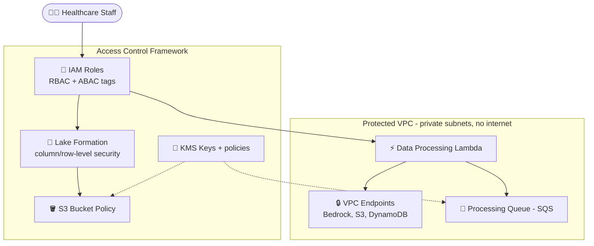
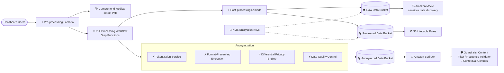

# ケーススタディ 11 — ヘルスケア AI 向けデータセキュリティ & プライバシー制御

[← ケーススタディに戻る](./README.md)

| | |
|---|---|
| **中心概念** | HIPAA データを処理する FM 向けの多層データセキュリティ（network isolation + access control + PII protection + anonymization） |
| **関連ドメイン** | D3 (Security/Privacy/Governance), D1 (Data) |
| **主要サービス** | VPC endpoints, IAM (RBAC/ABAC), Lake Formation, KMS, Comprehend Medical, Macie, GuardDuty, CloudTrail, Security Hub, S3 Lifecycle, Bedrock Guardrails, Step Functions, Lambda |

---

## 1. ユースケース要約

> **医療機関**が FM を使い、患者記録・医療研究・治療結果を分析して臨床意思決定を改善したい。ソリューションは **HIPAA を厳格に遵守** し、医療専門家に価値ある洞察を提供すること。

すべてのデータ行が法で厳重に保護される **個人健康情報 (PHI)** である AI 医療分析プラットフォームを作ると想像してほしい。難しいのは分析でなく **1 バイトも漏らさない** こと — データは「密閉室」で生き、正しい人だけ入れ、すべての PHI は秘匿/匿名化され、すべてのアクセスに証跡が残る。この問題は FM の周りの **多層データセキュリティ** の思考を試す。

### 解くべき要件

| # | 要件 | なぜ難しいか |
|---|---|---|
| R1 | **ネットワーク分離 (network isolation)** | AI 処理リソースは直接 internet を持ってはならない |
| R2 | **細粒度アクセス制御 (RBAC/ABAC, column-level)** | 正しい役割/部門が正しいデータを見る |
| R3 | **PII/PHI の検出 & 保護** | 非構造化テキスト内の PHI を自動識別 |
| R4 | **暗号化 & データライフサイクル** | at-rest 暗号化、key rotation、規制通りの保持/削除 |
| R5 | **匿名化 (anonymization)** | トークン化、format-preserving encryption、differential privacy |
| R6 | **監視・audit & 侵害検出** | 包括的な audit + データ漏洩検出 |

---

## 2. アーキテクチャ図

### 2.1 分離環境 + access control

### 2.2 PII protection + Anonymization

---

## 3. なぜこのアーキテクチャが要件を満たすか (Design Rationale)

### R1 → ネットワーク分離: VPC + VPC Endpoints + Security Groups/NACLs

- 医療分析プラットフォーム用の **専用 VPC**、すべての AI 処理コンポーネントに **private subnets**、**直接 internet なし**。
- **VPC Endpoints**（Bedrock/S3 向け interface、S3/DynamoDB 向け gateway）→ すべての traffic が AWS ネットワーク内に留まり、公衆 Internet を通らない。
- **Security groups + Network ACLs** がコンポーネント間 traffic を制限 + egress rule が data exfiltration をブロック。

> ⚠️ **間違えやすい点:** 機微データが Internet を通らずに Bedrock/S3 を呼ぶ → **VPC Endpoints** (PrivateLink)、public endpoint 経由でない。

### R2 → 細粒度アクセス制御: IAM + Lake Formation + resource policies

- **IAM**: 全コンポーネントに RBAC、**least privilege**、動的権限に **ABAC**（attribute-based）。
- **AWS Lake Formation**: data lake の細粒度アクセス制御 — 機微な患者データに **column-level security**、役割/部門による **row-level security**。
- **Resource-based policies**: S3 bucket policy が役割で制限、KMS key policy が暗号化を強制、SQS policy が producer/consumer を制限。

> ⚠️ **間違えやすい点:** 「data lake で列/行レベルの制御」→ **Lake Formation**、純粋な IAM policy でない。

### R3 → PHI の検出 & 保護: Comprehend Medical + Macie

- **Amazon Comprehend Medical**: PHI を自動検出、非構造化テキストの医療エンティティを識別、機微情報を分類。
- **Amazon Macie**: S3 の機微データを自動発見、定期スキャン、医療情報向け custom data identifier。
- **Pipeline Lambda**: 入力を sanitize、PII をリアルタイム検出 & 秘匿、コンプライアンス向けにイベントを log。

> ⚠️ **間違えやすい点:** 医療テキスト内の PHI → **Comprehend Medical**（医療特化）、通常の Comprehend でない; S3 の機微データ発見 → **Macie**。

### R4 → 暗号化 & ライフサイクル: KMS + S3 Lifecycle

- **KMS**: 全データを自動暗号化、**key rotation**、厳格なアクセス制御で鍵管理。
- **S3 Lifecycle**: 定義期間後にデータを cold storage へ自動移行、retention 通りの削除 policy、audit 用 versioning。

### R5 → 匿名化: tokenization + FPE + differential privacy

- **Data masking**: 患者識別子をトークン化、構造化データに **format-preserving encryption**、安全な mapping table での pseudonymization。
- **Differential privacy**: 統計的ノイズを加え個別レコードを保護、privacy budget を管理、保護 vs 有用性をバランス。
- **De-identification pipeline**（Step Functions）: 自動匿名化ワークフロー、感度に応じ複数手法、匿名化後の品質管理。

### R6 → 監視 & audit: CloudTrail + GuardDuty + Macie + Security Hub

- **CloudWatch**: Bedrock への API call をリアルタイム監視、アクセスパターンの custom metric、異常検出。
- **CloudTrail**: 包括的 audit log、**Security Hub** と統合、HIPAA 通りの retention。
- **GuardDuty + Macie**: データ漏洩の脅威を検出、自動 remediation ワークフロー。
- **Bedrock Guardrails**: 役割/アクセスレベル別 contextual controls、input/output 両方で PHI 漏洩をブロック、コンプライアンス報告向けに介入を log。

---

## 4. 代替案とトレードオフ (Alternatives & trade-offs)

| ニーズ | 正しい選択 | よくある誤り | 理由 |
|---|---|---|---|
| Internet なしで Bedrock/S3 を呼ぶ | **VPC Endpoints (PrivateLink)** | Public endpoint | traffic を AWS ネットワーク内に保持 |
| data lake の列/行制御 | **Lake Formation** | 純 IAM | Column/row-level security |
| テキスト内 PHI 検出 | **Comprehend Medical** | 通常の Comprehend | 医療エンティティに特化 |
| S3 機微データ発見 | **Macie** | 手動スキャン | 自動 + custom identifier |
| 漏洩/脅威の検出 | **GuardDuty + Security Hub** | CloudWatch のみ | 専用の脅威検出 |
| データ匿名化 | **Tokenization + FPE + differential privacy** | 列を粗く削除 | 有用性 + 保護を両立 |

---

## 5. 💡 学び (Lesson learned)

> **「極めて機微なデータ（医療/HIPAA）を処理する FM + 厳格なセキュリティ & プライバシー」** を見たら、すぐに **多層セキュリティ** を: network isolation (VPC Endpoints) + 細粒度 access control (Lake Formation/ABAC) + PHI protection (Comprehend Medical/Macie) + anonymization + audit (CloudTrail/GuardDuty)。

- **VPC Endpoints** = Internet を通さず AWS サービスを呼ぶ（機微データの中核）。
- **Lake Formation** = 列/行レベル制御、純 IAM を超える。
- **Comprehend Medical**（PHI）+ **Macie**（S3 の機微データ発見）— 通常の Comprehend と混同しない。
- **Anonymization** = tokenization + format-preserving encryption + differential privacy。
- **GuardDuty + Security Hub** で脅威検出、log だけでない。

🔗 **関連:** [03. Data & RAG](../01-basic-knowledge/03-data-rag-knowledge-services.md) · [07. Security & Governance](../01-basic-knowledge/07-security-governance-services.md) · [05. Specialized AI](../01-basic-knowledge/05-specialized-ai-services.md) · [Practice exam](../03-practice-exam/)
