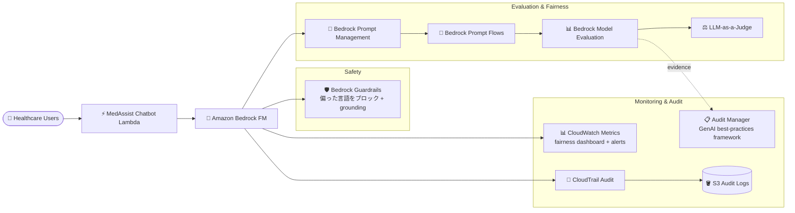

# ケーススタディ 12 — ヘルスケア chatbot の公平性 (fairness) 評価（Responsible AI）

[← ケーススタディに戻る](./README.md)

| | |
|---|---|
| **中心概念** | 公平性 (fairness) & Responsible AI の評価フレームワーク: LLM-as-a-judge + human eval + 継続的な bias 監視 |
| **関連ドメイン** | D5 (Responsible AI, Testing & Evaluation), D3 (Governance) |
| **主要サービス** | Bedrock (Model Evaluation, LLM-as-a-judge, Prompt Management, Prompt Flows, Guardrails), CloudWatch, CloudTrail, S3, Audit Manager |

---

## 1. ユースケース要約

> ある会社が Bedrock FM を使い患者に医療情報を提供する **ヘルスケア chatbot** を開発する。タスク: **Responsible AI 原則** を実装し、**公平性 (fairness) 評価** に注力して、多様な患者層で chatbot が **偏りなく** 回答するようにする。開発チームは次に関する bias を評価・軽減する必要がある: 年齢層（高齢/若年）、性別 & 性自認、民族/文化背景、社会経済要因、医療リテラシーレベル。

ヘルスケア chatbot を作り、それが **高齢者・貧困層・マイノリティに対しより悪い回答をしない** ことを保証しなければならないと想像してほしい。難しさ: bias は目で見えにくい — 多数の人口層で **体系的に測定** し、bias は時間とともに drift しうるので **継続監視** する必要がある。この問題は **Responsible AI & fairness evaluation** フレームワークを試す。

### 解くべき要件

| # | 要件 | なぜ難しいか |
|---|---|---|
| R1 | **複数グループでの自動評価** | correctness/completeness/harmfulness を規模で測る、すべて手動でない |
| R2 | **人間による評価** | 一部の公平性判断は最終的に人間の評価が必要 |
| R3 | **bias 削減 prompt 戦略の A/B test** | 人口層ごとに複数 prompt variant を試す |
| R4 | **継続的な fairness 監視** | bias は drift しうる; リアルタイム追跡 + 警告が必要 |
| R5 | **Audit & コンプライアンス証拠** | fairness 評価をコンプライアンス向けに文書化 |
| R6 | **偏った出力を防ぐ Guardrails** | 偏った言語をブロック + 事実の正確性を確保 |

---

## 2. アーキテクチャ図

---

## 3. なぜこのアーキテクチャが要件を満たすか (Design Rationale)

### R1 → 自動評価: Bedrock Model Evaluation + LLM-as-a-judge

**Bedrock Model Evaluation** の **LLM-as-a-judge** が correctness, completeness, harmfulness の metric を測定。プロセス: 人口層別の多様な test dataset を作成 → judge model を使う evaluation job を構成 → グループ間の fairness metric を定義 → console でスコア & 説明を分析。

> ⚠️ **間違えやすい点:** 大規模な品質/bias 評価 → **Bedrock Model Evaluation (LLM-as-a-judge)**、各回答を手で採点しない。

### R2 → 人間による評価: human evaluation

自動評価を **human evaluators** で補完し最終判断 — 自社 workforce または **AWS managed custom evaluation** を使う。機械が捉えにくい微妙な公平性判断には human-in-the-loop が重要。

### R3 → bias 削減 prompt の A/B test: Prompt Management + Prompt Flows

- **Bedrock Prompt Management** がグループごとに bias を減らすよう設計した複数の **prompt variant** を作成。
- **Bedrock Prompt Flows** が内容/文脈で質問をルーティングするワークフローを構築し、人口層セグメント間で異なる prompt 戦略をテスト、fairness metric で評価。visual builder が FM + prompt + AWS サービスを連結。分析して最も公平で効果的な prompt 戦略を見つける。

### R4 → 継続的な fairness 監視: CloudWatch

**CloudWatch** がモデル利用 metric をほぼリアルタイムで収集、custom dashboard がグループ間の fairness metric を追跡、潜在的 bias 検出時に警告、ユーザーセグメント別に invocation & token count を監視。

> ⚠️ **間違えやすい点:** fairness は 1 回評価ではない — bias は drift しうるので **継続監視** が必要。

### R5 → Audit & コンプライアンス: CloudTrail + Audit Manager

- **CloudTrail** が API data を収集、log を S3 へ配信、モデル利用パターンを定期 audit して fairness 問題を検出。
- **AWS Audit Manager** の **GenAI best-practices framework** が fairness 評価を文書化しコンプライアンス証拠を維持。

> ⚠️ **間違えやすい点:** 「Responsible AI 評価の文書化 + コンプライアンス証拠」→ **Audit Manager**（GenAI framework 内蔵）、手動で文書を作らない。

### R6 → 偏った出力を防ぐ Guardrails

**Bedrock Guardrails** が content filter を構成して偏った言語を検出 & ブロック、**contextual grounding check** で response の事実正確性を確保、LLM provider 内蔵の guardrails + external guardrails を組み合わせて追加保護。

---

## 4. 代替案とトレードオフ (Alternatives & trade-offs)

| ニーズ | 正しい選択 | よくある誤り | 理由 |
|---|---|---|---|
| 大規模 bias 評価 | **Model Evaluation + LLM-as-a-judge** | 手で採点 | 自動、複数 metric を測定 |
| 最終的な公平性判断 | **Human evaluation** | 自動のみ | 一部の bias は人間が捉える |
| bias 削減 prompt を試す | **Prompt Management + Prompt Flows** | prompt を hard-code | グループ別に variant を A/B test |
| 経時的な bias 追跡 | **CloudWatch fairness dashboard** | 1 回評価 | bias は drift、継続が必要 |
| コンプライアンス証拠 | **Audit Manager (GenAI framework)** | 手動文書化 | Responsible AI 向けの既製フレーム |
| 偏った出力のブロック | **Guardrails + grounding** | モデルを信じる | システム層で強制 |

---

## 5. 💡 学び (Lesson learned)

> **「Responsible AI / fairness / bias / グループ間で偏りなし」** を見たら、すぐにこのフレームを: **Model Evaluation (LLM-as-a-judge) + human eval + prompt の A/B test (Prompt Flows) + 継続監視 (CloudWatch) + audit (Audit Manager) + Guardrails。**

- **LLM-as-a-judge** = 大規模な品質/bias の自動評価。
- **Fairness は継続的プロセス**、1 回評価でない → CloudWatch dashboard + alert。
- **Audit Manager の GenAI best-practices framework** = Responsible AI コンプライアンス証拠。
- **Human-in-the-loop** は微妙な公平性判断になお必要。
- **Guardrails + contextual grounding** が偏った出力をブロック & 正確性を確保。

🔗 **関連:** [01. Bedrock](../01-basic-knowledge/01-amazon-bedrock-services.md) · [07. Security & Governance](../01-basic-knowledge/07-security-governance-services.md) · [Practice exam](../03-practice-exam/)
