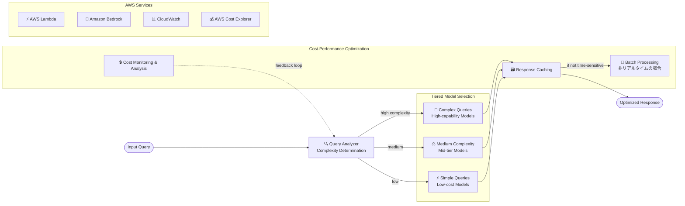

# ケーススタディ 13 — GenAI 向けコスト効率的なモデル選定フレームワーク

[← ケーススタディに戻る](./README.md)

| | |
|---|---|
| **中心概念** | コスト–能力のトレードオフに基づくモデル選定フレームワーク: tiered usage + intelligent routing + コスト削減 inference パターン |
| **関連ドメイン** | D4 (Operational Efficiency & Cost Optimization), D1 (FM Selection) |
| **主要サービス** | Bedrock (Model Evaluation, Intelligent Prompt Routing, batch, prompt/response caching), Lambda, CloudWatch, AWS Cost Explorer, cost allocation tags |

---

## 1. ユースケース要約

> 組織が GenAI を運用ワークフローに取り込むにつれ、**inference コストの管理 & 最適化** は従来のクラウドコストと同じくらい重要になる。このケースは、AWS で GenAI を展開する際の **コストと性能要件のバランス** の取り方を探る。

毎月 inference の請求が急増する GenAI システムを運用していると想像してほしい。難しさ: 最強のモデルは高価だが、すべての質問に強いモデルが要るわけではない。「注文はどこ?」に「高級」モデルを使うのは **金を燃やす**。この問題は **コスト–能力によるモデル選定の決定フレームワーク** を構築する力を試す: 簡単な仕事は安いモデル、本当に難しい仕事にだけ高価なモデルを充てる。

### 解くべき要件

| # | 要件 | なぜ難しいか |
|---|---|---|
| R1 | **複雑さでモデルを right-size** | 基本タスクに高価なモデルを使わない |
| R2 | **コスト vs 品質を体系的にバランス** | 品質 metric 定義 + 比較テスト + スマート routing |
| R3 | **price-to-performance の測定** | 性能単位あたりコストを計算しデータで決定 |
| R4 | **コスト削減 inference パターン** | 非リアルタイムは batch; 反復クエリは caching |
| R5 | **制限 & 停止条件** | runaway resource consumption を回避 |
| R6 | **継続的最適化** | コストを追跡、新データで基準を調整 |

---

## 2. アーキテクチャ図

---

## 3. なぜこのアーキテクチャが要件を満たすか (Design Rationale)

### R1 → Right-sizing: 複雑さによる tiered model usage

核心の思想。**Query Analyzer** が複雑さを判定しルーティング:

- **Simple queries** → 小さく安いモデル（単純な要求に十分）。
- **Medium complexity** → 中位モデル（コスト–能力のバランス）。
- **Complex queries** → 最強だが高価なモデル、**このシナリオ専用**。

> ⚠️ **間違えやすい点:** 基本タスクに強力・高価なモデルを使わない。複雑さによる階層化がコスト削減の最も直接的な方法。

### R2 → コスト vs 品質のバランス: 体系的評価

- **Define quality metrics**: use case ごとに「許容できる品質」を明確化。
- **Comparative testing**（Bedrock Model Evaluation）: 複数モデルを品質 metric でテストしつつコストを track。
- **Intelligent routing**（Bedrock Intelligent Prompt Routing）: **品質閾値を満たす最安モデル** へルーティング。

> ⚠️ **間違えやすい点:** 「品質を満たす最安モデルへ自動ルーティング」→ **Bedrock Intelligent Prompt Routing**、複雑なロジックを自前で書かない。

### R3 → price-to-performance の測定: cost allocation tags

**inference-level cost allocation tags** でコストを細粒度で track & 分析。performance metric を定義 → 性能単位あたりコストを計算 → **データ駆動** のモデル選定 decision matrix を作る。

### R4 → コスト削減 inference パターン: batch + caching

- **Batch processing**: **非リアルタイム** ワークロードでは batch がコストを大幅削減（例: ユーザー閲覧時の on-demand でなく夜間 job で製品説明を生成）。
- **Caching**: 頻出クエリの **response caching** + **prompt caching** → inference 呼出を削減。

> ⚠️ **間違えやすい点:** 急がない仕事 → **batch**（はるかに安い）; 反復クエリ → **caching**。すべてにリアルタイム inference を呼ばない。

### R5 → 制限 & 停止条件

**stopping conditions** を設定し execution パターンを監視して、ワークフローが過剰にリソースを消費したり有用な目的を超えて走り続ける（runaway consumption）のを回避。

### R6 → 継続的最適化: CloudWatch + Cost Explorer

- **AWS Cost Explorer** が inference コスト & 利用パターンを track。
- **CloudWatch** が metric に対しモデル性能を継続評価。
- 新データでモデル選定基準を調整; 選定フレームに影響しうる新モデル/価格をフォロー。

---

## 4. 代替案とトレードオフ (Alternatives & trade-offs)

| ニーズ | 正しい選択 | よくある誤り | 理由 |
|---|---|---|---|
| 基本タスク | **小さく安いモデル** | 最強モデル | 単純な仕事に金を燃やす |
| 品質/コストによる routing | **Intelligent Prompt Routing** | 自前ロジック | Managed、閾値を満たす最安モデルへ |
| 安くて十分なモデル選定 | **Model Evaluation + cost tracking** | 勘で選ぶ | 品質 + コストを比較 |
| 非リアルタイムの仕事 | **Batch processing** | On-demand inference | batch ははるかに安い |
| 反復クエリ | **Response/Prompt caching** | 毎回新規呼出 | caching が inference 回数を削減 |
| 細粒度のコスト追跡 | **Cost allocation tags + Cost Explorer** | 見積もり | データ駆動の決定 |

---

## 5. 💡 学び (Lesson learned)

> **「品質を保ちつつ GenAI inference コストを最適化」** を見たら、すぐに: **tiered model usage + intelligent routing + batch/caching + price-to-performance の測定。**

- **Tiered usage**: 簡単な仕事 → 安いモデル; 本当に難しい仕事にだけ高価なモデル。
- **Intelligent Prompt Routing** = 品質閾値を満たす最安モデルへ自動。
- **Batch** は非リアルタイム; **caching**（response + prompt）は反復クエリ。
- **Cost allocation tags + Cost Explorer** = 細粒度のコスト計測、データ駆動の決定。
- **Stopping conditions** = runaway consumption 対策。
- コスト最適化は **継続的プロセス**、新モデル/価格をフォロー。

🔗 **関連:** [01. Bedrock](../01-basic-knowledge/01-amazon-bedrock-services.md) · [04. Compute & Deployment](../01-basic-knowledge/04-compute-deployment-services.md) · [Practice exam](../03-practice-exam/)
