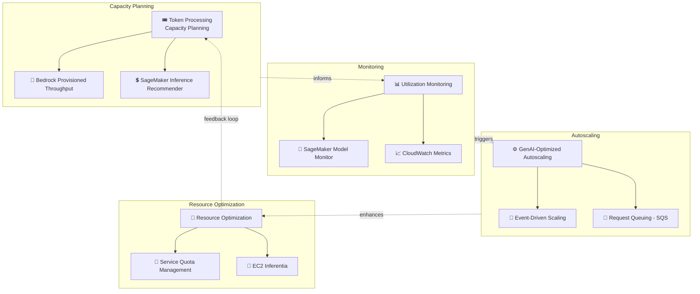

# ケーススタディ 14 — Foundation Model ワークロードのリソース配分最適化

[← ケーススタディに戻る](./README.md)

| | |
|---|---|
| **中心概念** | GenAI ワークロード専用に最適化した capacity planning + utilization monitoring + auto scaling（FM 向け FinOps） |
| **関連ドメイン** | D4 (Operational Efficiency & Cost), D2 (Integration) |
| **主要サービス** | SageMaker (Inference Recommender, Model Monitor), Bedrock (Provisioned Throughput, Cross-Region Inference), CloudWatch, EC2 Auto Scaling, EC2 Inferentia, SQS, Terraform (IaC) |

---

## 1. ユースケース要約

> **金融市場インフラ** プロバイダーが重要ワークロードを AWS へ移行し本番 GenAI を立ち上げている。GenAI ワークロードは従来アプリと比べ固有の課題を持つ: **大量の計算 & メモリ** が必要; 高い inference 需要時に **レイテンシが変動**; **特定の throughput quota** 下で動作; **従来のインフラパターンに従わない** → 従来の FinOps では不十分。

需要が **市場の開閉時に急増** し **予期せぬサージ** がある金融取引向け GenAI プラットフォームを運用していると想像してほしい。難しさ: GPU は非常に高価、throughput には硬い制限、負荷パターンは通常の web と異なる。この問題は、従来の FinOps を丸ごと持ち込むのでなく **capacity planning + 監視 + GenAI 固有の auto-scaling** の力を試す。

### 解くべき要件

| # | 要件 | なぜ難しいか |
|---|---|---|
| R1 | **token ベースの capacity planning** | token 需要に正しい instance を選ぶため benchmark が必要 |
| R2 | **既定 quota を超える安定 throughput** | ピーク時に on-demand quota では足りない |
| R3 | **prompt/completion パターンの監視** | token 長を測定、idle を検出して scale down |
| R4 | **GenAI パターン向け auto-scaling** | 市場開閉時のスパイク + 予期せぬサージ |
| R5 | **効率的な hosting + ハードウェア選択** | 大規模モデルに性能/コスト最適 instance を選ぶ |
| R6 | **インフラ自動化 (IaC)** | 標準パターンからインフラ構成を生成 |

---

## 2. アーキテクチャ図

---

## 3. なぜこのアーキテクチャが要件を満たすか (Design Rationale)

### R1 → Capacity planning: SageMaker Inference Recommender

**SageMaker Inference Recommender** が **自動 load testing** でモデルデプロイを様々な負荷下で評価し、性能/コスト最適な instance type を選び、real-time と serverless inference の両方を考慮。推測でなく instance 選択を **データ駆動** する。

> ⚠️ **間違えやすい点:** 「FM 向け instance を選ぶ benchmark」→ **SageMaker Inference Recommender**。

### R2 → 安定 throughput: Bedrock Provisioned Throughput + Cross-Region Inference

- **Provisioned Throughput** が専用インフラ endpoint を割り当て、**既定 on-demand quota より高く安定した** throughput を達成 — 保証が要る重要ワークロードに適する。
- **Cross-Region Inference profiles** が inference 需要を複数 region に分散し制限を超える。

> ⚠️ **間違えやすい点:** **保証された安定** throughput が要る重要ワークロード → **Provisioned Throughput**; ピーク時に一時的に quota を超える → **Cross-Region Inference**。

### R3 → 監視: CloudWatch + Model Monitor

- **CloudWatch** が resource metric を track、**prompt & response の token 長を測定** して utilization を把握、**idle period** を検出して endpoint を scale down/suspend。
- **SageMaker Model Monitor** が性能 & データ品質を継続監視。

### R4 → GenAI 固有の auto-scaling: EC2 Auto Scaling + queuing + event-driven

- SageMaker endpoint 向けに load balancer の背後の **EC2 Auto Scaling groups**; throughput 需要が予測可能なとき（例: 市場開閉）より大きな instance を **先行的に** デプロイ。
- アプリとモデル間の **Queuing (SQS)** で throughput 制約時に **request 拒否を回避**。
- 高需要アーキテクチャ向けの **Event-driven messaging**; ピークで scale up、閑散時に scale down; 実使用に容量を合わせる right-sizing。

> ⚠️ **間違えやすい点:** スパイクする GenAI 負荷 + 制約された throughput → request を落とさないため **queue (SQS)** を挿入; スケジュール scaling（市場開閉）+ 予期せぬサージを組み合わせ。

### R5 → Hosting & ハードウェア: EC2 Inferentia

より良い性能/効率のため **EC2 Inferentia**（AWS の専用 inference チップ）を検討; 大規模モデルは複数 instance に負荷を scale & 分散。

> ⚠️ **間違えやすい点:** 大規模モデル hosting のコスト/性能最適化 → **Inferentia** を検討、高価な GPU を既定にしない。

### R6 → インフラ自動化: IaC (Terraform) + AI agents

**AI agents** でアプリ要件を分析しインフラ構成を生成; 標準パターンに従いつつ具体的ニーズに適応する **Terraform のような IaC** を実装。

---

## 4. 代替案とトレードオフ (Alternatives & trade-offs)

| ニーズ | 正しい選択 | よくある誤り | 理由 |
|---|---|---|---|
| FM 向け instance 選択 | **SageMaker Inference Recommender** | 手動で推測 | load test がデータで決定 |
| 保証された安定 throughput | **Provisioned Throughput** | On-demand | 重要なピーク時に on-demand では不足 |
| 一時的に quota を超える | **Cross-Region Inference** | 固定 capacity を追加購入 | 柔軟に分散、spike に安価 |
| ピーク時の request 落ち回避 | **Queuing (SQS)** | 直接呼出 | queue が負荷を緩衝、拒否しない |
| 大規模モデルの効率的 hosting | **EC2 Inferentia** | 高価な GPU を既定 | 専用 inference チップが節約 |
| インフラ構成 | **IaC (Terraform)** | console を手で操作 | 再現可能、標準パターンに従う |

---

## 5. 💡 学び (Lesson learned)

> **「重要な FM ワークロード + 変動の大きい負荷 + throughput 制限 + GPU コスト最適化」** を見たら、すぐに: **Inference Recommender (capacity) + Provisioned Throughput/Cross-Region (throughput) + CloudWatch token monitoring + GenAI 固有の auto-scaling (queue + event-driven) + Inferentia。**

- **Inference Recommender** = load test で instance を選ぶ、推測しない。
- **Provisioned Throughput** は保証 throughput; **Cross-Region Inference** は spike 向け。
- **token 長 + idle period の監視** で right-size と scale down。
- アプリとモデル間の **Queue (SQS)** でピーク時に request を落とさない。
- **EC2 Inferentia** で大規模モデルをコスト効率的に hosting。
- GenAI の FinOps は従来と **異なる** — token & throughput に固有でなければならない。

🔗 **関連:** [02. SageMaker](../01-basic-knowledge/02-sagemaker-services.md) · [04. Compute & Deployment](../01-basic-knowledge/04-compute-deployment-services.md) · [01. Bedrock](../01-basic-knowledge/01-amazon-bedrock-services.md) · [Practice exam](../03-practice-exam/)
