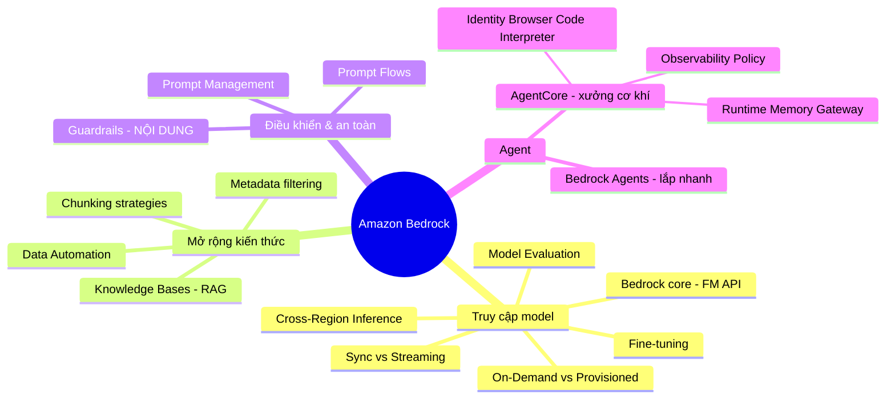

# 01. Amazon Bedrock Services

[← Về Basic Knowledge](./README.md)

> Nhóm dịch vụ **lõi** để làm GenAI trên AWS. Hãy hình dung **Amazon Bedrock** như một *"trung tâm thương mại" dành cho các bộ não AI (Foundation Model)*: bạn không tự nuôi model, chỉ ghé vào "chọn não" qua API. Quanh nó là cả hệ sinh thái: RAG, an toàn, quản lý prompt, agent.

## Mindmap nhóm này

## Bảng tra nhanh

| Service | Một câu | Domain liên quan |
|---|---|---|
| Amazon Bedrock (core) | API thống nhất gọi nhiều FM, serverless | D1, D2 |
| Foundation Model & Fine-tuning | "Sinh viên ưu tú" vs cho đi "học cao học" | D1 |
| Model Evaluation | So sánh hiệu năng nhiều FM để chọn | D1, D5 |
| Cross-Region Inference | Định tuyến inference sang region khác | D1, D4 |
| Knowledge Bases (RAG) | Cho AI "thi mở sách" từ tài liệu công ty | D1 |
| Data Automation | Đọc-hiểu tài liệu lộn xộn bằng GenAI | D1 |
| Guardrails | Lan can: kiểm soát **NỘI DUNG** (PII, từ độc) | D3, D1 |
| Prompt Management | "Git cho prompt": version + duyệt | D1, D3 |
| Prompt Flows | Nối nhiều bước prompt (DAG, kéo thả) | D1, D2 |
| Bedrock Agents | Agent lắp nhanh trên Console | D2 |
| AgentCore | Hạ tầng vận hành agent quy mô lớn (8 thành phần) | D2 |

---

## Service cards

### Amazon Bedrock (core)

> **Một câu:** "Trung tâm thương mại" của các bộ não AI — không tự mua máy chủ hay tự train, chỉ gọi API là dùng được Claude, Llama, Titan…

- **Giải quyết bài toán gì:** truy cập nhiều Foundation Model qua **một** API. **Serverless** — gọi API, nhận kết quả, trả tiền theo dùng.
- **Khi nào dùng:** gần như mọi dự án GenAI bắt đầu ở đây; làm PoC nhanh; cần đổi qua lại giữa các model.
- **Khi nào KHÔNG dùng / dễ nhầm:** cần tự host model open-source, tùy biến sâu trên hạ tầng riêng → **SageMaker**. Bedrock là *managed*, không phải nơi train từ đầu.
- **Liên quan domain thi:** D1, D2.
- **⚠️ Điểm phải nhớ:**
  - **Sync vs Streaming:** *Synchronous* đợi AI viết xong cả câu mới trả; *Streaming* trả từng chữ — chatbot phải dùng streaming để user không chờ lâu.
  - **2 kiểu giá:** **On-Demand** (xài nhiêu trả nhiêu) vs **Provisioned Throughput** (trả trước, latency ổn định). **Không** có kiểu Spot. (Xem card riêng bên dưới.)
  - **Bảo mật:** gọi qua **VPC Endpoint (PrivateLink)** để data không ra internet; Bedrock cam kết không dùng data của bạn để train model bên thứ ba.
  - **Lỗi hay gặp:** `AccessDeniedException` khi chưa **"Request Model Access"** trong Console + thiếu IAM `bedrock:InvokeModel`.
- **🧪 Ví dụ 1 dòng:** chatbot nội bộ gọi Claude qua Bedrock, đặt `temperature=0` cho câu trả lời ổn định.

💰 Đào sâu: On-Demand vs Provisioned Throughput (chắc chắn có trong đề)

- **On-Demand (Pay-as-you-go):** như đi taxi — đi bao nhiêu trả bấy nhiêu (theo token). Hợp **dự án mới, lưu lượng thất thường, Dev/Test**. Giờ cao điểm có thể chậm vì "xếp hàng" chung.
- **Provisioned Throughput:** như thuê hẳn xe + tài xế trực 24/7 — trả trước (thường cam kết **1–6 tháng**), nhưng **latency luôn ổn định, không xếp hàng**. Hợp **Production tải lớn, ổn định, cần độ trễ nhất quán**.
- **Câu hỏi mẫu:** "startup, traffic không đoán được" → On-Demand. "ngân hàng xử lý 100.000 hợp đồng/đêm, latency phải ổn định, ngân sách cố định" → Provisioned.
- **🔴 Bẫy:** Bedrock **KHÔNG** có mô hình giá kiểu **EC2 Spot**. Chỉ có 2 lựa chọn trên.

---

### Foundation Model (FM) & Fine-tuning

> **Một câu:** FM là "sinh viên ưu tú vừa tốt nghiệp, biết mọi thứ chung chung". Fine-tuning là "gửi cậu ấy đi học cao học chuyên ngành tại công ty bạn".

- **Giải quyết bài toán gì:** FM biết kiến thức tổng quát (đã "đọc" gần hết internet) nhưng **không** biết dữ liệu riêng của công ty bạn. Fine-tuning điều chỉnh "trọng số" model để thấm văn phong/thuật ngữ riêng.
- **Khi nào dùng Fine-tuning:** khi cần model hiểu **sâu** thuật ngữ chuyên ngành mà prompt không giải quyết nổi.
- **Khi nào KHÔNG dùng / dễ nhầm:** muốn AI **biết kiến thức nội bộ luôn-mới** → dùng **RAG (Knowledge Bases)**, KHÔNG fine-tune. Fine-tune **đắt, chậm**, và phải làm lại khi tài liệu cập nhật.
- **Liên quan domain thi:** D1.
- **⚠️ Điểm phải nhớ:** đây là **bẫy kinh điển nhất** của AWS — thấy "cập nhật kiến thức nội bộ" thì nghĩ RAG trước, fine-tune sau.
- **🧪 Ví dụ 1 dòng:** chatbot trả lời chính sách nghỉ phép 2025 → RAG (thay file PDF là xong), không fine-tune.

---

### Amazon Bedrock Knowledge Bases (RAG)

> **Một câu:** Cho AI "thi mở sách" — nạp tài liệu công ty vào, AI tra cứu rồi trả lời đúng theo tài liệu (RAG — Retrieval-Augmented Generation).

- **Giải quyết bài toán gì:** tự động **chunk → embed → lưu vector → truy xuất** để AI trả lời dựa trên tài liệu của bạn, giảm "bịa" (hallucination), **không cần fine-tune**.
- **Cách hoạt động:** tài liệu (PDF/Word) → "băm" nhỏ (chunking) → biến thành vector số (embeddings) → lưu Vector DB. Khi user hỏi, câu hỏi cũng thành vector → tìm đoạn **gần nghĩa nhất** → nhét vào prompt cho AI đọc & trả lời.
- **Khi nào dùng:** cần RAG nhanh, ít code; có sẵn connector cắm thẳng **S3 / SharePoint / Confluence**.
- **Khi nào KHÔNG dùng / dễ nhầm:** đừng nhầm với **Fine-tuning** (nạp kiến thức vào trọng số). RAG giữ nguyên "não" model, chỉ "mở sách" cho nó đọc.
- **Liên quan domain thi:** D1.
- **⚠️ Điểm phải nhớ:** **metadata filtering** vừa tăng tốc vừa **phân quyền bảo mật**; chọn **SEMANTIC vs HYBRID** qua `OverrideSearchType`.
- **🧪 Ví dụ 1 dòng:** trợ lý nội bộ trả lời quy trình từ 10.000 trang PDF trong S3.

✂️ Đào sâu: 3 chiến lược Chunking + Metadata filtering

| Chiến lược | Cách làm | Ưu | Nhược | Hợp với |
|---|---|---|---|---|
| **Fixed-size** | Đếm đủ N token là cắt | Nhanh, rẻ, đơn giản | Cắt giữa câu, đứt ngữ nghĩa | Q&A/FAQ ngắn, độc lập |
| **Semantic** | Giữ trọn cụm ý/đoạn văn | Bảo toàn ngữ cảnh | Tốn compute, chunk không đều (quá ngắn/quá dài vượt context window) | Hợp đồng, văn bản luật |
| **Hierarchical** | Lưu cha–con (Chương→Bài→Mục) | Nắm bối cảnh rộng | Phức tạp, cần tài liệu có heading rõ; truy xuất khó hơn | Sổ tay kỹ thuật lớn (vd sửa ô tô) |

- **Hybrid chunking (thực tế Production hay dùng):** Hierarchical giữ cấu trúc → Semantic cắt theo ý → Fixed-size làm màng lọc cuối ("không quá 500 tokens/chunk").
- **Metadata filtering:** gắn tag (`department=HR`, `year=2025`) để **lọc trước** → tìm nhanh hơn & **chặn rò rỉ** (nhân viên HR không thấy tài liệu lương của Finance).
- **Vector Embeddings:** tìm theo **ý nghĩa** (khoảng cách giữa các tọa độ vector), không phải khớp keyword như Google cũ.

---

### Amazon Bedrock Data Automation

> **Một câu:** "Chuyên viên phân tích thông minh" cho tài liệu lộn xộn — dùng GenAI đọc-hiểu ngữ cảnh, không chỉ bóc chữ.

- **Giải quyết bài toán gì:** trích xuất dữ liệu từ tài liệu **không có cấu trúc cố định** (hóa đơn nhiều nhà cung cấp, bệnh án…) và xuất ra JSON chuẩn hóa. Tự hiểu "Amount Due" = "Total" = "Cần thanh toán".
- **Khi nào dùng:** dữ liệu **bất quy tắc**, nhiều định dạng khác nhau, cần AI tự hiểu ngữ cảnh.
- **Khi nào KHÔNG dùng / dễ nhầm:** chỉ cần số hóa text thuần hoặc **form cố định 100%** → **Amazon Textract** (nhanh, rẻ, ổn định). Data Automation chậm & đắt hơn nhưng "có trí thông minh" (thường dùng Textract ngầm bên dưới rồi mới để FM phân tích).
- **Liên quan domain thi:** D1.
- **⚠️ Điểm phải nhớ:** đề nói "form cố định / bóc chữ" → Textract; "nhiều định dạng lộn xộn / hiểu ngữ cảnh" → Data Automation.
- **🧪 Ví dụ 1 dòng:** hệ thống nhận hóa đơn từ 500 nhà cung cấp khác mẫu → Data Automation xuất `{"total_due": 500000}` đồng nhất.

---

### Amazon Bedrock Guardrails

> **Một câu:** Lan can an toàn cho AI — kiểm soát **NỘI DUNG**: chặn từ độc hại và che thông tin cá nhân (PII).

- **Giải quyết bài toán gì:** lọc hate/insults/sexual/violence (mức low/medium/high), **che PII**, chặn denied topics, chống prompt injection; áp đồng nhất cho nhiều model.
- **Khi nào dùng:** output có thể chạm người dùng cuối; đề yêu cầu "ít công sức phát triển nhất" để chặn PII.
- **Khi nào KHÔNG dùng / dễ nhầm:** **🔑 Guardrails kiểm soát NỘI DUNG. Kiểm soát HÀNH ĐỘNG (agent được gọi tool nào) là việc của AgentCore Policy** (xem dưới). Đây là cặp bẫy kinh điển.
- **Liên quan domain thi:** D3 (chính), D1.
- **⚠️ Điểm phải nhớ:** là service *managed* → chọn nó thay vì tự viết regex khi đề nói "LEAST development effort". Phân biệt **chặn (prevent)** vs **chỉ cảnh báo (CloudWatch alert)**.
- **🧪 Ví dụ 1 dòng:** chatbot bảo hiểm bật PII filter + denied topics để không lộ số hợp đồng.

---

### Amazon Bedrock Prompt Management

> **Một câu:** "Git cho prompt" — quản version, biến (variables), và quy trình phê duyệt trước khi lên Production.

- **Giải quyết bài toán gì:** **không hard-code prompt** trong source. Lưu prompt trên cloud, đánh version (v1, v2), gọi qua ARN; có approval workflow (author/reviewer/admin).
- **Khi nào dùng:** doanh nghiệp nhiều app, cần governance + cho team Non-IT sửa prompt mà không phải deploy lại code.
- **Khi nào KHÔNG dùng / dễ nhầm:** đừng tự dựng Git CI/CD hay DynamoDB để quản prompt khi đã có service managed này (đề Pro hay gài).
- **Liên quan domain thi:** D1, D3.
- **⚠️ Điểm phải nhớ:** đổi prompt = đổi version trên Console, **không** deploy lại backend.
- **🧪 Ví dụ 1 dòng:** 50 app dùng chung kho prompt có version + duyệt → Prompt Management + CloudTrail audit.

---

### Amazon Bedrock Prompt Flows

> **Một câu:** Kéo-thả nối nhiều bước AI thành một **sơ đồ DAG** (đồ thị có hướng, không vòng lặp), thay vì viết code điều phối.

- **Giải quyết bài toán gì:** luồng AI **tuyến tính nhiều bước, có rẽ nhánh** (vd: nhận text → phân loại → tóm tắt → sinh phản hồi), component tái dùng, pre/post-processing.
- **Khi nào dùng:** quy trình rõ ràng, đi một chiều, rẽ nhánh theo điều kiện.
- **Khi nào KHÔNG dùng / dễ nhầm:** cần agent **tự suy luận chọn tool linh hoạt** → Bedrock Agents/AgentCore. Cần điều phối stateful kéo dài nhiều ngày → Step Functions.
- **Liên quan domain thi:** D1, D2.
- **⚠️ Điểm phải nhớ:** DAG = một chiều, có điểm đầu/cuối, **không vòng lặp** ngược.
- **🧪 Ví dụ 1 dòng:** email khách → phân tích sắc thái → (Tiêu cực) viết email xin lỗi / (Tích cực) đăng Slack.

---

### Amazon Bedrock Agents

> **Một câu:** "Đồ chơi lắp ráp sẵn" — tạo nhanh một AI Agent tự chủ ngay trên Console, không cần viết code điều phối.

- **Giải quyết bài toán gì:** AI tự suy nghĩ & quyết định gọi tool nào. Bạn cấp 4 món:
  - **Instructions (chỉ thị):** *bắt buộc* — "đóng vai nhân viên hỗ trợ…".
  - **Action groups (tay chân):** *tùy chọn* — API/Lambda để hành động (đặt vé, tạo ticket).
  - **Knowledge bases (sách):** *tùy chọn* — dữ liệu để tra cứu.
  - **Guardrails (rào chắn):** *tùy chọn* — chặn nội dung xấu/PII.
- **Khi nào dùng:** cần agent **cấu hình nhanh** trên Console cho bài toán vừa phải.
- **Khi nào KHÔNG dùng / dễ nhầm:** cần framework tùy chỉnh (LangGraph/CrewAI), chạy lâu, quy mô lớn → **AgentCore**.
- **Liên quan domain thi:** D2.
- **⚠️ Điểm phải nhớ:** thiếu **Instructions** thì không lưu được agent; thiếu các món khác thì agent vẫn chạy nhưng "giáng cấp" (thiếu KB → dễ bịa; thiếu Action → chỉ nói chay; thiếu Guardrails → dễ bị jailbreak).
- **🧪 Ví dụ 1 dòng:** agent CSKH đặt vé: Instructions + Action group (API đặt vé) + KB (chính sách) + Guardrails.

---

### Amazon Bedrock AgentCore

> **Một câu:** Nếu Bedrock Agents là "đồ chơi lắp ráp sẵn" thì **AgentCore là xưởng cơ khí** — hạ tầng vận hành agent **quy mô lớn, production**, framework-agnostic & model-agnostic.

- **Giải quyết bài toán gì:** chạy/điều hành agent phức tạp ở mức enterprise, gồm **8 thành phần module** lắp ghép.
- **Khi nào dùng:** agent chạy lâu, state phức tạp, dùng framework riêng, cần bảo mật/giám sát cấp production.
- **Khi nào KHÔNG dùng / dễ nhầm:** bài toán nhỏ, cấu hình nhanh → Bedrock Agents.
- **Liên quan domain thi:** D2 (chính). *Lưu ý: AgentCore thiên về Domain 2; ở đây gom chung vì cùng họ Bedrock.*

#### 8 thành phần AgentCore

| Thành phần | Một câu | Ghi nhớ / bẫy |
|---|---|---|
| **Runtime** | Môi trường chạy riêng cho agent, microVM cách ly | Session dài **tối đa 8 giờ** (Lambda chỉ 15 phút) |
| **Memory** | Trí nhớ ngắn hạn (session) + dài hạn (tóm tắt → Vector DB) | Dài hạn vượt qua ranh giới session |
| **Gateway** | Biến API/Lambda thành "tool" cho agent | Agent **tự khám phá tool mới** qua OpenAPI Schema/MCP, không sửa code |
| **Identity** | Cho agent hành động **thay mặt** user | Token tạm thời (**AWS STS**), không lưu mật khẩu cứng |
| **Code Interpreter** | Sandbox để agent tự viết & chạy code Python | Dùng khi cần tính toán chính xác / xử lý file (tránh AI nhẩm sai) |
| **Browser** | Trình duyệt ảo cho agent | Web automation, điền form, xử lý CAPTCHA khi đối tác không có API |
| **Observability** | Trace/log từng bước, token, latency | Debug production; **⚠️ rủi ro lộ PII trong log** |
| **Policy** | Cedar — kiểm soát **HÀNH ĐỘNG** (tool nào được gọi) | default-deny, forbid-wins; vd "refund < $500" |

> **🔑 Cặp bẫy quan trọng nhất:** **Guardrails = kiểm soát NỘI DUNG** (lọc từ độc, che PII). **AgentCore Policy (Cedar) = kiểm soát HÀNH ĐỘNG** (ngăn agent gọi API xóa DB / giao dịch > $10.000).

🔬 Đào sâu từng thành phần (các tình huống "nếu… thì sao")

- **Runtime > 8 giờ?** Quá 8h sẽ time-out. Đừng bắt agent "thức trắng" — dùng **Step Functions** chia task lớn thành nhiều task nhỏ, gọi Runtime nhiều lần (bền bỉ + tiết kiệm).
- **Memory ngắn vs dài hạn:** ngắn hạn = toàn bộ chat trong 1 session, đóng app là hết. Dài hạn = một AI ngầm **tóm tắt & trích sự kiện** ("user tên Minh, dị ứng đậu phộng") lưu Vector DB, session sau "bốc" lại bằng tìm kiếm ngữ nghĩa.
- **Gateway "tự khám phá tool":** khai báo API + OpenAPI Schema vào Gateway → Gateway dịch thành Tools cho FM. Team IT cắm thêm API mới, agent tự thấy & dùng, **không sửa code agent**.
- **Code Interpreter cần sandbox vì:** kẻ gian có thể prompt-injection bắt AI viết code xóa data/đọc trộm mật khẩu. Sandbox = hộp cách ly, bịt mạng ngoài, chạy xong **tự hủy** → mã độc cũng chỉ phá hộp rỗng.
- **Browser & mật khẩu/CAPTCHA:** AI **không** giữ mật khẩu — lấy từ **Secrets Manager** hoặc OAuth 2.0, tiêm vào headless browser. CAPTCHA: giả lập chuột/User-Agent + vision model cho ảnh đơn giản; bảo mật cấp ngân hàng vẫn có thể chặn (giới hạn công nghệ).
- **Identity chống giả danh:** token tạm thời qua **STS** (15 phút–1 giờ); IAM kiểm chữ ký điện tử → hacker biết ID nhưng không có secret key thì không mạo danh được.
- **Observability & PII:** log đẩy về **CloudWatch Logs** (retention tự đặt, tốn tiền theo GB). ⚠️ Câu user "số thẻ 4508…" có thể lọt log → bật **CloudWatch Logs Data Protection** (che ***) hoặc **Guardrails** che PII trước khi ghi.
- **Evaluations (ghi chú độ chắc chắn):** tài liệu chính thức của AWS xác nhận rõ **Policy/Runtime/Memory/Gateway/Identity/Code Interpreter/Browser/Observability**; "**Evaluations**" xuất hiện trong một số bài viết gần đây nhưng tôi **chưa xác nhận được là service định danh riêng**. Concept thì có thật & đáng nhớ: dùng **Golden Dataset** (cặp [câu hỏi]–[đáp án kỳ vọng] do SME tạo) + **feedback loop 👍/👎** để đánh giá/A-B test agent; cần cập nhật khi chính sách đổi (tránh out-of-date).

---

### Model Evaluation & Cross-Region Inference (tóm tắt)

> Hai tính năng Bedrock thường gặp, sẽ bổ sung sâu khi anh gửi thêm note.

- **Model Evaluation:** benchmark nhiều FM trên tác vụ chuẩn (accuracy, latency, throughput, cost) để chọn model theo TCO, không theo cảm tính. (D1, D5)
- **Cross-Region Inference (CRIS):** tự định tuyến inference sang region khác để tăng sẵn sàng/throughput ở **tầng model**. ⚠️ CRIS **≠** DR toàn hệ thống — muốn chịu lỗi cả app stack cần thêm **multi-region + Route 53 health check + failover**. (D1, D4)

---

## Bảng so sánh service dễ nhầm trong nhóm ("vũ khí đi thi")

| Tình huống / từ khóa đề | Đừng chọn (bẫy) | Hãy chọn (đúng) |
|---|---|---|
| Trợ lý trả lời từ tài liệu nội bộ (PDF/Word) | Fine-tuning | **Knowledge Bases (RAG)** |
| Trích xuất từ hàng ngàn hóa đơn khác định dạng | Textract (form cố định) | **Data Automation** |
| Số hóa form cố định, nhanh & rẻ | Data Automation | **Textract** |
| Ngăn AI lộ PII / nói tục | AgentCore Policy | **Guardrails** (nội dung) |
| Ngăn agent gọi API xóa DB / giao dịch > $10.000 | Guardrails | **AgentCore Policy** (Cedar, hành động) |
| Agent lắp nhanh trên Console | AgentCore | **Bedrock Agents** |
| Agent framework tùy chỉnh, chạy lâu, quy mô lớn | Bedrock Agents | **AgentCore Runtime** |
| Agent chạy tác vụ > 8 giờ | Ép Runtime chạy thẳng | **Step Functions** chia nhỏ + gọi Runtime nhiều lần |
| Agent nhớ sở thích user qua nhiều tháng | Session memory | **AgentCore Memory** (dài hạn) |
| Agent tự viết code phân tích CSV an toàn | Chạy trên server chính | **AgentCore Code Interpreter** (sandbox) |
| Luồng AI nhiều bước, rẽ nhánh tuyến tính | Step Functions chung chung | **Prompt Flows** |
| Quản version prompt + duyệt | Hard-code / Git tự chế | **Prompt Management** |
| Ứng dụng tải lớn, latency phải ổn định | On-Demand | **Provisioned Throughput** |
| Startup, traffic thất thường / Dev-Test | Provisioned | **On-Demand** |

## ⚠️ Bẫy thường gặp của nhóm (tổng hợp)

- "Cập nhật kiến thức nội bộ" → **RAG**, không Fine-tune (bẫy số 1).
- **Guardrails (nội dung) vs Policy (hành động)** — nhớ kỹ cặp này.
- **Bedrock không có Spot pricing** — chỉ On-Demand & Provisioned.
- **AgentCore Runtime tối đa 8h** — quá thì ghép Step Functions.
- **Observability dễ lộ PII** — bật Data Protection / Guardrails masking.
- Chatbot real-time → **Streaming**, không Synchronous.

## Liên quan exam domain

Nhóm này phủ mạnh **D1 (31%)** và **D2 (26%)**, chạm **D3** (Guardrails), **D4** (CRIS, cost), **D5** (Model Evaluation). Xem [bản đồ cross-map](./README.md#bản-đồ-nhóm-service--5-exam-domain).

🔗 **Liên quan:** [Case studies](../02-case-studies/) · [Practice exam](../03-practice-exam/) · [02. SageMaker →](./02-sagemaker-services.md)
