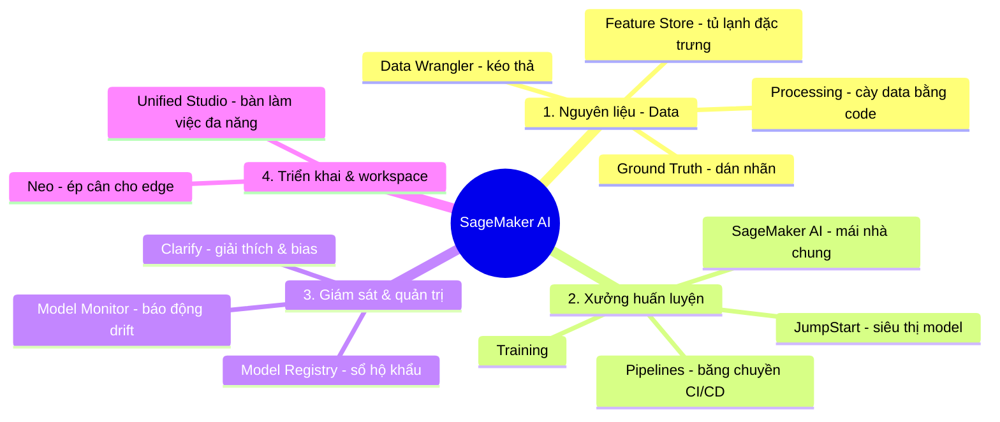

# 02. SageMaker Services

[← Về Basic Knowledge](./README.md)

> Nếu **Bedrock là "nhà hàng"** (gọi món = gọi API là có ăn) thì **SageMaker là "nhà bếp công nghiệp"** — dành cho kỹ sư muốn tự nhào nặn dữ liệu, tự huấn luyện (train) và tự đóng gói model.
> **Thần chú:** SageMaker không phải một công cụ, mà là một **dây chuyền (pipeline)**. Đề thi thường mô tả một "mắt xích" đang lỗi/cần tối ưu và hỏi bạn gọi tên đúng dịch vụ phụ trách mắt xích đó.

## Mindmap nhóm này (theo vòng đời dự án ML)

## Bảng tra nhanh

| Service | Mô tả ngắn gọn trong 1 câu | Domain liên quan |
|---|---|---|
| SageMaker AI (core) | "Mái nhà chung" để train/host model (tên mới của SageMaker) | D1, D2 |
| Ground Truth | Đội quân dán nhãn dữ liệu (+ auto labeling) | D1 |
| Data Wrangler | Làm sạch data bằng **kéo-thả** (visual, no-code) | D1 |
| Processing | "Máy cày" data quy mô lớn bằng **code/Spark** | D1 |
| Feature Store | "Tủ lạnh" lưu đặc trưng (feature) tái dùng | D1 |
| JumpStart | "Siêu thị" model mở (Llama, FLAN-T5, Stable Diffusion) | D1, D2 |
| Pipelines | "Băng chuyền" tự động hoá CI/CD cho ML | D2, D5 |
| Model Registry | "Sổ hộ khẩu" version + approval + lineage | D1, D5 |
| Model Monitor | "Bảo vệ" canh drift ở Production | D5 |
| Clarify | "Thanh tra": giải thích (explainability) + bias | D3, D5 |
| Neo | "Thợ độ xe" ép model chạy trên edge/IoT | D4 (ngoài rìa) |
| Unified Studio | "Bàn làm việc đa năng" gom mọi tool + AI viết code | D2 |

---

## Nhóm 1 — Xử lý nguyên liệu (Data)

### Amazon SageMaker Ground Truth

> **Mô tả ngắn gọn trong 1 câu:** "Đội quân dán nhãn" — thuê người thật khoanh vùng/gắn nhãn dữ liệu để dạy AI, có AI phụ làm việc dễ cho rẻ.

- **Giải quyết bài toán gì:** tạo tập dữ liệu có nhãn (vd khoanh xe máy/ô tô trong 50.000 ảnh giao thông) qua nhân viên của bạn hoặc Mechanical Turk.
- **Khi nào dùng:** cần labeled data chất lượng cho computer vision/NLP.
- **Khi nào KHÔNG dùng / dễ nhầm:** đây là bước **gắn nhãn**, khác với làm sạch (Data Wrangler/Processing).
- **Liên quan domain thi:** D1.
- **⚠️ Điểm phải nhớ (ăn tiền):** **Automated Data Labeling** = AI tự dán nhãn mẫu "dễ", chỉ chừa mẫu "khó" cho người → **tiết kiệm chi phí** dán nhãn.
- **🧪 Ví dụ 1 dòng:** dán bounding box người đi bộ cho dự án xe tự lái.

🔬 Đào sâu: Vì sao AI biết mẫu "dễ" hay "khó"? (Active Learning)

Cơ chế **Active Learning** dựa trên **Confidence Score**, không phải "cảm giác":
1. Người dán 1.000 mẫu đầu → Ground Truth train một *labeling model* nhỏ.
2. Model này dự đoán nhãn cho mẫu tiếp theo kèm độ tự tin.
3. Tự tin **≥ ngưỡng** (vd 90%) → tự chấp nhận (mẫu "dễ"). **< ngưỡng** (vd 45%) → đẩy cho người (mẫu "khó").
4. Người dán mẫu khó → model học lại (retrain) → ngày càng cần ít người hơn.

### Amazon SageMaker Data Wrangler

> **Mô tả ngắn gọn trong 1 câu:** Làm sạch dữ liệu bằng **kéo-thả** (visual, gần như không code).

- **Giải quyết bài toán gì:** nối data từ S3, xoá cột trống, lọc rác, chuẩn hoá — bằng giao diện chuột.
- **Khi nào dùng:** khám phá & dựng "công thức" (pipeline) trên **tập mẫu nhỏ**.
- **Khi nào KHÔNG dùng / dễ nhầm:** data cực lớn (hàng Terabyte) → kéo-thả treo máy → dùng **Processing**.
- **Liên quan domain thi:** D1.
- **⚠️ Điểm phải nhớ:** Wrangler có thể **export** ra S3, **Feature Store**, hoặc Python script/Pipeline. Cách chuẩn MLOps: dựng recipe trên data mẫu rồi đẩy sang Processing chạy toàn bộ.
- **🧪 Ví dụ 1 dòng:** kéo-thả 100 ảnh mẫu để xoá cột GPS thừa, chuẩn hoá thời gian.

### Amazon SageMaker Processing

> **Mô tả ngắn gọn trong 1 câu:** "Máy cày data" — viết code Python/Spark, ném cho nó tự bật cụm máy chủ cày sạch đống data khổng lồ rồi tự tắt.

- **Giải quyết bài toán gì:** tiền/hậu xử lý data **quy mô lớn (Terabytes)**, feature engineering, hoặc đánh giá model.
- **Khi nào dùng:** workload nặng cần script & tự động hoá; thường là bước trong Pipeline.
- **Khi nào KHÔNG dùng / dễ nhầm:** chỉ cần kéo-thả nhẹ nhàng trên data mẫu → Data Wrangler.
- **Liên quan domain thi:** D1.
- **⚠️ Điểm phải nhớ:** chạy job nặng → bật **Managed Spot** để giảm tới **~90%** chi phí so với On-Demand.
- **🧪 Ví dụ 1 dòng:** giải nén & resize 50TB ảnh hành trình về 1080p trước khi train.

### Amazon SageMaker Feature Store

> **Mô tả ngắn gọn trong 1 câu:** "Tủ lạnh chung" của công ty chứa các **đặc trưng (feature)** đã tính sẵn, để mọi team lấy ra tái dùng thay vì tính lại từ đầu.

- **Giải quyết bài toán gì:** lưu & chia sẻ feature (vd `user_failed_logins_last_5_mins`) với schema rõ ràng; tránh trùng lặp công sức giữa các team.
- **Khi nào dùng:** nhiều model/team cần chung feature; cần truy xuất feature **real-time** lúc inference.
- **Khi nào KHÔNG dùng / dễ nhầm:** lưu file thô (ảnh/log/video) → **S3**, không phải Feature Store.
- **Liên quan domain thi:** D1.
- **⚠️ Điểm phải nhớ:** **Online Store** = độ trễ **< 10ms** cho real-time (vd chống gian lận lúc quẹt thẻ); **Offline Store** = cho training (lưu ngầm trong S3).
- **🧪 Ví dụ 1 dòng:** lúc quẹt thẻ, AI chọc Online Store lấy `failed_logins_5m` trong 0.1 giây để phán đoán gian lận.

🔬 Đào sâu: Feature Store vs S3 + quản trị tránh "đầm lầy dữ liệu"

| Tiêu chí | Amazon S3 | Feature Store |
|---|---|---|
| Loại data | Mọi thứ (ảnh/video/log thô) | Chỉ **feature** đã tính (số/chuỗi) |
| Tốc độ | vài chục ms–vài giây | **Online < 10ms** |
| Cấu trúc | Lộn xộn, quăng gì cũng được | **Schema** ép kiểu rõ ràng |

Cơ chế governance (chống Data Swamp): (1) phải tạo **Feature Group** với schema nghiêm ngặt; (2) **metadata/catalog** ghi rõ tên, công thức, owner để tìm & dùng đúng; (3) **versioning/time-travel** theo timestamp — model cũ vẫn lấy đúng giá trị feature ở thời điểm cũ.

---

## Nhóm 2 — Xưởng lắp ráp & huấn luyện

### Amazon SageMaker AI (core)

> **Mô tả ngắn gọn trong 1 câu:** "Mái nhà chung" bao trùm mọi dịch vụ SageMaker — cung cấp máy chủ, thuật toán để train & host model. Đây là **tên mới** của Amazon SageMaker (đổi tại re:Invent **cuối 2024**).

- **Giải quyết bài toán gì:** nền tảng ML đầy đủ vòng đời: build → train → deploy.
- **Khi nào dùng:** cần kiểm soát sâu việc huấn luyện/host (khác Bedrock chỉ gọi API).
- **Khi nào KHÔNG dùng / dễ nhầm:** chỉ muốn gọi FM nhanh, không quản hạ tầng → Bedrock.
- **Liên quan domain thi:** D1, D2.
- **⚠️ Điểm phải nhớ:** đổi tên không phá kiến trúc lõi; "Amazon SageMaker AI" + "Unified Studio" là đợt tái cấu trúc lớn cuối 2024, dịch vụ con vẫn giữ nguyên vai trò.
- **🧪 Ví dụ 1 dòng:** train mô hình phát hiện gian lận trên cụm GPU trong SageMaker.

### Amazon SageMaker JumpStart

> **Mô tả ngắn gọn trong 1 câu:** "Siêu thị mô hình" — lấy sẵn Foundation Model mã nguồn mở (Llama, FLAN-T5, Stable Diffusion) thay vì xây "não" từ số 0.

- **Giải quyết bài toán gì:** deploy/fine-tune nhanh model dựng sẵn ngay trong SageMaker.
- **Khi nào dùng:** muốn **toàn quyền kiểm soát** model trên endpoint riêng của bạn để tinh chỉnh sâu.
- **Khi nào KHÔNG dùng / dễ nhầm:** đừng nhầm **JumpStart** (siêu thị model của thiên hạ) với **Model Registry** (tủ hồ sơ model **nội bộ** công ty bạn). Cũng khác Bedrock: JumpStart deploy lên **SageMaker endpoint riêng** (bạn quản instance), Bedrock trả-theo-token, fully managed.
- **Liên quan domain thi:** D1, D2.
- **⚠️ Điểm phải nhớ — tiêu chí chọn model:** *task-specific* (tóm tắt→FLAN-T5/BART; ảnh→Stable Diffusion; chat đa ngữ→Llama/Mistral); *parameter size* (7–8B nhanh-rẻ vs 70B+ thông minh-đắt); *context window* (4K vs 128K/200K); **licensing** (thương mại phải Apache 2.0/MIT).
- **🧪 Ví dụ 1 dòng:** lấy Llama từ JumpStart, fine-tune cho chatbot tiếng Việt, deploy lên endpoint riêng.

---

## Nhóm 3 — Giám sát, quản trị & giải thích (trọng tâm thi)

### Amazon SageMaker Pipelines

> **Mô tả ngắn gọn trong 1 câu:** "Băng chuyền" nối các bước ML thành quy trình tự động — **CI/CD cho Machine Learning (MLOps)**.

- **Giải quyết bài toán gì:** tự động hoá ingest → process → train → evaluate → register → deploy, không phải chạy tay từng bước.
- **Khi nào dùng:** cần retrain định kỳ / khi có data mới / khi Model Monitor báo động.
- **Khi nào KHÔNG dùng / dễ nhầm:** điều phối agent GenAI tự suy luận → đó là chuyện của Bedrock Agents/Step Functions, không phải Pipelines.
- **Liên quan domain thi:** D2, D5.
- **⚠️ Điểm phải nhớ:** **CI** = tự chạy lại khi code/data đổi; **CD** = deploy có kiểm soát qua bước **approval ở Model Registry** (không để model lỗi ra Production).
- **🧪 Ví dụ 1 dòng:** Monitor báo drift → kích Pipeline → vài tiếng sau có model v5.0 "xuất xưởng" tự động.

🔬 Đào sâu: dây chuyền MLOps phát hiện gian lận thẻ

1. **Processing** — kéo data từ S3, làm sạch.
2. **Training** — train trên cụm GPU.
3. **Evaluation** (Processing + **Clarify**) — accuracy < 95% thì Pipeline dừng & báo lỗi; đạt thì đi tiếp, Clarify check bias.
4. **Model Registry** — đăng ký v5.0, trạng thái *Pending Approval*.
5. **Approval & Deploy** — người duyệt → CD tự cập nhật **SageMaker Endpoint**.

### Amazon SageMaker Model Registry

> **Mô tả ngắn gọn trong 1 câu:** "Sổ hộ khẩu / GitHub cho model" — quản version, ai tạo, trạng thái, và phải **approve** mới được dùng.

- **Giải quyết bài toán gì:** quản vòng đời model nội bộ (v1, v2, v3), lineage, approval (Dev → Prod).
- **Khi nào dùng:** team nhiều người, nhiều model, cần biết bản nào đang Production.
- **Khi nào KHÔNG dùng / dễ nhầm:** lấy model của thiên hạ → JumpStart; đây là quản model **của bạn**.
- **Liên quan domain thi:** D1, D5.
- **⚠️ Điểm phải nhớ:** **rollback** không phải `git revert` — đổi trạng thái v3 thành **Rejected** rồi trỏ Endpoint config về **v2**. **Model Lineage** truy vết nguồn gốc (data nào, code version nào, ai duyệt) → minh bạch cho kiểm toán.
- **🧪 Ví dụ 1 dòng:** v3 lỗi ở Production → Reject v3, point traffic về v2 ổn định.

### Amazon SageMaker Model Monitor

> **Mô tả ngắn gọn trong 1 câu:** "Bảo vệ gác cổng" — canh model ở Production, hú còi (qua CloudWatch) khi độ chính xác sụt giảm.

- **Giải quyết bài toán gì:** phát hiện **drift** (trôi dạt) khi dữ liệu thực tế lệch so với lúc train.
- **Khi nào dùng:** model đã chạy thật, cần giám sát sức khoẻ 24/7.
- **Khi nào KHÔNG dùng / dễ nhầm:** **Monitor báo động *khi* kết quả lệch (triệu chứng)**; **Clarify tìm *nguyên nhân sâu xa* (bias/lý do)**. Đây là cặp dễ nhầm.
- **Liên quan domain thi:** D5.
- **⚠️ Điểm phải nhớ:** dù lỗi loại nào, hướng xử lý cuối là **kích Pipeline retrain** bằng data mới nhất.
- **🧪 Ví dụ 1 dòng:** giá nhà tăng vọt 2024 vs data 2020 → Monitor báo drift → retrain.

🔬 Đào sâu: Data Drift vs Concept/Model Drift

- **Data Drift:** model không đổi, "thế giới" đổi — phân phối **input** lệch (thu nhập TB 10tr→20tr). Phát hiện: so phân phối data hiện tại vs **baseline**.
- **Concept/Model Drift:** input không đổi nhưng **quy luật** đổi ("mua khẩu trang" 2019 = y tế, 2026 = thời trang). Phát hiện: cần **ground-truth labels** thực tế để đối chiếu dự đoán.

### Amazon SageMaker Clarify

> **Mô tả ngắn gọn trong 1 câu:** "Thanh tra công lý" — trả lời **vì sao** AI ra quyết định (explainability) và phát hiện **thiên vị** (bias).

- **Giải quyết bài toán gì:** giải thích đóng góp của từng yếu tố vào quyết định; đo mất cân bằng giữa các nhóm nhạy cảm.
- **Khi nào dùng:** khách hàng đòi lý do bị từ chối vay; kiểm tra model có phân biệt giới tính/độ tuổi.
- **Khi nào KHÔNG dùng / dễ nhầm:** Clarify = **nguyên nhân**; Model Monitor = **triệu chứng/drift**.
- **Liên quan domain thi:** D3 (bias/responsible AI), D5.
- **⚠️ Điểm phải nhớ:** thấy **Shapley Values (SHAP)** hoặc **Partial Dependence Plots (PDP)** → 99% là **Clarify**. Bias đo bằng các chỉ số thống kê như **DPL (Difference in Proportions of Labels)** trên **sensitive facet** (vd cột Giới tính).
- **🧪 Ví dụ 1 dòng:** hồ sơ bị từ chối 70% do nợ xấu, 30% do thu nhập thấp (giải thích bằng SHAP).

🔬 Đào sâu: SHAP & PDP

- **Shapley Values (SHAP):** mượn từ *game theory* — tính "công" của mỗi feature vào kết quả (cầu thủ "Thu nhập" góp 50%, "Nợ xấu" 40%, "Tuổi" 10%).
- **PDP (Partial Dependence Plot):** giữ nguyên mọi thứ, chỉ kéo 1 yếu tố (vd Tuổi 20→60) để xem đường cong xác suất kết quả đổi ra sao.
- **Bias (DPL):** so tỉ lệ duyệt giữa nhóm Nam vs Nữ (các điều kiện khác như nhau); lệch quá ngưỡng → cảnh báo thiên vị. Clarify chỉ nhìn **mất cân bằng thống kê**, không "hiểu" nam/nữ.

---

## Nhóm 4 — Triển khai & workspace

### Amazon SageMaker Neo

> **Mô tả ngắn gọn trong 1 câu:** "Thợ độ xe" — biên dịch & tối ưu model nặng để chạy mượt trên thiết bị edge/IoT/mobile nhỏ.

- **Giải quyết bài toán gì:** compile model cho phần cứng đích, giảm RAM/độ trễ mà giữ gần nguyên độ chính xác.
- **Khi nào dùng:** nhét model vào camera an ninh, thiết bị IoT, mobile.
- **Khi nào KHÔNG dùng / dễ nhầm:** Neo **biên dịch cho phần cứng**, khác Processing (**xử lý dữ liệu**).
- **Liên quan domain thi:** D4 — *và khá ngoài rìa với cert GenAI này; ưu tiên ôn thấp.*
- **⚠️ Điểm phải nhớ:** kỹ thuật chắc chắn của Neo là **compile tối ưu cho hardware đích + Quantization** (làm tròn Float-32 → Int-8, nhẹ ~4 lần). *Lưu ý độ chắc chắn:* note gốc nói Neo còn "Pruning (cắt tỉa)" — tôi **không chắc** đây là tính năng định danh của Neo (pruning thường là kỹ thuật nén model riêng), nên đừng coi pruning là từ khoá nhận diện Neo khi thi.
- **🧪 Ví dụ 1 dòng:** ép model nhận diện vật thể chạy được trên camera ngã tư.

### Amazon SageMaker Unified Studio

> **Mô tả ngắn gọn trong 1 câu:** "Bàn làm việc đa năng" — gom Athena/SageMaker/Bedrock… vào một màn hình, kèm AI (Amazon Q) ngồi cạnh viết code hộ.

- **Giải quyết bài toán gì:** một IDE thống nhất cho data engineer + ML + GenAI, xây trên **open lakehouse architecture**.
- **Khi nào dùng:** muốn làm việc liền mạch nhiều công cụ ở một nơi.
- **Khi nào KHÔNG dùng / dễ nhầm:** đây là **workspace/giao diện**, không phải engine xử lý.
- **Liên quan domain thi:** D2.
- **⚠️ Điểm phải nhớ:** từ khoá đi kèm là **Open Lakehouse** + **AI sinh code (Amazon Q)**.
- **🧪 Ví dụ 1 dòng:** gõ "viết SQL lọc khách VIP", Q tự sinh code và chạy ngay.

🔬 Đào sâu: Lakehouse vì sao truy vấn S3 nhanh?

Lakehouse = Data Lake (S3, rẻ, chứa thô) + Data Warehouse (truy vấn nhanh), nhờ 2 công nghệ đè lên S3:
- **Columnar storage (file Parquet):** lưu theo **cột** → tính tổng "Doanh thu" chỉ bốc đúng cột đó, bỏ qua 90% data thừa.
- **Open Table Format (Apache Iceberg / Delta Lake):** "siêu mục lục" metadata → query SQL đọc mục lục trước, nhảy thẳng đến đúng vài file chứa data tháng 5/2026, bỏ qua hàng triệu file khác.
→ Giá lưu rẻ như S3, tốc độ nhanh như Warehouse.

---

## Bảng so sánh service dễ nhầm trong nhóm ("vũ khí đi thi")

| Tình huống / từ khoá đề | Đừng chọn (bẫy) | Hãy chọn (đúng) |
|---|---|---|
| Trực quan hoá, kéo-thả làm sạch data (visual, no-code) | Processing | **Data Wrangler** |
| Xử lý batch cực lớn (Terabytes) bằng script | Data Wrangler | **Processing** (+ Managed Spot) |
| Giải thích lý do AI quyết định / kiểm tra bias | Model Monitor | **Clarify** (SHAP, PDP, DPL) |
| Cảnh báo độ chính xác sụt giảm (drift) ở Production | Clarify | **Model Monitor** |
| Lấy model GenAI có sẵn (Llama, FLAN) | Model Registry | **JumpStart** |
| Quản version model nội bộ (Dev→Prod) | JumpStart | **Model Registry** |
| Tối ưu model để chạy trên edge/IoT | Processing | **Neo** |
| Tự động hoá toàn bộ quy trình train→deploy (CI/CD) | từng bước thủ công | **Pipelines** |
| Lưu feature tái dùng, real-time < 10ms | S3 | **Feature Store** (Online) |

## ⚠️ Bẫy thường gặp của nhóm (tổng hợp)

- **Data Wrangler (chuột) vs Processing (code)** — quy mô quyết định.
- **Clarify (nguyên nhân/bias) vs Model Monitor (triệu chứng/drift)** — cặp kinh điển.
- **JumpStart (model thiên hạ) vs Model Registry (model nội bộ)**.
- Tiết kiệm chi phí job nặng → **Managed Spot** (~90%).
- Mọi loại drift → giải pháp cuối là **retrain qua Pipelines**.
- SHAP/PDP/DPL xuất hiện → nghĩ **Clarify**.

## Liên quan exam domain

Phủ mạnh **D1** (data pipeline, FM customization/lifecycle) và **D5** (testing/validation/troubleshooting: Monitor, Pipelines, Registry), chạm **D2** (deploy) và **D3** (Clarify bias). Xem [bản đồ cross-map](./README.md#bản-đồ-nhóm-service--5-exam-domain).

🔗 **Liên quan:** [Case studies](../02-case-studies/) · [Practice exam](../03-practice-exam/) · [← 01. Bedrock](./01-amazon-bedrock-services.md) · [03. AI/ML Supporting →](./03-ai-ml-supporting-services.md)
